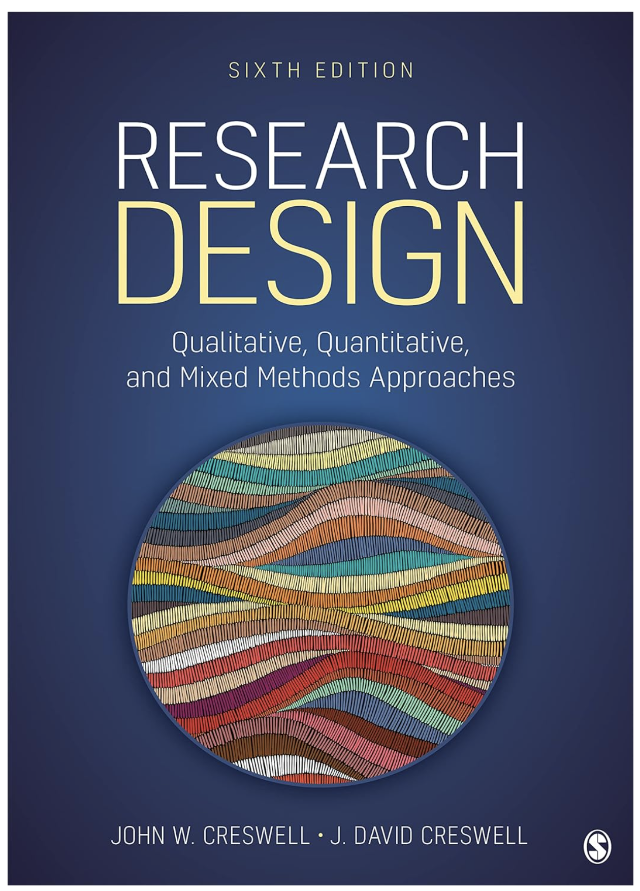
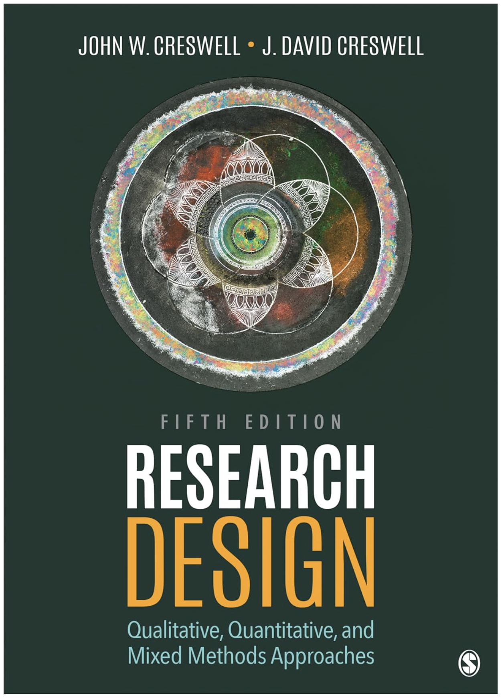
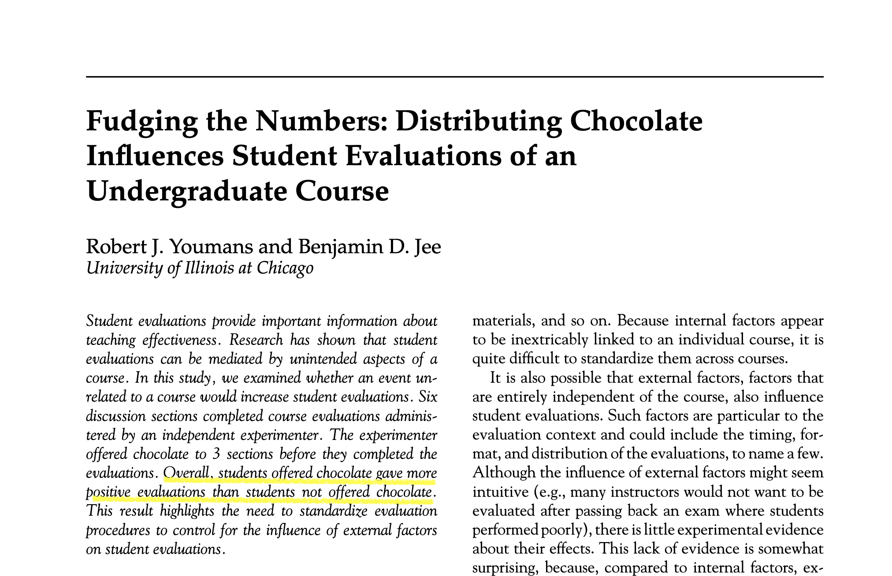
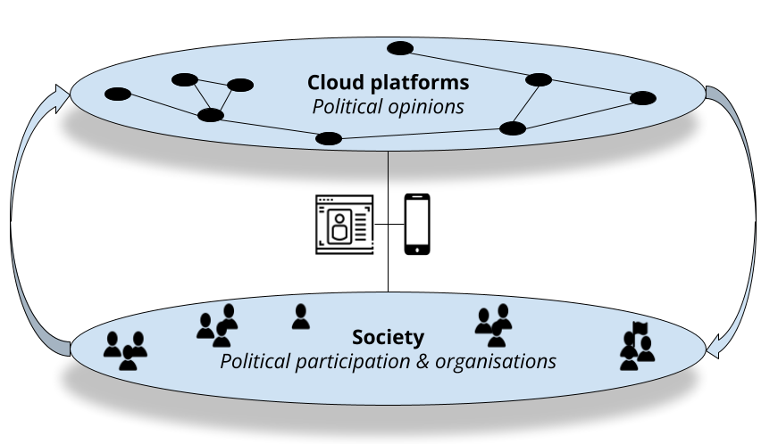
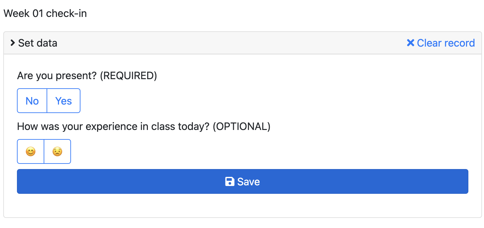

background-image: url(https://upload.wikimedia.org/wikipedia/en/6/6a/Logo_of_the_University_of_Sydney.svg)
background-size: 95%

```{r setup, include=FALSE}

knitr::opts_chunk$set(echo = TRUE, message = FALSE, warning = FALSE, 
                      dev = 'svg', out.width = "45%", fig.width = 6,
                      fig.align="center")

```

---

## Acknowledgement of Country

I would like to acknowledge the Traditional Owners of Australia and  recognise their continuing connection to land, water and culture. The  University of Sydney is located on the land of the Gadigal people  of the Eora Nation. I pay my respects to their Elders, past and present.

---

## Your teacher
	
Francesco Bailo (francesco.bailo@sydney.edu.au)

I am a Lecturer in the School of Social and Political Sciences, University of Sydney. I am interested in researching forms of political engagement and political talk on social media. I researched the emergence and dynamics of online communities, the role between news organisations and social media, and the interdependence between social media activists and news organisations. I have engaged with and applied quantitative research methods developing expertise in quantitative text analysis (NLP) and network analysis.

This year I am teaching GOVT6139, SSPS4102 & SSPS6006.

Fun fact: I took GOVT6139 in 2014 during my PhD. 

---
class: inverse, center, middle

# Let's get started with Research methods...

---

# Some preliminary tips


* Ask questions sooner than later, and ask questions at any point.

--

* All seminar slides are available from Canvas (go to "Modules") by the beginning of the seminar, so keep them open on your laptop (this makes opening links much easier).

--

.center[</img>]

---

## How are seminars run?

Mix of 

- Lectures: 

    * on the content covered by textbook and;
    
    * about the practice of research design (also with four guest lectures)

- Discussions (including on readings): Discussions will generally be prompted by questions and answers socialised using Menti and Padlet (this would require you come to class with an Internet connected device) 

- Individual and group tasks with a focus on research design and research writing;

- Literature Lab in Week 3 and Data lab (with R and RStudio) in Week 10 (make sure to bring your laptop to class then)

---

## My expectations

- Get your own copy of the textbook: Creswell, J. W., & Creswell, J. D. (2022 or 2018). *Research design qualitative, quantitative, and mixed methods approaches* (Sixth or Fifth edition). SAGE.

- Read the textbook chapter assigned each week before coming to class and come to class prepared to contribute to the discussion and share reflections on the readings.

- Attend and engage in class (the expectation is that you will attend at least 90% of classes).

.pull-left[.center[]]

.pull-right[.center[]]


---

## Let's get to know the class!

.center[

OR 

[www.menti.com/alxf5iwcwtzu](https://www.menti.com/alxf5iwcwtzu) 

OR

Menti link from Canvas
]


---

<div style='position: relative; padding-bottom: 56.25%; padding-top: 35px; height: 0; overflow: hidden;'><iframe sandbox='allow-scripts allow-same-origin allow-presentation' allowfullscreen='true' allowtransparency='true' frameborder='0' height='315' src='https://www.mentimeter.com/app/presentation/al4dpr6tkf2asa8qwck7216tcejr1etx/embed' style='position: absolute; top: 0; left: 0; width: 100%; height: 100%;' width='420'></iframe></div>

---
## What are your expectations for GOVT6139?

<div class="padlet-embed" style="border:1px solid rgba(0,0,0,0.1);border-radius:2px;box-sizing:border-box;overflow:hidden;position:relative;width:100%;background:#F4F4F4"><p style="padding:0;margin:0"><iframe src="https://sydney.padlet.org/embed/e9h77tcpfsmkr22y" frameborder="0" allow="camera;microphone;geolocation" style="width:100%;height:608px;display:block;padding:0;margin:0"></iframe></p><div style="display:flex;align-items:center;justify-content:end;margin:0;height:28px"><a href="https://padlet.com?ref=embed" style="display:block;flex-grow:0;margin:0;border:none;padding:0;text-decoration:none" target="_blank"><div style="display:flex;align-items:center;"></div></a></div></div>

---

## What some GOVT6139 students liked last year

(This is not intended to be a representative summary - just a summary of individual comments)

1. The course provides a structured guide for allocating attention to research proposal components, 

2. it includes peer reviews and in-class assignments that enrich learning, 

3. offers extensive related readings and valuable colleague feedback for constructing research designs, and 

4. allows flexibility in assignment topics within assessment criteria, enabling personalized exploration.

---

## What some GOVT6139 students had mixed feelings about last year

### Use of sharing tools such as Menti and Padlet.

* Some found that they enriched and supported the experience;

* Other found them laborious and repetitive after a while.

CLOSING THE LOOP: This year, we will use these tools less frequently and in a more targeted way (for context, last year GOVT6139 was offered in a hybrid mode.) 

---

## What some GOVT6139 students didn't like last year

(This is not intendend to be a representative summary - just a summary of individual comments)

1. The course needs to offer more practical exercises for writing proposals, including detailed guidance to enhance students' writing skills. 

2. The lack of timely feedback on in-class group activities due to time constraints makes it challenging for students to understand if they've correctly grasped the concepts. 

3. The assessment's weighting system is described as overly complex and confusing, leading to difficulties in understanding evaluation criteria.

4.  Readings were sometime not utilised in lectures, sometimes felt irrelevant to the course content, or were outdated.

---

## What some GOVT6139 students didn't like last year

CLOSING THE LOOP in 2024: 

1. We introduced a textbook which is very much focused on writing a research proposal and we will make sure to discuss that content in class. Guest lectures about practical research experience will complement that. 

2. We will give more time to in-class activities (including about research writing) and to provide in-class feedback on these activities. 

3. I published more resources on Canvas about tasks and weighting (but please, make sure you read them and ask questions if something is not clear)


---
class: inverse, center, middle

# An overview

---

## What do we mean by Research Design?

A class focused on how research in the social sciences is conducted.

Key questions:

* What is *knowledge*? *How* do we know? And *what* we know and what can we know?

* How do we critically evaluate research?

* How do we do research and conduct our research processes?

.pull-right[</img>]

---

## Can we trust research (in the social sciences)?

- Not a matter of research can / cannot be trusted

- Every study has strengths and weaknesses

- Different types of studies have different knowledge claims (interpretivism vs positivism)

- Many areas are debated: e.g. economic conditions and protest

- Research results specific to the context in which they were studied

- Knowledge a cumulative endeavor (meta-analyses / systematic reviews)

- Surveys: All depends on how the survey was conducted

---

## This semester is about unpacking ...

1. What is **knowledge** (in the social and political sciences) and

2. How is it **generated**?

.center[</img>]

---

## Why to take this class? (1/2)


### Understand the processes by which research is conducted in the social sciences.

So what?

- Become a critical consumer of research

- Build a foundation to be able to conduct social science research

- Real world relevance, e.g. understand how survey research is conducted and whether it can be trusted

- Understand strengths and weaknesses of different research approaches e.g. interviews vs surveys

- Understand new frontiers on methods

- Evidence-based policy making

- Professionally relevant skills

---

## Why to take this class? (2/2)

### What the class is

- Broad introduction to research design and methods

- Both qualitative and quantitative approaches

- Opportunity to develop a research proposal

- Foundation for future research (e.g. Masters / PhD / work settings)

### What the class is not 

- An advanced statistics course (Will do some #Rstat in week 10 but you should consider [Data Analytics for Social Research SSPS6006](https://www.sydney.edu.au/courses/units-of-study/2024/ssps/ssps6006.html) for a dedicated unit)

- Opportunity to conduct a research project

---
class: inverse, center, middle

# A quick excercise on research and knowledge

---

## What is research? What is research design? And what do we mean by research methods?

Let's take this chocolate study...

.center[</img>]

Youmans, R. J., & Jee, B. D. (2007). Fudging the numbers: Distributing chocolate influences student evaluations of an undergraduate course. *Teaching of Psychology*, 34(4), 245–247. https://doi.org/10.1080/00986280701700318

---

https://doi.org/10.1080/00986280701700318

Let's skim through the paper (is very short!) 

Then answer these questions: 

1. What *knowledge* is produced by the paper?

2. How was that *knowledge* produced? That is, how was the research *designed*?

3. How much do you *trust* this knowledge? 

4. And why? 

**Add your answers into Menti** (same link as before)

.center[
[www.menti.com/alxf5iwcwtzu](https://www.menti.com/alxf5iwcwtzu) 

]


---
class: inverse, center, middle

# Something about my own research 

</img>

---

### What do I study?

### 1. Emergence, interaction, and diffusion of *political opinions* online

.center[

]

### 2. Impacts of social media technologies and services on *political participation and organisation*

---

## 1. Emergence, interaction, and diffusion of *political opinions* online

* Cross-disciplinary research: Digital ethnography, Computer science and Political science. 

* Loops involving Qualitative, Quantitative & Computational methods.

### Key research questions

* What opinions do **emerge** online, but also when and where?

* How do opinions **interact** with other opinions through the Cloud and its online communities?

* What factors determine the speed and reach of the **diffusion** of opinions? 

---
  
## 2. Impact of social media technologies and services on *political participation and organisation*

* Political science research: Parties, Movements, Campaigns and Elections.
* Qualitative, Quantitative & Computational methods.

### Key research questions

* Can "Internet capital" offset a lack of social capital in facilitating participation and organisation?

* Does Internet capital facilitate the organisation of political discontent from the margin (low-social capital areas)?

* Do Internet technologies and services create more political instability by facilitating the emergence of new political actors (individuals or organisations)?
  
* Do social media negatively affect the quality of political deliberation? What factors, technologies or services are important in reducing the quality of online conversation? 

---
class: inverse, center, middle

# Reflection

---

## Group task: Experiences of engaging with research

In groups, introduce yourself, and discuss briefly (5 mins):

1. A situation where you had to deal with questions of research methods

    - E.g. in your studies, or in your work, or understanding reporting in the media

2. What challenges did you face?

3. What questions do you have about the process of how research is conducted?

After discussing, share your answers about 2. and 3. as group on Padlet (next slide...)

---

<div class="padlet-embed" style="border:1px solid rgba(0,0,0,0.1);border-radius:2px;box-sizing:border-box;overflow:hidden;position:relative;width:100%;background:#F4F4F4"><p style="padding:0;margin:0"><iframe src="https://sydney.padlet.org/embed/fooi1rl3hn5hmw0t" frameborder="0" allow="camera;microphone;geolocation" style="width:100%;height:608px;display:block;padding:0;margin:0"></iframe></p><div style="display:flex;align-items:center;justify-content:end;margin:0;height:28px"><a href="https://padlet.com?ref=embed" style="display:block;flex-grow:0;margin:0;border:none;padding:0;text-decoration:none" target="_blank"><div style="display:flex;align-items:center;"></div></a></div></div>

---
class: inverse, center, middle

# Course Outline

---

## Course Outline (1/2)

**Week 1**: Introduction

### PART I PRELIMINARY CONSIDERATIONS (Weeks 2-5)

**Week 2**: The Selection of a Research Approach

**Week 3**: Review of the Literature

**Week 4**: The Use of Theory

**Week 5**: Writing Strategies and Ethical Considerations + Guest lecture w/t Christopher Pepin-Neff

---

## Course Outline (2/2)

### PART II DESIGNING RESEARCH (Weeks 6-12)

**Week 6**: The Introduction (*but public holiday, no seminar*)

*Mid Semester break*

**Week 7**: The Purpose Statement

**Week 8**: Research Questions and Hypotheses + Guest Lecture w/t Charles Robert Butcher 

**Week 9**: Quantitative Methods

**Week 10**: Quantitative Methods: Data Analysis Lab (Make sure you install R and RStudio)

**Week 11**: Qualitative Methods + Guest lecture w/t Peter Chen

**Week 12**: Mixed Methods Procedures + Guest lecture w/t Assel Mussagulova

**Week 13**: Conclusions

---

## Assessment weighting

1. A1 Research article review (30%)

2. A2 Research proposal (60%) 

4. Participation (10%)

.center[</img>]

---

## What makes a good seminar participation grade?

- Attendance and participation in assigned unmarked tasks (in and outside of class).

In addition: 

- Read the required readings in advance of each class.

- Come prepared to discuss the readings and demonstrate engagement with the material in the course.

- Share ideas and questions.

- Respectful of others and allows others to participate.

---

## To avoid having your participation grade negatively affected

* Attend at least 90% of the seminars (e.g., 10 out of the 12 scheduled seminars)

* Submit for peer-review either the 500w **Research question** or the 1000w **Research design** in time; 

* Peer-review either the 500w **Research question** or the 1000w **Research design** in time; 

* Submit your 4000w **A2 Full Draft** and peer-review another student's **A2 Full Draft** in time.

---

### How the peer-review tasks contribute to you final A2 submission

```{r echo = F, out.width='100%'}

require(DiagrammeR)

grViz("                           # All instructions are within a large character string
digraph surveillance_diagram {    # 'digraph' means 'directional graph', then the graph name 
  
  # graph statement
  #################
graph [rankdir = TB]
node [shape = rectangle, style = filled, fillcolor = Linen]
  
  '500w\nResearch Question'   # names of nodes
  '1000w\nResearch Design'
  '4000w\nA2 Full Draft'
  '4000w\nA2 Final Submission'

  # edges
  #######
  '500w\nResearch Question'   -> '1000w\nResearch Design' [label = 'peer-review']
  '1000w\nResearch Design' -> '4000w\nA2 Full Draft' [label = 'peer-review']
  '500w\nResearch Question' -> '4000w\nA2 Full Draft' [label = 'peer-review']
  '4000w\nA2 Full Draft' -> '4000w\nA2 Final Submission' [label = 'peer-review']
}
")

```


---

##  Readings, Tasks and other deadlines in Canvas

* Let's check Canvas [assessment overview page](https://canvas.sydney.edu.au/courses/55191/pages/assessment-overview?module_item_id=2131844)

* Let's check Canvas [assignment page](https://canvas.sydney.edu.au/courses/55191/assignments)

* Let's check Canvas [calendar page](https://canvas.sydney.edu.au/calendar?include_contexts=course_55191#view_name=month&view_start=2024-03-01)

* Let's check Canvas [due dates (syllabus) page](https://canvas.sydney.edu.au/courses/55191/assignments/syllabus)

.center[</img>]

---
class: inverse, center, middle

# Tools

</img>

---

## Let's talk about... tools! (1/2)

* You need a **reference management software**. And you need it now!

    * If you are not using one yet I suggest you install Zotero (+ browser plugin, + Word plugin). Other popular option is EndNote. What RMS are you using? 
  
.center[</img> 

or https://www.menti.com/al8jn8dsxbqa]

---

## Let's talk about... tools! (2/2)

* Familiarise yourself with **search tools** for academic works (in A2 you will need to produce a literature review): start with thr *library website*, *Google Scholar*, *Web of Science* or *Scopus*, and *Research Rabbit* (https://researchrabbitapp.com/home). 

.center[</img>]

Remember that a good literature review aims for *relevance* more than *completeness* (simply, you can't win the completeness battle!). As you keep accumulating interesting works, keep asking yourself: why are these relevant? How does this support my own research project?  


---

## Let's talk about... ChatGPT and GenAI (1/4)


.center[</img>]


### Do you use it and how?

.center[

OR 

[www.menti.com/alxf5iwcwtzu](https://www.menti.com/alxf5iwcwtzu) 

]

---

## Let's talk about... ChatGPT and GenAI (2/4)

### Should I use it? 

.center[</img>]

Definitely!

### Problem is how to use it!

No need to say that the wrong way to use it is copying/pasting ChatGPT answers into your *original* work. 

This is not only cheating but also ChatGPT will never produce *original* (that is, *creative*) work!

---

### Use of GenAI in GOVT6139

Let's check [this Canvas page](https://canvas.sydney.edu.au/courses/55191/pages/use-of-generative-ai-and-other-marvels?module_item_id=2228838)

---

## Let's talk about... ChatGPT (3/4)

### What is ChatGPT?

ChatGPT is a *chatbot* build on a very sophisticated *language model* trained on one of the most comprehensive corpus of texts ever assembled in the history on our human civilisation.

### What does it do in practice? 

.pull-left[

Given an input, ChatGPT will guess the *best* possible series of words to respond to that input. In doing so, it simulate a person that is not only very knowledgeable on the topic but also naturally competent in the English language.   

]

.pull-right[


]

---

## Let's talk about... ChatGPT (4/4)

### How does it do in practice?

One of the best way to understand the working of any language model available in 2023 is to think about *compression algorithms*.


### How do compression algorithms work? 

* First excluding some information and 

* second interpolating information to fill gaps. 

ChatGPT is written information what JPEG is for images. Interpolation is what gives the impression of creative knowledge. **In conclusions**, ChatGPT output can be helpful to find new information (e.g. a paper?) but can't be trusted at face value! 


See: Ted Chiang's [ChatGPT Is a Blurry JPEG of the Web](https://www.newyorker.com/tech/annals-of-technology/chatgpt-is-a-blurry-jpeg-of-the-web) but also Domenic Denicola's [ChatGPT Is Not a Blurry JPEG of the Web. It's a Simulacrum.](https://blog.domenic.me/chatgpt-simulacrum/)

---
class: inverse, center, middle

# Issues with the unit?

---

## How to provide feedback (before the USS at the end of the semester)

There are a number of channels for your to provide feedback during the course of the semester.

You are always welcome to send me an email, of course, if you feel you are getting behind or confused. On top of this: 

1. At the end of each class, you can **optionally** provide a quick feedback (not anonymous) as you check-in for attendance. 



If you click on the sad face, I will get back to you to check what's wrong.  

---

## How to provide feedback

2. You will be invite to provide some anonymous feedback through Canvas in Week 4 and Week 9. The survey in Week 9 will also asked you about your experience with the textbook we are adopting. 


---

## General unit queries:

1. Bring to seminar

2. Canvas discussion boards

## Assignment queries:

1. Bring to seminar.

2. Check if your query has been addressed already in the submission pages

3. Post the question in the dedicated discussion board.

## Personal queries: 

Email me (francesco.bailo@sydney.edu.au, add GOVT6139 to your email's subject) or book an appointment [here](https://outlook.office.com/bookwithme/user/846b379784f440f185dfc56ee6d18f1f%40sydney.edu.au/meetingtype/5e97692b-d0e1-4d86-a501-3b6a33300e6d?anonymous).

---

## All queries and request about extensions (also simple extensions of five days or less) should be directed to special considerations

=> https://www.sydney.edu.au/students/special-consideration.html

### Remember

> Deduction of 5% of the maximum mark for each calendar day after the due date.

> After ten calendar days late, a mark of zero will be awarded.

---

## Academic Honesty & Plagiarism

- If you use other peoples work or AI tools, acknowledge it.

- If you do use direct quotes, put it in quotation marks and acknowledge it.

- Assignments are submitted to Turnitin. Turnitin will find copied work.

- If Turnitin highlights issues, per Usyd policy the assignment will be referred to the Educational Integrity Officer who will assess.

- Note University of Sydney policies on plagiarism do not distinguish between accidental and intentional plagiarism. 

    * **Most student plagiarims is non-intentional**. Be careful and use a RMS!

- Academic Honesty Education Module - https://canvas.sydney.edu.au/courses/15270

- Policy - http://sydney.edu.au/policies/showdoc.aspx?recnum=PDOC2012/254&RendNum=0

---

## Need help? University of Sydney resources

- University of Sydney Learning Hub

    - Workshops and consultation on study skills, writing, referencing
    
    - https://www.sydney.edu.au/students/learning-hub-academic-language.html
    
- University of Sydney Library

    - https://library.sydney.edu.au/study/student-support/
    
- Health and wellbeing

     - https://sydney.edu.au/students/browse.html?category=support-andservices&topic=health-wellbeing-and-support-services
     
     - Counselling and mental health support, disability support, and other
services

- Many support services for students, do not hesitate to reach out!


---
class: inverse, center, middle

# Questions?

---
class: center, middle

# See you next week with The Selection of a Research Approach


