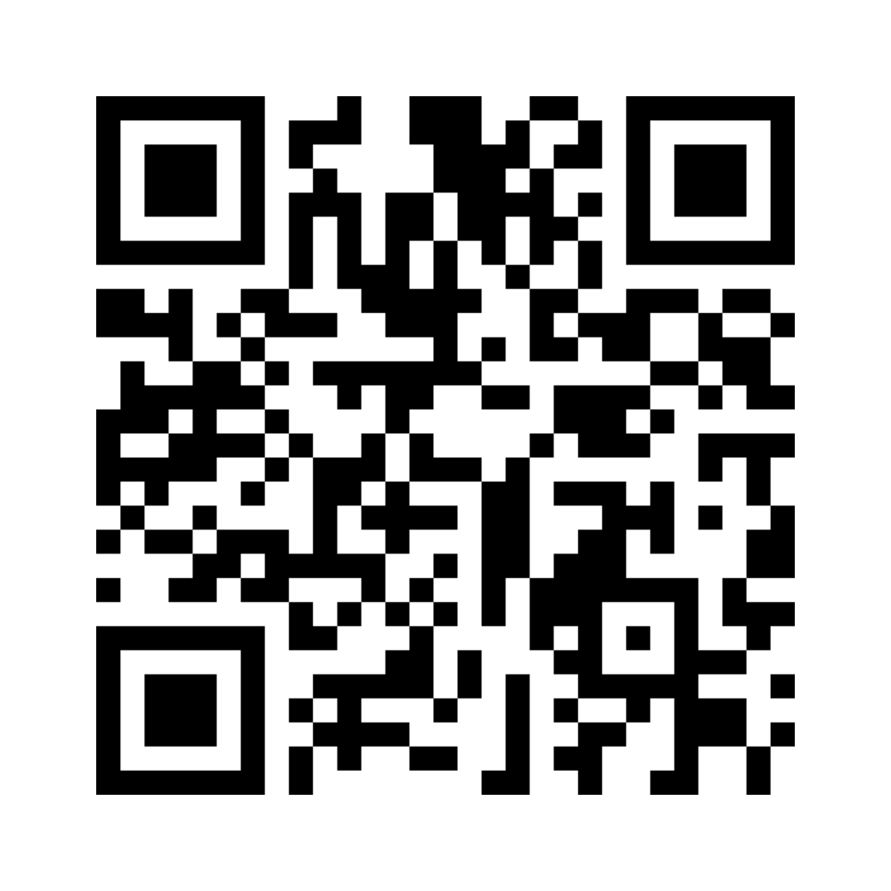

background-image: url(https://upload.wikimedia.org/wikipedia/en/6/6a/Logo_of_the_University_of_Sydney.svg)
background-size: 95%

```{r setup, include=FALSE}

knitr::opts_chunk$set(echo = TRUE, message = FALSE, warning = FALSE, 
                      dev = 'svg', out.width = "45%", fig.width = 6,
                      fig.align="center")

```

---

## Acknowledgement of Country

I would like to acknowledge the Traditional Owners of Australia and  recognise their continuing connection to land, water and culture. The  University of Sydney is located on the land of the Gadigal people  of the Eora Nation. I pay my respects to their Elders, past and present.

---

## Your teacher
	
Francesco Bailo (francesco.bailo@sydney.edu.au)

I am a Lecturer in the School of Social and Political Sciences, University of Sydney. I am interested in researching forms of political engagement and political talk on social media. I researched the emergence and dynamics of online communities, the role between news organisations and social media, and the interdependence between social media activists and news organisations. I have engaged with and applied quantitative research methods developing expertise in quantitative text analysis (NLP) and network analysis.

This year I am teaching GOVT6139 and SSPS4102.

Fun fact: I took GOVT6139 in 2014 during my PhD. 

---

# Some tips


* Ask questions sooner than later, and ask questions at any point.

--

* All seminar slides are available from Canvas (go to "Modules") by the beginning of the seminar, so keep them open on your laptop (this makes opening links much easier).

.center[</img>]

---

## How are seminars run?

Mix of 

- Lectures;

- Discussions (including on readings): Discussions will generally be prompted by questions you will be required to answer through Canvas and Mentimeter (you will try this soon!);

- Group work;

- Data labs (in Week 10 and 11).

## Expectations

- Attend class in-person or (only if authorised by the universit) via Zoom.

- Do the readings before coming to class.

- Come to class prepared to contribute to the discussion and share reflections on the readings.

---


## What do we mean by Research Design?

A class focused on how research in the social sciences is conducted.

Key questions:

* What is *knowledge*? *How* do we know? And *what* we know and what can we know?

* How do we critically evaluate research?

* How do we do research and conduct our research processes?

.pull-right[</img>]

---

## Can we trust research (in the social sciences)?

-Not a matter of research can / cannot be trusted

-Every study has strengths and weaknesses

-Different types of studies have different knowledge claims (interpretivism vs positivism)

-Many areas are debated: e.g. economic conditions and protest

-Research results specific to the context in which they were studied

-Knowledge a cumulative endeavor (meta-analyses / systematic reviews)

-Surveys: All depends on how the survey was conducted

---

## This semester is about unpacking ...

1. What is **knowledge** (in the social and political sciences) and

2. How is it **generated**?

.center[</img>]

---

## Why to take this class? (1/2)


### Understand the processes by which research is conducted in the social sciences.

So what?

-Become a critical consumer of research

-Build a foundation to be able to conduct social science research

-Real world relevance, e.g. understand how survey research is conducted and whether it can be trusted

-Understand strengths and weaknesses of different research approaches e.g. interviews vs surveys

-Understand new frontiers on methods

-Evidence-based policy making

-Professionally relevant skills

---

## Why to take this class? (2/2)

### What the class is

-Broad introduction to research design and methods

-Both qualitative and quantitative approaches

-Opportunity to develop a research proposal

-Foundation for future research (e.g. Masters / PhD / work settings)

### What the class is not 

-An advanced statistics course (although we will do some #Rstat in week 10 & 11)

-Opportunity to conduct a research project

-Note there are specialist qualitative / quantitative methods classes also on offer

---

## What is research? What is research design? And what do we mean by research methods?

Let's take this chocolate study...

.center[</img>]

Youmans, R. J., & Jee, B. D. (2007). Fudging the numbers: Distributing chocolate influences student evaluations of an undergraduate course. *Teaching of Psychology*, 34(4), 245–247. https://doi.org/10.1080/00986280701700318

---

https://doi.org/10.1080/00986280701700318

Let's skim through the paper (is very short!) 

Then answer these questions: 

1. What *knowledge* is produced by the paper?

2. How was that *knowledge* produced? That is, how was the research *designed*?

3. How much do you *trust* this knowledge? 

4. And why? 

---

## How to contribute you answers

1. Enter your answers in Canvas

Then, 

2. Copy/paste them into Menti 

.center[</img>

or https://www.menti.com/al8jn8dsxbqa]


---

## My own research 

### 1. Emergence, interaction, and diffusion of *political opinions* online

.center[

]

### 2. Impacts of social media technologies and services on *political participation and organisation*

---

#### 1. Emergence, interaction, and diffusion of *political opinions* online

* Cross-disciplinary research: Digital ethnography, Computer science and Political science. 
* Loops involving Qualitative, Quantitative & Computational methods.

##### Key research questions

* What opinions do **emerge** online, but also when and where?

* How do opinions **interact** with other opinions through the Cloud and its online communities?

* What factors determine the speed and reach of the **diffusion** of opinions? 

---
  
#### 2. Impact of social media technologies and services on *political participation and organisation*

* Political science research: Parties, Movements, Campaigns and Elections.
* Qualitative, Quantitative & Computational methods.

##### Key research questions

* Can "Internet capital" offset a lack of social capital in facilitating participation and organisation?

* Does Internet capital facilitate the organisation of political discontent from the margin (low-social capital areas)?

* Do Internet technologies and services create more political instability by facilitating the emergence of new political actors (individuals or organisations)?
  
* Do social media negatively affect the quality of political deliberation? What factors, technologies or services are important in reducing the quality of online conversation? 


---

## Reflection: Experiences of engaging with research

In groups, introduce yourself, and discuss briefly (5 mins):

- A situation where you had to deal with questions of research methods

- E.g. in your studies, or in your work, or understanding reporting in the media

- What challenges did you face?

- What questions do you have about the process of how research is conducted?

Prepare to share your ideas with the class by creating a document (Word or PPT in Teams => "Week 01")! 


---

## Course Outline (1/2)

**Week 1**: Introduction

**Week 2**: Foundations: Ontology and Epistemology (w/t Peter Chen)

**Week 3**: Research Design (I): Questions, Theories, Hypotheses, Variables, Measurements

**Week 4**: Research Design (II): Causal Inference

**Week 5**: Research Design (III): Case selection

**Week 6**: Qualitative Methods (I): Data Collection (w/t Peter Chen)

**Week 7**: Qualitative Methods (II): Data Analysis (w/t Peter Chen)

* A1 is due (via Canvas)

---

## Course Outline (2/2)

**Week 8**: Quantitative Methods (I): Data Collection

*Mid Semester break*

**Week 9**: Public holiday (but start working on Week 10 readings)

**Week 10**: Quantitative Methods (II): Data Analysis

* R lab: Make sure you install R and RStudio

**Week 11**: Quantitative Methods (III): Data Analysis + lab

* Draft A2 for peer review is due (via Canvas)

**Week 12**: Research Proposal: Peer Feedback Workshop

* Peer review of three A2s is due (via Canvas) 

**Week 13**: New frontiers and Conclusions

* A2 is due (via Canvas)

---

## Building blocks of the research process

### Weeks 02-05

.pull-left[

- **Week 02**: Ontology and epistemology

    - Philosophical worldviews
    
    -Interpretivism and positivism

- **Week 03**: Questions, theories, hypotheses, variables,
measurements

    - Asking good research questions
    
    - Theory and hypotheses
    
    - Concepts and measures
    
]
    
.pull-right[

- **Week 04**: Causal inference
    
    - Types of research design
    
    - Causality
    
- **Week 05**: Case selection

    - How do we choose cases? How many?
  
]
    
---
    
### Week 06 and 07: Qualitative Methods

.pull-left[

- **Week 06**: Qualitative data collection

    - Interviews
    
    - Focus groups
    
    - Observational techniques
    
    - Document analysis

]


.pull-right[

- **Week 07**: Qualitative data analysis

    - What to do with the data once you've collected it?
    
    - Data management and analysis
    
    - Thematic analysis
    
    - Discourse analysis

]

---

### Week 08, 10 and 11: Quantitative Methods

.pull-left[

- **Week 08**: Quantitative data collection

    - Types of quantitative data
    
    - Surveys

- **Week 10 & 11**: Quantitative data analysis

    - Once we've collected the data -how do we analyse it?
    
    - Univariate, bivariate, multivariate analyses
    
    - Intro to statistical software (R and RStudio)
    
]

.pull-right[

.center[</img>]

]

---

### Weeks 12-13: Wrapping up

- **Week 12**

    - Research proposal peer feedback workshop (Remember: Draft is due in Week 11, Peer review before class in Week 12)
    
      - What are the most common issues emerging during peer review?
      
      - How to address them? 

.pull-left[

- **Week 13**

    - New frontiers in methodology
    
    - Big data
    
    - Replication
    
]
    
    
.pull-right[.center[</img>]]

---

## Assessment overview

1. Research article review (30%) due **Week 07**

2. Research proposal (0%, draft for peer-review) **Week 11** 

3. Research proposal (60%) **Week 13** 

4. Seminar participation (10%) ongoing

.center[</img>]

---

##  Readings, Tasks and other deadlines in Canvas

* Let's check Canvas [assignments page](https://canvas.sydney.edu.au/courses/47713/assignments)

* Let's check Canvas [calendar page](https://canvas.sydney.edu.au/calendar?include_contexts=course_47713#view_name=month&view_start=2023-02-20)

* Let's check Canvas [syllabus page](https://canvas.sydney.edu.au/courses/47713/assignments/syllabus)

.center[</img>]

---

## Let's talk about... tools! (1/2)

* You need a **reference management software**. And you need it now!

    * If you are not using one yet I suggest you install Zotero (+ browser plugin, + Word plugin). Other popular option: EndNote. What RMS are you using? 
  
.center[</img> 

or https://www.menti.com/al8jn8dsxbqa]

---

## Let's talk about... tools! (2/2)

* Familiarise yourself with **search tools** for academic works (in A2 you will need to produce a literature review): start with thr *library website*, *Google Scholar*, and *Research Rabbit* (https://researchrabbitapp.com/home). 

.center[</img>]

Remember that a good literature review aims for *relevance* more than *completeness* (simply, you can't win the completeness battle!). As you keep accumulating interesting works, keep asking yourself: why are these relevant? How does this support my own research project?  


---

## Let's talk about... ChatGPT (1/4)


.center[</img>]


### Do you use it and how?

.center[</img> 

or https://www.menti.com/al8jn8dsxbqa]


---

## Let's talk about... ChatGPT (2/4)

### Should I use it? 

.center[</img>]

Definitely!

### Problem is how to use it!

No need to say that the wrong way to use it is copying/pasting ChatGPT answers into your *original* work. 

This is not only cheating but also ChatGPT will never produce *original* (that is, *creative*) work!

---

## Let's talk about... ChatGPT (3/4)

### What is ChatGPT?

ChatGPT is a *chatbot* build on a very sophisticated *language model* trained on one of the most comprehensive corpus of texts ever assembled in the history on our human civilisation.

### What does it do in practice? 

.pull-left[

Given an input, ChatGPT will guess the *best* possible series of words to respond to that input. In doing so, it simulate a person that is not only very knowledgeable on the topic but also naturally competent in the English language.   

]

.pull-right[


]

---

## Let's talk about... ChatGPT (4/4)

### How does it do in practice?

One of the best way to understand the working of any language model available in 2023 is to think about *compression algorithms*.


### How do compression algorithms work? 

* First excluding some information and 

* second interpolating information to fill gaps. 

ChatGPT is for written information what JPEG is for images. Interpolation is what gives the impression of creative knowledge. **In conclusions**, ChatGPT output can be helpful to find new information (e.g. a paper?) but can't be trusted at face value! 


See: *ChatGPT Is a Blurry JPEG of the Web* by Ted Chiang  (https://www.newyorker.com/tech/annals-of-technology/chatgpt-is-a-blurry-jpeg-of-the-web)


---
class: inverse, center, middle

# Queries about the course?

---

## General course queries:

1. Bring to seminar

2. Canvas discussion board (under "General")

## Assignment queries:

1. Bring to seminar.

2. Check if your query has been addressed already in the two Q&A docs for [A1](https://unisyd.sharepoint.com/:w:/r/teams/2023GOVT6139/Shared%20Documents/General/A1%20Q%26A.docx?d=w0a3b34e3a8024628b303265c742caa6e&csf=1&web=1&e=OeAjpw) and [A2](https://unisyd.sharepoint.com/:w:/r/teams/2023GOVT6139/Shared%20Documents/General/A2%20Q%26A.docx?d=w8ee7d49f42e4403ca6ddca6a0158e07a&csf=1&web=1&e=nBelt0); if not 

3. Post your Canvas discussion board (under "Assignments").

## Personal queries: 

Email me (francesco.bailo@sydney.edu.au, add GOVT6139 to your email's subject) or book an apointment [here](https://outlook.office.com/bookwithme/user/846b379784f440f185dfc56ee6d18f1f@sydney.edu.au/meetingtype/K2mXXuHQhk2lATtqMzAObQ2?anonymous&ep=mlink).

---

## All queries and request about extensions (also simple extensions of five days or less) should be directed to special considerations

=> https://www.sydney.edu.au/students/special-consideration.html

### Remember

> Deduction of 5% of the maximum mark for each calendar day after the due date.

> After ten calendar days late, a mark of zero will be awarded.

---

## Academic Honesty & Plagiarism

- If you use other peoples work, acknowledge it.

- If you do use direct quotes, put it in quotation marks and acknowledge it.

- Assignments are submitted to Turnitin. Turnitin will find copied work.

- If Turnitin highlights issues, per Usyd policy the assignment will be referred to the Educational Integrity Officer who will assess.

- Note University of Sydney policies on plagiarism do not distinguish between accidental and intentional plagiarism. 

    * **Most student plagiarims is non-intentional**. Be careful and use a RMS!

- Academic Honesty Education Module - https://canvas.sydney.edu.au/courses/15270

- Policy - http://sydney.edu.au/policies/showdoc.aspx?recnum=PDOC2012/254&RendNum=0

---

## Need help? University of Sydney resources

- University of Sydney Learning Hub

    - Workshops and consultation on study skills, writing, referencing
    
    - https://www.sydney.edu.au/students/learning-hub-academic-language.html
    
- University of Sydney Library

    - https://library.sydney.edu.au/study/student-support/
    
- Health and wellbeing

     - https://sydney.edu.au/students/browse.html?category=support-andservices&topic=health-wellbeing-and-support-services
     
     - Counselling and mental health support, disability support, and other
services

- Many support services for students, do not hesitate to reach out!

---
class: inverse, center, middle

# Questions?

---
