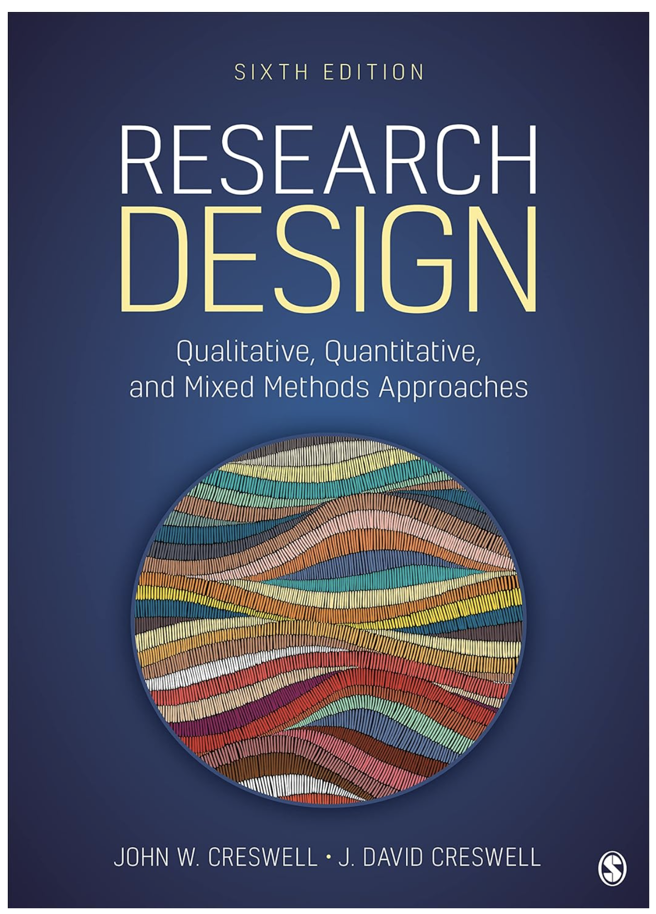
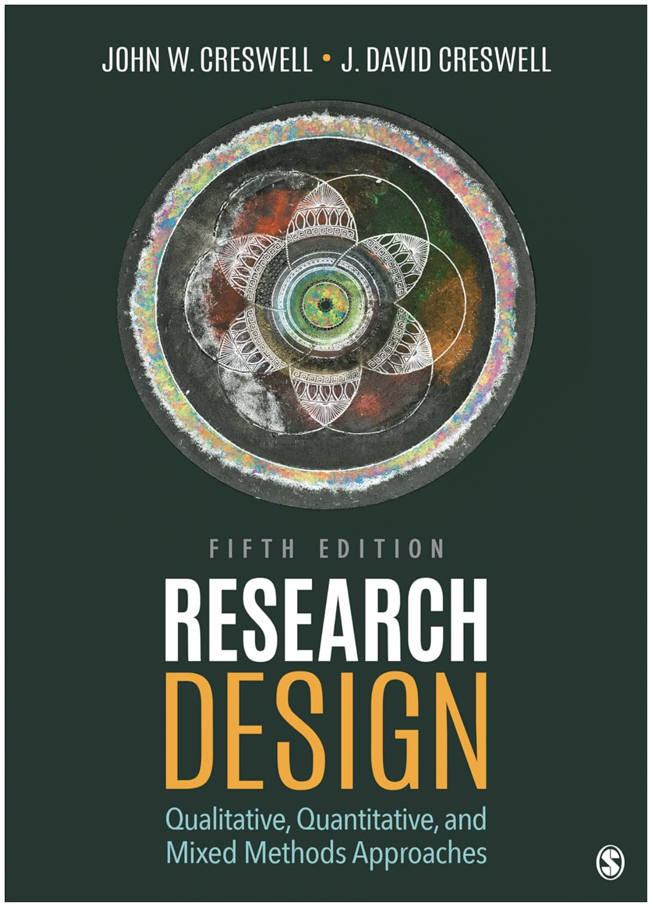
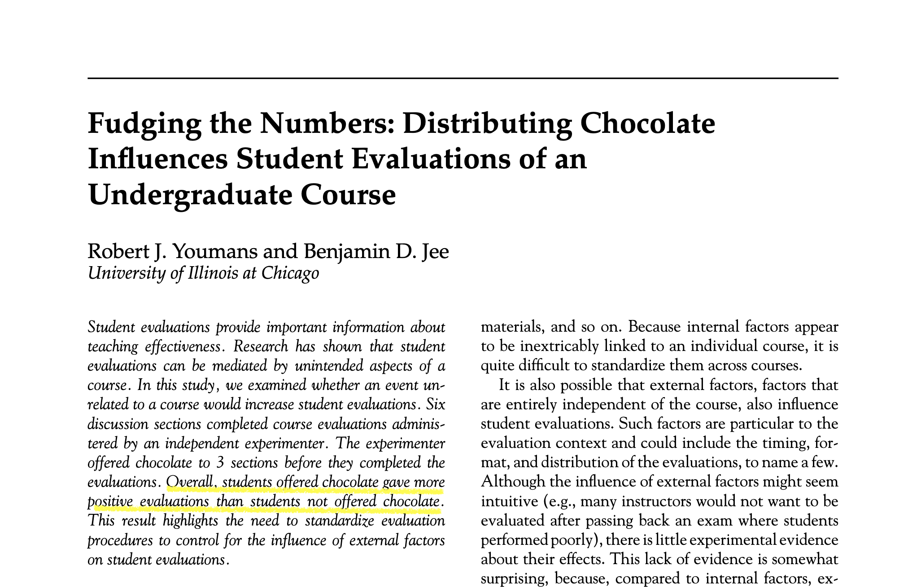
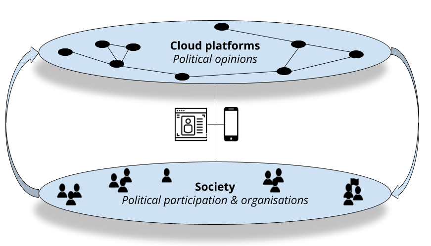

```{r setup, include=FALSE}

knitr::opts_chunk$set(echo = TRUE, message = FALSE, warning = FALSE,
                      dev = 'svg', out.width = "45%", fig.width = 6,
                      fig.align="center")

```

## Acknowledgement of Country

I would like to acknowledge the Traditional Owners of Australia and  recognise their continuing connection to land, water and culture. The  University of Sydney is located on the land of the Gadigal people  of the Eora Nation. I pay my respects to their Elders, past and present.

---

## Your teacher

Francesco Bailo (francesco.bailo@sydney.edu.au)

I am a Senior Lecturer in the School of Social and Political Sciences, University of Sydney. I am interested in researching forms of political engagement and political talk on social media. I researched the emergence and dynamics of online communities, the role between news organisations and social media, and the interdependence between social media activists and news organisations. I have engaged with and applied quantitative research methods developing expertise in quantitative text analysis (NLP) and network analysis.

This year I have been teaching GOVT3901, GOVT6139, SSPS4102 & SSPS6006.

Fun fact: I took GOVT6139 in 2014 during my PhD.

---

I am also involved in ...

## Centre for AI, Trust and Governance

The Centre was established this year to promote "research and innovation examining the complexities of emergent AI technologies from a socio-technical perspective."

Feel free to connect with the [Centre](https://www.sydney.edu.au/arts/our-research/centres-institutes-and-groups/centre-for-ai-trust-and-governance.html) and to join its newsletter to know about the events and opportunities we are organising!

## Computational social science lab

The Lab organises training activities and events exploring the computational aspects of research in the social sciences! If interested, you can join the Lab [Canvas page](https://canvas.sydney.edu.au/courses/65547).

# Let's get started with Research methods...

## Some preliminary tips

* Ask questions sooner than later, and ask questions at any point.

. . .

* All seminar slides are available from Canvas (go to "Modules") by the beginning of the seminar, so keep them open on your laptop (this makes opening links much easier).

. . .

::: {style="text-align: center;"}
</img>
:::

---

## How are seminars run?

::: callout-note
Yes, they are timetabled as Lec+Tut, but let's consider them as a single activity.
:::

Mix of

- Lectures:

    * on the content covered by textbook and;

    * about the practice of research design (also with four guest lectures)

- Discussions (including on readings): Discussions will generally be prompted by questions and answers socialised using Menti and Padlet (this would require you come to class with an Internet connected device)

- Individual and group tasks with a focus on research design and research writing.

---

## We have three hands-on in-class activities scheduled

::: callout-important
Make sure you prepare for these activities before coming to class! Check-out the syllabus to know what to do.
:::

### Week 03 Literature Review with

::: {style="text-align: center;"}

:::

### Week 10 Quantitative Data Analysis with JASP

::: {style="text-align: center;"}

:::

### Week 12 Qualitative Data Analysis with NVivo

::: {style="text-align: center;"}

:::


---

## My expectations

- Get your own copy of the textbook: Creswell, J. W., & Creswell, J. D. (2023). *Research design qualitative, quantitative, and mixed methods approaches* (6th edition). SAGE.

- Read the textbook chapter assigned each week before coming to class and come to class prepared to contribute to the discussion and share reflections on the readings.

- Attend and engage in class (the expectation is that you will attend at least 90% of classes).

::: columns
::: {.column width="50%"}
::: {style="text-align: center;"}

:::
:::

::: {.column width="50%"}
::: {style="text-align: center;"}

:::
:::
:::

---

## Let's get to know the class!

(Complete only first two slides)

::: {style="text-align: center;"}


OR

[www.menti.com/alxf5iwcwtzu](https://www.menti.com/alxf5iwcwtzu)

OR

Menti link from Canvas
:::


---

## What are your expectations for GOVT6139?

::: {style="text-align: center;"}
[Link to Padlet](https://padlet.com/sydney/2026-govt6139-week-01-expectations-what-are-your-expectation-e9h77tcpfsmkr22y)

OR 

Padlet link from Canvas
:::


# An overview

## What do we mean by Research Design?

A class focused on how research in the social sciences is conducted.

Key questions:

* What is *knowledge*? *How* do we know? And *what* we know and what can we know?

* How do we critically evaluate research?

* How do we do research and conduct our research processes?

::: {style="text-align: right;"}
</img>
:::

---

## Can we trust research in the social sciences?

- Every study has strengths and weaknesses

- Different types of studies have different knowledge claims (interpretivism vs positivism)

- Many areas are debated: e.g. economic conditions and protest

- Research results specific to the context in which they were studied

- Knowledge a cumulative endeavor (meta-analyses / systematic reviews)

- Surveys: All depends on how the survey was conducted

---

## This semester is about unpacking ...

1. What is **knowledge** (in the social and political sciences) and

2. How is it **generated**?

::: {style="text-align: center;"}
</img>
:::

---

## Why to take this class? (1/2)

### Understand the processes by which research is conducted in the social sciences.

So what?

- Become a critical consumer of research

- Build a foundation to be able to conduct social science research

- Real world relevance, e.g. understand how survey research is conducted and whether it can be trusted

- Understand strengths and weaknesses of different research approaches e.g. interviews vs surveys

- Understand new frontiers on methods

- Evidence-based policy making

- Professionally relevant skills

---

## Why to take this class? (2/2)

### What the class is

- Broad introduction to research design and methods

- Both qualitative and quantitative approaches

- Opportunity to develop a research proposal

- Foundation for future research (e.g. Masters / PhD / work settings)

### What the class is not

- An advanced qualitative methods or statistics course (Will do some #Rstat in week 10 but you should consider [Data Analytics for Social Research SSPS6006](https://www.sydney.edu.au/courses/units-of-study/2025/ssps/ssps6006.html) for a dedicated unit)

- Opportunity to conduct a research project

# A quick excercise on research and knowledge

## What is research? What is research design? And what do we mean by research methods?

Let's take this chocolate study...

::: {style="text-align: center;"}
</img>
:::

Youmans, R. J., & Jee, B. D. (2007). Fudging the numbers: Distributing chocolate influences student evaluations of an undergraduate course. *Teaching of Psychology*, 34(4), 245–247. https://doi.org/10.1080/00986280701700318

---

https://doi.org/10.1080/00986280701700318

Let's skim through the paper (is very short!)

Then answer these questions:

1. What *knowledge* is produced by the paper?

2. How was that *knowledge* produced? That is, how was the research *designed*?

3. How much do you *trust* this knowledge?

4. And why?

**Add your answers into Menti** (same link as before)

::: {style="text-align: center;"}

[www.menti.com/alxf5iwcwtzu](https://www.menti.com/alxf5iwcwtzu)
:::

# Something about my own research

</img>

## What do I study?

I study how political opinions, misinformation and knowledge *emerge*, *interact* and *diffuse* on social media and other digital platforms — and how these platforms reshape *political participation and organisation*, including in under-studied and high-risk contexts.

::: {style="text-align: center;"}

:::

---

### Some current projects:

* **Mobilisation networks** (Italy, 2013 election) — social capital, the geographic diffusion of Internet-organised "meetups", and their effect on political talk and voting.
* **Information disorder** — a scalable, LLM-based method for measuring how much a social media/information space converges on, or fragments over, shared facts.
* **The Undersphere** — how GenAI tools are reshaping online communities into transactional, knowledge-driven spaces rather than social ones.
* **Vietnam** — misinformation exposure (incl. on TikTok) and its effect on political attitudes amid rapid media change.
* **Afghanistan** — a pilot survey of how political participation on social media is reconfigured under Taliban rule.
* Affiliated with the [Centre for AI, Trust and Governance](https://www.sydney.edu.au/arts/our-research/centres-institutes-and-groups/centre-for-ai-trust-and-governance.html) (AI & platforms/media; AI & law/policy).

## Key research questions

* Does social capital predict where offline political mobilisation happens — and can Internet-mediated networks substitute for it where social capital is weak?

* Can we build a scalable, near-real-time measure of "information disorder" — how much an information space converges on shared facts versus fragments into disagreement?

* How are new, GenAI-centred online communities organised, and what happens to trust and knowledge production when interaction becomes transactional rather than social?

* How does exposure to misinformation on platforms like TikTok shape political attitudes in societies undergoing rapid media change?

* How is political participation on social media reorganised when the state itself constrains and surveils it?


# Reflection

## Group task: Experiences of engaging with research

In groups, introduce yourself, and discuss briefly (5 mins):

1. A situation where you had to deal with questions of research methods

    - E.g. in your studies, or in your work, or understanding reporting in the media

2. What challenges did you face?

3. What questions do you have about the process of how research is conducted?

After discussing, share your answers about 2. and 3. as group on Padlet (next slide...)

::: {style="text-align: center;"}

[Link to Padlet](https://padlet.com/sydney/2026-govt6139-week-01-reflections-ai5luwp4vmmwbkfl)

OR 

From Canvas
:::


# Course Outline

## Course Outline (1/2)

**Week 1**: Introduction

### PART I PRELIMINARY CONSIDERATIONS (Weeks 2-5)

**Week 2**: The Selection of a Research Approach

**Week 3**: Review of the Literature (Antigravity in-class activity)

**Week 4**: The Use of Theory

**Week 5**: Writing Strategies and Ethical Considerations

---

## Course Outline (2/2)

### PART II DESIGNING RESEARCH (Weeks 6-13)

**Week 6**: The Introduction

**Week 7**: The Purpose Statement

**Week 8**: Research Questions and Hypotheses

*Mid Semester break*

**Week 9**: Quantitative Methods — **A1 Viva Voce due (30%)**

**Week 10**: Quantitative Methods: Data Analysis Lab (JASP in-class activity)

**Week 11**: Qualitative Methods

**Week 12**: Qualitative Methods: Data Analysis Lab (NVivo in-class activity)

**Week 13**: Mixed-methods and Conclusions

---

## Assessment weighting

1. **A1 — Viva Voce of Project Proposal** (30%) — 15-minute individual oral exam, 1,700wd equivalent, due Week 9 (in fact we will likely start scheduling from Week 8)

2. **A2 — Research Proposal** (50%) — 3,000wd written proposal, due in the study period

3. **A3 — In-class Quizzes and Short Answers** (20%) — 13 × 100wd equivalent, one per teaching week

::: {style="text-align: center;"}
</img>
:::

---

## A1, A2 and A3 in a nutshell

::: callout-note
### A1 — Viva Voce (30%)

Orally defend your emerging research design (problem, worldview, purpose statement, research questions, anticipated design) in a 15-minute in-person exam, Week 9. Only draws on Weeks 1–8 content.
:::

::: callout-note
### A2 — Research Proposal (50%)

The capstone: a coherent 3,000-word research proposal incorporating feedback from A1 (and the optional peer-review exercise below). Due in the study period.
:::

::: callout-note
### A3 — In-class Quizzes and Short Answers (20%)

A short quiz or 100-word short answer every teaching week. Best 10 of 13 count, so up to three missed/low weeks cost you nothing.
:::

---

## Optional (but recommended): peer-review tasks supporting A2

On top of A1, A2 and A3, you're invited to take part in an **optional but recommended** peer-review exercise to help prepare A2. Three written submissions and three peer reviews, spread across the semester — you're free to reuse this writing in your final A2 submission.

```{r echo = F, out.width='100%'}

require(DiagrammeR)

grViz("
digraph peer_review_diagram {

  graph [rankdir = TB]
  node [shape = rectangle, style = filled, fillcolor = Linen]

  '500w\nResearch Question\n(Task 1, W04)'
  '1000w\nResearch Design\n(Task 2, W07)'
  '3000w\nA2 Full Draft\n(Task 3, W11)'
  '3000w\nA2 Final Submission'

  '500w\nResearch Question\n(Task 1, W04)' -> '1000w\nResearch Design\n(Task 2, W07)' [label = 'peer-review']
  '1000w\nResearch Design\n(Task 2, W07)' -> '3000w\nA2 Full Draft\n(Task 3, W11)' [label = 'peer-review']
  '500w\nResearch Question\n(Task 1, W04)' -> '3000w\nA2 Full Draft\n(Task 3, W11)' [label = 'peer-review']
  '3000w\nA2 Full Draft\n(Task 3, W11)' -> '3000w\nA2 Final Submission' [label = 'peer-review']
}
")

```

---

# A3 In-class quiz

---

##  Readings, Tasks and other deadlines in Canvas

* Let's check Canvas [assessment overview page](https://canvas.sydney.edu.au/courses/74158/pages/assessment-overview?module_item_id=3119403)

* Let's check Canvas [assignment page](https://canvas.sydney.edu.au/courses/74158/assignments)

* Let's check Canvas [calendar page](https://canvas.sydney.edu.au/calendar?include_contexts=course_74158#view_name=month&view_start=2026-08-01)

* Let's check Canvas [due dates (syllabus) page](https://canvas.sydney.edu.au/courses/74158/assignments/syllabus)

::: {style="text-align: center;"}
</img>
:::

# Tools

</img>

## Let's talk about... tools! (1/4)

* Familiarise yourself with **search tools** for academic works (in A2 you will need to produce a literature review): start with the *library website*, *Google Scholar*, *Web of Science* or *Scopus*, and *Research Rabbit* (https://researchrabbitapp.com/home).

* New: Google Scholar now has an experimental **AI/chat search feature** — worth trying, but treat it like any GenAI output: a lead to verify, not a citation to trust blindly.

::: {style="text-align: center;"}
</img>
:::

---

Remember that a good literature review aims for *relevance* more than *completeness* (simply, you can't win the completeness battle!). As you keep accumulating interesting works, keep asking yourself: why are these relevant? How does this support my own research project?

---

## Let's talk about... tools! (2/4)

* You need a **reference management software**. And you need it now!

    * If you are not using one yet I suggest you install [Zotero](https://www.zotero.org/) (+ browser plugin, + Word plugin) — free, open source, and animated by a huge community. Other popular option is EndNote.

---

## Let's talk about... tools! (3/4)

* You also need a system for taking and connecting notes as you read — don't let it live only scattered across Word docs.

* I'd recommend [Obsidian](https://obsidian.md/) notes are plain local text files, it's **free** (you only pay if you want their optional cloud sync across devices), and it's backed by a huge community building thousands of plugins.

* One of its most useful features: you can **link across notes very easily** — so something you mention in one note can be linked directly to a related note elsewhere, letting your notes form a connected web rather than a flat pile.

---

## Let's talk about... tools! (4/4)

* The University will likely offer its own supported AI assistant soon — watch Canvas for updates.

* In the meantime, generous free(-ish) tiers exist: ChatGPT (OpenAI), Gemini (Google), and others.

* We'll specifically use **Antigravity** (Google) in Week 3 for the literature review activity — it brings an LLM onto *your own computer*, able to read, organise and manipulate your files via natural language, rather than living only in a chat window.

## Let's talk about... GenAI for research (1/4)

But first let's complete the last two slides in Menti.

::: {style="text-align: center;"}

[www.menti.com/alxf5iwcwtzu](https://www.menti.com/alxf5iwcwtzu)
:::

* "Doing a literature review" — or "writing a proposal" — isn't one task. It's a chain of quite different activities, some mechanical, some pure judgment.

* Treating it as one blob is exactly how you end up either **over-trusting** AI (letting it "do the review," "write the section") or **under-using** it (only ever asking for a summary).

* For every task, ask two questions: what can I genuinely **offload**, and what has to **stay mine** no matter what?

::: callout-note
The message for today: **use the tool, don't be used by it.**
:::

---

## Let's talk about... GenAI for research (2/4)

### Literature review — offload vs. retain

**Offload:** brainstorming search terms and angles on your question; a first-pass screen of titles/abstracts against your own inclusion rule; pulling what a paper *reports* (sample, method, findings) into a structured note.

**Retain:** judging whether the gap you've found is real and worth pursuing; running the actual database search — an LLM's "memory" of the literature is not a search index, and it will confidently invent plausible-sounding citations that don't exist; appraising whether a study's method was actually *any good*, not just what it reports; the argument for why your synthesis matters.

::: callout-tip
Worth trying: Google Scholar's new experimental AI/chat search — a genuine step toward *grounded* search (a real index, not a model's memory). Still: click through and verify every result yourself.
:::

---

## Let's talk about... GenAI for research (3/4)

### Research writing — offload vs. retain

**Offload:** drafting candidate phrasings of a paragraph; checking clarity and flow · distilling your own notes into a shorter summary; tightening prose once the substance is already yours.

**Retain:** the actual claim each sentence makes, and why it follows from your evidence; the connections you draw between ideas. A note or paragraph isn't proof you understood something — if AI supplied the reasoning that connects it, that reasoning isn't yours yet.

This applies just as much to your **purpose statement and research questions (A2)** as to a lit review paragraph — the exact wording matters, because you'll be asked to defend it (next slide...).

---

## Let's talk about... GenAI for research (4/4)

* No matter which tool you use — Zotero, Obsidian, Antigravity, ChatGPT, Gemini, Google Scholar AI — at the end of the day **you are accountable for what you author and submit to others**

* You must be able to **explain it, justify it, and defend it** — under questioning, without the tool in front of you.

* This isn't abstract: it's literally what **A1 (Viva Voce)** tests. And it's exactly what A3's marking rewards — a rougher answer that's genuinely yours beats a polished, generic one that isn't.

::: {style="text-align: center;"}
### Use the tool. Don't be used by it.
:::


# Issues with the unit?

## How to provide feedback (before the USS at the end of the semester)

There are a number of channels for your to provide feedback during the course of the semester.

You are always welcome to send me an email, of course, if you feel you are getting behind or confused. On top of this:

1. At the end of each class, you can **optionally** provide a quick feedback (not anonymous) as you check-in for attendance.

---

## How to provide feedback

2. You will be invite to provide some anonymous feedback through Canvas in Week 4 and Week 9. The survey in Week 9 will also asked you about your experience with the textbook we are adopting.

---

## General unit queries:

1. Bring to seminar

2. Canvas discussion boards

## Assignment queries:

1. Bring to seminar.

2. Check if your query has been addressed already in the submission pages

3. Post the question in the dedicated discussion board.

## Personal queries:

Email me (francesco.bailo@sydney.edu.au, add GOVT6139 to your email's subject) or book an appointment [here](https://outlook.office.com/bookwithme/user/846b379784f440f185dfc56ee6d18f1f%40sydney.edu.au/meetingtype/5e97692b-d0e1-4d86-a501-3b6a33300e6d?anonymous).

---

## All queries and request about extensions (also simple extensions of five days or less) should be directed to special considerations

=> https://www.sydney.edu.au/students/special-consideration.html

### Remember

> Deduction of 5% of the maximum mark for each calendar day after the due date.

> After ten calendar days late, a mark of zero will be awarded.

---

## Academic Honesty & Plagiarism

- If you use other peoples work or AI tools, acknowledge it.

- If you do use direct quotes, put it in quotation marks and acknowledge it.

- Assignments are submitted to Turnitin. Turnitin will find copied work.

- If Turnitin highlights issues, per Usyd policy the assignment will be referred to the Educational Integrity Officer who will assess.

- Note University of Sydney policies on plagiarism do not distinguish between accidental and intentional plagiarism.

    * **Most student plagiarims is non-intentional**. Be careful and use a RMS!

- Academic Honesty Education Module - https://canvas.sydney.edu.au/courses/15270

- Policy - http://sydney.edu.au/policies/showdoc.aspx?recnum=PDOC2012/254&RendNum=0

---

## Need help? University of Sydney resources

- University of Sydney Learning Hub

    - Workshops and consultation on study skills, writing, referencing

    - https://www.sydney.edu.au/students/learning-hub-academic-language.html

- University of Sydney Library

    - https://library.sydney.edu.au/study/student-support/

- Health and wellbeing

     - https://sydney.edu.au/students/browse.html?category=support-andservices&topic=health-wellbeing-and-support-services

     - Counselling and mental health support, disability support, and other
services

- Many support services for students, do not hesitate to reach out!

# Questions?

## See you next week with The Selection of a Research Approach
