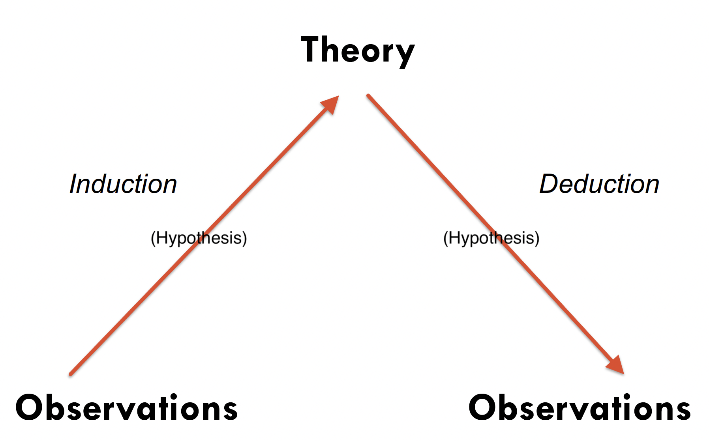

background-image: url(https://upload.wikimedia.org/wikipedia/en/6/6a/Logo_of_the_University_of_Sydney.svg)
background-size: 95%

```{r setup, include=FALSE}

knitr::opts_chunk$set(echo = TRUE, message = FALSE, warning = FALSE, 
                      dev = 'svg', out.width = "45%", fig.width = 6,
                      fig.align="center")

```

---

## Acknowledgement of Country

I would like to acknowledge the Traditional Owners of Australia and  recognise their continuing connection to land, water and culture. The  University of Sydney is located on the land of the Gadigal people  of the Eora Nation. I pay my respects to their Elders, past and present.

---

class: inverse, center, middle

# Chapter 1

# The Selection of a Research Approach

.center[Slides adapted from Creswell, Research Design 6e, SAGE Publishing, 2023 for GOVT6139 Research Design.

Do not reshare]

---

class: middle, center

# Any question concerning the content for this week?

---

# A few more words about participation in class

* *Attend* & *Engage*

* Some students are comfortable in speaking up in class, others less

* Engagement can take different forms

* If you are *not comfortable* in speaking up during class, you should alternatively:

  * Post your comments using Padlet (make sure to add your name);
  
  * Post your comments/questions about the content using the discussion board on Canvas
  
  * Email me your comments or questions. 
  
(Also, if would really help me if you could add a photo of yourself through Canvas "Setting the scene" -> "Knowing you better")

---

## Chapter 1 Learning Objectives

1. Define major research terms used in this book so that you can incorporate them into your projects.

2. Describe the three major methodologies and their differences to select an appropriate methodology for your study.

3. Describe the relationship among the terms, philosophical worldview assumptions, designs, and methods. How would you connect these three components in your study?

4. Appraise which one of the philosophical worldviews fits your experiences, training, and cultural orientation.

5. Identify which one of the types of research designs you will use in your study.

6. Describe the differences between quantitative methods, qualitative methods, and mixed methods research.

7. Identify the reasons for choosing either a quantitative, qualitative, or mixed methods approach to use in your study.

---

## Plan for today

| Time         | Content                                                                           |
|--------------|-----------------------------------------------------------------------------------|
| 1:00 - 1:30  | **Research approach**</br></br>Induction vs Deduction</br></br>**Philosophical Assumptions**      |
| 1:30 - 1:45  | Task 1 (15 Min)                                                                   |
| 1:45 - 2:20  | **Research design**</br></br>**Research methods**</br></br>Bringing everything together</br></br>Check-in |
| 2:20 - 2:50  | Task 2 (30 Min)                                                                   |

---

## Introducing Key Terms in this Chapter

**Research approaches** – plans and the procedures for research that span the steps

**Research designs** – procedures for inquiry

**Research methods** – specific data collection, analysis, and interpretation methods

**Research problem** – issue being addressed

---

The book uses three key terms throughout: **Research approaches**, **research designs**, and **research methods**. They represent the perspective about research from broad constructions of research to the narrow procedures of methods.


__Table 1.1: Key Terms and Their Definitions as Used in This Chapter__

| Key Terms | Definitions |
| :-: | :-: |
| Philosophical Assumptions | Before a study begins, a researcher brings a point of view and a set of beliefs to the research process that informs their approach to conducting the study. Philosophical assumptions are these *beliefs* and *values*. They emphasize what the researcher holds to be most important in conducting a study. Philosophical assumptions develop from an individual’s training in a specific discipline or field of study (e.g., political sciences). They also emerge from prior experiences in research and the cultural environment of an individual.	<br /> |
| Research Approach | We will use the term research approach synonymously with *research methodology*. This term represents different types of research to have historically emerged. In this chapter, we will present three broad methodologies: quantitative, qualitative, and mixed methods.	<br /> |

---

__Table 1.1: Key Terms and Their Definitions as Used in This Chapter (continued)__

| Key Terms | Definitions |
| :-: | :-: |
| Research Design | We use the term research design to mean the ways of conducting research within a broad methodology. Thus, as seen in this chapter, broad methodologies can be subdivided into different types of designs. Each design has its own procedures used in conducting a study. <br /> |
| Research Methods | Within a particular design, the researcher gathers data, analyzes it, and makes an interpretation of its meaning. These are the methods in a study.	<br /> |

---

```{r echo = F, out.width='100%'}

require(DiagrammeR)

grViz("                           # All instructions are within a large character string
digraph research_diagram {    # 'digraph' means 'directional graph', then the graph name 
  
  # graph statement
  #################
graph [rankdir = TB]
node [shape = rectangle, style = filled, fillcolor = Linen]
  
  'START HERE' [width=1, shape = oval, fillcolor = Green]
  'YOUR Philosophical Assumptions' [width=1]  # names of nodes
  'YOUR Research Approach/Methodology' [width=0.8] 
  'YOUR Research Design' [width=0.6] 
  'YOUR Research Methods' [width=0.4] 

  # edges
  #######
  'START HERE' -> 'YOUR Philosophical Assumptions'
  'YOUR Philosophical Assumptions'   -> 'YOUR Research Approach/Methodology' [label = 'are consistent with']
  'YOUR Research Approach/Methodology' -> 'YOUR Research Design' [label = 'is consistent with']
  'YOUR Research Design' -> 'YOUR Research Methods' [label = 'is consistent with']
}
")

```

###  BUT alternatively ...

---

###  BUT alternatively ...

```{r echo = F, out.width='100%'}

require(DiagrammeR)

grViz("                           # All instructions are within a large character string
digraph research_diagram {    # 'digraph' means 'directional graph', then the graph name 
  
  # graph statement
  #################
graph [rankdir = TB]
node [shape = rectangle, style = filled, fillcolor = Linen]
  
  'START HERE' [width=1, shape = oval, fillcolor = Green]
  'YOUR Philosophical Assumptions' [width=1]  # names of nodes
  'YOUR Research Approach/Methodology' [width=0.8] 
  'YOUR Research Design' [width=0.6] 
  'YOUR Research Methods' [width=0.4] 

  # edges
  #######
  'START HERE' -> 'YOUR Research Approach/Methodology'
  'YOUR Research Approach/Methodology' -> 'YOUR Philosophical Assumptions' [label = 'is consistent with']
  'YOUR Research Approach/Methodology' -> 'YOUR Research Design' [label = 'is consistent with']
  'YOUR Research Design' -> 'YOUR Research Methods' [label = 'is consistent with']
}
")

```

---

### Now, Let's check more in detail each node...

```{r echo = F, out.width='100%'}

require(DiagrammeR)

grViz("                           # All instructions are within a large character string
digraph research_diagram {    # 'digraph' means 'directional graph', then the graph name 
  
  # graph statement
  #################
graph [rankdir = TB]
node [shape = rectangle, style = filled, fillcolor = Linen]
  
  'YOUR Philosophical Assumptions' [width=1]  # names of nodes
  'YOUR Research Approach/Methodology' [width=0.8, fillcolor = Green] 
  'YOUR Research Design' [width=0.6] 
  'YOUR Research Methods' [width=0.4] 

  # edges
  #######
  'YOUR Research Approach/Methodology'
  'YOUR Research Approach/Methodology' -> 'YOUR Philosophical Assumptions' [label = 'is consistent with']
  'YOUR Research Approach/Methodology' -> 'YOUR Research Design' [label = 'is consistent with']
  'YOUR Research Design' -> 'YOUR Research Methods' [label = 'is consistent with']
}
")

```

---

class: center, middle

# Three Approaches or Methodologies in Research

## 

## Qualitative

## Quantitative

## Mixed methods

---

## Qualitative research

* Focuses on *understanding meaning*

* Uses emerging questions

* Collects data in participant’s setting

* Uses an **inductive** approach to analysis

* Has a written report that is flexible in structure

---

## Quantitative research

* *Tests objective theories*

* Examines relationships among measurable variables

* Uses survey instruments that produce numbered data

* Uses statistical analysis of data generated

* Tests theories **deductively**

* Uses a set structure for the final report

---

## Mixed methods research

* Collects both quantitative and qualitative data

* Integrates the two forms of data

* Uses distinct designs that may involve philosophy or theory

* Yields additional insight to a research problem

---

## Two types of reasoning: Induction and deduction

### Relationship between observations (evidence) and theory

.center[</img>]

---

## Does Sherlock Holmes use inductive or deductive reasoning to solve a crime?

.pull-left[.center[</img>]]


.pull-right[.center[</img>]]

---


### You can share your answer with Menti if you want

.center[</img> 

or https://www.menti.com/alaj9frntnz5]

---

<div style='position: relative; padding-bottom: 56.25%; padding-top: 35px; height: 0; overflow: hidden;'><iframe sandbox='allow-scripts allow-same-origin allow-presentation' allowfullscreen='true' allowtransparency='true' frameborder='0' height='315' src='https://www.mentimeter.com/app/presentation/al2uyzv85i21ku72ywcftts5sgh2767e/embed' style='position: absolute; top: 0; left: 0; width: 100%; height: 100%;' width='420'></iframe></div>

---

class: center, middle

# Three Major Components of a Research Approach

## 

## Philosophical worldviews

## Research designs

## Research methods

---

### Let's examing the Philosophical Assumpytions or Worlviews now...

```{r echo = F, out.width='100%'}

require(DiagrammeR)

grViz("                           # All instructions are within a large character string
digraph research_diagram {    # 'digraph' means 'directional graph', then the graph name 
  
  # graph statement
  #################
graph [rankdir = TB]
node [shape = rectangle, style = filled, fillcolor = Linen]
  
  'YOUR Philosophical Assumptions' [width=1, fillcolor = Green]  # names of nodes
  'YOUR Research Approach/Methodology' [width=0.8, fillcolor = Gray] 
  'YOUR Research Design' [width=0.6] 
  'YOUR Research Methods' [width=0.4] 

  # edges
  #######
  'YOUR Research Approach/Methodology'
  'YOUR Research Approach/Methodology' -> 'YOUR Philosophical Assumptions' [label = 'is consistent with']
  'YOUR Research Approach/Methodology' -> 'YOUR Research Design' [label = 'is consistent with']
  'YOUR Research Design' -> 'YOUR Research Methods' [label = 'is consistent with']
}
")

```

---

## Philosophical Worldviews

* Beliefs about the world and nature of research

* Make explicit in proposal

* Four common worldviews:

  * Postpositivism
  
  * Constructivism
  
  * Transformative
  
  * Pragmatism

---

__Table 1.2: Four Worldviews__

| Postpositivism | Constructivism | Transformative | Pragmatism |
| :-: | :-: | :-: | :-: |
| <br />Determination<br />Reductionism<br />Empirical observation and measurement<br />Theory verification<br />	<br /> | <br />Understanding<br />Multiple participant meanings<br />Social and historical construction<br />Theory development | <br />Political<br />Power and justice oriented<br />Collaborative<br />Change oriented<br /> | <br />Consequences of action<br />Problem centered<br />Pluralistic<br />Real-world practice oriented<br /> |


---

class: center, middle

# TASK 1 

## Of the four philosophical worldviews, which do you think is more appropriate for your research and why?

## Form a group with the students around you and briefly discuss


```{r echo = FALSE}
library(countdown)

countdown(minutes = 8, seconds = 00)
```

You can optionally & individually share your comment with Padlet (make sure to add your name)

---

## Padlet

<div class="padlet-embed" style="border:1px solid rgba(0,0,0,0.1);border-radius:2px;box-sizing:border-box;overflow:hidden;position:relative;width:100%;background:#F4F4F4"><p style="padding:0;margin:0"><iframe src="https://sydney.padlet.org/embed/9sv1ysi560nifokh" frameborder="0" allow="camera;microphone;geolocation" style="width:100%;height:608px;display:block;padding:0;margin:0"></iframe></p><div style="display:flex;align-items:center;justify-content:end;margin:0;height:28px"><a href="https://padlet.com?ref=embed" style="display:block;flex-grow:0;margin:0;border:none;padding:0;text-decoration:none" target="_blank"><div style="display:flex;align-items:center;"></div></a></div></div>

---

### Let's examing the Research design now...

```{r echo = F, out.width='100%'}

require(DiagrammeR)

grViz("                           # All instructions are within a large character string
digraph research_diagram {    # 'digraph' means 'directional graph', then the graph name 
  
  # graph statement
  #################
graph [rankdir = TB]
node [shape = rectangle, style = filled, fillcolor = Linen]
  
  'YOUR Philosophical Assumptions' [width=1, fillcolor = Gray]  # names of nodes
  'YOUR Research Approach/Methodology' [width=0.8, fillcolor = Gray] 
  'YOUR Research Design' [width=0.6, fillcolor = Green] 
  'YOUR Research Methods' [width=0.4] 

  # edges
  #######
  'YOUR Research Approach/Methodology'
  'YOUR Research Approach/Methodology' -> 'YOUR Philosophical Assumptions' [label = 'is consistent with']
  'YOUR Research Approach/Methodology' -> 'YOUR Research Design' [label = 'is consistent with']
  'YOUR Research Design' -> 'YOUR Research Methods' [label = 'is consistent with']
}
")

```

---


# Research Designs

* Types of inquiry

* Qualitative, quantitative, or mixed methods

* Provides specific direction for procedures

* Types of designs have grown

---

__Table 1.3: Alternative Research Designs__

| Quantitative Designs | Qualitative Designs | Methods Designs |
| :-: | :-: | :-: |
| • Experimental and<br />quasi-experimental designs<br />• Single-subject designs<br />• Nonexperimental designs, such as surveys<br />• Longitudinal designs | • Descriptive method<br />• Narrative research<br />• Phenomenology<br />• Grounded theory<br />• Ethnography<br />• Case study<br />• Convergent<br />• Explanatory sequential<br />• Exploratory sequential<br />• Complex designs with<br />embedded core designs | • Case study<br />• Convergent<br />• Explanatory sequential<br />• Exploratory sequential<br />• Complex designs with<br />embedded core designs |

---

### And finally, let's examing the Research methods now...

```{r echo = F, out.width='100%'}

require(DiagrammeR)

grViz("                           # All instructions are within a large character string
digraph research_diagram {    # 'digraph' means 'directional graph', then the graph name 
  
  # graph statement
  #################
graph [rankdir = TB]
node [shape = rectangle, style = filled, fillcolor = Linen]
  
  'YOUR Philosophical Assumptions' [width=1, fillcolor = Gray]  # names of nodes
  'YOUR Research Approach/Methodology' [width=0.8, fillcolor = Gray] 
  'YOUR Research Design' [width=0.6, fillcolor = Gray] 
  'YOUR Research Methods' [width=0.4, fillcolor = Green] 

  # edges
  #######
  'YOUR Research Approach/Methodology'
  'YOUR Research Approach/Methodology' -> 'YOUR Philosophical Assumptions' [label = 'is consistent with']
  'YOUR Research Approach/Methodology' -> 'YOUR Research Design' [label = 'is consistent with']
  'YOUR Research Design' -> 'YOUR Research Methods' [label = 'is consistent with']
}
")

```


---

# Research Methods

* Specific forms of

  * Data collection (e.g., instrument, observations)
  
  * Analysis (e.g., statistical analysis, interpret themes)
  
  * Interpretation
  
---

__Table 1.4: Quantitative, Mixed, and Qualitative Methods__

| Quantitative Methods | Mixed Methods | Qualitative Methods |
| :-: | :-: | :-: |
| Predetermined | Both predetermined and emerging methods | Emerging methods |
| Instrument-based questions | Both open- and closed-ended questions | Open-ended questions |
| Performance data, attitude data, observational data, and census data | Multiple forms of data drawing on all possibilities | Interview data, observation data, document data, and audiovisual data |
| Statistical analysis | Statistical and text analysis | Text and image analysis |
| Statistical interpretation | Across databases interpretation | Themes, patterns, and interpretation |


---

# Research Approaches as Worldviews, Design, and Methods

Research approach tends to be quantitative, qualitative, or mixed methods

Compare philosophy, strategies, methods

---

__Table 1.5: Qualitative, Quantitative, and Mixed Methods Approaches __

| Tends to or Typically | Qualitative Approaches | Quantitative Approaches | Mixed Methods Approaches |
| :-: | :-: | :-: | :-: |
| Uses these philosophical assumptions | Constructivist/transformative knowledge claims | Postpositivist knowledge claims | Pragmatic knowledge claims |
| Employs these designs | Phenomenology, grounded theory, ethnography, case study, and narrative | Surveys and experiments (true, quasi-experimental, single-subject) | Sequential, convergent, and complex designs |
| Employs these methods | Open-ended questions, emerging approaches, text or image data | Closed-ended questions, predetermined approaches, numeric data (may include some open-ended questions) | Both open- and closed-ended questions, both emerging and predetermined approaches, both quantitative and qualitative data and analysis |


---

__Table 1.5: Qualitative, Quantitative, and Mixed Methods Approaches (continued) __

| Tends to or Typically | Qualitative Approaches | Quantitative Approaches | Mixed Methods Approaches |
| :-: | :-: | :-: | :-: |
| Uses these practices of research | Positions themselves<br /><br />Collects participant meanings<br /><br />Focuses on a single concept or phenomenon<br /><br />Brings personal values into the study<br /><br />Studies the context or setting of participants<br /><br />Validates the accuracy of findings  | Tests or verifies theories or explanations<br /><br />Identifies variables to<br />Study<br /><br />Relates variables in<br />questions or hypotheses<br /><br />Uses standards of validity and reliability | Collects both quantitative and qualitative data<br /><br />Develops a rationale for mixing<br /><br />Integrates the data at different stages of<br />Inquiry<br /><br />Presents visual pictures of the procedures in the study |

---

__Table 1.5: Qualitative, Quantitative, and Mixed Methods Approaches (continued) __

| Tends to or Typically | Qualitative Approaches | Quantitative Approaches | Mixed Methods Approaches |
| :-: | :-: | :-: | :-: |
| Uses these practices of research | Makes interpretations of the data<br /><br />Creates an agenda for change or reform<br /><br />Collaborates with the participants<br /><br />Employs text analysis procedures  | Observes and measures<br />information numerically<br /><br />Uses unbiased approaches<br /><br />Employs statistical procedures | Employs the practices<br />of both qualitative and<br />quantitative research |

---

# Chaper 1 Summary

* Identify approach as qualitative, quantitative, or mixed methods

* Approach includes worldview, research design, and research methods

* Choice of approach

  * Research problem
  
  * Personal experiences
  
  * Audience
  
---

class: center, middle

# Week 02 Check-in

---

class: center, middle

# TASK 2 

## The Selection of a Research Approach

## In groups, select a research problem that you would like to study and address the questions on the task sheet. 


```{r echo = FALSE}
library(countdown)

countdown(minutes = 12, seconds = 00)
```

(Once you have completed the task sheet, one person per group can add them to Padlet for further discussion)


---

<div class="padlet-embed" style="border:1px solid rgba(0,0,0,0.1);border-radius:2px;box-sizing:border-box;overflow:hidden;position:relative;width:100%;background:#F4F4F4"><p style="padding:0;margin:0"><iframe src="https://sydney.padlet.org/embed/whfx3xzavuynpzg0" frameborder="0" allow="camera;microphone;geolocation" style="width:100%;height:608px;display:block;padding:0;margin:0"></iframe></p><div style="display:flex;align-items:center;justify-content:end;margin:0;height:28px"><a href="https://padlet.com?ref=embed" style="display:block;flex-grow:0;margin:0;border:none;padding:0;text-decoration:none" target="_blank"><div style="display:flex;align-items:center;"></div></a></div></div>


---

class: center, middle

## See you next week with the **Review of the Literature**. 

## Remember to bring your own laptop for the literature lab!


