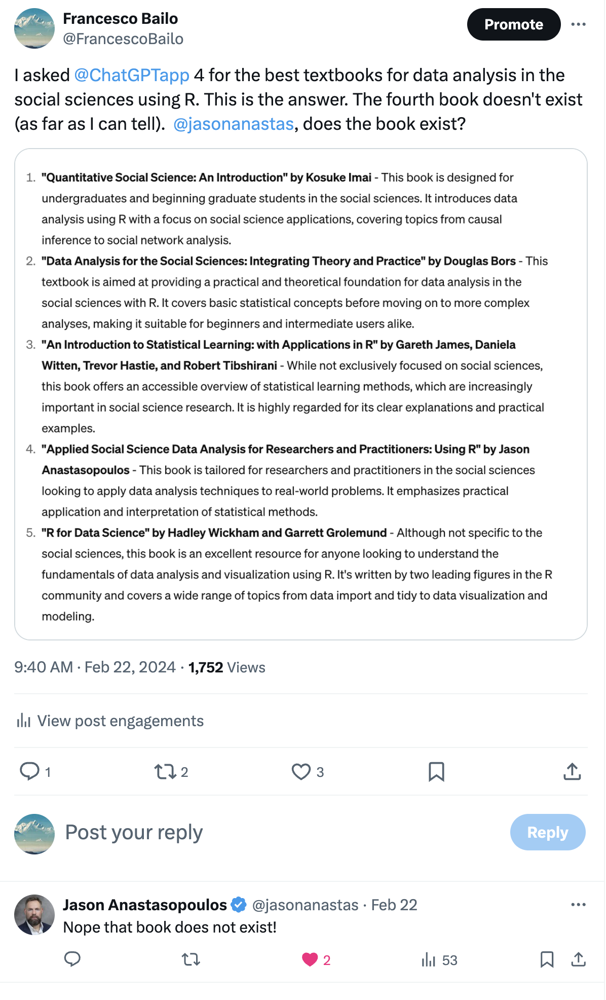

background-image: url(https://upload.wikimedia.org/wikipedia/en/6/6a/Logo_of_the_University_of_Sydney.svg)
background-size: 95%

```{r setup, include=FALSE}

knitr::opts_chunk$set(echo = TRUE, message = FALSE, warning = FALSE, 
                      dev = 'svg', out.width = "45%", fig.width = 6,
                      fig.align="center")

```

---

## Acknowledgement of Country

I would like to acknowledge the Traditional Owners of Australia and  recognise their continuing connection to land, water and culture. The  University of Sydney is located on the land of the Gadigal people  of the Eora Nation. I pay my respects to their Elders, past and present.

---

class: inverse, center, middle

# Chapter 2

# Review of the Literature

.center[Slides adapted from Creswell, Research Design 6e, SAGE Publishing, 2023 for GOVT6139 Research Design.

Do not reshare]

---

class: middle, center

# Any question concerning the content for this week?

---

## Today's class

| Time         | Content                                                                                                         |
|--------------|-----------------------------------------------------------------------------------------------------------------|
| 1:00 - 1:20  | **Research topic**</br></br>**Purpose, Organisation, Design of a Literature Review**                            |
| 1:20 - 1:50  | Hands-on: Databases, GenAI, Zotero                                                                              |
| 1:50 - 2:10  | Task 1: In Group (20 min)                                                                                       |
| 2:10 - 2:30  | **Priority of the Literature**</br></br>**Abstracting the Literature**</br></br>**Key Terms**</br></br>Check-in |
| 2:30 - 2:50  | Task 2: Individually (20 Min)                                                                                   |

---

# Chapter 2 Learning Objectives 

1. Explain the reasons for a literature review to defend its use in a study.

2. Organize a literature review consistent with a quantitative, qualitative or mixed methods approach.

3. Describe the steps typically undertaken when conducting a literature review.

4. Explain how to evaluate literature for inclusion in a literature review.

6. Identify the types of terms needing definition in a scholarly research report.

---

# Introduction

* Topic – subject or subject matter of a study
  * e.g., "political participation", "democratic development", "compulsory voting"
  
.center[</img>]
  
* Conduct literature review about the topic
  * Worth studying?
  * Scope?
  * Can be studied


---

# The Research Topic

* Gain insight into the topic by
    * Drafting a working title
      * “My study is about…”
    * Posing a brief question
      * What needs to be answered? (which helps you define your research problem and your research question)

First step is to examine research on the topic and ask

* How does this project contribute to the existing literature?

---

# The Research Topic

* The topic **can** be researched if
  * You have access to participants
  * You have resources to collect and analyze information
* The topic **should** be researched if
  * The research will add to the literature about the topic
  * Scholars will be interested in the topic
  * A study of it will advance your personal goals
  * It is ethical to conduct the study

---

# The Purpose of a Literature Review

* Shares the results of other studies

* Relates the study to the larger dialogue in the literature

* Provides a framework for establishing the importance of the study

* Provides a benchmark for comparing the results to other findings

* Studies need to add to the body of literature on a topic

---

# Organization of the Literature Review

## Literature reviews take several forms:

  * **Integrate** what others have done and said
  * **Criticize** previous scholarly works
  * **Bridge** between related topics
  * **Identify** the central issues in the field

---

# Qualitative approach

In qualitative research, inquirers use the literature in a manner consistent with the assumptions of **learning from the participant, not prescribing the questions** that need to be answered from the researcher’s standpoint. 

One of the chief reasons for conducting a qualitative study is that the study is **exploratory**. This usually means that not much has been written about the topic or the population being studied, and the researcher seeks to listen to participants and build an understanding based on what is heard.

---

# A Qualitative Structure

Table 2.1: Using Literature in a Qualitative Study

| Use of Literature | Criteria | Example of Suitable Strategy Types |
| :-: | :-: | :-: |
| The literature frames the problem in the introduction to the study.	 | There must be some literature available.	<br /> | Typically, researchers use this way in all types of qualitative studies.<br /> |
| The literature appears in a separate section.	 | This approach is often acceptable to an audience most familiar with the traditional postpositivist approach to literature reviews.	 | Researchers with a strong quantitative orientation like this approach. 	<br /> |
| The literature ends the study; it becomes a basis for comparing and contrasting findings of the qualitative study.	<br /> | This approach is most suitable for the inductive process of qualitative research; the literature does not guide and direct the study but becomes an aid once patterns or categories have been identified.	<br /> | Researchers with a strong qualitative orientation like this approach. 	<br /> |

---

# A Quantitative Structure

* The use of the literature:
* In quantitative studies, researchers use literature to:
  * Provide direction to the research questions and hypotheses
  * Introduce a problem
  * Introduce and describe the theory that will be used
  * Examine the usefulness of the theory
  * Compare results with existing literature or predictions

---

# A Mixed Method Structure

* The use of the literature:
* In mixed methods studies, researchers use the literature:
  * In either a quantitative or qualitative approach
  * In each phase, consistent with either the quantitative or qualitative approach
  * Relative to the intended audience
  
---

# Steps in Conducting a Literature Review

1. Identify key words (we can think of these as key *concepts*)

2. Search databases

3. Identify about 50 research reports in articles or books

4. Collect those that are central to your topic

5. Design a  __literature map__ (optional, but can be helpful to divide the literature under concepts, issues, methods and then relate this)

6. Draft summaries of relevant articles

7. Write a literature review, **organizing it by important concepts**

---

class: inverse, center, middle

# Databases, GenAI and Zotero

---

## The University of Sydney gives access to a wide range of databases for academic publications

Today we'll give a try to two

### 1. Google Scholar [scholar.google.com.au](https://scholar.google.com.au/)

* Free access
* Wider underlying collection (paper and books but also pre-prints, blogposts, etc..)
* Limited filtering functionalities
  
### 2. Web of Science [webofscience.com](https://www.webofscience.com/)

(An alternative to WoS is [Scopus](https://www.scopus.com/search))


---

## Using GenAI for research

.pull-left[.center[</img>]]

.pull-right[.center[</img>]]


---

Do you use GenAI?

.center[

OR 

[www.menti.com/albb7dk8wj91](https://www.menti.com/albb7dk8wj91) 

]

---

<div style='position: relative; padding-bottom: 56.25%; padding-top: 35px; height: 0; overflow: hidden;'><iframe sandbox='allow-scripts allow-same-origin allow-presentation' allowfullscreen='true' allowtransparency='true' frameborder='0' height='315' src='https://www.mentimeter.com/app/presentation/alpr569mjknqmhb9syry2qo4vspcgav1/embed' style='position: absolute; top: 0; left: 0; width: 100%; height: 100%;' width='420'></iframe></div>

---

## Using Cogniti

* [Literature searching coach (AI agent)](https://canvas.sydney.edu.au/courses/55191/pages/literature-searching-coach-ai-agent?module_item_id=2280367) on Canvas

---

# Hands-on: Install Zotero on your laptop

1. Install Zotero (which includes the Word plug-in)

2. Install the browser connector 

3. Create a free Zotero.org account (optional - to sync across devices)

Instructions: [libguides.nps.edu/zotero/install-setup](https://libguides.nps.edu/zotero/install-setup)

---

# Hands-on: Use Zotero for the first time

1. Create a collection;

2. Create an item by importing it; [libguides.nps.edu/zotero/add-items](https://libguides.nps.edu/zotero/add-items)

3. Add a reference in Word. [libguides.nps.edu/zotero/cite-in-word](https://libguides.nps.edu/zotero/cite-in-word)

## I need some volunteers to join the Zoom meeting and share their screen! Ideally, a mix of Windows, Mac, Chrome and Firefox...

---

# Hands-on: Google Scholar

.center[[scholar.google.com.au](https://scholar.google.com.au/)]

* Let's search for works about "compulsory voting"

* Phrase searching `"compulsory voting"`

* Exclude terms `"compulsory voting" -australia`

---

# Hands-on: Web of Science

.center[[webofscience.com](https://www.webofscience.com/)]

* Let's search for works about "compulsory voting"

* Phrase searching `"compulsory voting"`

* Exclude terms `"compulsory voting" NOT australia`

* Near term `"compulsory voting" NEAR/8 australia`

* Analyse results

* Filters

---

class: center, middle

# TASK 1 

Complete the **Part 1: In Group** on the Task sheet (also available from Canvas)

```{r echo = FALSE}
library(countdown)

countdown(minutes = 20, seconds = 00)
```


---

# Priority of the Literature

* A priority for selecting literature material:

1. Start with broad syntheses (such as encyclopedias or handbooks if you are new to the topic
  * E.g. *[The Oxford Handbook of Political Participation](https://global.oup.com/academic/product/the-oxford-handbook-of-political-participation-9780198861126]0)*)

2. Turn to journal articles in peer-reviewed journals
3. Next, consider books
4. Then examine conference papers (Google Scholar is king here)
5. Scan for dissertations
6. Lastly, consider reports on the web

---

# Abstracting the Literature 

### Abstracts summarize major elements of the article

#### For research studies:

* Mention the problem
* State the central purpose
* State information about the population and sample
* Review key results
* Point out methodological flaws (if a critique or methods review)

---

###  Abstracting studies

#### For nonempirical studies (essays, opinions, etc.)

* Mention the problem
* Identify the central theme
* State the major conclusions
* Mention flaws in reasoning or logic (if a methodological review)

---

# Definition of Terms

* Identify and define terms that readers need to understand a proposal
* Define terms introduced in  _all_  sections of the research plan:
  * Title of the study
  * Problem statement
  * Purpose statement
  * Research questions, hypotheses, or objectives
  * Literature review
  * Theory base of the study
  * Methods section

---

## General Guidelines for terms

* Define terms when they first appear in the manuscript

* Use specific operational definitions

* Do not define terms using everyday language, be guided by the literature

* Define terms so that they accomplish different goals

* One may use a definition of terms section in the manuscript

---

### Special Terms

* Qualitative studies
  * Inductive and evolutionary in nature
  * The definition of terms may appear later in the written report, perhaps in the data analysis
* Quantitative studies
  * Deductive with a fixed set of objectives
  * All relevant terms are comprehensively defined earlier in the study
* Mixed methods studies
  * Follows the use of quantitative or qualitative approach
  * Clarify terms related to mixed methods

---

# Summary

* Identify your topic through a brief title or central research question
* Use the literature to
  * Present similar studies
  * Relate the study to the literature
  * Provide a framework for comparison
* Different purpose depending on approach
* Search databases using key terms


---

# Check-in

---

class: center, middle

# TASK 2

Complete the **Part 2: Individually** on the Task sheet (also available from Canvas)

```{r echo = FALSE}
library(countdown)

countdown(minutes = 20, seconds = 00)
```


---

# First peer-review task is due next week (Friday, 15 Mar)

## Think about a research problem and a research question for your A2 (due in Week 13)

## Write max 500 words (up to a page)

From your textbook's glossary

### Research problems 

... are problems or issues that lead to the need for a study. Research problems become clear when the researcher asks "What is the need for my study?" or "What problem influenced the need to undertake this study?"


---


class: inverse, center, middle

# Thank you and see you neext week with "The Use of Theory" (Ch 3 of the textbook)


