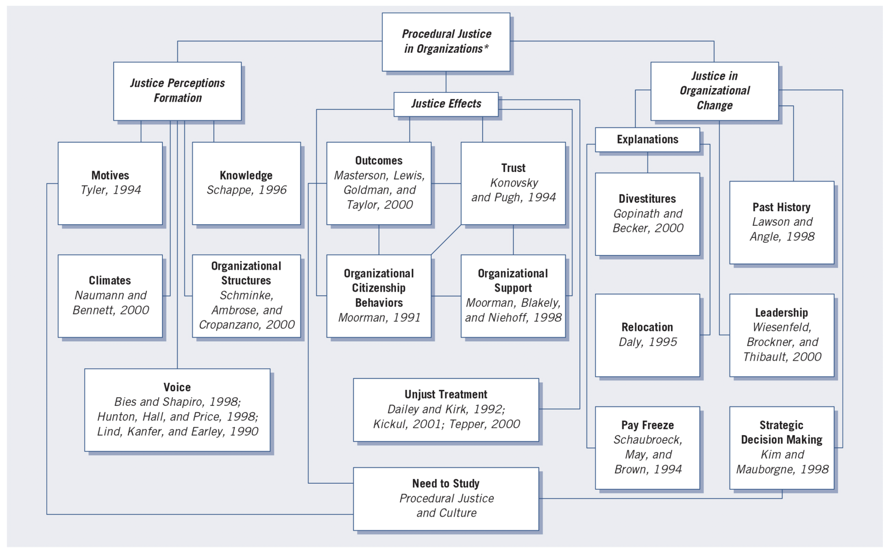

background-image: url(https://upload.wikimedia.org/wikipedia/en/6/6a/Logo_of_the_University_of_Sydney.svg)
background-size: 95%

```{r setup, include=FALSE}

knitr::opts_chunk$set(echo = TRUE, message = FALSE, warning = FALSE, 
                      dev = 'svg', out.width = "45%", fig.width = 6,
                      fig.align="center")

```

---

## Acknowledgement of Country

I would like to acknowledge the Traditional Owners of Australia and  recognise their continuing connection to land, water and culture. The  University of Sydney is located on the land of the Gadigal people  of the Eora Nation. I pay my respects to their Elders, past and present.

---

class: inverse, center, middle

# Chapter 2

# Review of the Literature

.center[Slides adapted from Creswell, Research Design 6e, SAGE Publishing, 2023 for GOVT6139 Research Design.

Do not reshare]

---

class: middle, center

# Any question concerning the content for this week?

---

## Today's Activities

- **Chapter 2 overview:** Literature review purposes and research topic development

- **Web of Science training:** Live database demonstration and search techniques

- **TASK 1 (Groups):** Use NotebookLM to abstract papers

- **TASK 2 (Individual):** Find 5+ papers for your research topic, analyse with NotebookLM

---

# Chapter 2  Overview

### Before you design your proposal, you must:

- Identify a researchable topic
- Conduct an extensive literature review
- Understand how literature reviews differ across research approaches

### Key Focus Areas:

- Selecting and evaluating research topics
- Understanding purposes and organisation of literature reviews
- Mastering the literature search process
- Defining key terms appropriately


---

## What your Research Proposal A2 should contain

.pull-left[

### Research Question (15%)

- Identify a specific question for your research project
- Outline why the question is important

###Literature Review (25%)
- How does your proposed research add new knowledge to the previous literature on the topic?  

]

.pull-right[

### Research Design (60%)

- Theory (and, if appropriate, hypotheses)
- What data do you propose to collect and how do you plan to go about it OR what existing data source do you plan to use, and how do you plan to use it
- What case(s) did you select, and why
- How do you plan to analyse your data
- The strengths and weaknesses of your proposed approach
]

---

  
## The Research Topic
  
### What is a Research Topic?
  - The **subject or subject matter** of a proposed study
- Examples: "faculty teaching," "organizational creativity," "psychological stress"
- Should be described in **a few words or short phrase**
  - Becomes the **central idea** to learn about or explore


---

### Developing Your Topic

.pull-left[

**Strategy 1: Draft a Working Title**

- Complete: "My study is about..."
  
- Keep it **straightforward and uncomplicated**
  
  - Avoid complex, erudite language early on
  
- Follow Wilkinson's (1991) guidelines:

  - Be brief, avoid wasting words
  - Eliminate "An Approach to..." or "A Study of..."
  - Limit to 10-12 words
  - Include the focus/topic
  
]

.pull-left[

**Strategy 2: Pose as a Question**
- "What treatment is best for depression?"
- "What does it mean to be Arabic in U.S. society today?"

]


---

## Evaluating Topic Significance

### Can it be researched?
- Access to willing participants
- Available resources (time, computer programs, etc.)
- Sustainable data collection period

### Should it be researched?
**Key Considerations:**
1. **Contribution to literature** - Does it add new knowledge?
2. **Broader interest** - Appeals beyond your institution
3. **Personal goals** - Aligns with career objectives
4. **Time investment** - Worth the commitment required
5. **Ethical considerations** - Is it ethically acceptable to conduct the study?

---

## Evaluating Topic Significance

**Ways to Contribute:**
- Address unexamined topics
- Extend existing discussions
- Replicate studies in new contexts
- Study unusual locations or populations
- Take unexpected perspectives
- Use novel data collection methods
- Study timely topics

---

## Purpose of Literature Review

### What Literature Reviews Accomplish:

1. **Share related studies** - Results of closely related research
2. **Connect to ongoing dialogue** - Fill gaps and extend prior studies
3. **Establish importance** - Framework for significance
4. **Provide benchmarks** - Compare results with other findings
5. **Shape narrative** - From larger problem to narrower issue

### Core Principle:
.content-box-yellow[

.center[**Studies must add to the body of literature on a topic**]

]

---

## Organising Literature Reviews by Research Approach

### Quantitative Structure
- **Substantial literature** at the beginning
- **Deductive approach** - provides direction for questions/hypotheses
- **Separate section** titled "Related Literature" or "Review of Literature"
- **Five-component model:**
  1. Introduction to the review
  2. Topic 1: Independent variable(s)
  3. Topic 2: Dependent variable(s)
  4. Topic 3: Studies relating independent and dependent variables
  5. Summary highlighting key studies

---

## Organising Literature Reviews by Research Approach

### Qualitative Structure
- **Literature used sparingly** at beginning (unless design requires it)
- **Inductive approach** - learn from participants
- **Three placement options:**
  1. In introduction (frames the problem)
  2. Separate section (for quantitatively-oriented audiences)
  3. At the end (compare with findings - preferred for qualitative orientation)
  
---

## Organising Literature Reviews by Research Approach

### Mixed Methods Structure
- **Depends on strategy** and relative weight of qualitative/quantitative
- **Sequential approach:** Literature presented in each phase
- **Equal weight:** Choose qualitative or quantitative form based on audience

---

## Steps in Conducting Literature Review

### 7-Step Process:

1. **Identify keywords** for database searches
2. **Search databases** (ERIC, Google Scholar, Web of Science, EBSCO, ProQuest, JSTOR)
3. **Locate ~50 reports** of research articles or books
4. **Skim and collect** central articles
5. **Design literature map** (visual organisation)
6. **Draft summaries** of most relevant articles
7. **Assemble review** structured thematically with summary

### Key Principle:
**Iterative process** - search, then re-search until finding appropriate material


---

## Major Databases for Literature Search in Social Sciences

- **Google Scholar** - Cross-disciplinary (scholar.google.com) Free

- **Web of Science** - Largest abstract and citation database (www.webofscience.com) Access from USyd Library

- **Scopus** - Largest abstract and citation database (www.scopus.com)  Access from USyd Library

### Search Tips:
- Use both free and institutional databases
- Search multiple databases regardless of your field
- Use thesaurus guides when available
- Start with recent articles, work backward
- Look for full-text access


---

## Literature Priority and Quality Evaluation

.pull-left[

### Search Priority (in order):
1. **Broad syntheses** - encyclopedias, **review articles**
2. **Journal articles** - research studies in respected journals
3. **Books** - research monographs, topic-focused books
4. **Conference papers** - latest developments
5. **Web materials** - evaluate carefully for quality

]

.pull-right[

### Quality Evaluation Criteria:
- **Journals:** National refereed publications with editorial boards
- **Books:** Recognized publishers, recent publications (last 10 years)
- **Online sources:** Evidence of quality review
- **Conference papers:** Included in recent conferences
- **General:** Seek recommendations from advisors/mentors

]

---

## Let's give it a try!

- Go to [library.sydney.edu.au](https://www.library.sydney.edu.au/)

- Search `Web of Science`

- Click on "Access online"

- If prompted, enter you UniKey and password

- Let's search something!

- Also, get help with your search string here [https://webofscience.help.clarivate.com/en-us/Content/search-rules.htm](https://webofscience.help.clarivate.com/en-us/Content/search-rules.htm)

---

## Abstracting the Literature

### Components of a Research Abstract:
- **Problem** being addressed
- **Purpose** or focus of study
- **Sample information** - population, participants, subjects
- **Key results** related to your proposed study
- **Methodological critique** (if applicable)

### Components of Theoretical/Methodological Abstract:
- **Problem** addressed by article/book
- **Central theme** of the study
- **Major conclusions** related to theme
- **Reasoning/logic flaws** (for methodological reviews)

### Where to Find Information:
- **Problem/Purpose:** Introduction section
- **Sample:** Method/procedure section
- **Results:** Results section addressing each research question

.content-box-yellow[

.center[... or we can ask a LLM chatbot!]

]

---


# TASK 1: NotebookLM


### In group

- One person for each group to

  1. Download the paper from Canvas (compressed folder) with topic "political participation and social media"
  2. Open NotebookLM and create a new notebook (use an original name!)
  3. Upload a selection of the papers or all of them!
  4. Share the notebook with the other person in the group
  
- The group now shares the resources of the notebook, but each member will have separated chats (also invite me: `bailo.francesco@gmail.com`).

---

# TASK 1: NotebookLM (In group)


```{r echo = FALSE}
library(countdown)

countdown(minutes = 30, seconds = 00)
```

- **High-level task**: Go back to the previous slide and try to abstract the literature!

- **Low-level tasks** (a few tips, but feel free to be creative and experiment)

  - Start from .content-box-green[`For each paper, provide a one line summary`]
  
  - Zoom in into single papers, then, and get
  
      - **type of paper**: review paper or research paper?
    
      - **research abstracts**: ask about "research problems", "sample information", "key findings".
    
      - **theoretical and conceptual abstracts**: ask about theories and concepts mentioned in the papers. 
    
      - **methodology abstracts**: ask about the methodology and the methods presented in the paper. 
    

  - Ask questions to draw connections/comparison among more than one paper. 

.center[.content-box-yellow[.small[When you get an interesting result from the chatbot,]]]
.center[.content-box-yellow[.small[add it into a "Note" (see right panel)]]]


---

## Literature Maps

### Purpose:
**Visual summary** showing how your study fits within existing literature

### Design Principles:
1. **Topic at top** of hierarchy (a topic can also be a critical concept, theory or idea)
2. **Organize into 3+ subtopics** based on your literature
3. **Include descriptive labels** in each box
4. **Add major citations** illustrating content
5. **Create multiple levels** as needed
6. **Show your study** at bottom with connecting lines

---

### Benefits:
- Organize your understanding
- Present to committees
- Compose journal articles
- Show how your study extends existing research

### Design Options:
- **Hierarchical** (top-down)
- **Flowchart** (left-to-right)
- **Intersecting circles** (overlapping areas indicate research needs)

---

.center[]

An example of a literature map from the text book

---

## Definition of Terms

### When to Define Terms:
- **Individuals outside the field** may not understand
- **Beyond common language** usage
- **When terms first appear** in proposal
- **Any likelihood** readers won't know meaning

### Guidelines for Definitions:
1. **Define when first mentioned**
  2. **Use operational/applied level** - specific, not abstract
3. **Ground in research literature** - not everyday language
4. **Different purposes:** describe, limit, establish criteria, define operationally
5. **Separate section** if needed (2-3 pages maximum)

### Approach by Research Type:

**Qualitative:**
  - **Few terms** defined at beginning
- **Tentative definitions** may emerge during research
- **Terms defined** as they surface in findings

**Quantitative:**
  - **Extensive definitions** early in proposal
- **Separate section** with precise definitions
- **Comprehensive** approach using accepted literature definitions

**Mixed Methods:**
  - **Define mixed methods terminology** (convergent design, integration, etc.)
- **Approach depends** on which phase comes first
- **Clarify strategy terms** (concurrent, sequential, specific design names)

---
  
## Summary and Key Takeaways
  
  ### Before Literature Search:
  1. **Identify researchable topic** using title/question strategies
2. **Evaluate significance** - can it and should it be researched?
  3. **Consider contribution** to existing knowledge

### During Literature Review:
1. **Understand different purposes** across research approaches
2. **Follow systematic 7-step process**
  3. **Use multiple high-quality databases**
  4. **Prioritize and evaluate sources** carefully
5. **Create literature map** for organization
6. **Abstract key information** systematically

### Writing and Style:
1. **Follow APA 7th edition** consistently
2. **Define terms** appropriately for your approach
3. **Structure review** thematically
4. **End with summary** showing gaps your study will fill

### Final Goal:
**Position your study within existing literature** and demonstrate how it extends, replicates, or fills gaps in current knowledge

---
  
## Key Terms to Remember
  
- **Abstract** - Brief review summarizing major elements of a study
- **Computer databases** - Online repositories providing access to literature
- **Definition of terms** - Precise meanings for concepts in your study
- **Literature map** - Visual representation of literature organization
- **Style manuals** - Guidelines for consistent scholarly communication
- **Topic** - Subject matter of your proposed study

---

# First peer-review task is due next week (Wed, 27 Aug)

## Think about a research problem and a research question for your A2 (due in Week 13)

## Write max 500 words (up to a page)

From your textbook's glossary

### Research problems 

... are problems or issues that lead to the need for a study. Research problems become clear when the researcher asks "What is the need for my study?" or "What problem influenced the need to undertake this study?"

---

# TASK 2: Web of Science + NotebookLM (individually)

1. Reflect on a research **topic** (for A2)

2. Think about what **key words** would help you find relevant literature. 

3. Post your **key words*** on **Padlet**!

4. Go the **Web of Science**, search and download **5+ papers** (at least **1 review paper**).

5. Upload the papers to a new notebook in Notebook LM. 

6. Start with **summaries** then try to understand the **research problems** addressed in the paper. 

7. What **YOUR research problem** could be? 

8. Post your research problem on **Padlet**!

.center[.content-box-red[Do you have a question? Asking on this week's discussion board on Canvas!]]

---


class: inverse, center, middle

# Thank you and see you neext week with "The Use of Theory" (Ch 3 of the textbook)


