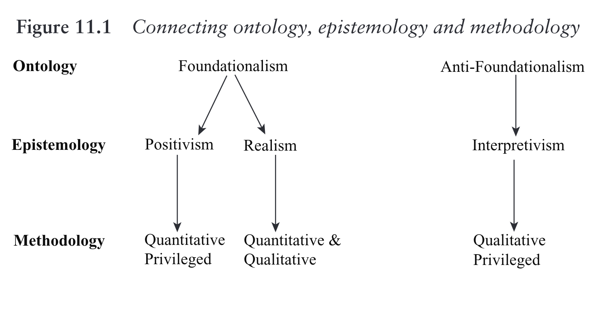
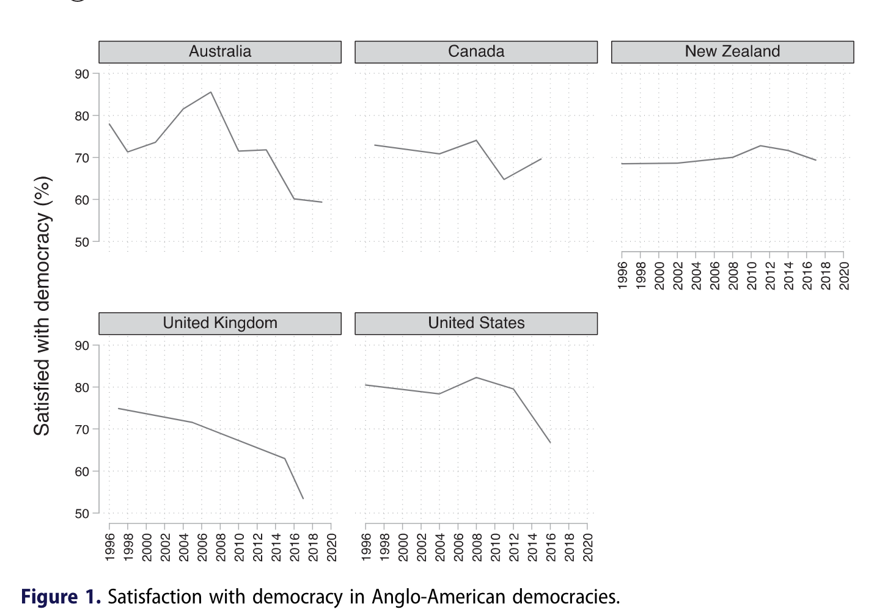
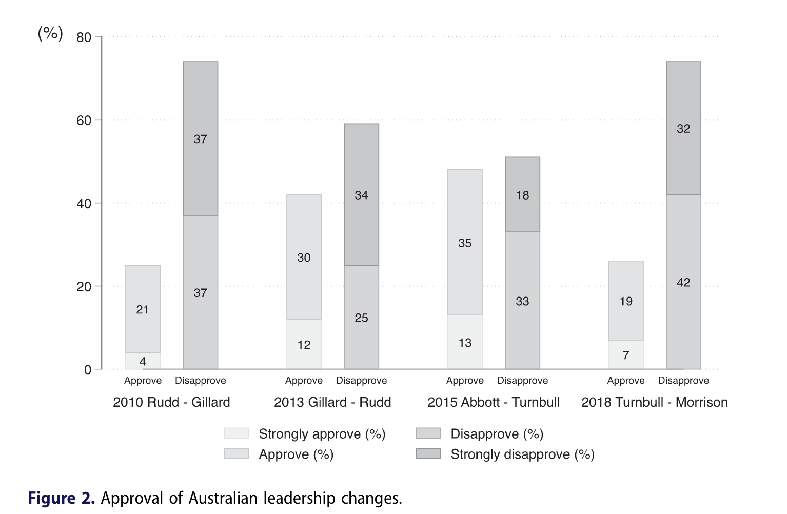
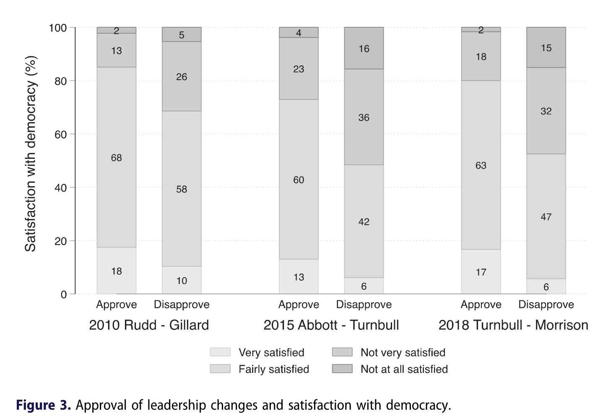
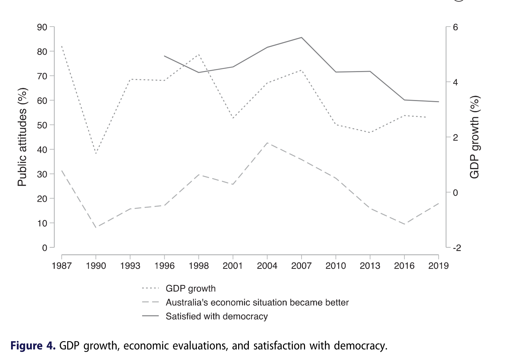
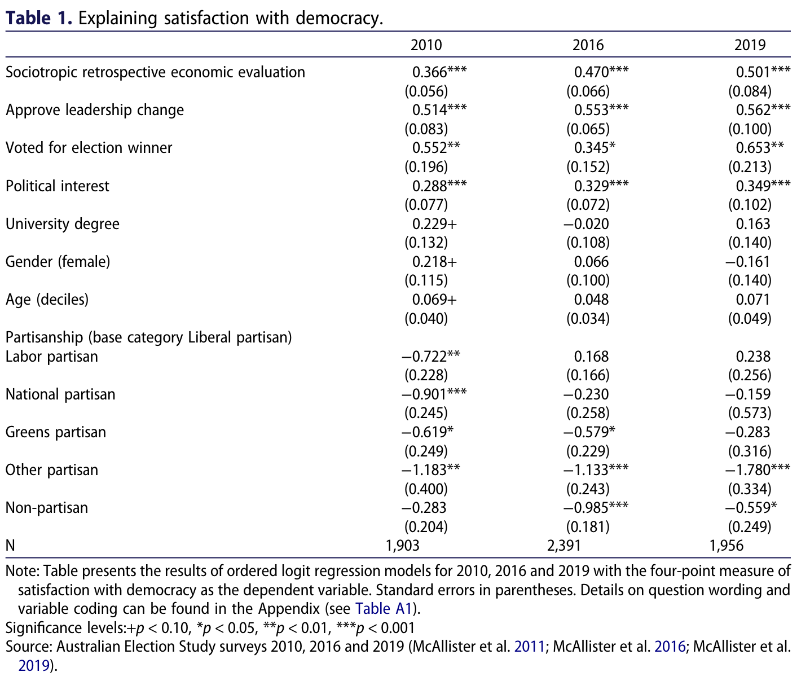
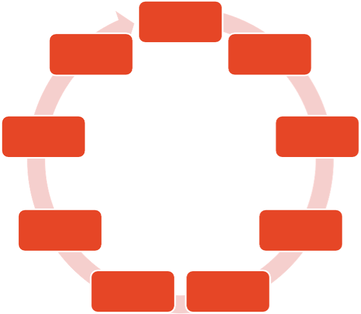
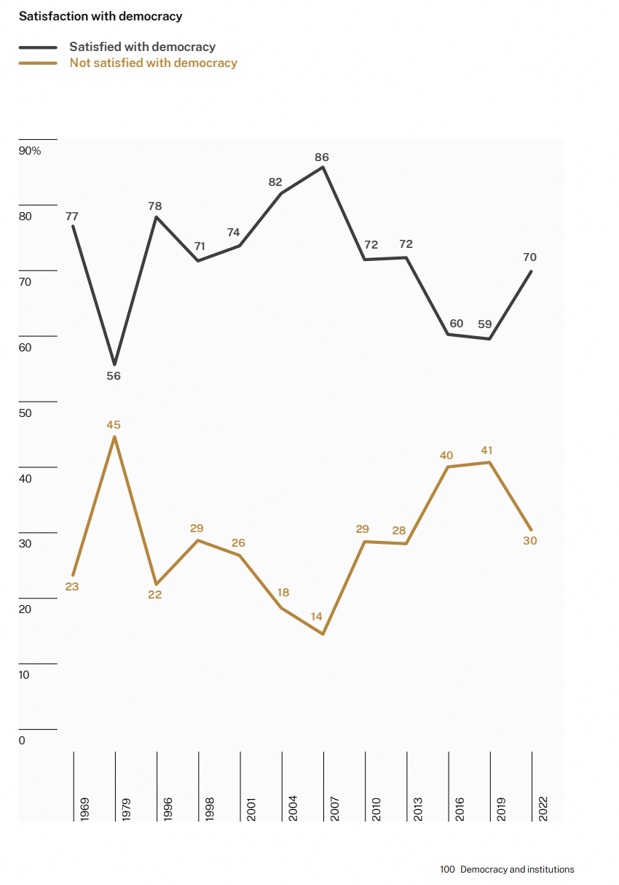
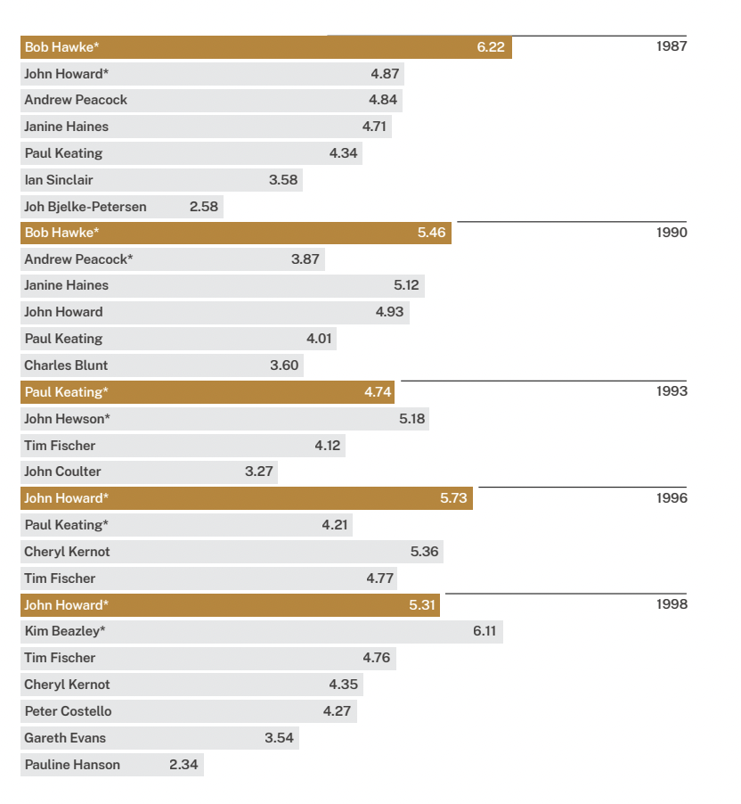
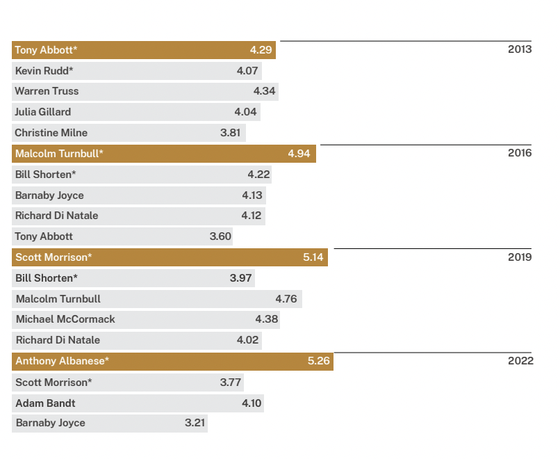

background-image: url(https://upload.wikimedia.org/wikipedia/en/6/6a/Logo_of_the_University_of_Sydney.svg)
background-size: 95%

```{r setup, include=FALSE}

knitr::opts_chunk$set(echo = TRUE, message = FALSE, warning = FALSE, 
                      dev = 'svg', out.width = "45%", fig.width = 6,
                      fig.align="center")

```

---

## Acknowledgement of Country

I would like to acknowledge the Traditional Owners of Australia and recognise their continuing connection to land, water and culture. The  University of Sydney is located on the land of the Gadigal people  of the Eora Nation. I pay my respects to their Elders, past and present.

---

## Today's class

* Ontology and epistemology continued:
    * Recap: Interpretivism and positivism
    * Example of positivism: Government performance and dissatisfaction with democracy in Australia

* Asking research questions

* Building blocks of the research process:
    * Concepts
    * Theories
    * Hypotheses
    * Variables
    * Measurements

* Individual exercise

* Primary and secondary data

---

## Recap: Epistemological positions

.center[</img>]

(Marsh et al., 2018, p. 179)

Note: Generally, post-positivism = *Critical* realism. Objectivity but with biases. 

---

## Individual task

Let's quickly answer last week's questions: 

* What is *ontology*? What are the main ontological positions?

* What is *epistemology*? What are the main epistemological positions?

You can post your answers to Canvas after entering them in Menti.

```{r echo = F}

library(countdown)

countdown(minutes = 5, seconds = 00)
```


---

## Recap: Epistemological positions

.pull-left[
**Positivism**

*Objectivist ontology: Real world out there, independent of our observation*

* Can therefore establish ‘real’ relationships between social phenomena
* Can study these relationships via direct observation
* Interested in causal relationships
* Researcher objectivity

]

.pull-right[

**Interpretivism**

*Constructivist ontology: The world is socially constructed*

* Social phenomena cannot be understood independently of our interpretation of them
* More subjective: No observer can be objective because he/she lives in the world and participates in the social construction of reality
* Double hermeneutic – the world is interpreted by the actors and their interpretation is interpreted by the observers

]

---

## Example positivist research

.center[</img>]

Cameron, S. (2020). Government performance and dissatisfaction with democracy in Australia. *Australian Journal of Political Science*, 55(2), 170–190. https://doi.org/10.1080/10361146.2020.1755221


---

## Key research question

### What does explain declining satisfaction with democracy in Australia?

---

## Context 1/2 

### Declining satisfaction with democracy in Australia

.center[</img>]

---

## Context 2/2 

### Satisfaction with democracy in Anglo-American democracies


.center[</img>]

Source: Comparative Study of Electoral Systems (CSES) and national election studies.

---

## What explains declining satisfaction with democracy in Australia?

Media commentary on the decline:

.pull-left[

* Democratic malaise affecting other advanced democracies

* Frequent changes of Prime Minister

> "There have been some rather unkind comments about Australia being the *Italy of the South Pacific* and the *coup capital of the world*" (Julie Bishop 2018)

]

.pull-right[
.center[</img>]
]

Cameron's paper provides an empirical test of explanations.

---

## What explains satisfaction with democracy? 
## Theory

Key findings of previous comparative studies:
1.	**Political institutions**
    * Electoral system: Majoritarian vs. proportional representation
    * Electoral winners / losers
2.	**Culture and values**
    * Rising levels of education affect citizen attitudes
    * Generational change, younger generations more critical
3.	**Government performance**
    * Economic performance
    * Political performance
    
See: Anderson and Guillory (1997); Huang et al. (2008); Inglehart (1997); Norris (1999).

---

## Explaining dissatisfaction with democracy in Australia
## Theory II

* **Political performance**
    * Leadership changes: 6 Prime Minsters in a span of 8 years
    
    * Changes driven by party infighting not voters
    
    * Only one change of PM resulting from an election (2013) [Remember paper was published in 2020]
    
* **Economic performance**

    * Voter pessimism about the state of the economy
    
    * In 2016 just 10% thought economy had improved in past year

---

## Explaining dissatisfaction with democracy in Australia

### Hypotheses

1. Those disapproving of the leadership changes more dissatisfied with democracy

2. Those pessimistic about the economy more dissatisfied with democracy

Note the IF ... THEN .... This is an important approach for multivariate analysis and positivist research

---

## Data and Methods I: The Australian Election Study

.pull-left[

* National, post-election surveys asking ≈ 250 questions about politics and the election.

* 1987-2022. Satisfaction with democracy measured since 1996.

* Surveys representative of the Australian population.

* Data available from: www.australianelectionstudy.org

]

.pull-right[


.center[</img>]

]

---

## Data and Methods II: Key measures

**Dependent variable: Satisfaction with democracy** (1996-2019)

> On the whole, are you very satisfied, fairly satisfied, not very satisfied or not at all satisfied with the way democracy works in Australia? [Very satisfied / Fairly satisfied / Not very satisfied / Not at all satisfied]

**Independent variable: Approval of leadership changes** (2010, 2019)
> Do you approve or disapprove of the way the [Liberal Party] handled the leadership change in [September of last year] when [Malcolm Turnbull] replaced [Tony Abbott]? [Strongly approve / Approve / Disapprove / Strongly disapprove]

** Independent variable: Economic evaluations** (1987-2019)
> And how do you think the general economic situation in Australia now compares with what it was 12 months ago? [A lot better / A little better / About the same / A little worse / A lot worse]

---

## Dependent and independent variables (snapshot recap)

The dependent variable, usually indicated with $Y$, is the variable on which the independent variable(s), usually $X$, has an effect.

Synonyms from Wikipedia

| independent | dependent |
| -- | -- | 
| input | output |
| regressor |	regressand |
| predictor |	predicted |
| explanatory |	explained |
| exogenous |	endogenous |
| manipulated |	measured |
| exposure |	outcome |

---

## Data and Methods III: Approach


### Quantitative methods

* Examine trends over time

* Examine relationships between variables

* Regression modelling to:

    * Examine effects of government performance (political and economic) on satisfaction with democracy
    
    * Whilst controlling for other factors expected to affect satisfaction with democracy – electoral winners/losers, education level, age etc.

* Don’t worry about the details here – we will unpack all this in Weeks 8-11 on quantitative methods

---

## Approval of leadership changes, 2010–2018

> Do you approve or disapprove of the way the [Labor party] handled the leadership change [in June of this year], when [Julia Gillard] replaced [Kevin Rudd]?

.center[</img>]

Source: Australian Election Study (2010, 2016, 2019) and ANU Poll (2013).

---

## Approval of leadership changes and satisfaction with democracy

.center[</img>]

Note: The Y-axis (vertical) is changed now. This charts directly investigates (now for the first time) the relationship between two variables.

---

## Economic perceptions and satisfaction with democracy

.center[</img>]

Source: Australian Election Study and OECD (GDP growth).

Note: Survey variables from a number of years are compared to GDP measures.

---

## Explaining satisfaction with democracy

A regression table 😱 😱 😱 (Note: Four-point measure of satisfaction with democracy is the dependent variable)

.center[</img>]

---

## Conclusions

**The effect of government performance**

* Frequent leadership changes and negative economic perceptions
undermined satisfaction with democracy.

**Contribution**
* Sheds light on an interesting case.

* Examines the effects of frequent prime ministerial turnover on citizen attitudes towards democracy.

* Results suggest satisfaction with democracy in Australia reflects homegrown factors, not just global trends.

---

## What makes this research positivist?

*Assumptions*
* Social phenomena can be directly observed and measured
    * E.g. satisfaction with democracy measured via survey
    * These measurements enable comparisons – between individuals, and even across countries
    * Can examine relationships between social phenomena – e.g. attitudes towards the leadership changes and satisfaction with democracy
    
* Assumed objectivity of the researcher

* Interested in causal explanations
    * i.e. what caused satisfaction with democracy to decline in Australia?
    
* Interested to discover general, universal laws
    * Frequent changes of political leaders (outside of elections) undermine satisfaction with democracy
    * Testing and building upon established theories

---

## Individual task

### Think about a key difference between interpretivism and positivism in practice using as an example the research by Peter Chen and Sarah Cameron (e.g. think about research questions or methods and data).

You can post your answers to Canvas after entering them in Menti.

```{r echo = F}
library(countdown)

countdown(minutes = 8, seconds = 00)
```


---

class: inverse, center, middle

# Introduction to research design

.center[</img>]

---

## What is research design?

### Broad definition

Research design can refer to a whole proposal for a research project, including the 

* review of the literature, 
* research questions, 
* hypotheses, 
* selection of cases,
* details of data collection and 
* methods of data analysis.

### Narrow definition

Research design refers to "the logical method by which we propose to test a hypothesis".

Monroe 2018, *Essentials of Political Research*, p. 31, Chapter 3 Research Design [[link](https://www-taylorfrancis-com.ezproxy1.library.usyd.edu.au/books/9780429500749)]

---

## The Research process

.center[</img>]

Source: Toshkov, D. (2017). Research design. In V. Lowndes, D. Marsh, & G. Stoker (Eds.), *Theory and Methods in Political Science* (pp. 219–236), p. 221. [[link](http://ebookcentral.proquest.com/lib/usyd/detail.action?docID=6234931)]

---

class: inverse, center, middle

# Asking research questions

.center[</img>]

---

## Research Topic

**Choosing a topic**
* Familiarize yourself with existing studies in the area
* You should identify what the key finding is in each article, book or policy debate.
* Are there debates within the literature?
* Do you see weaknesses? Can you think of an alternative argument? 
* Do you think the argument is applicable to other cases which the author does not use (e.g. Asian countries)?
* Do you see further questions?

**Any puzzle?**
* One often effective way of choosing a topic is to work on something which puzzles us.

---

## What makes for a good research question?

* Addresses an important topic in the real world.
    * So what? Why should anyone care about this?
    
* Contributes to scholarly debates / literature.
    * Has not yet been answered; or has not yet been examined in a particular context. Adds to knowledge.
    
* Testable.
    * Is it a feasible question to answer?
    * Is it sufficiently focused?

* Addresses a 'puzzle'

---

## Why develop a research question?

(Note: A research question is actually... a question! With a ? at the end.)

* It forces you to get clear about what you are interested to find out;

* It organises, and is the basis for all other steps in the research process;

* It focuses and narrows your search for information;

* By requiring that it address an issue of significance in the real world, enables research to contribute to knowledge about important issues;

* By requiring that it addresses an issue of significance to the academic literature, enables research to contribute to, rather than merely reproduce, existing knowledge.

---

### Types of research questions

#### Descriptive

Characteristics of something, how it works or behaves - describe and model it

* *Example: What are Australians’ attitudes towards democracy?*
    
#### Explanatory

Causes of something that has occurred or is happening – explain what factors or conditions are causally connected to a known outcome

* *Example: What explains (dis)satisfaction with democracy in Australia?*
    
#### Normative

Questions about how things should be

* *Example: Is it important that Australian citizens are satisfied with democracy?*


---

## Example research question

.pull-left[
**Puzzle**: Satisfaction with democracy has declined rapidly in Australia. 86% of citizens satisfied in 2007; 59% in 2019. What explains this decline?

**Research question**: What has caused the decline in satisfaction with democracy in Australia?

Source: Australian Election Study, 2022 Trends report]

.pull-right[.center[</img>]]

---

## Puzzle: Australia’s political leaders are less popular than they used to be. Why?

.pull-left[.center[</img>]]

.pull-right[.center[</img>]]


Source: Australian Election Study, 2022 Trends report

**Research question**: Why are Australia's political leaders less popular than they used to be? (Is it the quality of leaders that's declining, or citizens' expectations that are rising?)

---

## Example research question

**Puzzle**: Sometimes political leaders are selected by their parliamentary party members (MPs), sometimes they are selected by mass party members, and sometimes they are selected in some other way. Which method of leader selection leads to better electoral outcomes?

**Research question**: Which process of political leader selection results in the best electoral outcomes?

---

## Example research question

**Puzzle**: The global financial crisis that hit in 2008 was the greatest economic shock in almost 100 years, since the Great Depression of the 1930s. What effect did this have on citizen *participation* in *protests*?

.center[</img>]

**Research question**: What effect did the global financial crisis have on citizen participation in protest? Did it mobilize or demobilize participation in protest?

---

## Strategies / Good Empirical Questions

.pull-left[

**Good empirical questions**

* *Clarity*: It must be clear and reasonably specific;

* *Testability*: It must be a question that can be investigated given available empirical resources;

* *Theoretical significance* and/or ‘real world’ relevance: It must be important theoretically and/or practically.

* *Originality*: It should have at least some degree of originality.

]

.pull-right[

**Reformulating questions **

**Method 1**: Change the frame of reference
* Is Albanese doing a good job as Prime Minister?
* Does the public think that Albanese is doing a good job as Prime Minister?

**Method 2**: Test the underlying argument
* Should the government provide an economic stimulus in response to COVID-19?
* Did an economic stimulus (under similar conditions) boost the economy?

]

---

## Reflective exercise: Good or bad research questions

### Let's answer with Menti

---
class: inverse, center, middle

# Building blocks of the research process: 

.center[</img>]

# Concepts, theories, hypotheses, variables, measures

---

## Building blocks of social scientific research

.pull-left[
**Positivist approach**

* Concepts

* Theory

* Hypothesis

* Variables

* Operationalisation

* Measures

* Unit of Analysis
]

.pull-right[

</img>

]

---

## Concept

### What is a concept?

An idea or mental construct that represents phenomena in the real world

#### Examples

Democracy, globalization, poverty, accountability, civil society etc.

### Basic problem in social science

* Many concepts are abstract and lack precise and shared meaning (i.e. they are often multi-dimensional)

* Concepts are “unobservable” – that is, we rely on other observable variables to measure indirectly the concept

* Raises problems of measurement and how to capture abstract concepts with observable measures

---

## Theory

### What is a theory?

#### A theory is a set of related propositions that attempts to explain, and sometimes predict, a set of phenomena

* It is broad and general – aimed at generalized causal relationships (i.e. 'X causes Y')
* It connects variables at the conceptual level
* A statement as to the expected relationship between concepts

#### Uses of theory in social scientific thinking

* Theory provides patterns for the interpretation of data
* Theory links one study with another
* Theory supplies frameworks within which concepts and variables acquire substantive significance
* Theory allows us to interpret the larger meaning of our findings for ourselves and others

---

## Hypothesis

### A hypothesis is ... 

* an **empirical statement** 

derived from

* a **theory** (or an observable implication of a theory)

Also a hypothesis ...

* is focused and specific;

* explicitly indicates how a researcher thinks that phenomena of interest are related

* translates theory (relationship between concepts) to hypothesis (relationship between measures of those concepts)

* A good hypothesis can be tested!

---

## Variables

A variable is ...

*an attribute or a feature that can take on a range of values (e.g. education level, age, gender, type of political regime)*

* **Independent variable** (the presumed cause, or the *input*)

* **Dependent variable** (the presumed effect or the *output*)

* **Control variables** (any other variables that may be expected to influence the dependent variable)

* **The effect of X** (independent variable) **on Y** (dependent variable), controlling for Z (control variable)

Examples:

*What is the independent variable and dependent variable?*

* What effect does education have on political participation?
* What effect does social media use have on trust in government?
* What effect do gender quotas have on the proportion of women in parliament?

---

## An example

**Research question**:  What effect does economic hardship have on protest participation?

**Theory**: When people experience economic hardship they will be less likely to participate in protest.

**Hypothesis**: Fewer people on lower incomes would have participated in a protest demonstration in the past year, than people on higher incomes.

.pull-left[

**Variables**:
* Income (independent variable)
* Protest participation (dependent variable)
* Education, urban/rural (control variables)

]

.pull-right[

</img>

]

---

## Example


**Concepts**: Development and democracy

**Theory**: Economic development results in democratic development.

.pull-left[

**Hypothesis**: The higher the rate of economic growth, the greater the level of democracy.

**Operational (or "working") hypothesis**: The higher the rate of GDP growth (World Bank), the higher the score on the Varieties of Democracy liberal democracy index.

]

.pull-right[

.center[</img>]

]


---

## Concepts vs. Measures

| Concept (unobservable) | Measures (observable)| 
| -- | -- |
| Economic growth	| World Bank GDP growth e.g. Change of GDP growth over same quarter previous year |
| Corruption	| e.g. transparency international corruption perception index |
| Regime type	| e.g. Freedom House – Free / Partly Free / Not free classification |
| Democracy	| Varieties of Democracy liberal democracy index|


.pull-right[</img>]

---

## How do we ensure that we have good measures?


### We must ensure that our measures are a good match for our concepts

### Benchmarks for accuracy:

* **Validity**: A measure is valid if it actually measures what it purports to measure (i.e. the concept at hand)
    * *Truth in measurement*
    
* **Reliability**: A measure is reliable to the extent that it gives the same result again if the measurement is repeated (note in reality the measurement is almost always not repeated)
    * *Consistency in measurement*
    
---

## From theory to hypothesis

</img>

---

## Two types of reasoning: Induction and deduction

### Relationship between observations (evidence) and theory

</img>

---

## Does Sherlock Holmes use inductive or deductive reasoning to solve a crime?

### Let's answer with Menti

.pull-left[.center[</img>]]


.pull-right[.center[</img>]]


---

## Unit of analysis


### In deciding what to measure for a concept of your interest, it is important to understand the unit of analysis.

The unit of analysis is the object that the hypothesis describes.

* It can be a person (in a survey/interview study)
* A country (in a cross-national comparison)
* An organization (in a comparative study of organizational behavior)
* A year (in a longitudinal analysis of a given country)
* Can also be multi-level (people within countries)

The unit of analysis often determines how a variable in a hypothesis is “operationalized” (i.e., measured)

Generally speaking, all variables in a hypothesis must have the same unit of analysis

---

## Unit of analysis

Note: For a given hypothesis, there can be many ways to operationalize depending on how you define the unit of analysis

**Example**: The higher the income level, the more likely citizens vote for the Republican party in the US

**Question**: How can you operationalize this hypothesis?

.pull-left[

**Answer (1)**: Unit of Analysis (Individuals)
* *A measure of income*: Ask a survey respondent, 'what is your household’s annual income?'
* *A measure of voter behaviour*: Ask a survey respondent, 'Which party’s candidate did you vote for in the 2020 U.S. Presidential election?' [R: Donald Trump; D: Joe Biden; Other…]

]

.pull-right[

**Answer (2)**: Unit of Analysis (State level)
* *A measure of income*: Average household income in the state
* *A measure of voter behaviour*: % of votes for the Republican candidate in the last election
* *Warning*: Ecological fallacy – drawing inferences about individuals from group level behaviour

]

---

## Individual task

### Pick any topic in political research (e.g. the war in Ukraine, government handling of Covid-19 in NSW, participation in a particular protest movement, voter behavior in elections)

Construct a research approach around this including the following:

1. Topic (be more specific than broad suggestions above)
2. Research question(s)
3. Theory
4. Hypothesis
5. Identify which is your *independent* and *dependent* variable
6. What is your unit of analysis?
7. Specify your concepts and measures
8. Do you think your measures are valid measures?
9. Are there alternative measures that you could use?
10. Then (if time) with the same research question, come up with a different theory (and all the points under theory)

**Submit it in Canvas then post it with Padlet**.

```{r echo = F}

library(countdown)

countdown(minutes = 15, seconds = 00)

```

---
class: inverse, center, middle

# Gathering evidence: 

.center[</img>]

# Methodology, primary and secondary data


---

## Gathering evidence: Methodology

### Qualitative or quantitative?

* *Quantitative* methods: collecting and analysing data that can be analysed *numerically* using statistics;
    * E.g. surveys, experiments
    
* *Qualitative* methods: relies on words, description and *meaning* as sources of evidence rather than on the use of numbers.
    * E.g. interviews, focus groups, ethnography, document analysis

### Primary or secondary data?

* Primary data: New data / information that you collect yourself;

* Secondary data: Data / information collected by others.

---

## Why use secondary data?

* Many datasets free to access, saves money and time (cuts the ethics approval and data collection phase out of the research process);

* Quality of existing datasets is often high;

* Can enable longitudinal analysis (e.g. if someone else was collecting data since 1980s);

* Facilitates cross-national research;

* Making use of the extensive available data;

* Pools the resources of the social science community to do more than could be done individually.

---

## Secondary data sources in political science

* Cross-national surveys

    * Comparative Study of Electoral Systems
    * World Values Survey
    * Eurobarometer surveys
    
* Australian surveys

    * Australian Election Study
    * Australian Social Attitudes Survey
    
* Cross-national databases

    * Varieties of democracy (indicators of democracy for different countries)
    * Polity IV (indicators of democracy for different countries)
    * World Bank / OECD (economic indicators)

---

## Potential limitations of working with secondary data

* Data quality (can be very high, but need to assess)

* Data source may be missing measures for key variables of interest to answer research question

* Might not cover cases (e.g. countries) of interest

* Might not cover time-frame of interest

* Can produce data driven rather than question or problem driven research

---

## Why use primary data?

* Not relying on the availability of existing data;

* Questions drive data collection, not the other way around;

* Tailored to specific objectives;

* Generation of	new	data (can	share	with	the	research community).

---

## Types of primary data collection

* Focus on data collection from people (but can also collect data from institutions);

* Needs ethical consideration;

.pull-left[

* Main techniques:

    * Surveys (*quantitative*)
    
    * Experiments (*quantitative*)
    
    * Interviews (*qualitative*)
    
    * Ethnography (*qualitative*)
    
]

.pull-right[</img>]


---

## Next week

.pull-left[

Week 1: Introduction

Week 2: Foundations: Ontology and Epistemology

Week 3: Research Design (I): Questions, Theories, Hypotheses, Variables, Measurements

<mark>Week 4:	Research Design (II): Case selection</mark> 

Week 5: Research Design (III): Causal Inference

Week 6: Qualitative Methods (I): Data Collection 

]

.pull-right[

Week 7: Qualitative Methods (II): Data Analysis 

Week 8: Quantitative Methods (I): Data Collection 

Week 9: 🎉 Public holiday 🎉

Week 10: Quantitative Methods (II): Data Analysis 

Week 11: Quantitative Methods (II): Data Analysis lab

Week 12: Research Proposal: Peer Feedback Workshop Week 13:New frontiers and Conclusions

]

---

class: inverse, center, middle

# Thank you and see you neext week!


