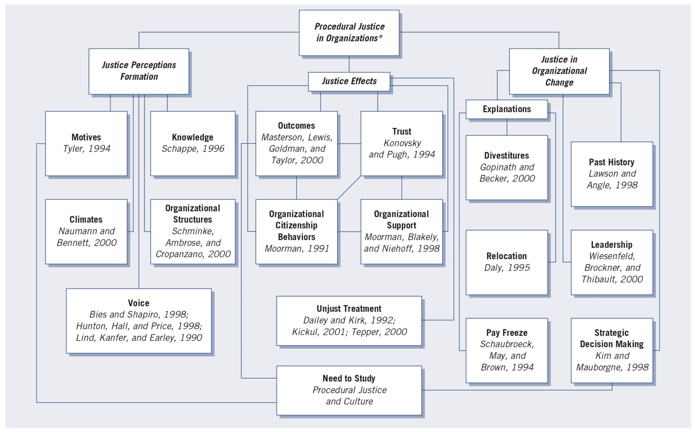

```{r setup, include=FALSE}

knitr::opts_chunk$set(echo = TRUE, message = FALSE, warning = FALSE,
                      dev = 'svg', out.width = "45%", fig.width = 6,
                      fig.align="center")

```

## Acknowledgement of Country

I would like to acknowledge the Traditional Owners of Australia and  recognise their continuing connection to land, water and culture. The  University of Sydney is located on the land of the Gadigal people  of the Eora Nation. I pay my respects to their Elders, past and present.

# Chapter 2: Review of the Literature

::: {style="text-align: center;"}
Slides adapted from Creswell, Research Design 6e, SAGE Publishing, 2023 for GOVT6139 Research Design.

Do not reshare
:::

---

## Any question concerning the content for this week?

---

## Plan for today

1. **Chapter 2 overview** — literature review purposes and research topic development

2. **Web of Science training** — live database demonstration and search techniques

3. Task 1 (individual): summarise and connect your own papers with Antigravity

4. Task 2 (groups): abstracting papers with Antigravity

5. A3 in-class short answer

6. Task 3 (individual): find papers and identify your research problem

---

## Chapter 2 Overview

### Before you design your proposal, you must:

- Identify a researchable topic
- Conduct an extensive literature review
- Understand how literature reviews differ across research approaches

### Key focus areas:

- Selecting and evaluating research topics
- Understanding purposes and organisation of literature reviews
- Mastering the literature search process
- Defining key terms appropriately

---

## What your Research Proposal A2 should contain

::: columns
::: {.column width="50%"}
### Research Question (15%)

- Identify a specific question for your research project
- Outline why the question is important

### Literature Review (25%)

- How does your proposed research add new knowledge to the previous literature on the topic?
:::

::: {.column width="50%"}
### Research Design (60%)

- Theory (and, if appropriate, hypotheses)
- What data do you propose to collect and how do you plan to go about it OR what existing data source do you plan to use, and how do you plan to use it
- What case(s) did you select, and why
- How do you plan to analyse your data
- The strengths and weaknesses of your proposed approach
:::
:::

---

## The Research Topic

### What is a Research Topic?

- The **subject or subject matter** of a proposed study
- Examples: "faculty teaching," "organizational creativity," "psychological stress"
- Should be described in **a few words or short phrase**
- Becomes the **central idea** to learn about or explore

---

## Developing Your Topic (1/2): Draft a Working Title

- Complete: "My study is about..."

- Keep it **straightforward and uncomplicated**

  - Avoid complex, erudite language early on

- Follow Wilkinson's (1991) guidelines:

  - Be brief, avoid wasting words
  - Eliminate "An Approach to..." or "A Study of..."
  - Limit to 10–12 words
  - Include the focus/topic

---

## Developing Your Topic (2/2): Pose as a Question

- "What treatment is best for depression?"
- "What does it mean to be Arabic in U.S. society today?"

---

## Evaluating Topic Significance: Can it be researched?

- Access to willing participants
- Available resources (time, computer programs, etc.)
- Sustainable data collection period

---

## Evaluating Topic Significance: Should it be researched?

### Key considerations:

1. **Contribution to literature** — does it add new knowledge?
2. **Broader interest** — appeals beyond your institution
3. **Personal goals** — aligns with career objectives
4. **Time investment** — worth the commitment required
5. **Ethical considerations** — is it ethically acceptable to conduct the study?

---

## Evaluating Topic Significance: Ways to Contribute

- Address unexamined topics
- Extend existing discussions
- Replicate studies in new contexts
- Study unusual locations or populations
- Take unexpected perspectives
- Use novel data collection methods
- Study timely topics

---

## Purpose of Literature Review

### What literature reviews accomplish:

1. **Share related studies** — results of closely related research
2. **Connect to ongoing dialogue** — fill gaps and extend prior studies
3. **Establish importance** — framework for significance
4. **Provide benchmarks** — compare results with other findings
5. **Shape narrative** — from larger problem to narrower issue

> Studies must add to the body of literature on a topic.

---

## Organising Literature Reviews: Quantitative Structure

- **Substantial literature** at the beginning
- **Deductive approach** — provides direction for questions/hypotheses
- **Separate section** titled "Related Literature" or "Review of Literature"
- **Five-component model:**
  1. Introduction to the review
  2. Topic 1: Independent variable(s)
  3. Topic 2: Dependent variable(s)
  4. Topic 3: Studies relating independent and dependent variables
  5. Summary highlighting key studies

---

## Organising Literature Reviews: Qualitative Structure

- **Literature used sparingly** at beginning (unless design requires it)
- **Inductive approach** — learn from participants
- **Three placement options:**
  1. In introduction (frames the problem)
  2. Separate section (for quantitatively-oriented audiences)
  3. At the end (compare with findings — preferred for qualitative orientation)

---

## Organising Literature Reviews: Mixed Methods Structure

- **Depends on strategy** and relative weight of qualitative/quantitative
- **Sequential approach:** literature presented in each phase
- **Equal weight:** choose qualitative or quantitative form based on audience

---

## Steps in Conducting a Literature Review

### 7-step process:

1. **Identify keywords** for database searches
2. **Search databases** (ERIC, Google Scholar, Web of Science, EBSCO, ProQuest, JSTOR)
3. **Locate ~50 reports** of research articles or books
4. **Skim and collect** central articles
5. **Design literature map** (visual organisation)
6. **Draft summaries** of most relevant articles
7. **Assemble review** structured thematically with summary

> Iterative process — search, then re-search until finding appropriate material.

---

## Major Databases for Literature Search in Social Sciences

- **Google Scholar** — cross-disciplinary (scholar.google.com), free
- **Web of Science** — largest abstract and citation database (www.webofscience.com), access from USyd Library
- **Scopus** — largest abstract and citation database (www.scopus.com), access from USyd Library

### Search tips:

- Use both free and institutional databases
- Search multiple databases regardless of your field
- Use thesaurus guides when available
- Start with recent articles, work backward

---

## Literature Priority and Quality Evaluation {.smaller}

::: columns
::: {.column width="50%"}
### Search priority (in order):

1. **Broad syntheses** — encyclopedias, **review articles**
2. **Journal articles** — research studies in respected journals
3. **Books** — research monographs, topic-focused books
4. **Conference papers** — latest developments
5. **Web materials** — evaluate carefully for quality
:::

::: {.column width="50%"}
### Quality evaluation criteria:

- **Journals:** national refereed publications with editorial boards
- **Books:** recognized publishers, recent publications (last 10 years)
- **Online sources:** evidence of quality review
- **Conference papers:** included in recent conferences
- **General:** seek recommendations from advisors/mentors
:::
:::

---

## Let's give it a try!

- Go to [library.sydney.edu.au](https://www.library.sydney.edu.au/)
- Search `Web of Science`
- Click on "Access online"
- If prompted, enter your UniKey and password
- Let's search something!

Also, get help with your search string here: [webofscience.help.clarivate.com/en-us/Content/search-rules.htm](https://webofscience.help.clarivate.com/en-us/Content/search-rules.htm)

---

## Abstracting the Literature {.smaller}

::: columns
::: {.column width="50%"}
### Components of a research abstract:

- **Problem** being addressed
- **Purpose** or focus of study
- **Sample information** — population, participants, subjects
- **Key results** related to your proposed study
- **Methodological critique** (if applicable)
:::

::: {.column width="50%"}
### Components of theoretical/methodological abstract:

- **Problem** addressed by article/book
- **Central theme** of the study
- **Major conclusions** related to theme
- **Reasoning/logic flaws** (for methodological reviews)
:::
:::

### Where to find information:

**Problem/Purpose:** Introduction section — **Sample:** Method/procedure section — **Results:** Results section addressing each research question

> ... or we can ask an LLM chatbot!

---

## TASK 1: Antigravity (individually)

- Each student to:

  1. Gather **3–5 papers** (PDFs) related to your own research interest and save them in a folder on your laptop
  2. Open Antigravity, create a **New Project**, and **Add Folder** pointing at your papers
  3. Ask Antigravity to write a **Markdown (.md) document**: for each paper, a **two-sentence summary**, plus a note on **why the paper is relevant to your research** — your first attempt at a research topic/problem

- Save the `.md` file — you'll come back to it

---

## TASK 1: Antigravity (individually) {.smaller}

```{r echo = FALSE}
library(countdown)

countdown(minutes = 5, seconds = 00)
```

- **High-level task**: get Antigravity to produce a running summary + relevance note for each of your papers

- **Low-level tips** (a few pointers, but feel free to experiment):

  - No papers on hand yet? Use any readings from this unit as a placeholder
  - Try: *"For each paper in this folder, write a two-sentence summary, then explain why it's relevant to a study on [your topic]"*

> Don't worry about landing on the "right" research problem yet — this is a first attempt you'll revise

---

## TASK 2: Antigravity (in group)

- Each group member to:

  1. Download the papers from Canvas (compressed folder) with topic "political participation and social media"
  2. Open Antigravity, create a **New Project**, and **Add Folder** pointing at the downloaded papers

- Work individually from here — Antigravity runs locally on your own laptop, so there's no notebook to share and nothing to invite anyone to

---

## TASK 2: Antigravity (in group) {.smaller}

```{r echo = FALSE}
library(countdown)

countdown(minutes = 30, seconds = 00)
```

- **High-level task**: go back to the previous slide and try to abstract the literature!

- **Low-level tasks** (a few tips, but feel free to be creative and experiment):

  - Start from "For each paper, provide a one line summary"
  - Zoom in into single papers, then get:
    - **type of paper**: review paper or research paper?
    - **research abstracts**: ask about "research problems", "sample information", "key findings"
    - **theoretical and conceptual abstracts**: ask about theories and concepts mentioned in the papers
    - **methodology abstracts**: ask about the methodology and the methods presented in the paper
  - Ask questions to draw connections/comparison among more than one paper

> When you get an interesting result from the chatbot, copy it somewhere you'll find it again (e.g. a running notes doc)

---

## Literature Maps

### Purpose:

**Visual summary** showing how your study fits within existing literature

### Design principles:

1. **Topic at top** of hierarchy (a topic can also be a critical concept, theory or idea)
2. **Organize into 3+ subtopics** based on your literature
3. **Include descriptive labels** in each box
4. **Add major citations** illustrating content
5. **Create multiple levels** as needed
6. **Show your study** at bottom with connecting lines

---

## Literature Maps: Benefits and Design Options

### Benefits:

- Organize your understanding
- Present to committees
- Compose journal articles
- Show how your study extends existing research

### Design options:

- **Hierarchical** (top-down)
- **Flowchart** (left-to-right)
- **Intersecting circles** (overlapping areas indicate research needs)

---

## Example Literature Map

::: {style="text-align: center;"}
</img>
:::

An example of a literature map from the textbook

---

## From Literature Map to Zettelkasten

### A method for turning readings into linked notes

- **Zettelkasten** ("slip box"): a note-taking method for building a web of connected notes, not just a pile of sources
- Each **zettel** (note) = **one idea**, written in **your own words**, with a source reference
- Core principles:
  - **Atomicity** — one idea per note, so it can be linked precisely
  - **Own words** — forces understanding, not copying
  - **Explicit links** — state *why* two notes connect, not just that they do

> "Links without explanation will not create knowledge." — [zettelkasten.de/introduction](https://zettelkasten.de/introduction/)

---

## Applying Zettelkasten to Your Literature Review

- For each paper, write **one or more atomic notes**: a claim, a method, a finding — not a full summary
- **Link notes across papers**, explaining the connection (agreement, contradiction, extension, gap)
- Build **structure notes** — meta-notes clustering related zettels into themes — these become the skeleton of your review
- Compare with a literature map:
  - **Literature map** — one visual, top-down snapshot
  - **Zettelkasten** — a growing, linkable archive you keep writing into as you read
- Your Antigravity per-paper summaries (Task 1) are a good **starting point**: rewrite them as atomic notes in your own words, then link them

---

## Definition of Terms: When to Define

- **Individuals outside the field** may not understand
- **Beyond common language** usage
- **When terms first appear** in proposal
- **Any likelihood** readers won't know meaning

---

## Definition of Terms: Guidelines

1. **Define when first mentioned**
2. **Use operational/applied level** — specific, not abstract
3. **Ground in research literature** — not everyday language
4. **Different purposes:** describe, limit, establish criteria, define operationally
5. **Separate section** if needed (2–3 pages maximum)

---

## Definition of Terms: Approach by Research Type {.smaller}

**Qualitative:**

- Few terms defined at beginning
- Tentative definitions may emerge during research
- Terms defined as they surface in findings

**Quantitative:**

- Extensive definitions early in proposal
- Separate section with precise definitions
- Comprehensive approach using accepted literature definitions

**Mixed Methods:**

- Define mixed methods terminology (convergent design, integration, etc.)
- Approach depends on which phase comes first
- Clarify strategy terms (concurrent, sequential, specific design names)

---

## Summary and Key Takeaways {.smaller}

### Before literature search:

1. Identify researchable topic using title/question strategies
2. Evaluate significance — can it and should it be researched?
3. Consider contribution to existing knowledge

### During literature review:

1. Understand different purposes across research approaches
2. Follow systematic 7-step process
3. Use multiple high-quality databases
4. Prioritise and evaluate sources carefully
5. Create literature map for organisation

### Writing and style:

1. Follow APA 7th edition consistently
2. Define terms appropriately for your approach
3. Structure review thematically
4. End with summary showing gaps your study will fill

### Final goal:

**Position your study within existing literature** and demonstrate how it extends, replicates, or fills gaps in current knowledge

---

## Key Terms to Remember

- **Abstract** — brief review summarising major elements of a study
- **Computer databases** — online repositories providing access to literature
- **Definition of terms** — precise meanings for concepts in your study
- **Literature map** — visual representation of literature organization
- **Style manuals** — guidelines for consistent scholarly communication
- **Topic** — subject matter of your proposed study

---

## A3 — In-class Short Answer

Take 10 minutes to complete this week's A3 short answer on Canvas — worth 10 points, on distinguishing a research topic from a research problem (Ch. 2, Review of the Literature).

```{r echo = FALSE}
library(countdown)

countdown(minutes = 10, seconds = 00)
```

---

## First peer-review task is due next week (Wed, 27 Aug)

### Think about a research problem and a research question for your A2 (due in Week 13)

### Write max 500 words (up to a page)

From your textbook's glossary:

> **Research problems** ... are problems or issues that lead to the need for a study. Research problems become clear when the researcher asks "What is the need for my study?" or "What problem influenced the need to undertake this study?"

---

## TASK 3: Web of Science + Antigravity (individually, if time allows)

1. Reflect on a research **topic** (for A2)
2. Think about what **key words** would help you find relevant literature
3. Post your **key words** on **Padlet**!
4. Go to **Web of Science**, search and download **5+ papers** (at least **1 review paper**)
5. Add the papers to a new Antigravity project folder
6. Start with **summaries** then try to understand the **research problems** addressed in the paper
7. What could **YOUR research problem** be?
8. Post your research problem on **Padlet**!

> Do you have a question? Ask on this week's discussion board on Canvas!

---

## See you next week with **The Use of Theory** (Ch. 3 of the textbook)
