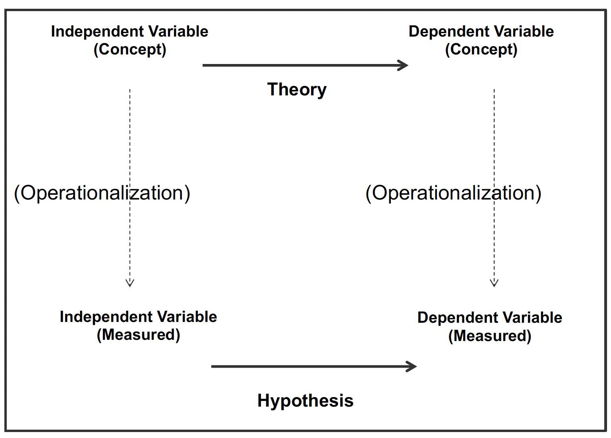

background-image: url(https://upload.wikimedia.org/wikipedia/en/6/6a/Logo_of_the_University_of_Sydney.svg)
background-size: 95%

```{r setup, include=FALSE}

knitr::opts_chunk$set(echo = TRUE, message = FALSE, warning = FALSE, 
                      dev = 'svg', out.width = "45%", fig.width = 6,
                      fig.align="center")

```

---

## Acknowledgement of Country

I would like to acknowledge the Traditional Owners of Australia and recognise their continuing connection to land, water and culture. The  University of Sydney is located on the land of the Gadigal people  of the Eora Nation. I pay my respects to their Elders, past and present.

---

## Course outline

.pull-left[

Week 1: Introduction

Week 2: Foundations: Ontology and Epistemology

Week 3: Research Design (I): Questions, Theories, Hypotheses, Variables, Measurements

<mark>Week 4:	Research Design (II): Case selection</mark> 

Week 5: Research Design (III): Causal Inference

Week 6: Qualitative Methods (I): Data Collection 

Week 7: Qualitative Methods (II): Data Analysis 

]

.pull-right[

⏸️ *Mid Semester break* ⏸️

Week 8: Quantitative Methods (I): Data Collection 

*Week 9: 🎉 Public holiday 🎉*

Week 10: Quantitative Methods (II): Data Analysis 

Week 11: Quantitative Methods (II): Data Analysis lab

Week 12: Research Proposal: Peer Feedback Workshop Week 

13:New frontiers and Conclusions

]

---

## Today's class

* Building blocks of the research process
    
    * Unit of Analysis
    * Primary and secondary data
    
* Case selection: how many cases?
    * Case study
    * Small-N
    * Large-N
    
* Case selection: which cases?
    * Mill’s methods
    * Selection Bias
    * Selecting cases for large-N studies
    
* Exercise: Designing a [case /small-N / large-N] study

---
class: inverse, center, middle

## Let's start where we finshed last week ...

# Unit of analysis

---

## From theory to hypothesis

</img>


## Unit of analysis

### In deciding what to measure for a concept of your interest, it is important to understand the unit of analysis.

The unit of analysis is the object that the hypothesis describes.

* It can be a person (in a survey/interview study)
* A country (in a cross-National comparison)
* An organization (in a comparative study of organizational behavior)
* A year (in a longitudinal analysis of a given country)
* Can also be multi-level (people within countries)

The unit of analysis often determines how a variable in a hypothesis is “operationalized” (i.e., measured)

Generally speaking, all variables in a hypothesis must have the same unit of analysis

---

## Unit of analysis

Note: For a given hypothesis, there can be many ways to operationalize depending on how you define the unit of analysis

**Example**: The higher the income level, the more likely citizens vote for the Republican party in the US

**Question**: How can you operationalize this hypothesis?

.pull-left[

**Answer (1)**: Unit of Analysis (Individuals)
* *A measure of income*: Ask a survey respondent, 'what is your household’s annual income?'
* *A measure of voter behaviour*: Ask a survey respondent, 'Which party’s candidate did you vote for in the 2020 U.S. Presidential election?' [R: Donald Trump; D: Joe Biden; Other…]

]

.pull-right[

**Answer (2)**: Unit of Analysis (State level)
* *A measure of income*: Average household income in the state
* *A measure of voter behaviour*: % of votes for the Republican candidate in the last election
* *Warning*: Ecological fallacy – drawing inferences about individuals from group level behaviour

]


---
class: inverse, center, middle

# Gathering evidence: 

.center[</img>]

# Methodology, primary and secondary data


---

## Gathering evidence: Methodology

### Qualitative or quantitative?

* *Quantitative* methods: collecting and analysing data that can be analysed *numerically* using statistics;
    * E.g. surveys, experiments
    
* *Qualitative* methods: relies on words, description and *meaning* as sources of evidence rather than on the use of numbers.
    * E.g. interviews, focus groups, ethnography, document analysis

### Primary or secondary data?

* Primary data: New data / information that you collect yourself;

* Secondary data: Data / information collected by others.

---

## Why use secondary data?

* Many datasets free to access, saves money and time (cuts the ethics approval and data collection phase out of the research process);

* Quality of existing datasets is often high;

* Can enable longitudinal analysis (e.g. if someone else was collecting data since 1980s);

* Facilitates cross-National research;

* Making use of the extensive available data;

* Pools the resources of the social science community to do more than could be done individually.

---

## Secondary data sources in political science

* Cross-National surveys

    * Comparative Study of Electoral Systems
    * World Values Survey
    * Eurobarometer surveys
    
* Australian surveys

    * Australian Election Study
    * Australian Social Attitudes Survey
    
* Cross-National databases

    * Varieties of democracy (indicators of democracy for different countries)
    * Polity IV (indicators of democracy for different countries)
    * World Bank / OECD (economic indicators)

---

## Potential limitations of working with secondary data

* Data quality (can be very high, but need to assess)

* Data source may be missing measures for key variables of interest to answer research question

* Might not cover cases (e.g. countries) of interest

* Might not cover time-frame of interest

* Can produce data driven rather than question or problem driven research

---

## Why use primary data?

* Not relying on the availability of existing data;

* Questions drive data collection, not the other way around;

* Tailored to specific objectives;

* Generation of	new	data (can	share	with	the	research community).

---

## Types of primary data collection

* Focus on data collection from people (but can also collect data from institutions);

* Needs ethical consideration;

.pull-left[

* Main techniques:

    * Surveys (*quantitative*)
    
    * Experiments (*quantitative*)
    
    * Interviews (*qualitative*)
    
    * Ethnography (*qualitative*)
    
]

.pull-right[</img>]


---
class: inverse, center, middle

## About last week's task on constructing a research approach

### Is there any question you didn't have time to ask last week?

---
class: inverse, center, middle

# Case selection: how many cases?

</img>

---

## Some Basic Terms

* **Cases**

    * Countries that feature in the *Comparative Analysis*
    
    * But doesn’t need to be countries
    
        * E.g. villages, organisations, events

* **Variable**

    * A variable is an empirical property that can take on two or more values (e.g. at country level - economic growth, level of democracy)
    
    * Independent variable(s) (presumed cause(s))
    
    * Dependent variable (the presumed effect)

---

## Comparative methods: Types

.pull-left[

* **Types**

    * Case study: Single Country Study (n=1)
    
    * Small-N: Comparing Few Countries
    
    * Large-N: Comparing Many Countries
    
* **Criteria for Choosing Design**

    * Research question; time; method; epistemological position

]

.pull-right[

```{r echo = FALSE, out.width='100%', dev = 'svg', fig.width=4, fig.height=5}

require(ggplot2)

df <-
    data.frame('Scope of Countries' = 
                 factor(c('One', 'Few (<10)', 'Many (10+)'),
                        levels = c('One', 'Few (<10)', 'Many (10+)')),
             'Level of Abstraction' = factor(c('Low', 'Middle', 'High'),
                                             levels = c('Low', 'Middle', 'High')),
             label = c("Single\ncountry\nstudy",
                       "Comparing\nfew\ncountries",
                       "Comparing\nmany\ncountries"))

colnames(df) <- 
  c('Scope of Countries', 'Level of Abstraction', 'label')
  

ggplot(df,
       aes(x = `Scope of Countries`, y = `Level of Abstraction`, label = label)) +
  geom_text() +
  theme_bw()


```


]

---

## Small-N: Single Case Study

* **Focus**

    * In-depth analysis of one single case
    
    * Often qualitative, can be quantitative (e.g. survey data in a country)

* **Strengths**

    * In-depth
    * Theory generating
    
    * Theory confirming
    
    * Can focus on outlier countries

* **Weaknesses**

    * Results may not travel to other cases (generalizability / low external validity)
    
    * Selection Bias
    
---

## Small-N: The Comparative Approach

* **Focus**

    * Intentional selection of a few countries for comparison (often two or three cases)
    
    * Often qualitative, can be quantitative (e.g. survey data in a few countries)

* **Strengths**

    * ‘Focused comparison’ of cases (MSSD vs. MDSD)
    
    * Good for theory building
    
    * Thick description – in-depth
    
    * Area studies

* **Weaknesses**

    * Less secure inferences (low external validity)
    
    * Selection bias

---

## Large-N: The Statistical Method

* **Focus**

    * Quantitative analysis of aggregate data collected on different measures that vary across many countries
    
* **Strengths**

    * Extensive coverage of countries over space and time (breadth)
    
    * Ability to make strong inferences that hold for more cases than not (high external validity)
    
    * Use of statistical control to rule out rival explanations
    
    * Ability to identify outlier cases
    
* **Weaknesses**

    * N can be limited based on data availability
    
    * Need to have valid measures of concepts
    
    * Limited depth for each case (i.e. *thin* vs *thick* description)


---
class: inverse, center, middle

# Case selection: which cases?

---

## Mill’s Comparative Methods

John Stuart Mill (1806-1873) introduced process for identifying causal connections in the 1843 book *A System of Logic*.

.pull-left[</img>]

.pull-right[</img>]

---

## Mills Comparative Methods

#### Mill’s Method of Difference, or Most Similar Systems Design (MSSD)

.pull-left[
Compares cases that share a number of common features, but produce different outcomes
]

.pull-right[

```{r echo = F, out.width = '100%'}
require(DiagrammeR)

DiagrammeR::grViz("
  digraph graph2 {
  
  graph [layout = dot, rankdir = LR]
  
  # node definitions with substituted label text
  node [shape = oval, style = filled]
  a [label = 'Similar\nfeature set', fillcolor = Orange]
  b [label = 'Case 1']
  c [label = 'Case 2']
  d [label = 'Outcome A', fillcolor = Deepskyblue]
  e [label = 'Outcome B', fillcolor = Deepskyblue]

  
  a -> b; a -> c; b -> d; c -> e
  }
  ",
  height = 100)

```


]

</br>

#### Mill’s Method of Agreement, or Most Different Systems Design (MDSD)

.pull-left[
Compares cases that differ on a number of features, but produce similar outcomes
]

.pull-right[

```{r echo = F, out.width = '100%'}
require(DiagrammeR)

DiagrammeR::grViz("
  digraph graph2 {
  
  graph [layout = dot, rankdir = LR]
  
  # node definitions with substituted label text
  node [shape = oval, style = filled]
  a [label = 'Feature\nset A', fillcolor = Orange]
  b [label = 'Feature\nset B', fillcolor = Orange]
  c [label = 'Case 1']
  d [label = 'Case 2']
  e [label = 'Same outcome', fillcolor = Deepskyblue]

  
  a -> c; b -> d; c -> e; d -> e
  }
  ",
  height = 220)
```


]

---

## Mill’s Method of Difference (MSSD): Food poisoning example

```{r echo = FALSE}

require(knitr)
require(kableExtra)

data.frame(case = c("Mother", "Father", "Daugther", "Son"),
           meal = c(T),
           seafood = c(TRUE, FALSE, FALSE, TRUE),
           salad = c(T,T,T,F),
           chicken = c(F, T, F, T),
           sick = c(T, T, T, F)) %>%
  knitr::kable() %>%
  column_spec(2:5, background = "orange") %>%
  column_spec(4, background = "gold") %>%
  column_spec(6, background = "deepskyblue") %>%
  row_spec(4, bold = T)

```

</br>

```{r echo = F}

DiagrammeR::grViz("
  digraph graph2 {
  
  graph [layout = dot, rankdir = LR]
  
  # node definitions with substituted label text
  node [shape = oval, style = filled]
  a [label = 'Similar\nfeature set', fillcolor = Orange]
  b [label = 'Mother']
  c [label = 'Father']
  d [label = 'Daugther']
  e [label = 'Son']
  f [label = 'Sick', fillcolor = Deepskyblue]
  g [label = 'Not sick', fillcolor = Deepskyblue]

  
  a -> b; a -> c;  a -> d; a -> e; 
  b -> f; c -> f; d -> f; e -> g
  }
  ",
  height = 240, width = 750)

```


---

## Mill’s Method of Difference (MSSD)

.pull-left[

Potential case pairs:

* Sweden and Finland

* Very similar countries

* Differs on a dependent variable (e.g. Finland went into lockdown in 2020, Sweden did not)
* What factor explains the different outcome?

* Potential explanation? Theory?

]

.pull-right[

</img>

]

</br>

```{r echo = F, out.width = '100%'}

DiagrammeR::grViz("
  digraph graph2 {
  
  graph [layout = dot, rankdir = LR]
  
  # node definitions with substituted label text
  node [shape = oval, style = filled]
  a [label = 'Similar\nfeature set', fillcolor = Orange]
  b [label = 'Sweden']
  c [label = 'Finland']
  d [label = 'No lockdown', fillcolor = Deepskyblue]
  e [label = 'Lockdown', fillcolor = Deepskyblue]

  
  a -> b; a -> c; b -> d; c -> e
  }
  ",
  height = 100)

```

---

## Mill’s Method of Agreement (MDSD): Food poisoning example

```{r echo = FALSE}

require(knitr)
require(kableExtra)

data.frame(case = c("Mother", "Father", "Daugther", "Son"),
           meal = c(T),
           seafood = c(T,T,T,T),
           salad = c(T,T,T,F),
           chicken = c(F,T,F,T),
           sick = c(T,T,T,T)) %>%
  knitr::kable() %>%
  column_spec(2:5, background = "orange") %>%
  column_spec(3, background = "gold") %>%
  column_spec(6, background = "deepskyblue")

```

</br>

```{r echo = F}

require(DiagrammeR)

DiagrammeR::grViz("
  digraph graph2 {
  
  graph [layout = dot, rankdir = LR]
  
  # node definitions with substituted label text
  node [shape = oval, style = filled]
  a [label = 'Feature set A', fillcolor = Orange]
  b [label = 'Feature set B', fillcolor = Orange]
  c [label = 'Feature set C', fillcolor = Orange]
  d [label = 'Feature set D', fillcolor = Orange]
  e [label = 'Mother']
  f [label = 'Father']
  g [label = 'Daugther']
  h [label = 'Son']
  i [label = 'Sick', fillcolor = Deepskyblue]

  
  a -> e; b -> f; c -> g; d -> h
  e -> i; f -> i; g -> i; h -> i;
  }
  ", 
  height = 220, width = 750)

```


---

## Mill’s Method of Agreement / Most Different Systems Design: Political science example

.pull-left[

* Theda Skocpol States and Social Revolutions (1979)

* Why do revolutions occur?

* Picks three very different cases: France, China, Russia

* Identifies common factors: external military threat; elite split; peasant rebellion

```{r echo = F, out.width = '100%'}
require(DiagrammeR)

DiagrammeR::grViz("
  digraph graph2 {
  
  graph [layout = dot, rankdir = LR]
  
  # node definitions with substituted label text
  node [shape = oval, style = filled]
  a [label = 'Feature set A', fillcolor = Orange]
  b [label = 'Feature set B', fillcolor = Orange]
  c [label = 'Feature set C', fillcolor = Orange]
  d [label = 'France']
  e [label = 'China']
  f [label = 'Russia']
  g [label = 'Revolution', fillcolor = Deepskyblue]

  
  a -> d; b -> e; c -> f; 
  d -> g; e -> g; f -> g;  
  }
  ",
  height = 190)
```

]

.pull-right[

.center[
</img>
]

]

---

## Case selection: Selection bias

.pull-left[
See [Geddes. (1990). How the Cases You Choose Affect the Answers You Get: Selection Bias in Comparative Politics. *Political Analysis*, 2(1), 131–150. https://doi.org/10.1093/pan/2.1.131](https://sydney.leganto.exlibrisgroup.com/leganto/public/61USYD_INST/citation/28748680100005106?auth=SAML)
]

.pull-right[
</img>
]

* What is selection bias in comparative research?

* How does selection bias arise?

* What can be done to avoid selection bias?


