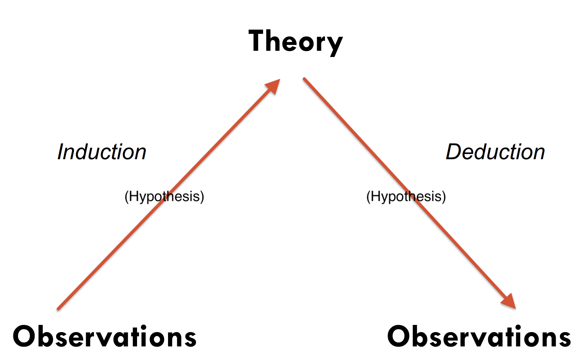
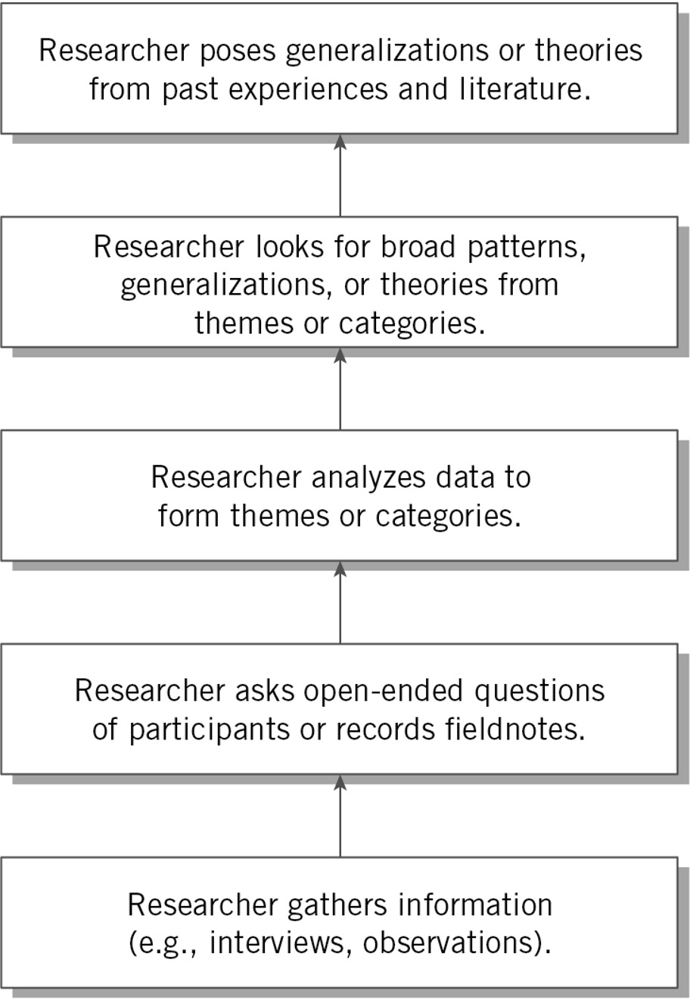
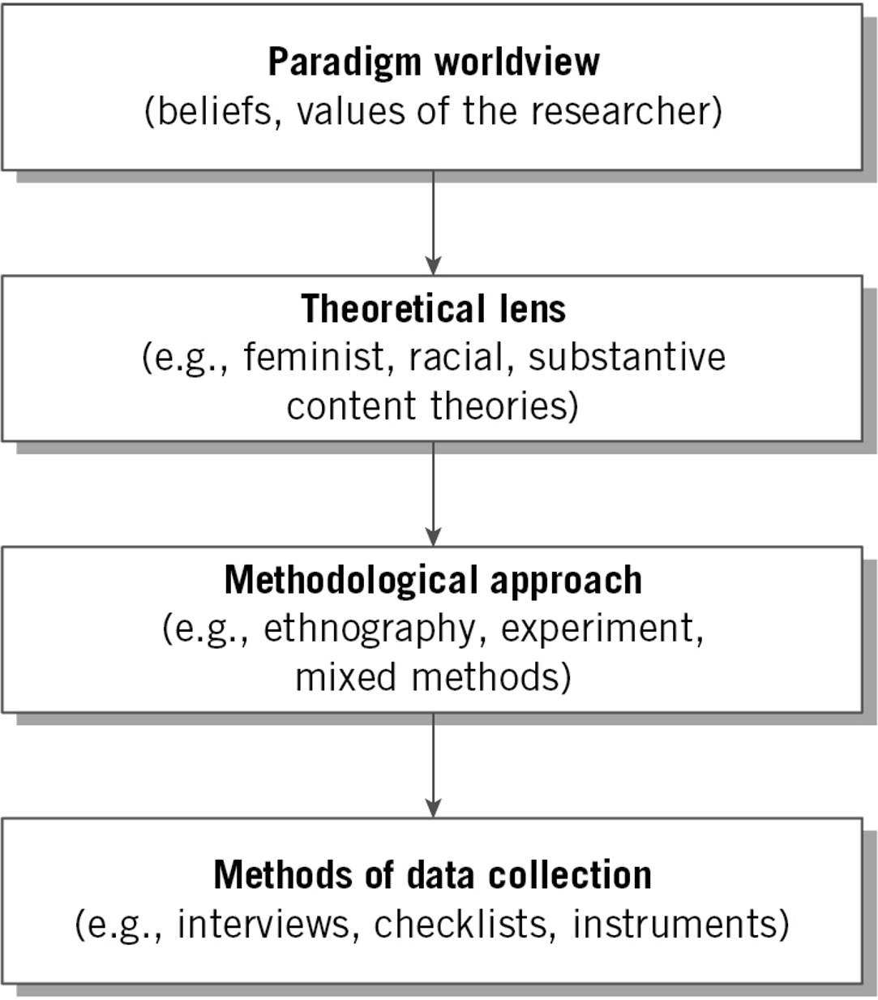

background-image: url(https://upload.wikimedia.org/wikipedia/en/6/6a/Logo_of_the_University_of_Sydney.svg)
background-size: 95%

```{r setup, include=FALSE}

knitr::opts_chunk$set(echo = TRUE, message = FALSE, warning = FALSE, 
                      dev = 'svg', out.width = "45%", fig.width = 6,
                      fig.align="center")

```

## Acknowledgement of Country

I would like to acknowledge the Traditional Owners of Australia and  recognise their continuing connection to land, water and culture. The  University of Sydney is located on the land of the Gadigal people  of the Eora Nation. I pay my respects to their Elders, past and present.

---

class: inverse, center, middle

# Chapter 3

# The Uses of Theory

.center[Slides adapted from Creswell, Research Design 6e, SAGE Publishing, 2023 for GOVT6139 Research Design.

Do not reshare]

---

class: middle, center

# Any question concerning the content for this week?

---

# Additional info on AI agents (e.g. Notebook LM, ChatGPT, Co-pilot, etc.)

Use them with **extreme care** and double check every bit of information coming from them. 

You should consider these tools as **experimental**. Because we are all testing how to use them, it would be great to share our experiences. I have added a [Canvas discussion board](https://canvas.sydney.edu.au/courses/65715/discussion_topics/1472179) to collect what you like to share:

1. Post your prompts (i.e. your questions);

2. Post the bot's responses.

3. Explain how you have used these tools in your learning. 

NOTE: If you have used any GenAI tools for your assignment, you **must** aknowledge their contribution (more details [here](https://canvas.sydney.edu.au/courses/65715/pages/use-of-generative-ai-and-other-marvels?module_item_id=2788753))

---

## Today's class

| Time         | Content                                                                                                                                 |
|--------------|-----------------------------------------------------------------------------------------------------------------------------------------|
 

---

# Chapter 3 Learning Objectives

1. Identify the seven steps in locating and **using theories for incorporation into a proposal** or a study.

2. Identify the major distinctions between an **inductive** and **deductive** use of theory in a research study.

3. **Define variables**, their measurement, and a causal model for inclusion in quantitative research.

4. Distinguish between the **deductive approach**, a **theoretical standpoint**, and an **end point** as ways to incorporate theories into qualitative research.

5. Describe the difference between **discipline-based theory** and **social justice use of theories** in mixed methods research.

---

# Introduction

* What theories might be used?

  * .content-box-yellow[Quantitative] researchers **test hypotheses** from theory

  * .content-box-green[Qualitative] researchers may 
    
      * **use as a lens** or 
      * **generate a theory**

  * .content-box-purple[Mixed methods] researchers may do **both**


---

## Two types of reasoning: Induction and deduction

### Relationship between observations (evidence) and theory

.center[</img>]


---

## An yet, in practice the theory-and-observation problem is always going to be a chicken-and-egg problem.

.center[]

- Our experience (observations) always generates new theories (we are sense-making machines, we can't help it!), 

- An we always experience reality based on some pre-existing theory of reality (sometimes, *biases*).


---

# The Varied Use of Theory 

## (seven steps - yes, textbook's authors love the number seven)

1. **Identify** the theory from literature search

2. **Place** the theory at the beginning of the article as an *a priori* framework

3. **Name** the theory to be used and describe how it informs the quantitative, qualitative or mixed methods study

4. **Discuss** studies using the theory

5. **Diagram** the theory

6. **Theory provides framework** for the study

7. **Review** theory’s role at end of study in findings and results, and compare to other studies

---

class: middle, center, inverse

# Quantitative research

---

# Definition of a Theory in Quantitative Research

* Theory is a scientific prediction or explanation of what the Researcher expects to find

* Interrelated set of constructs or variables

* Hypothesis: predictive statement that is tested

* Theory emerges from testing hypotheses over and over

The independent variable X has an effect on the dependent variable Y;

<center>

```{r dia1, echo = FALSE, out.height='80%', out.width = '80%', fig.align='center'}

require(DiagrammeR)

grViz("                           
digraph diagram {   
  
  # graph statement
  #################
graph [rankdir = LR]
node [shape = oval, style = filled, fillcolor = Linen]
  
  'Independent variable X'
  'Dependent variable Y'
  
  # edges
  #######
  'Independent variable X'   -> 'Dependent variable Y' [label = 'affects']
}
")

```

</center>

.center[.content-box-yellow[

Then a theory would **explain** why a change in X *causes* a change in Y

]]

---

# A theory in quantitative research can explains phenomena at different levels 


* __Micro-level theories__  – limited to a small segment of time, place or number of people

  - e.g. University students in Sydney

* __Meso-level theories__  – link micro-level and macro-level theories

* __Macro-level theories__  – explain larger scales, for example the entire society

  - e.g. People and societies everywhere

---

# Variables in Quantitative Research

__Variable__  – characteristic of an individual or group that can be **measured** or **observed**

.content-box-green[

Examples: age, gender, socioeconomic status, attitudes, but also more abstract characteristics such the quality of democracy in a country.

]

Variables may have temporal order or be measurable or observable

* **Independent variable** (or **predictor** variable)
  * Variables that probably cause or affect outcomes
  
* **Dependent variable** (or **outcome** variable)
  * The outcomes that depend on the independent variables
  
---

# Variables in Quantitative Research

* Intervening or mediating
  * Variables that stand between the independent and dependent variables
  * Transmit the effects
  
* Moderating
  * Predictor variables that *affect* the relationship between independent and predictor variables
  
* Confounding
  * “Third variable” that is both related to the independent and dependent variables

---

## Dependent and independent variables

<center>

```{r dia2, echo = FALSE, out.width = '100%', fig.align='center'}

require(DiagrammeR)

grViz("                           
digraph diagram2 {   
  
  # graph statement
  #################
graph [rankdir = LR]
node [shape = oval, style = filled, fillcolor = Linen]
  
  'Independent variable X'
  'Dependent variable Y'
  
  # edges
  #######
  'Independent variable X'   -> 'Dependent variable Y' [label = 'affects']
}
")

```

</center>

---

## Dependent, independent and mediating variables

<center>

```{r dia3, echo = FALSE, out.width = '100%', fig.align='center'}

require(DiagrammeR)

grViz("                           
digraph diagram3 {   
  
  # graph statement
  #################
graph [rankdir = LR]
node [shape = oval, style = filled, fillcolor = Linen]
  
  'Independent variable X'
  'Dependent variable Y'
  'Mediating variable Z'
  
  # edges
  #######
  'Independent variable X' ->  'Mediating variable Z' [label = 'affects']
  'Mediating variable Z' -> 'Dependent variable Y' [label = 'affects']
}
")

```

</center>


---

## Dependent, independent and moderating variables

<center>

```{r dia4, echo = FALSE, out.width = '100%', fig.align='center'}

require(DiagrammeR)

grViz("                           
digraph diagram3 {   
  
  # graph statement
  #################
graph [rankdir = LR]
node [shape = oval, style = filled, fillcolor = Linen]
  
  'Moderating variable Z'
  'Independent variable X'
  'Dependent variable Y'
  'effect' [shape = circle, fillcolor = Orange]
  
  # edges
  #######
  'Moderating variable Z' -> 'effect' [label = 'affects']
  'Independent variable X' ->  'effect' [arrowhead = none]
  'effect' -> 'Dependent variable Y'
  
  
}
")

```

</center>


---

## Dependent, independent and confounding variables

<center>

```{r dia5, echo = FALSE, out.width = '100%', fig.align='center'}

require(DiagrammeR)

grViz("                           
digraph diagram3 {   
  
  # graph statement
  #################
graph [rankdir = LR]
node [shape = oval, style = filled, fillcolor = Linen]
  
  'Confounding variable Z'
  'Independent variable X'
  'Dependent variable Y'
  
  # edges
  #######
  'Confounding variable Z' -> 'Independent variable X' [label = 'affects']
  'Confounding variable Z' -> 'Dependent variable Y' [label = 'affects']
  'Independent variable X' -> 'Dependent variable Y' [label = 'affects']
  
  
}
")

```

</center>

---

## Let's answer questions 1-3 on Menti (you can move across the slides at your own pace but leave question 4 for later)


.center[</img> 

or https://www.menti.com/alacmk9rnt1i]

---

<div style='position: relative; padding-bottom: 56.25%; padding-top: 35px; height: 0; overflow: hidden;'><iframe sandbox='allow-scripts allow-same-origin allow-presentation' allowfullscreen='true' allowtransparency='true' frameborder='0' height='315' src='https://www.mentimeter.com/app/presentation/al1gcm8mojakjmrd3azrjh1cign32fdm/embed' style='position: absolute; top: 0; left: 0; width: 100%; height: 100%;' width='420'></iframe></div>


---

# Hypothesis and Scale in quantitative research

  * __Hypothesis __ – prediction about a specific event or relationship between variables
  * __Scale of Measurement__  – response options available to participants on instruments or collected by researcher observing participants
    * __Categorical scales __ – nominal and ordinal
    * __Continuous scales __ – interval and ratio

---

# Stating Theories in Quantitative Research

.content-box-yellow[

### Theory

A theory should provide an explanation of why something happens

  * X *affects* (that is, *causes*) Y.

]

.content-box-green[

### Hypothesis 

An hypothesis should provide a statement that is testable if we measure both X and Y

  * **If** X is observed **then** Y is also observed.  

]


---

# Placement of Quantitative Theories

* Towards the beginning of the study
* Used a **deductive approach**
* The theory provides the **framework** for your study
* Organising model for
  * Research questions or hypotheses
  * Data collection procedure
  
  
---

# Task 1 (Group)

## (Please refer to the sheet, also available from Canavas)

```{r echo = FALSE}
library(countdown)

countdown(minutes = 20, seconds = 00)
```


---

<div class="padlet-embed" style="border:1px solid rgba(0,0,0,0.1);border-radius:2px;box-sizing:border-box;overflow:hidden;position:relative;width:100%;background:#F4F4F4"><p style="padding:0;margin:0"><iframe src="https://sydney.padlet.org/embed/j7fajnneaotzqt8f" frameborder="0" allow="camera;microphone;geolocation" style="width:100%;height:608px;display:block;padding:0;margin:0"></iframe></p><div style="display:flex;align-items:center;justify-content:end;margin:0;height:28px"><a href="https://padlet.com?ref=embed" style="display:block;flex-grow:0;margin:0;border:none;padding:0;text-decoration:none" target="_blank"><div style="display:flex;align-items:center;"></div></a></div></div>
  
---

class: middle, center, inverse

# Qualitative research

---

# Variation in Theory Use in Qualitative Research

1. Used for a **broad explanation**

2. Used a  __theoretical lens or perspective or standpoint__  – overall orienting lens for question of gender, class, and race

3. Theory becomes the end point in an **inductive approach**

4. Do not employ any explicit theory

---

# Qualitative theoretical perspectives

* Feminist perspective
* Racialized discourse
* Critical theory
* Queer theory
* Disability inquiry

---

Figure 3.5:  The **Inductive Logic** of Research in a Qualitative Study (Creswell & Creswell, 2022)

.center[</img>]

---

# Locating the Theory in Qualitative Research

## Locating the theory in qualitative research:

* Studies with cultural themes or theoretical lens
  * In the opening passages
* Studies with an emerging design of qualitative inquiry
  * At the beginning, may be modified
* Studies based on grounded theory
  * Theory derived inductively
  * Placed at the end
  
---

## Let's answer question 4 on Menti (you can move across the slides at your own pace)


.center[</img> 

or https://www.menti.com/alacmk9rnt1i]

---

<div style='position: relative; padding-bottom: 56.25%; padding-top: 35px; height: 0; overflow: hidden;'><iframe sandbox='allow-scripts allow-same-origin allow-presentation' allowfullscreen='true' allowtransparency='true' frameborder='0' height='315' src='https://www.mentimeter.com/app/presentation/al1gcm8mojakjmrd3azrjh1cign32fdm/embed' style='position: absolute; top: 0; left: 0; width: 100%; height: 100%;' width='420'></iframe></div>

  
---

class: middle, center, inverse

# Mixed-methods research

---

# Types of Mixed Methods Theory Use

* Mixed methods studies may:
  * Include theory deductively (theory testing and validity)
  * Include theory inductively (an emerging theory or pattern)
  * Use a discipline-based or participatory-social justice framework

---

# Discipline-based theory use

* Placed **at the beginning** as an a priori framework to guides questions/hypothesis

* Named and described, used to inform the explanation of the major variables in the study

* Diagrammed to indicate the causal links

* Used to guide the data collection process

* Returned to at the end to inform findings and results

---

# Participatory-social justice theory use

* Growing use of **transformative theory** and mixed methods

* Theoretical framework to inform a mixed methods project

* Ethical stance of inclusion and challenging oppression

* Designed to build trust

* Use of results to enhance social justice

---

# Participatory-social justice theory use

## Incorporating into a mixed methods study

1. Indicate **at the beginning** that transformative theory is in use
2. Early in the study, outline the framework.
3. Connect the theory with the existing body of knowledge on the topic
4. Involve the community of interest in the process of the research
5. Take a stand with the research question
6. Advance in the design qualitative and quantitative methods
7. Talk about your experience as a researcher
8. End the study by advocating for change

---

class: middle, center, inverse

# Distinctions Between a Theory and a Worldview

---

# Distinctions Between a Theory and a Worldview

* Theories and worldviews are not the same

* Worldview relates to *beliefs* and *values* of researcher and how these inform the study

* Theories are less abstract, drawn from literature, and guide many research process aspects (e.g., methodological approaches to design, data collection methods)

---

Figure 3.6:  The Four Levels for Developing a Research Study (Adapted from Crotty, 1998, by Creswell & Creswell, 2022)

.center[</img>]

---

# Summary

Theory is used to:

* Provide an explanation or prediction about the relationship among variables in quantitative research

* Provide broad explanation, a theoretical lens, or as an end-point in qualitative research

* Inform the design, data collection, analysis, and interpretation in mixed methods research

---

# Check-in

---

# Please take 2 mins to complete the anonymous Week 04 Student feedback survey (link from Canvas)

---

# Task 2 (Individual)

## (Please refer to the sheet, also available from Canavas)

```{r echo = FALSE}
library(countdown)

countdown(minutes = 20, seconds = 00)
```

---

<div class="padlet-embed" style="border:1px solid rgba(0,0,0,0.1);border-radius:2px;box-sizing:border-box;overflow:hidden;position:relative;width:100%;background:#F4F4F4"><p style="padding:0;margin:0"><iframe src="https://sydney.padlet.org/embed/3q5z377c8ryllpi2" frameborder="0" allow="camera;microphone;geolocation" style="width:100%;height:608px;display:block;padding:0;margin:0"></iframe></p><div style="display:flex;align-items:center;justify-content:end;margin:0;height:28px"><a href="https://padlet.com?ref=embed" style="display:block;flex-grow:0;margin:0;border:none;padding:0;text-decoration:none" target="_blank"><div style="display:flex;align-items:center;"></div></a></div></div>

---

## See you next week with Writing Strategies and Ethical Considerations!
