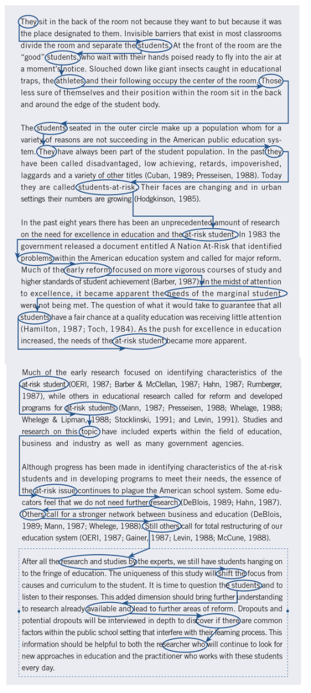

background-image: url(https://upload.wikimedia.org/wikipedia/en/6/6a/Logo_of_the_University_of_Sydney.svg)
background-size: 95%

```{r setup, include=FALSE}

knitr::opts_chunk$set(echo = TRUE, message = FALSE, warning = FALSE, 
                      dev = 'svg', out.width = "45%", fig.width = 6,
                      fig.align="center")

```

## Acknowledgement of Country

I would like to acknowledge the Traditional Owners of Australia and  recognise their continuing connection to land, water and culture. The  University of Sydney is located on the land of the Gadigal people  of the Eora Nation. I pay my respects to their Elders, past and present.

---

class: inverse, center, middle

# Chapter 4

# Writing Strategies and Ethical Considerations

.center[Slides adapted from Creswell, Research Design 6e, SAGE Publishing, 2023 for GOVT6139 Research Design.

Do not reshare]

---


## Course outline

.pull-left[

**Week 1**: Introduction

**PART I PRELIMINARY CONSIDERATIONS (Weeks 2-5)**

**Week 2**: The Selection of a Research Approach + Guest lecture w/t Inessa De Angelis

**Week 3**: Review of the Literature

**Week 4**: The Use of Theory + Guest lecture w/t Assel Mussagulova

**Week 5**: Writing Strategies and Ethical Considerations  👈

**PART II DESIGNING RESEARCH (Weeks 6-12)**

**Week 6**: The Introduction


]

.pull-right[


**Week 7**: The Purpose Statement

**Week 8**: Research Questions and Hypotheses + Guest Lecture w/t Minglu Chen

⏸️ *Mid Semester break* ⏸️

**Week 9**: Quantitative Methods

**Week 10**: Quantitative Methods: Data Analysis Lab (Make sure you install JASP)

**Week 11**: Qualitative Methods + Guest lecture w/t Sarah Phillips

**Week 12**: Qualitative Methods: Data Analysis Lab (Make sure you install NVivo)

**Week 13**: Conclusions


]

---

## Today's class

| Time         | Content                                         |
|--------------|-------------------------------------------------|


---

# Chapter 4 Learning Objectives

By the end of this session, you will be able to:

1. **Identify** the .content-box-yellow[nine key topics] to include in a proposal or research study
2. **Compare** the differences in proposal structures for quantitative, qualitative, and mixed methods research
3. **Evaluate** the quality of your writing for conciseness, coherence, and unnecessary words
4. **Identify** ethical issues and strategies for addressing them throughout the research process


---

class: inverse, center, middle

# Part I: Writing the Proposal

---

## Introduction: Why Structure Matters

Before writing a proposal for a research study, consider:

- **General structure** or outline of topics and their order
- **Format differences** between quantitative, qualitative, and mixed methods projects
- **Good writing practices** that ensure consistency and readability
- **Ethical practices** that affect all phases of the study

.content-box-green[

*A well-structured proposal provides a cohesive picture of your entire research project*

]

---

# Topics Presented in a Proposal

## Arguments presented in a proposal

* Consider early on in planning the study

  * The **major points** that need to be addressed
  
  * How they will convey a **cohesive picture** of the study
  
  * What the **core arguments** to advance are

---

## Nine Core Arguments for Any Proposal

**Maxwell's (2013) Essential Questions:**

1. What do readers need to **better understand** your topic?
2. What do readers **already know** about your topic?
3. What do you **propose to study**?
4. What is the **setting and participants**?
5. What **methods** will you use to collect data?
6. How will you **analyse** the data?
7. How will you **validate** your findings?
8. What **ethical issues** will your study present?
9. What do **preliminary results** show about feasibility and value?

*These nine questions provide the foundation for good research*

.footnote[Maxwell, J. A. (2013). *Qualitative research design: An interactive approach*. Sage]

---

class: inverse, middle, center

# Let's a few examples of proposal formats

---

## Qualitative Proposal Format: Constructivist/Interpretivist

**Introduction**
- Statement of the Problem (literature, deficiencies, relevance)
- Purpose of the Study
- Research Questions
- Philosophical Assumptions/Worldview and Theory

**Procedures**
- Qualitative Design (ethnography, case study, etc.)
- Role of the Researcher
- Data Collection Procedures
- Data Analysis Procedures
- Proposed Narrative Structure
- Strategies for Validation
- Anticipated Ethical Issues
- Preliminary Pilot Findings

**Appendixes**: Interview protocols, timeline, budget, chapter summaries

---

## Qualitative Proposal Format: Participatory/Social Justice

**Key Differences from Constructivist Format:**

- **Social Justice Theory** section (major elements, past use, applicability)
- **Collaborative data collection** approaches with participants
- **Transformative changes** likely to occur from the research
- Emphasis on **community involvement** and **participant empowerment**

*This format specifically identifies frameworks for addressing oppression, discrimination, and community involvement*

---

## Quantitative Proposal Format

**Standard Social Science Structure:**
.pull-left[
**Introduction and Literature Review**
- Statement of the Problem (theory, literature, deficiencies)
- Purpose of the Study
- Research Questions or Hypotheses
]
.pull-right[
**Method**
- Population, Sample, Participants, Recruitment
- Type of Research Design (experimental, survey)
- Procedure (variables, instruments, materials, ethics)
- Data Analysis Procedures
- Preliminary Studies or Pilot Tests

**Appendixes**: Instruments, timeline, budget, chapter outline
]
---

## Mixed Methods Proposal Format

**Integration of Quantitative and Qualitative Approaches:**
.pull-left[
**Introduction**
- Research Problem (need for both data types)
- Purpose/Study Aim (intent of combining data)
- Research Questions (quantitative, qualitative, integration)
- Philosophical Assumptions and Theory
- Literature Review (quantitative, qualitative, mixed methods studies)
]
.pull-right[
**Methods**
- Definition and Rationale for Mixed Methods
- Type of Design and Examples
- Visual Diagram of Procedures
- Validity Challenges and Solutions
- Sequential Data Collection and Analysis Steps
- Integration Statement and Joint Display Template
]
---

class: middle, inverse

# TASK 1 

Individually,

1. Revise four example outlines on the Task sheet;
2. Ask any question about the items in the examples;
2. Write the outline for your own A2 proposal;
3. Share it the class (you can write it directly on Padlet, or you can write it down and share a photo of it).
4. Go through the check-list on the back of the Task sheet using one of the outlines shared on Padlet.

```{r echo = FALSE}
library(countdown)

countdown(minutes = 20, seconds = 00)
```

---
class: inverse, center, middle

# Part II: Writing Strategies

---

## The Writing Process: Three Key Principles

### 1. Write Ideas Down Early
- **Visualise the final product** by getting words on paper
- **Advisors/Peers react better** to written ideas than verbal discussions
- **Draft a 1-2 page overview** before the full proposal
- Include: research problem, purpose, questions, data sources, significance (This will basically be Task 1 + 2!)

### 2. Work Through Multiple Drafts (This is way you want to submit a full draft for Task 3)
- **Iterative process**: write, review, rewrite
- **Elbow's method**: Write four 15-minute drafts rather than one polished hour
- **Don't polish too early** - focus on content first

---

### 3. Franklin's Three-Stage Model
1. **Develop an outline** (sentence, word, or visual map)
2. **Write and shift** ideas (move paragraphs around)
3. **Edit and polish** each sentence

---

## The Habit of Writing

**Establish Regular Writing Discipline:**

- **Write daily** or engage in thinking/collecting information daily
- **Chart your activities** for a week to find writing time
- **Select a consistent time** and place free of distractions
- **Write when fresh** - avoid weekend-only writing
- **Write in small, regular amounts** - avoid binge writing
- **Set specific, manageable tasks** for each session

**Track Your Progress:**
- Time spent writing
- Page equivalents finished
- Percentage of planned task completed

.center[**Share with supportive, constructive friends** until ready to go public]

---

## Clear and Concise Writing: Consistency

**Use Consistent Terms Throughout:**

- **Quantitative studies**: Same variable names throughout
- **Qualitative research**: Same name for central phenomena
- **Avoid synonyms** that confuse readers and cause them to question subtle meaning shifts

**Example Problem:**
"Students' academic performance" → "learner achievement" → "educational outcomes"

**Better Approach:**
Choose "academic performance" and use consistently throughout

---

## Narrative Structure: Four Types of Thoughts

**Tarshis's (1982) Framework:**

1. **Umbrella Thoughts**: General or core ideas you're conveying (this is likely your core argument)
2. **Big Thoughts**: Specific ideas that reinforce, clarify, or elaborate umbrella thoughts
3. **Little Thoughts**: Ideas whose function is to reinforce big thoughts
4. **Attention/Interest Thoughts**: Ideas that keep readers on track and organize content

**Common Problems:**
- Too many umbrella ideas without sufficient detail
- Short, unconnected paragraphs (newspaper style)
- Missing organisational statements that guide readers

.footnote[Tarshis, B. (1982). *How to write like a pro: A guide to effective nonfiction writing*. New American Library.]


---

## Task 2

.center[</img> 

or https://www.menti.com/alwdnw4cuin8]


---

.small[
(1) Despite widespread recognition of climate change as a global challenge, policy implementation at the national level remains inconsistent and inadequate. (2) This implementation gap is particularly evident in three key areas. (3) First, renewable energy adoption rates vary dramatically between developed nations, with some countries achieving over 40% renewable electricity while others lag below 10%. (4) These disparities reflect differences in government incentives, grid infrastructure capacity, and public-private partnerships. (5) Second, carbon pricing mechanisms, while adopted by 46 national jurisdictions, show significant variation in coverage and price levels. (6) For instance, carbon prices range from less than $1 per tonne in some systems to over $130 per tonne in others, undermining global coordination efforts. (7) Finally, international climate finance commitments consistently fall short of pledged amounts. (8) The $100 billion annual pledge to developing countries remains unmet, with actual contributions reaching only $83.3 billion in 2020. (9) Understanding these implementation challenges is crucial for developing more effective climate governance frameworks.
]

### What is what?

1. **Umbrella Thoughts**: General or core ideas you're conveying (this is likely your core argument)
2. **Big Thoughts**: Specific ideas that reinforce, clarify, or elaborate umbrella thoughts
3. **Little Thoughts**: Ideas whose function is to reinforce big thoughts
4. **Attention/Interest Thoughts**: Ideas that keep readers on track and organize content


---

## Coherence in Writing

**Definition**: Ideas tie together, flow logically from sentence to sentence, and connect from paragraph to paragraph

**Strategies for Coherence:**
- **Repeat key terms** in title, purpose, questions, literature headings
- **Maintain consistent order** for presenting variables
- **Use transitional words** and connecting phrases
- **Apply the hook-and-eye exercise**: Circle key ideas and connect sentences/paragraphs

**Zinsser's Rule**: Every sentence should be a logical sequel to the one that preceded it

---

## Hook-and-Eye Exercise Example

**Process:**
1. Circle key ideas ("eyes") in each sentence
2. Connect related ideas with lines ("hooks")
3. Good connections = coherence
4. Difficult connections = need for transitional words/phrases

---

.center[]

---

# Check-in

---
class: inverse, center, middle

# Part III: Voice, Tense, and Style

---

## Voice, Tense, and "Fat"

**Active vs. Passive Voice:**
- **Use active voice** whenever possible
- **Active**: "The researchers conducted interviews". 
  - But you can also say, "I/we conducted..." Your subjectivity might count!
- **Passive**: "Interviews were conducted by the researchers"
- **Passive indicators**: was, will be, have been, is being

**Strong Verbs:**
- Avoid "lazy verbs" (is, was, to be verbs)
- Choose action-oriented, specific verbs
- Replace verb + adjective combinations with strong verbs

---

## Verb Tense Guidelines (APA Recommendations)

**Past Tense or Present Perfect:**
- Literature reviews: "Smith (2020) found..." or "Researchers have shown..."
- Procedures based on past events

**Past Tense:**
- Describing results: "Stress lowered self-esteem"

**Present Tense:**
- Discussing findings and conclusions: "The findings show..."

**Future Tense:**
- Proposals describing planned research: "This study will examine..."

---

## Trimming the "Fat"

**"Fat" = Unnecessary words that don't convey meaning**

**Common Fat to Remove:**
- **Piled-up modifiers**: "very unique and extremely important"
- **Excessive prepositions**: "in order to," "with regard to"
- **"The-of" constructions**: "the study of the impact of..."
- **Overused phrases**: "it should be noted that," "needless to say"
- **Excessive quotations, italics, parenthetical comments**

**Wolcott's Editorial Skills:**
- Keep only essential words
- Use active voice
- Scale down qualifiers (maximum one per concept)
- Strike out overused phrases completely

---


class: inverse, center, middle

# Part IV: Ethical Issues in Research
---

# Ethical Issues

* Research involves collecting data from people

* Researchers need to

  1. Protect research participants
  2. Develop trust with research participants
  3. Promote the integrity of research
  4. Guard against misconduct
  5. Cope with new problems that emerge

---

## Prior to beginning the study:

* Consider codes of ethics

* Apply to the institutional review board (in Australia: Human Research Ethics Committees)

* Obtain the necessary permissions to gain access to the site and to study participants

* Select a site without vested interests

* Negotiate authorship for publication

---

## Beginning the study:

* .content-box-yellow[In the research problem]:
  * Identify a problem that will benefit individuals being studied
* .content-box-green[n the purpose and questions]:
  * Convey the purpose and sponsors of the research to participants
* Do not pressure participants into signing consent forms, obtain informed consent from participants
* Respect norms and charters of indigenous cultures
* Assess the burden of research on the participants

---

## Collecting the data:

* Respect the site, and disrupt as little as possible

* Make sure all participants receive the benefits

* Collaborate with participants

* Avoid deceiving participants

* Respect potential power imbalances, consider reciprocity (also with your research assistant!)

* Avoid exploitation of participants

* Avoid collecting harmful information

---

## Analyasing the data:

Avoid taking sides (no matter how difficult this might be) or disregarding data

Avoid disclosing only positive results – reflect the statistical tests and diversity of perspectives

* Analysing the data:
* Respect the privacy of participants:
  * Protect anonymity of participants
  * Remove names from responses
  * Qualitative researchers use aliases and pseudonyms

---

## Reporting, sharing, and storing data:

* Do not falsify authorship, evidence, data, findings or conclusions

* Do not plagiarise or misuse LLM.

* Avoid disclosing information that would harm participants

* Communicate in clear straightforward, appropriate language

---

## Reporting, sharing, and storing data:

* Share data with others (e.g. stakeholders, participants)

* Keep raw data and other materials for a reasonable period of time

* Do not duplicate or piecemeal publications

* Complete proof of compliance with ethical issues and lack of conflict of interest

* Understand who owns the data

---

## Summary: Key Takeaways

**Writing Strategies:**
- **Structure proposals** using appropriate format for your approach
- **Write regularly** and work through multiple drafts
- **Ensure coherence** through consistent terms and logical flow
- **Use active voice** and trim unnecessary words

**Ethical Considerations:**
- **Plan ethical issues** at every stage of research
- **Protect participants** through informed consent and confidentiality
- **Respect cultural differences** and power imbalances
- **Report honestly** and share data appropriately

**Remember**: Good research requires both excellent writing and ethical integrity throughout the entire process.

---

# Week 05: Anonymous qualitative student feedback survey

## Complete now or later at home!

## It will only take 5 minutes


---

class: inverse, middle, center

# Thank you and see you next week with the Introduction (of your proposal)!

A1 is due next Week!: If you are late apply for a simple extension! 


    


