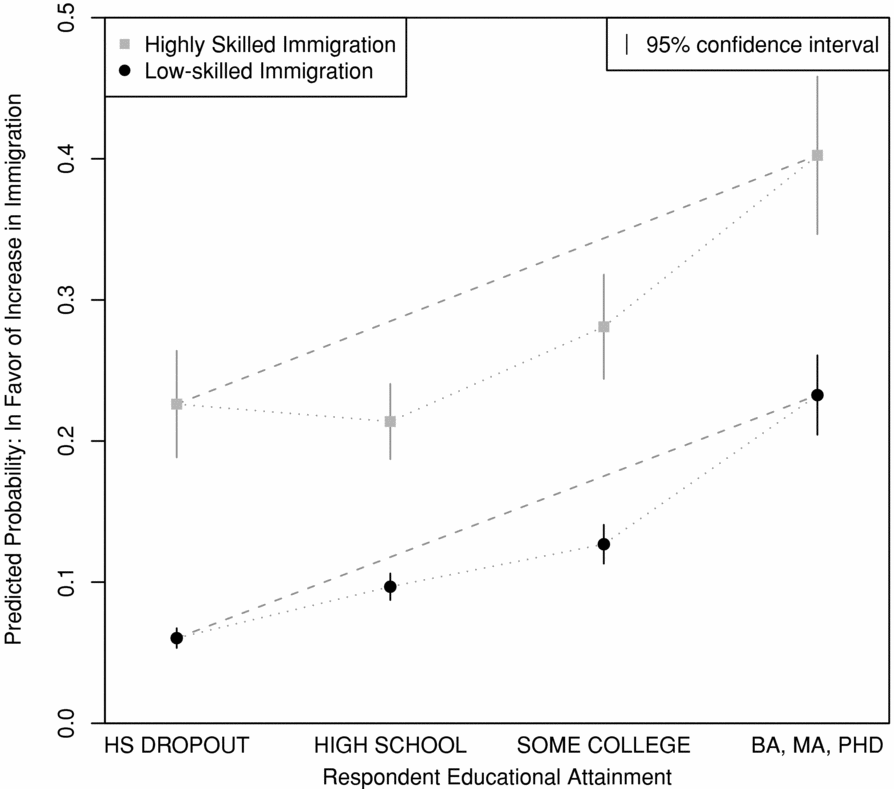

background-image: url(https://upload.wikimedia.org/wikipedia/en/6/6a/Logo_of_the_University_of_Sydney.svg)
background-size: 95%

```{r setup, include=FALSE}

knitr::opts_chunk$set(echo = TRUE, message = FALSE, warning = FALSE, 
                      dev = 'svg', out.width = "45%", fig.width = 6,
                      fig.align="center")

```

---

## Acknowledgement of Country

I would like to acknowledge the Traditional Owners of Australia and recognise their continuing connection to land, water and culture. The  University of Sydney is located on the land of the Gadigal people  of the Eora Nation. I pay my respects to their Elders, past and present.

---

## Course outline

.pull-left[

Week 1: Introduction

Week 2: Foundations: Ontology and Epistemology

Week 3: Research Design (I): Questions, Theories, Hypotheses, Variables, Measurements

Week 4:	Research Design (II): Case selection</mark> 

<mark>Week 5: Research Design (III): Causal Inference

Week 6: Qualitative Methods (I): Data Collection 

Week 7: Qualitative Methods (II): Data Analysis 

]

.pull-right[

⏸️ *Mid Semester break* ⏸️

Week 8: Quantitative Methods (I): Data Collection 

*Week 9: 🎉 Public holiday 🎉*

Week 10: Quantitative Methods (II): Data Analysis 

Week 11: Quantitative Methods (II): Data Analysis lab

Week 12: Research Proposal: Peer Feedback Workshop Week 

13:New frontiers and Conclusions

]

---

## Today's class

### Causality

* Research design approaches

    * Experimental research design
    
    * Quasi-experimental research design
    
    * Observational research design
    
* Research design strengths and weaknesses

    * Internal validity
    
    * External validity
    
---
class: inverse, center, middle

# Casuality

---

## Addressing causality in the social sciences


* Positivist research often interested in examining causality

* What does causality mean in the social sciences?

* We often hear the phrase ‘correlation is not causation’

* So, what exactly is *correlation* and how does it differ from *causation*?

* **Correlation** (or *co-variation* or *association*): Two phenomena (i.e., variables) tend to be associated. If one of the two variables changes, the other variable changes also.

---

## Causality, an ontological and epistemological problem

### Ontology

What is a cause? And what is an effect? Are they part of the same entity? Are they part of different entities? 

(Note that some thinks casual relations as we commonly intend them do not exist or that they are not useful concepts... 🤯)

### Epistemology

Can/How we determine what is an effect and what caused it?


---

## Different kind of causal claims

### High-level, concepts

1. The drought caused the famine. [This (instance of a) drought caused this (instance of a) famine] 

2. Drowsy driving causes crashes. [Any instance of drowsy driving  causes crashes.]

### Low-level, measured

3. How much I *water* my plant influences how tall it *grows*. [A variable influences another variable, in general.]

4. How much *novocaine* a patient receives affects how much *pain* they will feel during dental surgery [A variable influences another variable, in a specific context.]


Adapted from: https://plato.stanford.edu/entries/causation-metaphysics/

---

## Examples of correlation/association

.pull-left[
**Ice cream sales and murders**

* There is a positive correlation between *ice-cream* sales and *murder*.
* When ice-cream sales rise, the rate of murders rises.
* Do ice-creams cause murder? Why / why not?

**Umbrellas and rain**

* There is a positive correlation between *umbrella* use and *rain*.
* When umbrellas are in use, it’s more likely to be raining
* Do umbrellas cause rain? Why / why not?

]

.pull-right[

</img>

]

---

## Conditions for Causality

.pull-left[

1. **Correlation (or co-variation, association)**: Two phenomena (i.e., variables) tend to be associated. If one of the two variables changes, another variable changes.

2. **Time-order**: The presumed cause (an independent variable) happened before the presumed consequence (a dependent variable).

3.	**Non-spuriousness**: The correlation between independent and dependent variables is not caused by other (third) factors.

]

.pull-right[ 

##### Casuality

```{r echo = F, out.width = '100%'}

require(DiagrammeR)

DiagrammeR::grViz("
  digraph graph2 {
  
  graph [layout = dot, rankdir = LR]
  
  # node definitions with substituted label text
  node [shape = oval, style = filled]
  X [label = 'X\nEducation', fillcolor = Orange]
  Y [label = 'Y\nDemocracy', fillcolor = Lightblue]
  
  X -> Y
  }
  ",
  height = 75)

```

##### Reverse casuality

```{r echo = F, out.width = '100%'}

require(DiagrammeR)

DiagrammeR::grViz("
  digraph graph2 {
  
  graph [layout = dot, rankdir = LR]
  
  # node definitions with substituted label text
  node [shape = oval, style = filled]
  X [label = 'X\nEducation', fillcolor = Orange]
  Y [label = 'Y\nDemocracy', fillcolor = Lightblue]
  
  Y -> X
  }
  ",
  height = 75)

```

##### Spurious relationship


```{r echo = F, out.width = '100%'}

require(DiagrammeR)

DiagrammeR::grViz("
  digraph graph2 {
  
  graph [layout = dot, rankdir = LR]
  
  # node definitions with substituted label text
  node [shape = oval, style = filled]
  X [label = 'X\nEducation', fillcolor = Orange]
  Y [label = 'Y\nDemocracy', fillcolor = Lightblue]
  Z [label = 'Z\nEconomic\ndevelopment']
  
  Z-> X; Z -> Y
  }
  ",
  height = 105)

```

]

---

## Examining causation


#### Do ice-creams cause murder?

.pull-left[
* **Association**: Are ice creams and murders positively correlated?
    * <mark>Yes</mark>
* **Time-order**: Do ice-cream sales increase before the murder rate increases?
    * <mark>Not sure</mark>
* **Non-spuriousness**: Can we rule out any other factors that could cause both ice-cream sales and murders?
    * <mark>No, both could be caused by *seasonal* factors</mark>
* Does it meet all three conditions for causality?
    * <mark>No, does not meet non-spuriousness criterion</mark>
]

.pull-right[

</img>

]

---

## Examining causation

.pull-left[
* **Association**: Is umbrella use associated with rain? (Is there more rain when umbrellas are in use?)
    * <mark>Yes</mark>
* **Time-order**: Does umbrella use precede the onset of rain?
    * <mark>No, it’s the other way around, people tend to get umbrellas out after it starts raining</mark>
* **Non-spuriousness**: Can we rule out any other factors that could cause both both umbrella use and rain?
    * <mark>Yes</mark>
* Does it meet all three conditions for causality?
    * <mark>No, does not meet time-order criterion</mark>
]

.pull-right[

</img>

]

---

## Examining causation

* Ice-cream / umbrellas – these are simple examples unrelated to the social sciences

* However, the same principles apply to problems in the social/ political sciences

.center[
</img>
]

---

## Examining causal questions - political science

### Relationship between dissatisfaction with democracy and populism

* Does voter dissatisfaction with democracy increase support for populist parties?

* Or does the rise of populist parties increase voter dissatisfaction with democracy?

* Most studies assumed the former (e.g. Lubbers and Scheepers 2000), although a recent study showed that the relationship goes in both directions (Rooduijn et al. 2016)

.center[</img>]

---

## Examining causal questions

In the social sciences it’s not always easy to be certain of causality (i.e. not always easy to be sure that all the conditions for causality are met). Time order and non-spuriousness in particular can present challenges.


---

### In some cases it is easier to determine time-order than others

* E.g. age and satisfaction with democracy
    * Someone’s age is determined (by birth year) before their attitudes towards democracy – so it’s easy to know which came first
* Sex (M/F) also determined before political attitudes and behaviours

### But in other areas (e.g. public attitudes) can be harder to know which came first

* E.g. attitudes towards leadership changes and satisfaction with democracy – harder to know which came first
     * Were people already less satisfied with democracy and so they had negative attitudes towards leadership changes?
     * Or did they develop negative attitudes towards democracy as a result of the leadership changes?
     * Relationship could potentially go in either direction


**As the researcher, you need to make justified assumptions about the direction of relationships – or design your research to be able to make causal claims**

---

## Examining causal questions

### Non-spuriousness

Research design choices can ensure non-spuriousness criterion is met:

* Experimental designs control for other factors

* In non-experimental designs can statistically control for other factors


---
class: inverse, center, middle

# Research design approaches

---

## What is research design?

### Broad definition

Research design refers to a whole proposal for a research project, including the review of the literature, research questions, hypotheses, selection of cases, details of data collection and methods of data analysis.

###Narrow definition

Research design refers to the logical method by which we  propose to test a hypothesis.


---

## Research designs for causal inference

### True experimental design
* Almost always quantitative

### Quasi-experimental design
* Often quantitative
* Sometimes referred to as a *natural experiment*

### Observational design (correlational design and statistical adjustment)
* Can be qualitative (intentional selection of observations)
* Or can be quantitative (using correlation and regression analysis)

---

## True experimental design

Also referred to as **randomized** **controlled** experiment.

--

1.	Select subjects for your experimental study (e.g. student volunteers).

--

2.	Randomly divide the subjects into two groups: the “treatment group” and the “control group” (randomization).

--

3.	Measure the dependent variable in the treatment and control group.

--

4.	Give a “stimulus (or treatment)” only to the experimental group.

--

5.	Measure the dependent variable and compare the difference in the dependent variable between the groups (experimental effect).

--

6.	Experimental environment (location, time, other physical aspects) is under control of the researcher

---

## True experimental design

#### Logic of experimental research design

```{r echo = F, out.width = '100%'}

require(DiagrammeR)

DiagrammeR::grViz("
  digraph graph2 {
  
  graph [layout = dot, rankdir = LR]
  
  # node definitions with substituted label text
  node [shape = oval, style = filled]
  P [label = 'A (possibly undefined)\npopulation']
  S [label = 'Pool of\nsubjects']
  T [label = 'Treatment\ngroup', shape = box, fillcolor = Lightblue]
  C [label = 'Control\ngroup', shape = box, fillcolor = Orange]
  
  P -> S -> T; S -> C
  }
  ",
  height = 150)

```

#### Results of Hypothetical Media Experiment

```{r echo  = F}
require(knitr)
require(kableExtra)
data.frame(g = c("Treatement", "Control"),
           b = c(65, 63),
           a = c(72, 62)) %>%
  kable(col.names = c("Group",
                           "Before Measure of Intention (% intending to vote)",
                           "After Measure of Intention (% intending to vote)")) %>%
  kable_paper("striped", full_width = F)
  
```

---

## True experimental design

#### Settings

* Controlled lab setting

* Survey experiment

* Field experiment

#### Who participates?

* Experiments often use students as participants (Why?)

* Amazon Mechanical Turk (pay people to complete surveys)

* Ideally would have sample representative of the population of interest (e.g. adult Australians) – for experimental approaches this is hard and rarely done

---

#### Example lab experiment: The New Videomalaise - Effects of Televised Incivility on Political Trust (Mutz and Reeves 2005)

.pull-left[

**Research question**: Does incivility in political discourse affect public regard for politics?

**Theory**: ‘when viewers are exposed to televised political disagreement, it often violates well-established face- to-face social norms for the polite expression of opposing views. As a result, incivility in public discourse adversely affects trust in government’

**Finding**: ‘We find that televised presentations of political differences of opinion do not, in and of themselves, harm attitudes toward politics and politicians. However, political trust is adversely affected by levels of incivility in these exchanges.’

]

.pull-right[

#### Approach
* Actors hired to play the roles of two congressional candidates in a television talk show set up
* Actors stick to the same script so the substantive discussion on policy did not vary (content of discussion constant)
* *Treatment condition 1* – actors behaved in uncivil fashion
* *Treatment condition 2* – actors behaved in civil fashion
* Control condition – participant did not watch tv program
* Participants sat alone in a room with couch and TV
* Pre-test questionnaire, watched the TV program for 20 mins, then post-test questionnaire

]

---

#### Example survey experiment: Attitudes toward Highly Skilled and Low-skilled Immigration (Hainmueller and Hiscox 2010)

.pull-left[

Authors identified *two concerns* leading to anti-immigrant sentiment
* Concerns about labour market competition
* Concerns about burden on public services

They test both and find:
* Both low-skilled and high-skilled natives prefer highly skilled immigrants
* Economic self-interest does not influence attitudes towards immigration

#### Survey respondents randomly assigned one of two questions:

]

.pull-right[


**Version 1**: Do you agree or disagree that the US should allow more *highly skilled* immigrants from other countries to come and live here? (emphasis added)

**Version 2**: Do you agree or disagree that the US should allow more *low-skilled* immigrants from other countries to come and live here? (emphasis added)

</img>

]

---

## Example Field-experiment: Controlling Corruption in Indonesia (Olken 2007)

**Research Question**: What is the best way to control for corruption: bottom up (i.e., citizen monitoring) or top down (i.e., audits)?

#### Research Design
* **Sample**: Random selection of 600 road projects

* **Intervention**: Cases randomly assigned to either audit by government or to increased grassroots participation in monitoring

* **Measure of Effect**: expert estimate of cost of road materials compared to reported costs (calculate difference between estimated and actual costs)

#### Findings:

* Fewer missing expenditures in cases where there are government audits.

* Top-down monitoring more effective in reducing corruption.

---

## Quasi-experimental design

#### Design criteria include:

1.	Measure the dependent variable of the subjects. (Note often need to look for this data retrospectively).

2.	Wait until some subjects are exposed to the independent variable, or observe that the values of the independent variable change among the subjects. (Note: The subjects are not assigned to groups: no random assignment).

3.	Measure the dependent variable again, and compare the difference in the dependent variable among the subjects.


Also referred to as *natural experiments*

---

## Quasi-experimental design

#### When this design type can be useful

* Say you have two countries that are quite similar to one another, and then something happens in one of the countries but not the other, e.g.:

    * Major economic crisis
    * Natural disaster
    * Going to war
    * Pandemic
    
* Suitable approach if you’re interested in the effect of that factor on a dependent variable

* Same principle for more countries where some are naturally exposed to some kind of ‘treatment effect’ while others are not

* Things that just happen in the world – not controlled by the researcher (ethics!)

---

## Quasi-experiment (no random assignment)

#### Logic of Quasi Experiments

```{r echo = F, out.width = '100%'}

require(DiagrammeR)

DiagrammeR::grViz("
  digraph graph2 {
  
  graph [layout = dot, rankdir = LR]
  
  # node definitions with substituted label text
  node [shape = oval, style = filled]
  P [label = 'Population\n(i.e. Scandinavian countries)']
  S [label = 'Subset\nof\ncountries']
  T [label = 'Treatment: Implements\nCOVID-19 lockdown\n(e.g. Norway, Finland)', shape = box, fillcolor = Lightblue]
  C [label = 'Control: Does not\nimplement COVID-19 lockdown\n(e.g.Sweden)', shape = box, fillcolor = Orange]
  
  P -> S -> T; S -> C
  }
  ",
  height = 150)

```

#### Hypothetical Quasi-Experiment

```{r echo  = F}
require(knitr)
require(kableExtra)
data.frame(g = c("Treatement group: Citizen approval of government", 
                 "Control group: Citizen approval of government"),
           b = c("?", "?"),
           a = c("?", "?")) %>%
  kable(col.names = c("Group",
                           "Before measurement",
                           "After measurement")) %>%
  kable_paper("striped", full_width = F)
  
```


---

## Example quasi-experiment: Rain and voter turnout (Gomez et al. 2006)

.pull-left[

#### The Republicans Should Pray for Rain: Weather, Turnout, and Voting in U.S. Presidential Election

* Rain reduces voter participation by around 1% per inch

* Poor weather benefits the Republican party’s vote share

* Weather may have contributed to Electoral College outcomes in 1960 and 2000

]


.pull-right[

</img>

]

---

## Observational design

#### Design criteria include:

1.	Select a sample of your study.

2.	Measure the dependent and independent variables. (Note: The values of the independent variables must vary among the subjects.)

3.	Examine the relationship between the independent and dependent variable.

    * Are the variables correlated?
    
    * Make reasonable assumptions about time-order.
    
    * Control for other factors (e.g. using statistical methods) to ensure non-spuriousness.

*In political science this approach far more common than experimental approaches. Experiments more common in psychology.*

---

### Example observational design (I): Government performance and dissatisfaction with democracy in Australia (Cameron 2020)

.pull-left[

* Examines the effect of changes of prime minister on satisfaction with democracy in Australia
* Draws upon Australian Election Study (survey) data from 1996 to 2019
* Observes attitudes towards the leadership changes (the presumed cause
* independent variable)
* Observes satisfaction with democracy (the presumed effect – dependent variable)
* Controls for a number of other factors that may affect satisfaction with democracy
]

.pull-right[

* Shows that disapproval of the changes of prime minister a major factor undermining satisfaction with democracy in Australia

#### Approval of leadership changes and satisfaction with democracy

</img>

]

---

### Example observational design (II): Gender, Political Knowledge, and Descriptive Representation: The Impact of Long-Term Socialization (Dassonneville and McAllister 2018)

.pull-left[

**Puzzle**: Many studies have shown a gender gap in political knowledge (men higher). What explains the gap?

**Hypothesis**: Higher levels of women’s elected representation will increase women’s political knowledge.

**Findings**: Proportion of women elected representatives at the time of the survey has no significant effect on the gender gap. But a strong and significant long-term impact for descriptive representation for respondents aged 18-21. 
]

.pull-right[

In line with political socialization theories, which posit that the impact of political context is greatest during adolescence and early adulthood.

**Approach**: Uses survey data from the Comparative Study of Electoral Systems and European Election Study (cross-national surveys). Measures on political knowledge, respondent age and % women in parliament.

]

---

## Observational design

### Matching: A case of statistical adjustment 

When justifiable, observational data can be adjusted before running a standard regression (as in the previous examples).

Let's say you want to estimate the effect of the presence of a nuclear power plant on the proportion of people voting the Greens in that precinct. How do you do? 

1. You can measure the statistical association between the presence of a nuclear power plant (a binary independent variable) and a continuous variable (the vote share for the Greens).

2. But instead of comparing the differences between the two averages in the two groups, it might be preferable to *match* every precinct with a power plant with the most similar precinct available in the data based on a number of characteristics and demographics (e.g. unemployment, median age, education, etc.) and compare the pairwise differences. In so doing you average the difference among comparable precincts.

---

## Research Design

#### Internal Validity
* High internal validity = can be confident that there is a causal relationship
* “Internal Validity is the approximate truth about inferences regarding cause-effect or causal relationships.” https://conjointly.com/kb/internal-validity/

.center[
</img>
]


---

## Research Design

#### External Validity
* High external validity = can be confident that the conclusions would be generalizable to the ‘real world’ / other settings
* “external validity refers to the approximate truth of conclusions the involve generalizations. Put in more pedestrian terms, external validity is the degree to which the conclusions in your study would hold for other persons in other places and at other times” https://conjointly.com/kb/external-validity/

.center[
</img>
]

---

## Research Design – Strengths and Weaknesses

| **Experimental design**  | **Quasi-experimental design**  | **Observational design**  |
|---|---|---|
| *Internal validity* | *Internal validity* | *Internal validity* |
| **High** <br/> Can be confident in causal claims because of random assignment | **Higher** than observational design <br/> **Lower** than experiments | **Low** <br/> Determining causality can be difficult |
| *External validity* | *External validity* | *External validity* |
| **Low** (e.g. using unrepresentative participants like students) - setting might not reflect real world. <br/> **Higher** in field experiments than lab experiments | **High** <br/> Real world rather than lab setting | **High** <br/> Real world rather than lab setting|


