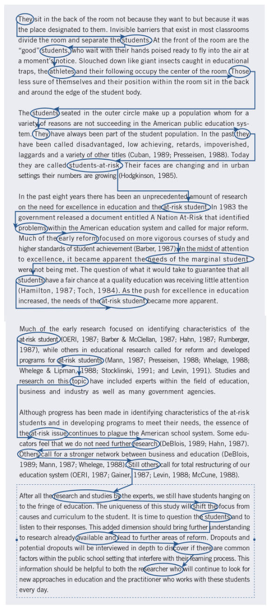

```{r setup, include=FALSE}

knitr::opts_chunk$set(echo = TRUE, message = FALSE, warning = FALSE,
                      dev = 'svg', out.width = "45%", fig.width = 6,
                      fig.align="center")

```

## Acknowledgement of Country

I would like to acknowledge the Traditional Owners of Australia and  recognise their continuing connection to land, water and culture. The  University of Sydney is located on the land of the Gadigal people  of the Eora Nation. I pay my respects to their Elders, past and present.

# Chapter 4: Writing Strategies and Ethical Considerations

::: {style="text-align: center;"}
Slides adapted from Creswell, Research Design 6e, SAGE Publishing, 2023 for GOVT6139 Research Design.

Do not reshare
:::

---

## Any question concerning the content for this week?

---

## Plan for today

1. **Writing the proposal** — the nine core arguments; qualitative, quantitative & mixed methods formats

2. Task 1 (individual): draft the outline for your own A2 proposal

3. **Writing strategies** — process, habit, coherence, voice/tense, trimming the "fat"

4. Task 2 (short exercise): umbrella / big / little / attention thoughts

5. **Ethical issues** — the textbook's stage-by-stage view, then the Australian framework (NHMRC *National Statement*)

6. A3 in-class short answer

7. Check-in

---

## Chapter 4 Learning Objectives

By the end of this session, you will be able to:

1. **Identify** the nine key topics to include in a proposal or research study
2. **Compare** the differences in proposal structure for quantitative, qualitative, and mixed methods research
3. **Evaluate** the quality of your writing for conciseness, coherence, and unnecessary words
4. **Identify** ethical issues and strategies for addressing them — before, during, and after a study

# Part I: Writing the Proposal

---

## Why Structure Matters

Before writing a proposal for a research study, consider:

- **General structure** or outline of topics and their order
- **Format differences** between quantitative, qualitative, and mixed methods projects
- **Good writing practices** that ensure consistency and readability
- **Ethical practices** that affect all phases of the study

> A well-structured proposal provides a cohesive picture of your entire research project.

---

## Nine Core Arguments for Any Proposal

**Maxwell's (2013) essential questions** — address each with a section of its own:

1. What do readers need to **better understand** your topic?
2. What do readers **already know** about your topic?
3. What do you **propose to study**?
4. What is the **setting**, and **who** are the people you will study?
5. What **methods** will you use to collect data?
6. How will you **analyse** the data?
7. How will you **validate** your findings?
8. What **ethical issues** will your study present?
9. What do **preliminary results** show about feasibility and value?

::: footer
Maxwell, J. A. (2013). *Qualitative research design: An interactive approach*. SAGE.
:::

---

## Qualitative Format: Constructivist / Interpretivist

::: columns
::: {.column width="50%"}
**Introduction**

- Statement of the Problem (literature, deficiencies, relevance)
- Purpose of the Study
- Research Questions
- Philosophical Assumptions / Worldview and Theory
:::

::: {.column width="50%"}
**Procedures**

- Qualitative Design (ethnography, case study, etc.)
- Role of the Researcher
- Data Collection Procedures
- Data Analysis Procedures
- Proposed Narrative Structure
- Strategies for Validation
- Anticipated Ethical Issues
- Preliminary Pilot Findings
:::
:::

**Appendixes**: interview protocols, timeline, budget, chapter summaries

---

## Qualitative Format: Participatory / Social Justice

**Key differences from the constructivist format:**

- A **Social Justice Theory** section (major elements, past use, applicability)
- **Collaborative** data collection with participants
- **Transformative changes** likely to result from the research
- Emphasis on **community involvement** and **participant empowerment**

> This format specifically identifies frameworks for addressing oppression, discrimination, and community involvement.

---

## Quantitative Format

::: columns
::: {.column width="50%"}
**Introduction and Literature Review**

- Statement of the Problem (issue, theory, literature, deficiencies, relevance)
- Purpose of the Study
- Research Questions or Hypotheses
:::

::: {.column width="50%"}
**Method**

- Population, Sample, Participants, Recruitment
- Type of Research Design (experimental, survey)
- Procedure (variables, instruments, materials, ethics)
- Data Analysis Procedures
- Preliminary Studies or Pilot Tests
:::
:::

**Appendixes**: instruments, timeline, budget, chapter outline

---

## Mixed Methods Format

::: columns
::: {.column width="50%"}
**Introduction**

- Research Problem (need for both data types)
- Purpose / Study Aim (intent of combining data)
- Research Questions (quant, qual, integration)
- Philosophical Assumptions and Theory
- Literature Review (quant, qual, mixed methods studies)
:::

::: {.column width="50%"}
**Methods**

- Definition and Rationale for Mixed Methods
- Type of Design and Examples
- Visual Diagram of Procedures
- Validity Challenges and Solutions
- Sequential Data Collection and Analysis Steps
- Integration Statement and Joint Display Template
:::
:::

> This format usually makes the mixed methods proposal **longer** than a qualitative or quantitative one.

---

## Designing the Sections of a Proposal

Research tips from Creswell & Creswell:

- **Specify the sections early.** Work on one section — it prompts ideas for others. First outline, then write *something* for each section rapidly, then refine.
- **Read other students' proposals** written under your supervisor; study topics, order, level of detail.
- **Ask your supervisor** for their preferred format and a model proposal.
- Keep it **within an acceptable length** (they prefer ≤ 30 pages — your A2 is 3,000 words).

---

## TASK 1 (individual)

1. Review the four example outlines on the Task sheet.
2. Ask any question about the items in the examples.
3. Write the outline for **your own A2 proposal**.
4. Share it with the class (write it on Padlet, or photograph your handwritten version).
5. Run the check-list on the back of the Task sheet against one of the outlines shared on Padlet.

```{r echo = FALSE}
library(countdown)

countdown(minutes = 20, seconds = 00)
```

# Part II: Writing Strategies

---

## The Writing Process: Three Principles

### 1. Write ideas down early
- **Visualise the final product** by getting words on paper
- Advisers and peers react better to **written** ideas than to talk
- Draft a **1–2 page overview** before the full proposal (≈ Task 1 + Task 2)

### 2. Work through multiple drafts
- Iterative: write → review → rewrite
- **Elbow's method**: four 15-minute drafts rather than one polished hour
- Don't polish too early — content first

### 3. Franklin's three stages
1. Develop an **outline** (sentence, word, or visual map)
2. **Write and shift** ideas (move paragraphs around)
3. **Edit and polish** each sentence

---

## The Habit of Writing

**Establish a regular writing discipline:**

- **Write daily** — or at least think / collect information daily
- **Chart your activities** for a week to find writing time
- Pick a **consistent time and place**, free of distractions
- **Write when fresh**; avoid the "weekend writer" trap
- Write in **small, regular amounts** — avoid binge writing
- Set **specific, manageable tasks** for each session

**Track progress:** time spent, page equivalents finished, % of planned task done.

> Share with supportive, constructive friends until you're ready to go public.

---

## Clear and Concise Writing: Consistency

**Use consistent terms throughout:**

- **Quantitative**: same variable names every time
- **Qualitative**: same name for the central phenomenon
- **Avoid synonyms** — they make readers question subtle shifts in meaning

**Example problem:**
"students' academic performance" → "learner achievement" → "educational outcomes"

**Better:** choose "academic performance" and use it consistently.

---

## Narrative Structure: Four Types of Thoughts

**Tarshis's (1982) framework:**

1. **Umbrella thoughts** — the general or core ideas you're conveying (likely your core argument)
2. **Big thoughts** — specific ideas that reinforce, clarify, or elaborate umbrella thoughts
3. **Little thoughts** — ideas whose job is to reinforce big thoughts
4. **Attention / interest thoughts** — ideas that keep readers on track and organise content

**Common problems:** too many umbrella ideas without detail; short, unconnected "newspaper" paragraphs; missing organising statements.

::: footer
Tarshis, B. (1982). *How to write like a pro*. New American Library.
:::

---

## Task 2

::: {style="text-align: center;"}
</img>

or <https://www.menti.com/alwdnw4cuin8>
:::

---

## Task 2: What is what? {.smaller}

::: {style="font-size: 0.75em;"}
(1) Despite widespread recognition of climate change as a global challenge, policy implementation at the national level remains inconsistent and inadequate. (2) This implementation gap is particularly evident in three key areas. (3) First, renewable energy adoption rates vary dramatically between developed nations, with some countries achieving over 40% renewable electricity while others lag below 10%. (4) These disparities reflect differences in government incentives, grid infrastructure capacity, and public-private partnerships. (5) Second, carbon pricing mechanisms, while adopted by 46 national jurisdictions, show significant variation in coverage and price levels. (6) For instance, carbon prices range from less than $1 per tonne in some systems to over $130 per tonne in others, undermining global coordination efforts. (7) Finally, international climate finance commitments consistently fall short of pledged amounts. (8) The $100 billion annual pledge to developing countries remains unmet, with actual contributions reaching only $83.3 billion in 2020. (9) Understanding these implementation challenges is crucial for developing more effective climate governance frameworks.
:::

1. **Umbrella** — general / core idea
2. **Big** — reinforces, clarifies, elaborates the umbrella
3. **Little** — reinforces big thoughts
4. **Attention / interest** — keeps readers on track, organises content

---

## Coherence in Writing

**Definition**: ideas tie together, flow logically from sentence to sentence, and connect from paragraph to paragraph.

**Strategies:**

- **Repeat key terms** in title, purpose, questions, literature headings
- **Keep a consistent order** for presenting variables
- **Use transitional words** and connecting phrases
- Apply the **hook-and-eye exercise**: circle key ideas, connect sentences and paragraphs

> Zinsser's rule: every sentence should be a logical sequel to the one before it.

---

## Hook-and-Eye Exercise

1. Circle key ideas ("eyes") in each sentence
2. Connect related ideas with lines ("hooks")
3. Good connections = coherence
4. Difficult connections = you need transitional words / phrases

::: {style="text-align: center;"}
</img>
:::

---

## Voice, Tense, and "Fat"

**Active vs. passive voice:**

- Prefer the **active voice**: "The researchers conducted interviews."
  - "I / we conducted…" is fine too — your positionality can matter
- Passive: "Interviews were conducted by the researchers"
- Passive markers: *was, will be, have been, is being*

**Strong verbs:** avoid "lazy" *to be* verbs; choose action-oriented, specific verbs.

---

## Verb Tense Guidelines (APA)

- **Past tense / present perfect** — literature reviews: "Smith (2020) found…", "Researchers have shown…"
- **Past tense** — describing results: "Stress lowered self-esteem"
- **Present tense** — discussing findings and conclusions: "The findings show…"
- **Future tense** — proposals describing planned research: "This study **will** examine…"

> A useful guideline, not a hard-and-fast rule.

---

## Trimming the "Fat"

**"Fat" = unnecessary words that don't convey meaning.**

Common fat to cut:

- **Piled-up modifiers**: "very unique and extremely important"
- **Excessive prepositions**: "in order to", "with regard to"
- **"The-of" constructions**: "the study of the impact of…"
- **Overused phrases**: "it should be noted that", "needless to say"
- Excessive quotations, italics, parenthetical comments

**Wolcott's editorial skills:** keep only essential words; use active voice; one qualifier per concept at most; strike overused phrases completely.

---

## Check-in

# Part III: Ethical Issues in Research

---

## Why Ethics Runs Through Every Stage

Research involves collecting data **from and about people**. Researchers need to:

1. Protect research participants
2. Develop trust with participants
3. Promote the integrity of research
4. Guard against misconduct
5. Cope with new problems as they emerge

> The textbook (Table 4.1) organises ethical issues by the **stage** of research at which they arise: *prior to*, *beginning*, *collecting data*, *analysing data*, and *reporting / sharing / storing*.

---

## Textbook View — Prior to the Study

- **Consult codes of ethics** for your discipline / professional association
- **Apply to the ethics review board** — in the US the IRB; **in Australia, a Human Research Ethics Committee (HREC)**
- **Obtain permissions** to access the site and the participants (gatekeepers)
- **Select a site with no vested interest** — where you can't influence outcomes
- **Negotiate authorship** for publication, based on contribution
- **Plan to keep the participant burden low**

---

## Textbook View — Beginning the Study

- **In the research problem**: identify a problem that will benefit the people being studied
- **In the purpose and questions**: disclose the purpose and sponsors of the research to participants — avoid *deception*
- **Do not pressure** participants into signing consent forms; participation is voluntary
- **Respect the norms and charters of Indigenous communities**; involve Indigenous leaders in all phases
- **Obtain appropriate consent for vulnerable populations** (e.g. parents *and* children)
- **Assess the burden** the research places on participants

---

## Textbook View — Collecting the Data

- **Respect the site** — disrupt as little as possible
- Make sure **all participants receive the benefits** (e.g. wait-list control groups)
- **Collaborate** with participants
- **Avoid deceiving** participants
- **Respect power imbalances** and consider reciprocity — *including with your research assistant*
- **Avoid exploiting** participants ("gather data and leave")
- **Avoid collecting harmful information**

---

## Textbook View — Analysing the Data

- **Avoid taking sides** — don't disregard data that disproves your own hypotheses, however difficult
- **Don't disclose only positive results** — report the full range, including contrary findings and the diversity of perspectives
- **Respect participants' privacy**:
  - Protect anonymity
  - Remove names from responses
  - Use aliases / pseudonyms (and composite profiles) in qualitative work

---

## Textbook View — Reporting, Sharing, Storing

- **Do not falsify** authorship, evidence, data, findings, or conclusions
- **Do not plagiarise** — and do not misuse LLMs
- **Avoid disclosing** information that would harm participants; use composite stories
- **Communicate in clear, bias-free, non-discriminatory language**
- **Share data** with stakeholders and participants; keep raw data for a reasonable period (**most guidelines: 5 years**)
- **No duplicate or piecemeal** publication
- **Disclose funders** and conflicts of interest; **state who owns the data**

# Part IV: The Australian Framework

---

## The *National Statement* — What It Is

The textbook is written for a US context (IRBs, professional-association codes). In Australia the governing document is:

> **National Statement on Ethical Conduct in Human Research (2025)** — NHMRC, ARC & Universities Australia.

- Issued under the *NHMRC Act 1992*; **binding** on research funded by or conducted under the auspices of NHMRC, ARC, or an Australian university
- Sits alongside the **Australian Code for the Responsible Conduct of Research** (integrity, authorship, data management, misconduct)
- **"Human research" is defined broadly**: surveys, interviews, focus groups, observation, access to a person's data or biospecimens — *including* data where consent has been waived
- **Not** human research (no ethics review as a standalone activity): a literature review supporting a project, research using **public data**, research using **aggregate data**

::: footer
NHMRC, ARC & Universities Australia (2025). *National Statement on Ethical Conduct in Human Research.* Canberra: NHMRC.
:::

---

## The *National Statement* — Structure

| Section | Content |
| :-- | :-- |
| **1** | Values and principles of ethical conduct |
| **2** | Themes in research ethics: **risk and benefit, consent** |
| **3** | Ethical considerations in the design, development, review and conduct of research |
| **4** | Ethical considerations **specific to participants in research** (specific groups) |
| **5** | Research governance and ethics review (HRECs, researchers, institutions) |

Section 1 applies to **all** human research; Sections 2–5 have multiple chapters.

---

## Section 1 — Four Values {.smaller}

| Value | What it requires |
| :-- | :-- |
| **Research merit and integrity** | The research is justifiable by its potential benefit, uses appropriate methods, is grounded in the literature, and is carried out honestly and competently. *Without merit, involving participants is not justifiable.* |
| **Justice** | Fair recruitment; no unfair burden on particular groups; fair distribution of the benefits and burdens of research; no exploitation; fair access to benefits. |
| **Beneficence** | The likely benefit must justify any risks of harm or discomfort; researchers design to **minimise** risk and are responsible for participants' welfare. |
| **Respect** | Recognising the intrinsic worth of each person; regard for their welfare, beliefs, customs and cultural heritage; giving scope to their capacity to make their own decisions, and protecting those who cannot. |

::: footer
Research with Aboriginal and Torres Strait Islander people and communities is also informed by the values of *spirit and integrity, cultural continuity, equity, reciprocity, respect* and *responsibility*.
:::

---

## Section 2 — Risk and Benefit

**A risk** = potential for harm or discomfort — its *likelihood* × its *severity*.

Types of harm: **physical, psychological, devaluation of personal worth, cultural, social, economic, legal.**

Research sits on a **risk continuum** (Figure 1):

| Lower risk | | Higher risk | |
| :-- | :-- | :-- | :-- |
| **Minimal** — no risk of harm/discomfort; at most minor burden or inconvenience | **Low** — no risk of harm; risk of discomfort only | **Greater than low** — risk of harm | **High** — risk of significant harm |

> Research that is **more than low risk must be reviewed by an HREC.** No-more-than-low-risk research may be reviewed under other, proportionate processes; some research may be exempt.

---

## Section 2 — Consent

Consent must be **voluntary** and based on **sufficient information** and **adequate understanding** of the research and what participation involves.

- Not merely a formality — the aim is **mutual understanding**; participants can ask questions and take time
- Can be **oral, written, or implied** (e.g. returning a survey), depending on risk and context
- Participants must be told: purpose, methods, demands, risks, benefits, funding, how privacy is protected, complaint contacts, and the **right to withdraw at any stage**
- **No coercion or pressure** — including deference to a researcher's perceived authority

---

## Section 2 — When Consent Can Be Qualified or Waived

- **Limited disclosure** — not fully revealing aims/methods, where the research couldn't otherwise work (e.g. some behavioural studies); debrief afterwards
- **Active concealment / planned deception** — only an **HREC** can approve, and only if participants face no increased risk and would plausibly have consented anyway
- **Opt-out approach** — participation presumed unless the person declines; only for **low-risk** research
- **Waiver of consent** — e.g. research on existing records; an HREC/review body must be satisfied it is **low risk**, impracticable to obtain consent, privacy is protected, and participants would not be expected to object

---

## Section 4 — Participants Needing Specific Consideration

The *National Statement* has a dedicated chapter for each group. Note the 2025 framing — **"who may experience increased risk"**, not "vulnerable":

- Recruitment and involvement of participants **who may experience increased risk**
- Pregnancy, the human fetus and human fetal tissue
- **Children and young people**
- **People in dependent or unequal relationships** (e.g. teacher–student, employer–employee)
- People experiencing physical or mental ill-health or disability
- Research conducted in **other countries**
- **Research with Aboriginal and Torres Strait Islander people and communities**
- Research during **natural disasters, public health emergencies or other crises**
- Research that may **discover illegal activity**

---

## Aboriginal and Torres Strait Islander Research

Research with Aboriginal and Torres Strait Islander people and communities must **also** follow, in addition to the *National Statement*:

- NHMRC — *Ethical Conduct in Research with Aboriginal and Torres Strait Islander Peoples and Communities: Guidelines for Researchers and Stakeholders (2018)*
- NHMRC — *Keeping Research on Track II (2018)*
- **AIATSIS** — *Code of Ethics for Aboriginal and Torres Strait Islander Research (2020)*

> These require a process of **meaningful engagement and reciprocity** between the researcher and the individuals and communities involved — not just individual consent. The Preamble now explicitly acknowledges the **history of harm** done to Aboriginal and Torres Strait Islander people and communities by poor research practices.

---

## Section 5 — Ethics Review in Practice (Australia)

- Every **university has an HREC**; ethical approval is required **before** data collection **and before funding is released**
- Level of review is **proportionate to risk** (Section 2)
- The **researcher and the institution** hold primary responsibility — not just the committee
- For a student project, your **supervisor** is normally a named investigator on the application
- Reviewers assess merit, risk/benefit, consent, recruitment, privacy, and data management against the four values

> For your **A2 proposal**: describe the ethical issues your design raises, the risk level, your consent process, and how you'd protect privacy — *as if writing the ethics section of a real HREC application.*

---

## Summary: Key Takeaways

**Writing strategies**

- Structure the proposal using the format for your approach
- Write regularly, work through multiple drafts
- Ensure coherence through consistent terms and logical flow
- Use active voice; trim the "fat"

**Ethical considerations**

- Anticipate ethical issues at **every** stage — before, during, and after
- In Australia, work from the **NHMRC *National Statement* (2025)**: four values, proportionate risk review, voluntary informed consent, extra care for participants who may experience increased risk
- Protect participants through informed consent, privacy, and honest reporting

---

## A3 — In-class Short Answer

Take 10 minutes to complete this week's A3 short answer on Canvas — worth 10 points, marked 0 / 5 / 10 (≤ 100 words).

Identify **one** concrete ethical issue you anticipate in **your own** emerging research project, name the **stage** it arises at, and explain **one** strategy you would use to address it.

> *If your project genuinely raises no ethical issue you can identify* (e.g. it relies entirely on existing published data with no participants), analyse this scenario instead: **you are interviewing council staff about a failed project. One interviewee, mid-flow, starts naming colleagues and describing decisions in a way that would make them identifiable to anyone in that council — and doesn't seem to realise it. They've signed the consent form and are happy to keep talking.** What ethical issue does this raise, at what stage, and how would you address it?

```{r echo = FALSE}
library(countdown)

countdown(minutes = 10, seconds = 00)
```

---

## Week 05: Anonymous student feedback survey

### Complete now or later at home — it takes about 5 minutes (link on Canvas).

---

## See you next week with **The Introduction** (Ch. 5)

**A1 (Viva Voce) is due soon** — if you're running late, apply for a simple extension.
