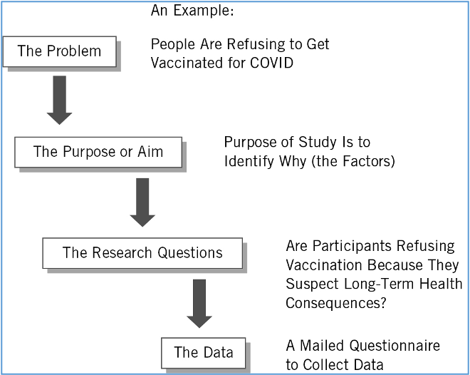

background-image: url(https://upload.wikimedia.org/wikipedia/en/6/6a/Logo_of_the_University_of_Sydney.svg)
background-size: 95%

```{r setup, include=FALSE}

knitr::opts_chunk$set(echo = TRUE, message = FALSE, warning = FALSE, 
                      dev = 'svg', out.width = "45%", fig.width = 6,
                      fig.align="center")

```

---

## Acknowledgement of Country

I would like to acknowledge the Traditional Owners of Australia and  recognise their continuing connection to land, water and culture. The  University of Sydney is located on the land of the Gadigal people  of the Eora Nation. I pay my respects to their Elders, past and present.


---


## Course outline

.pull-left[

**Week 1**: Introduction

**PART I PRELIMINARY CONSIDERATIONS (Weeks 2-5)**

**Week 2**: The Selection of a Research Approach

**Week 3**: Review of the Literature

**Week 4**: The Use of Theory

**Week 5**: Writing Strategies and Ethical Considerations + Guest lecture w/t Christopher Pepin-Neff 

**PART II DESIGNING RESEARCH (Weeks 6-12)**

**Week 6**: The Introduction **no seminar** (public holiday)

⏸️ *Mid Semester break* ⏸️

]

.pull-right[


**Week 7**: The Purpose Statement 👈

**Week 8**: Research Questions and Hypotheses + Guest Lecture w/t Charles Robert Butcher 

**Week 9**: Quantitative Methods

**Week 10**: Quantitative Methods: Data Analysis Lab (Make sure you install R and RStudio)

**Week 11**: Qualitative Methods + Guest lecture w/t Peter Chen

**Week 12**: Mixed Methods Procedures + Guest lecture w/t Assel Mussagulova

**Week 13**: Conclusions


]

---

## Today's class

| Time        | Content               |
|-------------|-----------------------|
| 1:00 - 1:20 | The Introduction      |
| 1:20 - 1:50 | Group Task            |
| 1:50 - 2:00 | The Research Problem  |
|             | Check-in              |
| 2:00 - 2:30 | The Purpose Statement |
| 2:30 - 3:00 | Individual Task       |


---

class: inverse, center, middle

# Chapter 5

# The Introduction

.center[Slides adapted from Creswell, Research Design 6e, SAGE Publishing, 2023 for GOVT6139 Research Design.

Do not reshare]

---

## Chapter 5 Learning Objectives

1. Construct a good abstract for a study with five key components.

2. Describe reasons for an introduction’s role as a key feature of a study.

3. Compare an introduction for a qualitative, quantitative, and mixed methods study.

4. Describe the four components of a good introduction to a study.


---

## Introduction to a Study

### Proposal introduction has five components:

1. **Establishing the problem** leading to the study
2. **Reviewing the literature** about the problem
3. Identifying **deficiencies** (gaps?) in the literature about the problem 
4. Targeting an **audience** and noting the significance
5. Identifying the **purpose** of the proposed study

---

## The Importance of Introductions

.pull-left[


* The introduction is the initial passage in a study or proposal that
  * Sets the stage for the project
  * Creates reader **interest** in the topic
  * Establishes the **problem** leads to the study
  * Places the study **within the larger literature**
  * Reaches out to a **specific audience**
  
]

.pull-right[


* A **research problem** is the problem or issue that leads to the need for a study
* Sources
  * Personal experience
  * Debate in the literature
  * Gaps that need to be addressed
  * Policy debates

]

---

## An Abstract for a Study

* A **brief summary** of the contents of a study

* Allows the reader to **quickly** survey the **essential elements** of the study

* Components

  1. Issue or problem
  2. Purpose of the study
  3. What data that will be collected
  4. Themes, statistical results, or mixed methods integrated findings that are likely
  5. Practical implications of the study
  
  
---

## Group Task

> Choose one of the three abstracts provided on the task sheet. Highlights the **five components** that you find in the abstract. What elements are present, and what elements are missing?

.pull-left[

1. Issue or problem
2. Purpose of the study
3. What data that will be collected
4. Themes, statistical results, or mixed methods integrated findings that are likely
5. Practical implications of the study

You can work on the task sheet and then share it on Padlet.

]

.pull-right[

.center[</img>]

]


---

## A Model for an Introduction (Deficiencies model - of an introduction builds on gaps in the literature)

Table 5.1: Illustration of an Introduction to a Study with Annotated Markers of Components

| Component | Exploring the Conceptions and Misconceptions of Teen Smoking in High Schools: A Multiple Case Analysis |
| --- | --- |
| **The Topic**<br /><br />**The Research Problem** | Tobacco use is a leading cause of cancer in American society (McGinnis & Foefe, 1993). Although smoking among adults has **declined in recent years**, it has actually **increased for adolescents**. The Centers for Disease Control and Prevention reported that smoking among high school students had risen from 27.5 percent in 1991 to 34.8 percent in 1995 (USDHHS, 1996). Unless this trend is dramatically reversed, **an estimated 5 million of our nation’s children will ultimately die** a premature death (Centers for Disease Control and Prevention, 1996).	<br /> |

---

| Component | Exploring the Conceptions and Misconceptions of Teen Smoking in High Schools: A Multiple Case Analysis |
| --- | --- |
| **Evidence from Literature Justifying Problem** | **Previous research** on adolescent tobacco use has focused on four primary topics. Several studies have examined the question of the initiation of smoking by young people, noting that tobacco use initiation begins as early as junior high school (e.g., Heishman et al., 1997). **Other studies** have focused on the prevention of smoking and tobacco use in schools. This research has led to numerous school-based prevention programs and interventions (e.g., Sussman, Dent, Burton, Stacy, & Flay, 1995). **Fewer studies** have examined “quit attempts” or cessation of smoking behaviors among adolescents, a distinct contrast to the extensive investigations into adult cessation attempts (Heishman et al., 1997). **Of interest**, as well, to researchers studying adolescent tobacco use has been the social context and social influence of smoking (Fearnow, Chassin, & Presson, 1998). For example, adolescent smoking may occur in work-related situations, at home where one or more parents or caretakers smoke, at teen social events, or at areas designated as “safe” smoking places near high schools (McVea et al., in press).	<br /> |


.center[.content-box-yellow[
Note the thematic division of the literature review
]]

---


| Component | Exploring the Conceptions and Misconceptions of Teen Smoking in High Schools: A Multiple Case Analysis |
| --- | --- |
| **Deficiencies in Evidence** | **Minimal research attention has been directed** toward the social context of high schools as a site for examining adolescent tobacco use. During high school, students form peer groups which may contribute to adolescent smoking. Often peers become a strong social influence for behavior in general, and belonging to an athletic team, a music group, or the “grunge” crowd can impact thinking about smoking (McVea et al., in press). Schools are also places where adolescents spend most of their day (Fibkins, 1993) and are available research subjects. Schools provide a setting for teachers and administrators to be role models for abstaining from tobacco use and enforcing policies about tobacco use (OHara et al., 1999). **Existing studies** of adolescent tobacco use **are primarily quantitative** with a focus on outcomes and transtheoretical models (Pallonen, 1998). **Qualitative investigations, however**, provide detailed views of students in their own words, complex analyses of multiple perspectives, and specific school contexts of different high schools that shape student experiences with tobacco (Creswell, in press). **Moreover, qualitative inquiry** offers the opportunity to involve high school students as co-researchers, a data collection procedure that can enhance the validity of student views uncontaminated by adult perspectives.	<br /> |

.center[.content-box-yellow[
Note the identification of a deficiency in our current knowkledge: insights are primarily generated by quantitative research - but a qualitative approach can add something to this.
]]

---

.center[.content-box-yellow[
Why should we use a qualitative approach?
]]

| Component | Exploring the Conceptions and Misconceptions of Teen Smoking in High Schools: A Multiple Case Analysis |
| --- | --- |
| **Importance of Problem for Audiences** | By examining these multiple school contexts, using qualitative approaches and involving students as co-researchers, **we can better understand** the conceptions and misconceptions adolescents hold about tobacco use in high schools. With this understanding, researchers can **better isolate variables** and develop models about smoking behavior. Administrators and teachers can plan interventions to prevent or change attitudes toward smoking, and school officials can assist with smoking cessation or intervention programs. |

---

## The Research Problem 

* Begins with narrative hook

* Easily understood by many readers (Audience!)

* Builds readers’ interest through reference to study participants or posing questions

* Clearly **identify the issue(s) or problem(s)** that lead to a need for the study

* Indicate **why the problem is important** by citing numerous references


---

## Evidence from the Literature: Justifying the Problem

* Not a complete literature review as in the full literature review (Chapter 2, and in a proposal usually in a different, dedicated section)

* The literature review in the introduction serves to

  * Justify the importance of the problem
  * Create distinctions between past studies and the proposed study
  * Set the research problem within ongoing dialogue in the literature
  
.blockquote[ 
#### Tips to consider when reviewing the literature for the introduction:
* Summarize groups of studies not individual ones
* Use in-text referencing to remove the emphasis on any one study
* Review studies that use quantitative, qualitative, and mixed methods approaches
* Use recent studies (last 10 years) and older studies that are of value

]

---

## Deficiencies in the Evidence

* Deficiencies in past literature **may exist because**
  1. The topic has not been explored with a particular group, sample, or population
  2. The literature needs to be replicated with new people or sites or countries
  3. The voice of underrepresented groups has not been heard in published literature
  
* **Discuss how** proposed study will
  * Remedy or address the deficiencies
  * Provide a unique contribution
  
* Consider including:
  * reasons the study **adds** to the scholarly literature
  * reasons the study helps to **improve practice**
  * reasons the study will **improve policy**

---

# Summary (Chapter 5)

* The introduction incorporates the research problem
* Four-part deficiencies model
  1. Research problem (narrative hook)
  2. Evidence from the literature justifying the problem
  3. Deficiencies in the evidence
  4. The importance of the problem for audiences
  
---

class: segue-yellow

# Check-in
  
---

class: inverse, center, middle

# Chapter 6

# The Purpose Statement

.center[Slides adapted from Creswell, Research Design 6e, SAGE Publishing, 2023 for GOVT6139 Research Design.

Do not reshare]

---

## Chapter 6 Learning Objectives

1. Describe the relationship among the problem, the purpose statement, and the research questions.

2. In writing a purpose statement (or study aim) for a qualitative study, identify the three major components.

3. Identify the central phenomenon in a qualitative purpose statement.

4. State a quantitative purpose statement with variables and their relationships.

5. Describe the four essential components of a mixed methods purpose statement. (Not covered in class, refer to textbook)

---

## What is the Purpose (or Study Aim) Statement ? 

__Purpose statement__ **establishes the intent** of the entire study

* Most important statement in the entire study

* In articles, final statement in introduction

* In theses and dissertations, stand alone section

.pull-left[
### The purpose statement
  * Indicates **why** you want to do **the study**
  * Indicates **what** you intend **to accomplish**
  * Is the **central controlling idea** in a study
  * Is written in a sentence or several sentences
  * Sets the objectives, the intent, or the major idea of a proposal or a study
]

.pull-right[
.content-box-red[
### The purpose statement IS NOT
  * The problem leading to a need for the study (see Chapter 5)
  * The questions to be answered by collecting data
  ]
]

---

## Figure 6.1: Relationship Among the Problem, the Purpose (Aim), the Research Questions, and the Data

.center[</img>]

---

## Qualitative purpose statement

* A good qualitative purpose statement **contains**

  * The **central phenomenon**
  * The **participants**
  * The **research site**
  
* Include language drawn from qualitative inquiry

  * Use words such as purpose, intent, or objective to signal attention to this statement as the central controlling idea
  
  * Focus on a single phenomenon, narrows the study to one idea
  
  
---

## Qualitative purpose statement: Example

.blockquote[

The purpose of this .content-box-yellow[( _strategy of inquiry, such as ethnography, case study, or other type_ )] study is  .content-box-yellow[_(was? will be?_ )] to .content-box-yellow[( _understand? explore? develop? discover?_ )] the .content-box-yellow[( _central phenomenon being studied_ )] for .content-box-yellow[( _the participants, such as the individual, groups, organization_ )] at  .content-box-yellow[( _research site_ )]. 

At this stage in the research, the .content-box-yellow[( _central phenomenon being studied_ )] will be generally defined as .content-box-yellow[( _provide a general definition_ )].

]

---

In this example from the textbook (Example 6.1) ...

> The inquiry, as part of uncovering meaning, articulated “essences” of meaning in mothers’ lived experiences when their wished-for babies died. Using the lens of the feminist perspective, the focus was on mothers’ memories and their “living through” experience. This perspective facilitated breaking through the silence surrounding mothers’ experiences; it assisted in articulating and amplifying mothers’ memories and their stories of loss. Methods of inquiry included phenomenological reflection on data elicited by existential investigation of mothers’ experiences, and investigation of the phenomenon in the creative arts. 


.content-box-green[

In which sentence does the author disclose the central **phenomenon** explored in the study?

]

.pull-left[.center[</img> ]]
.pull-right[or https://www.menti.com/alpimxhp15af]

---

<div style='position: relative; padding-bottom: 56.25%; padding-top: 35px; height: 0; overflow: hidden;'><iframe sandbox='allow-scripts allow-same-origin allow-presentation' allowfullscreen='true' allowtransparency='true' frameborder='0' height='315' src='https://www.mentimeter.com/app/presentation/altu6ruakaopr8xatf6b7c8vktghbn7m/embed' style='position: absolute; top: 0; left: 0; width: 100%; height: 100%;' width='420'></iframe></div>

---

## A quantitative purpose statement

* Differs from the qualitative purpose statement in terms of language and focus
* Includes
  * The **variables and their relationship**
  * The **participants**
  * The **research site**
  
.blockquote[
The purpose of this .content-box-yellow[( _experiment? survey?_ )] study is .content-box-yellow[( _was? will be?_ )] to test the theory of .content-box-yellow[( _what theory?_ )]  that .content-box-yellow[( _compares? relates?_ )] the .content-box-yellow[( _independent variable_ )] to .content-box-yellow[( _dependent variable_ )], controlling for .content-box-yellow[( _mediating or moderating variables_ )] for .content-box-yellow[( _participants_ )] at .content-box-yellow[( _the research site_ )]. The independent variable(s) .content-box-yellow[( _what variable?_ )] will be defined as .content-box-yellow[( _provide a definition_ )]. The dependent variable(s) will be defined as  .content-box-yellow[( _provide a definition_ )], and the control and intervening variable(s),  .content-box-yellow[ ( _identify intervening variables_ )]  will be defined as .content-box-yellow[( _provide a definition_ )].
]

---

## A Mixed Methods Purpose Statement 

* Contains
  * The **overall intent** of the study
  * **Information about both** the quantitative and qualitative strands of the study
  * A **rationale for combining** quantitative and qualitative strands
  
__A mixed methods purpose statement for Convergent design__:
  
.blockquote[
This mixed methods study will address .content-box-yellow[ [overall content aim] ]. A convergent mixed methods design will be used, and it is a type of design in which qualitative and quantitative data are collected in parallel, analyzed separately, and then merged. In this study, .content-box-yellow[ [quantitative data] ] will be used to test the theory of .content-box-yellow[ [the theory] ] that predicts that .content-box-yellow[ [independent variables] ] will .content-box-yellow[ [positively, negatively] ] influence the .content-box-yellow[ [dependent variables] ] for .content-box-yellow[ [participants] ] at .content-box-yellow[ [the site] ]. The .content-box-yellow[ [type of qualitative data] ] will explore .content-box-yellow[ [the central phenomenon] ] for .content-box-yellow[ [participants] ] at .content-box-yellow[ [the site] ]. The reason for collecting both quantitative and qualitative data is to .content-box-yellow[ [the mixing reason] ].
]


---

# Summary (Chapter 6)

* Importance of a purpose statement

* Advances central idea in a study

* Qualitative, quantitative, and mixed methods purpose statements differ


---

## Individual task 

### Writing Exercise

Write a purpose statement for your research proposal and (optionally) share it on Padlet. 


.center[</img><br/>]


---

# Thank you! 

Remember to submit your Research design for peer-review by tonight!


    


