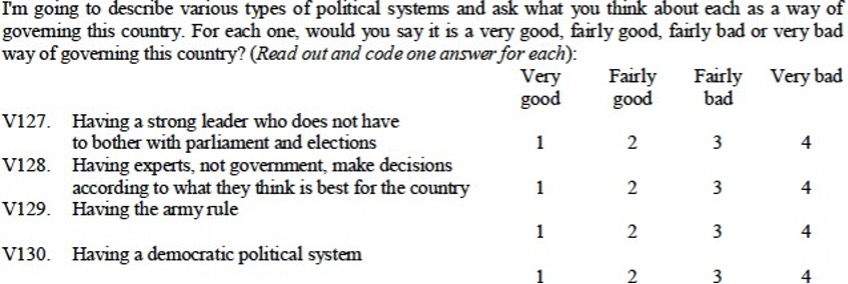
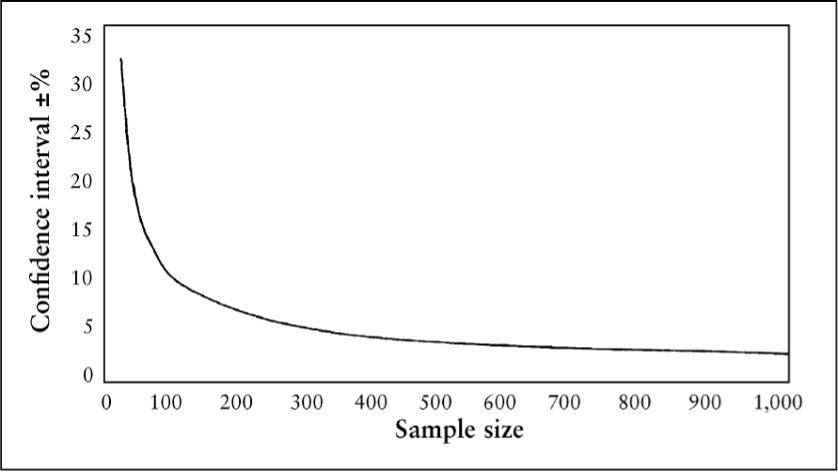

background-image: url(https://upload.wikimedia.org/wikipedia/en/6/6a/Logo_of_the_University_of_Sydney.svg)
background-size: 95%

```{r setup, include=FALSE}

knitr::opts_chunk$set(echo = TRUE, message = FALSE, warning = FALSE, 
                      dev = 'svg', out.width = "45%", fig.width = 6,
                      fig.align="center")

```

---

## Acknowledgement of Country

I would like to acknowledge the Traditional Owners of Australia and recognise their continuing connection to land, water and culture. The  University of Sydney is located on the land of the Gadigal people  of the Eora Nation. I pay my respects to their Elders, past and present.

---

## Course outline

.pull-left[

Week 1: Introduction

Week 2: Foundations: Ontology and Epistemology

Week 3: Research Design (I): Questions, Theories, Hypotheses, Variables, Measurements

Week 4:	Research Design (II): Case selection

Week 5: Research Design (III): Causal Inference

Week 6: Qualitative Methods (I): Data Collection 

Week 7: Qualitative Methods (II): Data Analysis 

]

.pull-right[

⏸️ *Mid Semester break* ⏸️

<mark>Week 8: Quantitative Methods (I): Data Collection</mark> 

*Week 9: 🎉 Public holiday 🎉*

Week 10: Quantitative Methods (II): Data Analysis 

Week 11: Quantitative Methods (II): Data Analysis lab

Week 12: Research Proposal: Peer Feedback Workshop Week 

Week 13: New frontiers and Conclusions

]

---

## Today's class

- Introduction to quantitative methods

- Quantitative Data Collection: Surveys

    - What are surveys?
    - Asking survey questions
    - Selecting a sample
    - Sample size
    - Survey mode (phone / mail / online / in-person)
    - Can we trust survey research? What about election polling?
    
---

# Week 12: Peer feedback workshop

### Part 1: 5-minute project presentation (45 minutes)

- Prepare to present your research proposal in five minutes.

- You are encouraged to preliminary share supporting materials using the [Canvas Group](https://community.canvaslms.com/t5/Canvas-Basics-Guide/What-are-Groups/ta-p/16) page for Week 12 (e.g. a one or two slide deck, or a one-page document). 

- In groups of four, each student will present for five minutes - I will be strict with the timing - and then receive questions and comments for another five minutes.

- You are encouraged to keep discussing this on the Canvas groups page after class.

---

# Week 12: Peer feedback workshop

### Part 2: Brain storm on the issues you have identified with the presentations you reviewed (30 minutes)

- Prepare a (short) list of issues to discuss with your group (but avoid offering details that could identify the proposal you have reviewed). 

- In the same groups of four, discuss the issues and possible solutions for about 20 minutes.

- Report on your discussion using Padlet (same as before, avoid offering details that could identify specific proposals): list issues and possible solutions.  

---

# Introduction to quantitative methods

---

## Quantitative methods mostly draws upon positivist

Key assumptions:

**Foundationalist ontology**

- The world exists independently of our observations

- There is an ultimate and knowable truth

**Positivist epistemology**

- Can establish ‘real’ relationships between social phenomena

- Can study these relationships via observation

- Objective (researcher’s interpretation should not determine the results)

- Interested in generalisability and causality

---

## Types of quantitative data in political science

**Primary and Secondary Data**

- Collected by the researcher (primary)

- Collected by someone else (secondary)

1. Surveys
    - Data on individual attitudes and reported behaviors

2. Country-level data
    - Economic conditions
    - Measures of how democratic a country is

3. Content analysis
    - E.g. coding newspaper articles, social media posts

4. Data from Experiments
    - Survey, lab or field experiments

---

## Why use quantitative methods?

#### Generalizability
- Results can be representative of the population studied (if designed to be)
- Comparability, e.g. comparisons cross-nationally, between states, over time, across sub-groups - by gender, race, age-group etc.

#### Assessing relationships between variables
- Are two variables related?
- e.g. are young people less satisfied with democracy?
- Does X cause Y?
- e.g. did frequent changes of Prime Minister cause Australians to become less satisfied with democracy?

#### Scope
- Possible to be broad in scope, can look at a whole country, or even comparisons across many countries.
- Can do large-N research using quantitative methods – that wouldn’t be feasible using qualitative methods.

---

# Quantitative Data Collection: Surveys

## 1.	What is a survey

## 2.	Asking survey questions

## 3. Selecting a sample

## 4. Sample size

---

## 1.	What is a survey

---

## 1.	What is a survey

#### Definition
Data collection tool used to gather information about individuals
It takes a sample of a larger population, asking questions, and recording the answers
Note: Unit of Analysis = individuals
#### Purpose
To collect original data for describing a population too large to observe directly
#### What do Survey Researchers do?
Sample many respondents who answer the same questions;
They then analyse the data to look at:
- Average responses to survey questions
- Relationships between variables (e.g. age group and attitudes towards democracy)
- Test theories and hypotheses about attitudes / behaviours

---

## Surveys vs Interviews

#### Fundamental differences

- A survey research (or “polling”) takes a sample of the population, asks questions, records the answers, and examines the distribution of answers.
- An interview research focuses on specific individuals (e.g., government officers), ask questions, record the answers, and examine the opinions and attitudes of specific individuals.

#### Stylistic differences

- In survey research, each respondent is treated equally, but in an interview, each interviewee is usually treated differently.
- The sequence of questions is pre-determined in survey research, but can be flexibly modified in an interview research.
- Most questions are close-ended in survey research, but are open-ended in an interview research.
- Surveys are usually analyzed with statistics, interviews are usually interpreted qualitatively.

---

## How do we go about survey research?

1. Developing a survey questionnaire

2. Selecting a sample (who / how many?)

3. Selecting a survey mode (e.g. phone / mail / online / in- person)

4. Field the survey

5. Analyse the data (After the break!)

---

## 2.	Asking survey questions

#### Open vs. Closed Questions
- Closed: Respondents are given all of the possible answers (mostly used in surveys)
- Open: Respondents are given a more general question and asked to articulate their own answers (often used in interviews)

#### Writing good survey questions
- Keep it clear and avoid confusion
- Keep the respondent’s perspective in mind
- Give the researcher valid measures (does the concept match the measure?)

#### Other considerations
- How many questions?
- Consistency in question wording: to enable comparisons between countries / over time.

---

## Asking survey questions: Things to Avoid

- Avoid jargon, slang, abbreviations
- Avoid ambiguity, confusion, and vagueness
- Avoid emotional language
- Avoid double-barreled questions (two or more questions bound together)
- Avoid leading questions
- Avoid asking questions that are beyond respondent’s capabilities
- Avoid asking about future intentions
- Avoid double negatives
- Avoid overlapping or unbalanced response categories

---

## Example survey question: Is this a good question?

> Do you agree or disagree with the following statement: "The federal government has gotten totally out of control and threatens our basic liberties unless we clear house and commit to drastic change"

--

Problems with the question:

--

- Double (or triple/quadruple) barreled question

--

- Emotional language

--

- Vagueness / ambiguity – e.g. what do they mean by ‘clear house’ and ‘drastic change’

---

## Example survey question: Is this a good question?

> How serious a threat do you think global warming will pose to you or your way of life in your lifetime? 
> 1. Very serious
> 2. Farily serious
> 3. Not very serious
> 4. Not at all serious

(Source: Australian Election Study survey)

---

## Example survey question: Is this a good question?

</img>


(Source: World Values Survey 2012)

---

## What questions do we put in our survey?

#### Theory testing

Example: Are young people less interested in politics?

- **Independent variable** (the presumed cause): Age
- **Dependent variable** (the presumed effect): Interest in politics
- **Control variables**: e.g. education level, gender

<mark>We’d ask questions about our variables of interest to be able to examine the relationship between variables</mark>

---

## What questions do we put in our survey?

#### How many questions to ask?

- Common to include questions that will be relevant for many researchers in the one survey

- More questions = more variables = more that can be done with the data

- However, the longer the questionnaire, the more likely some respondents might not complete the survey

---

## 3. Selecting a sample

---

## Sampling: Who is asked to complete the survey?

#### Rationale
- Making inferences about a population from a sample
#### Terminology
- Population; Sampling Frame; Sample
#### Sample Designs
- Probability Samples
- Non-Probability Samples

---

## What is a sample

.center[</img>]

---

## What is a sample? Example

#### Population: 

- Every student in GOVT6139

#### Sample: 

Each and every group we created for the in-class tasks

.center[</img>]

---

## How do we go from population to sample? The Sampling frame

- To select a sample from our population we first need a sampling frame
- The sampling frame is the list of all the units (e.g. people) in the population
- Ideally, the sampling frame would be a list of every member of the population, e.g.
    - List of all adults in Australia
    - List of all uni students at USYD
    - List of all students in GOVT6139
- In reality this isn’t always possible
 - Need list as close to the population as possible, e.g.:
 - List of enrolled voters
 - List of phone numbers
 - List of addresses

---

# Once we have our sampling frame, who do we select to be part of the sample?

#### Probability Samples
Those within the sampling frame have an equal chance of being selected into the sample
- Simple random sample (this is the gold standard)
- Modifications (e.g. cluster sampling, systematic, stratified)
- **Can make inferences to the population**

#### Non-probability Samples
Those within the sampling frame have a non-equal chance of being selected into the sample
- Convenience sample / street corner sample
- Online ‘opt-in’ surveys
- **Cannot make inferences to the population**

---

## Simple random sample

1. Probability sample

2. List of the population (sampling frame)

3. Assign a number to everyone in the list

4. Randomly select numbers (e.g. via random number generator)

**Those randomly selected are your sample**

---

### Note on terminology: Random selection vs. random assignment

#### Random selection
- ‘Refers to the process of randomly selection individuals from a population to be involved in a study.
- Used in survey research to obtain a sample representative of the population of interest

#### Random assignment
- ‘Refers to the process of randomly assigning the individuals in a study to either a treatment group or a control group.’
- Used in experimental research to ensure the treatment and control group will be the same.

.center[</img>]

---

## Cluster Sampling

.pull-left[

.center[</img>]

]

.pull-right[

- Probability sample

- Randomly select clusters (e.g. districts within the United States)

- Within the selected clusters, randomly select people to be included in the sample

*Why/when would we use this approach instead of a simple random sample?*

- If doing a face to face survey in a large country (e.g. Australia / USA) more feasible – cost/time.


]

---

## Non-probability sample

- Non-random selection into sample

- E.g. online opt-in survey – why isn’t this ideal?

- E.g. street corner sample – why isn’t this ideal?


**Cannot make inferences to the population from a non- probability sample**

---

## 4. Sample size

---

## How many people do we select to be part of our sample?

#### Law of large numbers

–	 The larger your sample size, the closer the sample mean (average) will be to the population mean (but only *if the sample is a random sample*)

–	What happens if we flip a coin once, ten times, 100 times, 1000 times?

```{r echo = FALSE, message = FALSE, fig.width = 5, fig.height=2, out.width = "100%"}

require(tidyverse)

tossFun <- function(x) {
  mean(rbinom(n = x, size = 1, prob = .5))
}

my_seq <- 
  round(seq(from = 1, to = 1000, length.out = 1000))

res <- 
  sapply(my_seq, tossFun)

data.frame(x = my_seq,
           y = res) %>%
  ggplot(aes(x, y)) +
  geom_line() +
  theme_bw() +
  labs(x = 'Numbers of tosses of a fair coin (average result)', y = NULL) +
  scale_y_continuous(limits = c(0, 1))


```

---

#### Law of large numbers

```{r echo = FALSE, message = FALSE, fig.width = 5, fig.height=3, out.width = "100%"}

require(tidyverse)

tossFun <- function(x) {
  mean(rbinom(n = x, size = 1, prob = .5))
}

my_seq <- 
  round(seq(from = 1, to = 50000, length.out = 1000))

res <- 
  sapply(my_seq, tossFun)

data.frame(x = my_seq,
           y = res) %>%
  ggplot(aes(x, y)) +
  geom_line() +
  theme_bw() +
  labs(x = 'Numbers of tosses of a fair coin (average result)', y = NULL) +
  scale_y_continuous(limits = c(0, 1))


```

---

## Sample size and margin of error

If your sampling is truly random, you should expect this trend:

* The larger the sample, the narrower the confidence interval (i.e. the expected precision of your result)

* Yet, with a diminishing benefit: at a certain point, increasing your sample size will stop capturing significantly more diversity of your population.  

.center[</img>]

---

## Common misconception

#### If I wasn’t surveyed how can the results be representative of the population?
–	If the survey:
•	Uses probability sampling (random selection)
•	And the sample is drawn from a sampling frame that is very close to a list of all members of the population
•	And has a sufficiently large number of observations (e.g. 1000- 2000 is common for national surveys).
•	And ideally has a high response rate.
–	Then survey results for the sample should come very close to the population
–	But still with a small margin of error so depends on how precise estimates need to be.

