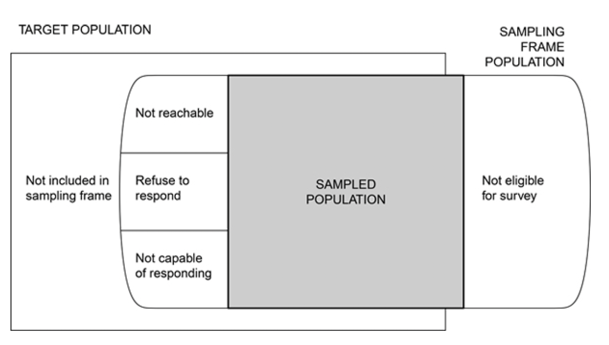
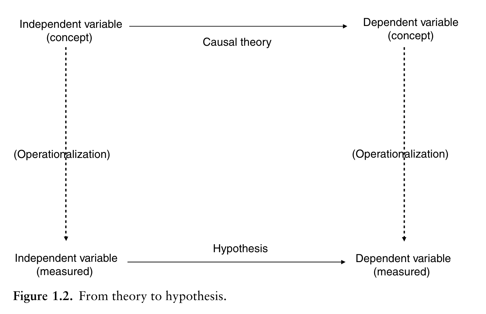
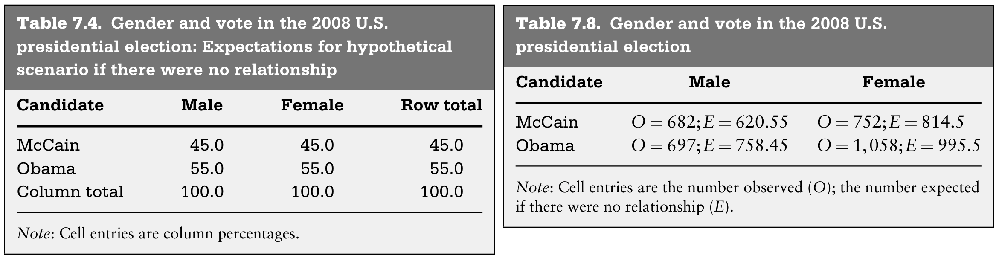

background-image: url(https://upload.wikimedia.org/wikipedia/en/6/6a/Logo_of_the_University_of_Sydney.svg)
background-size: 95%

```{r setup, include=FALSE}

knitr::opts_chunk$set(echo = TRUE, message = FALSE, warning = FALSE, 
                      dev = 'svg', out.width = "45%", fig.width = 6,
                      fig.align="center")

options(scipen = 999)
```

---

## Acknowledgement of Country

I would like to acknowledge the Traditional Owners of Australia and  recognise their continuing connection to land, water and culture. The  University of Sydney is located on the land of the Gadigal people  of the Eora Nation. I pay my respects to their Elders, past and present.


---


## Course outline

.pull-left[

**Week 1**: Introduction

**PART I PRELIMINARY CONSIDERATIONS (Weeks 2-5)**

**Week 2**: The Selection of a Research Approach

**Week 3**: Review of the Literature

**Week 4**: The Use of Theory

**Week 5**: Writing Strategies and Ethical Considerations + Guest lecture w/t Christopher Pepin-Neff 

**PART II DESIGNING RESEARCH (Weeks 6-12)**

**Week 6**: The Introduction **no seminar** (public holiday)

⏸️ *Mid Semester break* ⏸️

]

.pull-right[


**Week 7**: The Purpose Statement 

**Week 8**: Research Questions and Hypotheses + Guest Lecture w/t Charles Robert Butcher 

**Week 9**: Quantitative Methods 👈

**Week 10**: Quantitative Methods: Data Analysis Lab (Make sure you install R and RStudio)

**Week 11**: Qualitative Methods + Guest lecture w/t Peter Chen

**Week 12**: Mixed Methods Procedures + Guest lecture w/t Assel Mussagulova

**Week 13**: Conclusions


]


---

## Today's class

| Time         | Content                                    |
|--------------|--------------------------------------------|
| 1:00 - 1:10  | Quantitative approaches to data collection |
| 1:10 - 1:20  | Sampling                                   |
| 1:20 - 1:40  | Task 01 (Group)                            |
| 1:40 - 2:00  | Measurement                                |
| 2:00 - 2:30  | Analysis                                   |
|              | Check-in                                   |
| 2:30 - 3:00  | Task 02 (Individual)                       |


---

class: inverse, center, middle

# Chapter 8

# Quantitative Methods

---

# Today's Seminar Learning Objectives

## Quantitative methods

1. The three approaches to collecting data: observation, survey, experiment

2. Sampling: How do you do it?

3. Measurement: Operationalisation and variable construction  

4. Analysis: Bivariate hypothesis tests


---

class: segue

# 1. The three approaches to collecting data: observation, survey, experiment


---

### 1. Observational study (no intervention)

* Quantitative description and association of observed variables (e.g, country-level statistics, social media data, documents)

### 2. Survey design (asking questions, the workhorse of social sciences)

* Quantitative description of trends, attitudes, or opinions of a population
* Testing association
* Studying a sample of that population

### 3. Experimental Design (rarer in the social sciences)

* Systematic manipulation of one or more variables to evaluate an outcome
* Holds other variables constant to isolate effects
* Generalize to a broader population

---

### 1. The three approaches to collecting data: observation, survey, experiment

|                       | Observation | Survey | Experiment |
|-----------------------|-------------|--------|------------|
| Intervention          | NO          | YES    | YES        |
| Variable manipulation | NO          | NO     | YES        |


---
class: segue

# 2. Sampling: How do you do it?

---

### Sampling (obsernational study, survey or experiment)

.center[</img>]

* **Target population** The complete collection of observations we want to study.

* **Sample** A subset of a population.

* **Sampled population** The collection of all possible observation units that might have been chosen in a sample.

* **Sampling unit** A unit that can be selected for a sample. Documents, individuals, households.

* **Sampling frame** A list, map, or other specifiation of sampling units in the population from which a sample may be selected. A list of telephone numbers, street names, farms, documents.


.footnote[Lohr, S. L. (2021). Sampling: Design and Analysis. Chapman and Hall/CRC. https://doi.org/10.1201/9780429298899]


---

.center[</img>]

> **Target population** and **sampled population** in a *telephone survey* of *registered voters*. Some persons in the target population do not have a telephone or will not be associated with a telephone number in the sampling frame. In some households with telephones, the residents are not registered to vote and hence are not eligible for the survey. Some eligible persons in the sampling frame population do not respond because they cannot be contacted, some refuse to respond to the survey, and some may be ill and incapable of responding.

.footnote[Lohr, S. L. (2021). Sampling: Design and Analysis. Chapman and Hall/CRC. https://doi.org/10.1201/9780429298899]


---

Once you have defines your **sampling frame** and your **sample size** ($n$=sample size, $N$=population size), you can finally draw your **sample**. 

How do you do it in practice?


### Types of sampling

- **Random sampling**: You randomly (must be true randomness!) select from your sampling frame (i.e., list)

- **Convenience sampling**: You choose your sample based on convenience and access (more practical, but not ideal!)

---

## Population stratification

Your population is stratified based on characteristics of interest before sampling (e.g., gender, ethnicity). This gives more control on the representation of these characteristics in the final sample. 


.center[</img>]

.content-box-yellow[
Note: The allocation population-sample can be *proportionate* or *disproportionate*, if you want a larger proportion in your sample of some individuals because their characteristics present more variability.
]


---

class: segue-blue

# Task 1: Sampling

---

class: segue

# 3. Measurement: Operationalisation and variable construction  

---

### A quantitative study proves a theory by 

* testing an hypothesis,

* by measuring through operationalisation abstract concepts. 

.center[</img>]

.footnote[Kellstedt, P. M., & Whitten, G. D. (2013). The fundamentals of political science research. Cambridge University Press.]
---

### Instrumentation: In your proposal... (from the textbook)
<small>
* Name the survey instrument (e.g. telephone survey) used to collect data
* Indicate how instrument was developed
* Describe the established validity scores (e.g., questions/variables) from past use
  * Content validity
  * Predictive or concurrent validity
  * Construct validity
* Describe reliability of scores from past use
  * Internal consistency
  * Test-retest
* Discuss pilot testing or field-testing
  * Rationale for plans
  * Content validity and reliability
  * Improve question
* Steps for administering for a mailed survey
</small>
---

## Validity vs Reliability (from textbook)

### Validity: can you draw accurate inferences from scores on the instruments?

* **Construct validity**: Does the survey instrument accurately measure the hypothetical construct or concept it was intended to measure?

* **Concurrent or criterion validity**: Does the survey instrument associate with other gold-standard measures of the construct or predict a criterion measure?. 

.content-box-yellow[
Note: **Internal** and **external** validity *mostly* refers to experiment settings. Internal validity is about biases (e.g., selection bias) that can threaten *internal* inferences. External validity is about generalisation of findings outside of the sample, that is *external* inferences about individuals not in the sample.
]

### Reliability: using this instrument (i.e., question) can you consistently repeat the same measurement? 

---

class: segue

# 4. Analysis: Bivariate hypothesis tests

---

## Variable type and appropriate bivariate hypothesis tests 


> “Are X and Y related?” By definition – “bivariate” means “two variables” – these tests cannot help us with the important question, “Have we controlled for all confounding variables Z that might make the observed association between X and Y spurious?” 

(We will deal with Z next week!)

<table>
<thead>
  <tr>
    <th></th>
    <th></th>
    <th colspan="2">Independent variable type</th>
  </tr>
</thead>
<tbody>
  <tr>
    <td></td>
    <td></td>
    <td>Categorical</td>
    <td>Continuous</td>
  </tr>
  <tr>
    <td rowspan="2">Dependent variable type</td>
    <td>Catgorical</td>
    <td>Tabular analysis</td>
    <td>Probit/Logit</td>
  </tr>
  <tr>
    <td>Continuous</td>
    <td>Difference of means</td>
    <td>Correlation coefficient, <br>regression model</td>
  </tr>
</tbody>
</table>

.footnote[Kellstedt, P. M., & Whitten, G. D. (2013). The fundamentals of political science research. Cambridge University Press.]

---

## The Logic of $p$-Values (and statistical tests)

### Is there covariation between X and Y?

We can answer this question *statistically*, by

* **comparing** the actual (observed) **relationship** between X and Y in **sample data** with

* what **we would expect** to find **if** X and Y **were not related** in the **underlying population**.

Statistical tests (and $p$-values) are about this comparison.

> The p-value, which ranges between 0 and 1, is the probability that we would see the relationship that we are finding because of random chance. Put another way, the p-value tells us the probability that we would see the observed relationship between the two variables in our sample data if there were truly no relationship between them in the unobserved population.

> The **lower** the $p$-value, the **greater confidence** we have that there is a **systematic relationship** between the two variables for which we estimated the particular $p$-value.

.footnote[Kellstedt, P. M., & Whitten, G. D. (2013). The fundamentals of political science research. Cambridge University Press.]

---

## From $p$-Values to Statistical Significance

> Lower $p$-values increase our confidence that there is a relationship between the two variables in question. 

> A common way of referring to such a situation is to state that **the relationship between the two variables is statistically significant**.

<br/>

.content-box-red[

When is a relationship statistically significant? We have a number of arbitrary thresholds. 

* In the social sciences, we usually settle to a 0.05 value. That is,

* $p$-value $>0.05$ no statistical significance <large>😔</large>.

* $p$-value $\le 0.05$ statistical significance and publication <large>😀</large>.

]

.footnote[Kellstedt, P. M., & Whitten, G. D. (2013). The fundamentals of political science research. Cambridge University Press.]

---

## Beware of $p$-hacking

The arbitrary threshold at 0.05 creates some perverse incentive in variable selection and reporting so to make sure that your $p$-value will just below it... 

> The distribution of p-values [from 50,000 different tests] exhibits a camel shape with abundant p-values above .25, a valley between .25 and .10 and a bump slightly under .05.


.center[</img>]

.footnote[Brodeur, Abel and Brodeur, Abel and LÉ, Mathias and Sangnier, Marc and Zylberberg, Yanos, Star Wars: The Empirics Strike Back (June 18, 2012). Paris School of Economics Working Paper No. 2012-29, Available at SSRN: https://ssrn.com/abstract=2089580 or http://dx.doi.org/10.2139/ssrn.2089580]

---

## Tabular analysis (two categorical variables)

.center[</img>]

How do we test an hypothesis of association between gender and vote? 

Enter the chi-squared ( $\chi^2$ ) test for tabular association

$$ \chi^2 = \sum\frac{(O - E)^2}{E}$$


.footnote[Kellstedt, P. M., & Whitten, G. D. (2013). The fundamentals of political science research. Cambridge University Press.]
---

## Tabular analysis: Prepare the data with R

```{r}
# Create a matrix for the counts of each category
movie_data <- matrix(c(20, 50, 50, 30), nrow = 2, byrow = TRUE,
                     dimnames = list(Preference = c("Action", "Comedy"),
                                     Gender = c("Male", "Female")))

# Display the matrix
print(movie_data)
```

---

## Tabular analysis: Test for statistical association with R

```{r}
# Perform the chi-square test
chi_square_result <- chisq.test(movie_data)

# Print the results
print(chi_square_result)
```


---

## Difference of means (one categorical and one continuous variable)

> In this type of bivariate hypothesis test, we are looking to see if the means are different across the values of the independent variable.

Karl Pearson's $t$-test: 

$$ t = \frac{\bar{Y}_1-\bar{Y}_2}{se(\bar{Y}_1-\bar{Y}_2)} $$ where $se$ is the standard error.


.content-box-green[
Let's test this hypothesis: In the UK Labour-led cabinets last longer than Conservative-led cabinets.]
* $X$ = $party$ $\in \{Con, Lab\}$
* $Y$ = $duration$ $\in \{1,2,3,...\}$

.footnote[Kellstedt, P. M., & Whitten, G. D. (2013). The fundamentals of political science research. Cambridge University Press.]

---

## Difference of means: Import data with R

```{r echo = FALSE, eval = FALSE}
library(tidyverse)

dat <- 
  read_csv("https://www.parlgov.org/data/parlgov-development_csv-utf-8/view_cabinet.csv") %>%
  dplyr::filter(country_name == "United Kingdom" &
                  party_name_short %in% c("Con", "Lab"))

dat <-
  dat %>%
  dplyr::filter(prime_minister == 1) %>%
  mutate(duration_days = as.numeric(lead(start_date) - start_date))

write.csv(dat, file = "../data/uk_cabinets.csv", row.names = F)

```


```{r}
my_data <- 
  read.csv("https://raw.githubusercontent.com/fraba/GOVT6139/main/data/uk_cabinets.csv")
```


```{r echo = FALSE}
library(DT)
datatable(my_data, options = list(scrollX = TRUE, pageLength = 4))
```


---

## Difference of means: Visualise data with R (boxplot)

```{r fig.height=3, fig.width=4}
library(ggplot2)
ggplot(data = my_data, aes(x = party_name_short, y = duration_days)) + geom_boxplot()
```

---

## Difference of means: Visualise data with R (density) 

```{r fig.height=3, fig.width=7, out.width='80%'}
library(ggplot2)
ggplot(data = my_data, aes(x = duration_days, colour = party_name_short)) + geom_density()
```

---

## Difference of means: Visualise data with R (t-test) 

After visually inspecting the distribution of the data, let's run the t-test...

```{r}
t_test_result <- t.test(formula =  duration_days ~ party_name_short, data = my_data)
print(t_test_result)
```

**Hypothesis**: In the UK Labour-led cabinets last longer than Conservative-led cabinets.

**Result from statistical analysis**: Although on average Labour-led cabinets last longer (`r round(t_test_result$estimate, 2)`), we can't reject the null hypothesis of no statistical association (as the $p-value$ is `r round(t_test_result$p.value, 2)` $>0.05$).

---

## Correlation coefficient (two continuous variables)

Pearson’s correlation coefficient

$$ r = \frac{COV_{XY}}{\sqrt{VAR_XVAR_Y}} $$ 

.content-box-yellow[

Let's now test this hypothesis: The larger the proportion of seats in Parliament of the Prime Minister's party, the longer the duration of the cabinet.

]


.footnote[Kellstedt, P. M., & Whitten, G. D. (2013). The fundamentals of political science research. Cambridge University Press.]

--

```{r echo = FALSE}
library(DT)
datatable(my_data, options = list(scrollX = TRUE, pageLength = 2))
```

---

## Correlation coefficient (Code new variable and visualise)

```{r}
my_data$prop_seats <- my_data$seats / my_data$election_seats_total
```

(Note in R, I use `$` to access columns in a dataframe)


```{r fig.height = 3, fig.width=3, out.width="32%"}
ggplot(my_data, aes(x = prop_seats, y = duration_days)) + geom_point()
```

---

## Correlation coefficient (Pearson's test)

```{r}
cor_test_result <- cor.test(x = my_data$prop_seats, y = my_data$duration_days)
print(cor_test_result)
```


Statistical results:

* The two variables are **positively correlated** (cor = `r round(cor_test_result$estimate, 2)`); yet

* The two variables are not **significantly correlated** ( $p$-value = `r round(cor_test_result$p.value, 2)`).

We can't reject the null hypothesis of no association. 

---

# Summary 

1. The three approaches to collecting data: observation, survey, experiment.

2. Sampling: Targe population, Sample, Sampling frame.

3. Measurement: Operationalisation and variable construction.

4. Analysis: Using three bivariate hypothesis tests.

---

class: segue-clue

# Check-in

---

class: segue-red

# Individual task

---