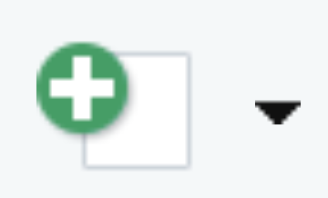
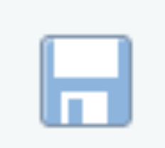
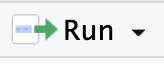
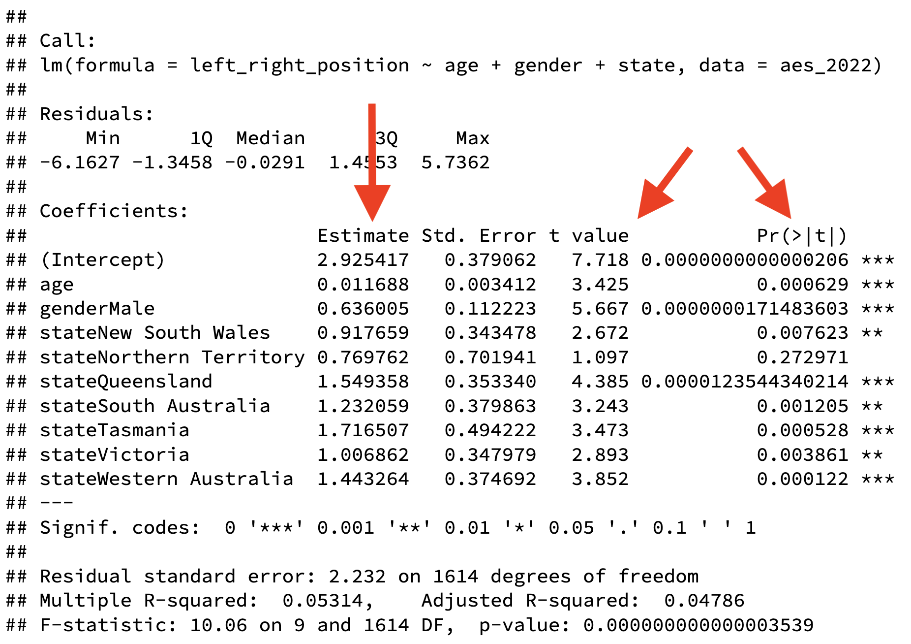
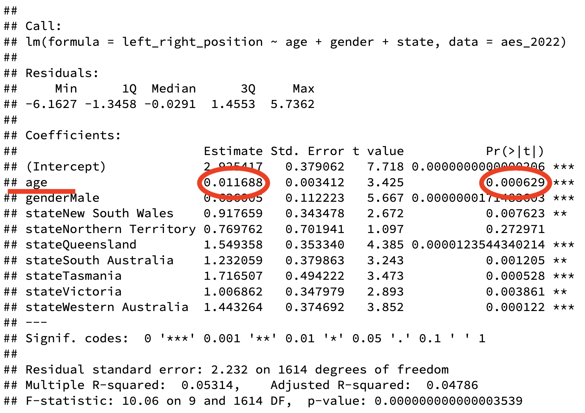
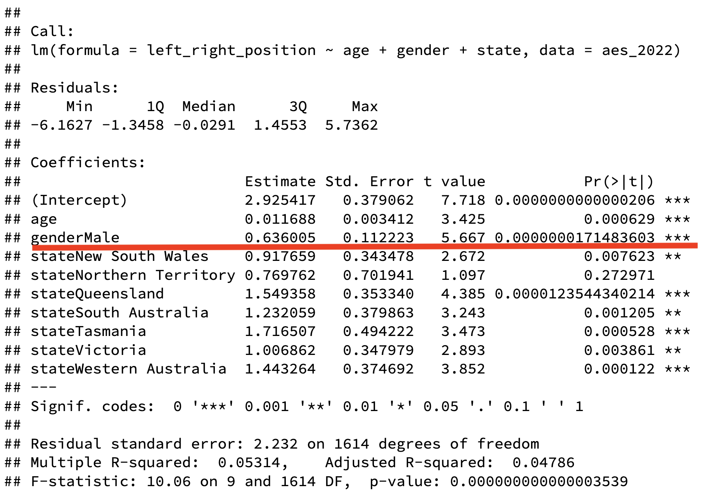
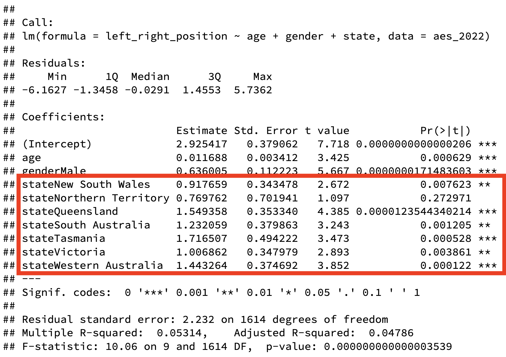

background-image: url(https://upload.wikimedia.org/wikipedia/en/6/6a/Logo_of_the_University_of_Sydney.svg)
background-size: 95%

```{r setup, include=FALSE}

knitr::opts_chunk$set(echo = TRUE, message = FALSE, warning = FALSE, 
                      dev = 'svg', out.width = "45%", fig.width = 6,
                      fig.align="center")

options(scipen = 999)
```

---

## Acknowledgement of Country

I would like to acknowledge the Traditional Owners of Australia and  recognise their continuing connection to land, water and culture. The  University of Sydney is located on the land of the Gadigal people  of the Eora Nation. I pay my respects to their Elders, past and present.


---


## Course outline

.pull-left[

**Week 1**: Introduction

**PART I PRELIMINARY CONSIDERATIONS (Weeks 2-5)**

**Week 2**: The Selection of a Research Approach

**Week 3**: Review of the Literature

**Week 4**: The Use of Theory

**Week 5**: Writing Strategies and Ethical Considerations + Guest lecture w/t Christopher Pepin-Neff 

**PART II DESIGNING RESEARCH (Weeks 6-12)**

**Week 6**: The Introduction **no seminar** (public holiday)

⏸️ *Mid Semester break* ⏸️

]

.pull-right[


**Week 7**: The Purpose Statement 

**Week 8**: Research Questions and Hypotheses + Guest Lecture w/t Charles Robert Butcher 

**Week 9**: Quantitative Methods 

**Week 10**: Quantitative Methods: Data Analysis Lab (Make sure you install R and RStudio) 👈

**Week 11**: Qualitative Methods + Guest lecture w/t Peter Chen

**Week 12**: Mixed Methods Procedures + Guest lecture w/t Assel Mussagulova

**Week 13**: Conclusions


]


---

class: inverse, center, middle

# Quantitative Methods: Data Analysis Lab (with R)


---

## Week 10 Learning Objectives

- Appreciate what R & Rstudio are and what they can do for you

With R and RStudio, learn how to

- Create, save and run an R script file

- Install new packages 

- Load data from Excel and CSV data files

- Visualise your variables

- Run bivariate and multivariate statistical tests

---

## Practical advise to follow this seminar

- Launch RStudio on your laptop

- Keep these slides open in on your computer (so you can copy/paste into RStudio) move to any slide if needed

- You don't need to understand or replicate everything during the seminar

- It's OK to feel a bit overwhelmed

<center><iframe src="https://gifer.com/embed/jU" width=240 height=134.88 frameBorder="0" allowFullScreen></iframe></center>

.content-box-yellow[ 

### `r icons::fontawesome("location-arrow")` The goal of this seminar is to gently walk you into what R could do for you. But this is not a crush course into R.

]


---
class:  segue-red

# R and RStudio

.center[ &nbsp; &nbsp; &nbsp;  ]


---

## R and RStudio

*  is an *objected-oriented* computer language, that is a "formal language used to communicate with a computer"). 

    * It is widely used among social scientists to work with data and statistical applications...
    
    * ... but it's a fully fledged computer language (so you can use it to send a rocket to Mars, if you want). 

--

*  is an application - formally, an integrated development environment (IDE) - designed to facilitate using R. 

    * RStudio comes in two versions: a desktop application and a server application (which you access from a browser)
    
---

## R and RStudio


Using a **car metaphor**...

.center[</img>]

.pull-left[

If  is the **engine**, 

]

.pull-right[
 is the **dashboard** (and the steering wheel). 
]


---

### Rstudio: Let's creat our first R script

.center[</img>]

---

### Rstudio: Let's creat our first R script

An R script is a text document that we can edit and save it for later use. 

An R script has a ".R" extension (sometimes lower-cased, ".r"). 

I contains our R code and it can be run by R.

When you open a new R script document it will be blank.

---

## RStudio user interface: How does it look?

After launching RStudio, you should see four windows. Each windows has a number of tabs (like in a web browser). The most important tabs are:

.pull-left[

After launching RStudio, you should see four windows. Each windows has a number of tabs (like in a web browser). The most important tabs are:

]

.pull-right[

.center[]

]

1. **Upper-left window**: Your source code appears in the **source editor**.

2. **Lower-left window**:  The **console**. Your R code will execute here. Code output (including errors and messages) is visualised here.

3. **Lower-right window**: Your local *files* and *plots* can be accessed from here. 

2. **Upper-right window**: This is a list of objects in your current **environment**.


---

### RStudio user interface: How does it look?


.center[</img>]

---

class: segue

# Create, save and run an R script file in RStudio

---

## RStudio: Running code from the editor

If you want to run some code (and for *run* we mean *write* the code, then ask run to *execute* it) you can add it to a new document in your **source editor**. 

In your **source editor** each tab represents a different document. These are text documents containing R code. 

You can write your code here and you can save your document containing the code for later use (with "File" then "Save") as you would save a Word document. 

Once you have a line of code you can *place your cursor* on the line and then hit "Run". 

#### By hitting "Run"...

1. You ask *RStudio* to copy paste your line into the **console**;

2. You ask *R* to execute your code. R will kindly do it and will print any outcome below your code directly in the **console**. 

3. If your code results in creating a *new object*, the object will now appear in the **environment** window.

---

### RStudio: Running code from the editor


.center[</img>]


---

## RStudio: Create and save a script

#### To create a new script 
- File -> New File -> R Script (or ).

#### To save a script
- File -> Save (or ). RStudio will automatically append .r or .R at the end of the filename. This is the extension of R scripts.

.content-box-red[Note: By saving a script you don't save any data!]

#### To run selectet lines 
- Cursor on line in open script and ; or 
- Highlight more lines in open script (these will be executed top-down) and .

---
class: segue 

# Install new packages

---

## Understand functions and objects


.pull-left[

.center[</img> </img> </img>]

* A **function** is a machine that can optionally take an *input* (a list of **arguments** in computer science) - and return an *output*.

* With the arrow `<-` we tell R where to store the *output* from the function. 

* In R information is stored in **objects**. The objects in the *environment* are of different **types** as they contain different type of information. They can be data or functions.

]

.pull-right[

.center[</img>]

]

---

## R packages

* R is open source and highly modular. 

* When you first install R, that installation comes with some base functions. But you definitely will need to more functions.

* Although you can create your functions, it would be great if you could use functions created by someone else... Well, you can!

.pull-left[

* By .content-box-yellow[installing] a **package** and .content-box-yellow[loading] it into your R environment you get access to

  1. Functions created by others;
  2. Documentation explaining how to use these functions; 
  3. Sometime, data. 

]

.pull-right[

<center></img></center>
]


---

### How do you install a new package?

- In your console, write `install.packages("tidyverse")` and hit return. This will install the package "tidyverse".
.content-box-yellow[Note: The name of the package will need to be quoted.]
- Alternatively, you can click on "Packages" in the lower-right window of RStudio and then "Install".
.content-box-yellow[Note: You only need to install the package once on your computer!]

### How to you load a package in R?
- To load a package, you type `library(tidyverse)` and hit return in your console. 
.content-box-yellow[Note: The name of the package will NOT need to be quoted this time.]

A common error that you might get is

> Error in some_function() : could not find function "some_function"

This means that the function was **misspelled** OR that the **package with that function hasn't been loaded yet**.

---

class: segue

# Load data from CSV and Excel data files

---

### Import the data from a CSV using RStudio

Top-left window: "Environment" -> "Import Dataset" -> "Import From Text (base)..." -> Check the import panel -> "Import"

.center[</img>]

---

## What happened? 

When we use the RStudio **import feature** (shown before), we are actually asking RStudio to write this code for us. 

```{r}

health <- read.csv("../data/health.csv")

```

After clicking "Import", you will see that code being executed in your console (of course with a different path to your file). 
.content-box-yellow[Note: You might want to copy/paste that code from the console into your script so that you can quickly replicate it in the future.]

This code does two things:

1. The **function** `read.csv()` read a comma-separated file (CSV) file, which we specify within the two parenthesis and the two quote signs.

2. The **assignment operator** `<-` take the result from the function and assign it to the object `health`.

RStudio will also run another function immediately after `View()` that view the data just loaded in a new tab. You can always view a dataset in your environment by clicking on it...

---

## View the data

.center[</img>]


---

class: segue-yellow

# Task: Try know to use the import feature to read in an Excel data file

(Top-left window: "Environment" -> "Import Dataset" -> "From Excel")


---

class: segue-red

# Visualise your variables

---

### Let's first read in some new data from the Australian Election Study survey of 2022...

.content-box-yellow[Note: You can download `aes_2022` from Canvas or read it directly from the Internet]

```{r}
aes_2022 <- read.csv("https://raw.githubusercontent.com/fraba/GOVT6139/main/data/aes_2022.csv")
```

Then let's have a look at the content with the `View()` function by clicking on the `aes_2022` in our environment

.pull-left[

#### Two variables are continuous (or numeric)

* `age`
* `left_right_position`

]


.pull-right[

#### Four variables are categorical

* `gender`
* `state`
* `most_important_issues_2022`
* `vote_2022`

]

---

### Let's summarise the content of each continuous variable with `summary()`

.content-box-green[

Note: To access a column in a data frame in R, we use the `$` dollar sign, like `name_dataframe$name_column`

]

```{r}
summary(aes_2022$age)
```

```{r}
summary(aes_2022$left_right_position)
```

---

### Let's summarise the content of each categorical variable with `table()`

```{r}
table(aes_2022$gender)
table(aes_2022$state)
```

---

```{r}
table(aes_2022$most_important_issues_2022)
table(aes_2022$vote_2022)
```


---

## Visualise data with ggplot2

* **ggplot2** is the most widely used package to visualise data in R. 
* It is effective for simple as well as very complex visualisation. 
* If you want to learn only one visualisation package, it should probably be ggplot2. 


.center[</img>]

---

## The logics of ggplot2

ggplot2 builds your visualisation by *mapping* 

* **variables** 

onto 

* **visual elements** or **aesthetics**: with the function `aes()` (e.g. lines, dots, colours, shapes, areas, labels, ect...) 


```{r eval = F}

ggplot(data = <data>, 
       mapping = aes(<aesthetic> = <variable>,
                     <aesthetic> = <variable>,
                     <   ...   > = <   ...  >))
# Don't run. Credit: Healy, 2018
 
```

---

## The basics of ggplot2

This creates a ggplot object, with all the instructions to map *variables* to *aesthetics.* But it won't visualise any data yet...

```{r out.width="40%", fig.width=4, fig.height=3}
library(ggplot2)

ggplot(data = aes_2022, 
       mapping = aes(x = left_right_position,
                     y = age))
```

---

### The basics of ggplot2

After we have specified `data = <data>` and `mapping = aes(...)`, we need to pass at least an additional *layer* specifying the *geometry* we want, so that ggplot2 can visualise the mapping.  

```{r out.width="40%", fig.width=4, fig.height=3}
library(ggplot2)

ggplot(data = aes_2022, 
       mapping = aes(x = left_right_position,
                     y = age)) +
  geom_point()
```

---

Or let's replace the `geom_point()` layer with `geom_jitter()`, which add a small amount of random variation... 

```{r out.width="35%", fig.width=4, fig.height=3}
library(ggplot2)

ggplot(data = aes_2022, 
       mapping = aes(x = left_right_position,
                     y = age)) +
  geom_jitter()
```

Do you see an association between the two variables? (We can test this hypothesis!)

---

## ggplot2 offers plenty of different geoms, dipending on what kind of variables you want to visualise.

You can refer to this [cheatsheet](https://www.maths.usyd.edu.au/u/UG/SM/STAT3022/r/current/Misc/data-visualization-2.1.pdf) for a full list. 

# Let's only review the most important...

---

### One variable: continuous x

```{r}
p <- ggplot(data = aes_2022, mapping = aes(x = left_right_position))
```

```{r out.width = "15%", fig.width=3, fig.height=3}
p + geom_density()
```

```{r out.width = "15%", fig.width=3, fig.height=3}
p + geom_histogram()
```

---

### One variable: categorical x

```{r}
p <- ggplot(data = aes_2022, mapping = aes(x = vote_2022))
```

```{r out.width = "25%", fig.width=3, fig.height=3}
p + geom_bar()
```

---

### Two variables: continuous x , continuous y 

```{r}
p <- ggplot(data = aes_2022, mapping = aes(x = left_right_position, y = age))
```

```{r out.width = "15%", fig.width=3, fig.height=3}
p + geom_point()
```

```{r out.width = "15%", fig.width=3, fig.height=3}
p + geom_jitter()
```

---

### Two variables: categorical x, continuous y 

```{r}
p <- ggplot(data = aes_2022, mapping = aes(x = gender, y = left_right_position))
```

```{r out.width = "15%", fig.width=3, fig.height=3}
p + geom_boxplot()
```

```{r out.width = "15%", fig.width=3, fig.height=3}
p + geom_col() # It sums values for each categories
```

---

### Two variables: categorical x, categorical y 

```{r}
p <- ggplot(data = aes_2022, mapping = aes(x = gender, y = vote_2022))
```

```{r out.width = "25%", fig.width=3, fig.height=3}
p + geom_count() # It sums values for each categories
```

Do we see any association? We can test this hypothesis too!
---

### Continuous function (e.g., date/year and some value)

Let's bring in some new data first...

```{r}
midterms <- read.csv("https://raw.githubusercontent.com/fraba/GOVT6139/main/data/midterms.csv")
```


```{r}
p <- ggplot(data = midterms, mapping = aes(x = year, y = seat.change))
```

```{r out.width = "25%", fig.width=3, fig.height=3}
p + geom_line()
```

---

class: segue-red

# Run bivariate and multivariate statistical tests

### Bivariate analysis

#### 1. Tabular analysis (two categorical variables)

#### 2. Difference of means (one categorical and one continuous variable)

#### 3. Correlation coefficient (two continuous variables)

### Multivariate analysis

#### 4\. Multivariate analysis (categorical and continuous variables predicting one continuous variables)

---

#### 1\. Tabular analysis (two categorical variables)

**Hypothesis**: In the 2022 federal election, women were more likely than men to vote for the Labor party.  

```{r out.width = "15%", fig.width=4, fig.height=3}
ggplot(data = aes_2022, mapping = aes(x = gender, y = vote_2022)) + geom_count()
```

```{r}
chisq.test(x = aes_2022$gender, y = aes_2022$vote_2022)
```

Figure and statistical test support this hypothesis. 

---

## Introducing formulas in R 

* In R, formulas are expressions that define the relationship between a dependent variable and one or more independent variables. 

* Formulas are often used in modelling functions like linear regression or other statistical tests. 

Here is how formulas are structured and used in R:

```{r eval = F}
dependent_variable ~ independent_variable(s)
```

Here, the `~` (tilde) operator separates the dependent variable (left side) from the independent variables (right side). You find ~ on the top-left of your keyboard.

* `y ~ x` This formula states that `y` (dependent variable) is modelled as a function of `x` (independent variable).

* `y ~ x1 + x2` Here, `y` is modelled as a function of two independent variables, `x1` and `x2`.

---

#### 2\. Difference of means (one categorical and one continuous variable)

**Hypothesis**: In the 2022 federal election, women were on average more left-leaning than men.

```{r out.width = "15%", fig.width=4, fig.height=3}
ggplot(data = aes_2022, mapping = aes(x = gender, y = left_right_position)) + geom_boxplot()
```


```{r}
t.test(formula =  left_right_position ~ gender, data = aes_2022)
```


---

#### 3\. Correlation coefficient (between two continuous variables)

**Hypothesis**: In the 2022 federal election, younger voters were on average more left-leaning than older voters.

```{r}
cor.test(x = aes_2022$left_right_position, y = aes_2022$age)
```

Yes, age is **positively** (cor = 0.11 $\rightarrow$ cor > 0) and **significantly** ( $p$-value = 0.0000037 $\rightarrow$ $p$-value < 0) associated with a right-leaning value (i.e., a higher value on the `left_right_position` scale form left (0) to right (10)). 

---

#### 4\. Multivariate analysis (categorical and continuous variables predicting one continuous variables)

Multivariate analysis is used when you want to assess the relationship between more than two variables, simultaneously. 

More specifically, we might want to estimate how a number of independent variables can explain a single dependent variable. 

This would a formula for a linear regression with one continuous dependent variable $Y$ and a number of independent variables $X_1$, $X_2$, $X_3$, etc.

$$Y_i = \underbrace{\alpha}_{intercept} + \underbrace{\beta_1}_{coefficient\\first\:IV} \ \  \underbrace{X_{i1}}_{values\\first\:IV} \ + \ \underbrace{\beta_2}_{coefficient\\second\:IV} \ \  \underbrace{X_{i2}}_{values\\second\:IV} + ... + \underbrace{\epsilon_i}_{error\:term}$$

For example, let's assume we want to explain political position in the Australian electorate using age and gender and state of residence - *simultaneously*. In R, we can specify the formula like this

```{r eval = F}
left_right_position ~ age + gender + state
```

---

#### 4\. Multivariate analysis (categorical and continuous variables predicting one continuous variables)

And this is how we would run the linar regression on our `aes_2022` data with the `lm()` function:

```{r}
lm_results <- lm(formula = left_right_position ~ age + gender + state, data = aes_2022)
```

Let's now summarise the results with `summary()` to get some of the key statistics our regression. 

```{r eval = F}
summary(lm_results)
```

---

```{r echo = F}
summary(lm_results)
```

---

### Reading through the summary statistics of a linear regression ... 

In general, when it comes to association between variables there are two aspects we want to focus on:

1. Size and direction of the association;

2. Statistical significance of the association.

For (1) we check the "Estimate" for each variable while for (2) we check the $p$-value. 

.center[</img>]

---

### Reading through the summary statistics of a linear regression: Continous independent variable

In the case of `age`, we can say that

1. There is a positive association between age and a more right-leaning position: 

  * Specifically, keeping the other two independent variables fixed, for each additional year voters are expected to move on the 0-10 political position scale by 0.01 towards the right-wing (is this a big effect?).  

2\. `age` is significantly associated with political position as $p$-value is really small. 

.center[</img>]

---

### Reading through the summary statistics of a linear regression: Categorical independent variable with two values

`gender` is a categorical variable that can takes two values "Female" or "Male". Here, R shows the estimate for `gender=Male`. So we interpret the results so that

1. An average male voter is expected to be on the 0-10 political position scale 0.636 on the right than an average female voter.   

2. The association between `gender` and political position is also statistically significant.

.center[</img>]

---

### Reading through the summary statistics of a linear regression: Categorical independent variable with more than two values


`state` is a categorical value that can takes these values: `r paste0(names(table(aes_2022$state)), collapse = ", ")`. If for `gender`, the baseline for the estimates was `gender=Female` now is `state=Australian Capital Territory`. So each estimate refer to the variation for an average voter from the mentioned state relatively to an average voter from the Australian Capital Territory. 

We see that all estimates are significant (with the exception of the variation ACT->NT) and all estimates indicate that ACT is the most left-leading among state and territories.  


.center[</img>]

---
class: segue-red

# Group Task

.content-box-yellow[<large>[shorturl.at/gnxFT](https://shorturl.at/gnxFT)</large>]

---
class: segue

# Check-in

---
