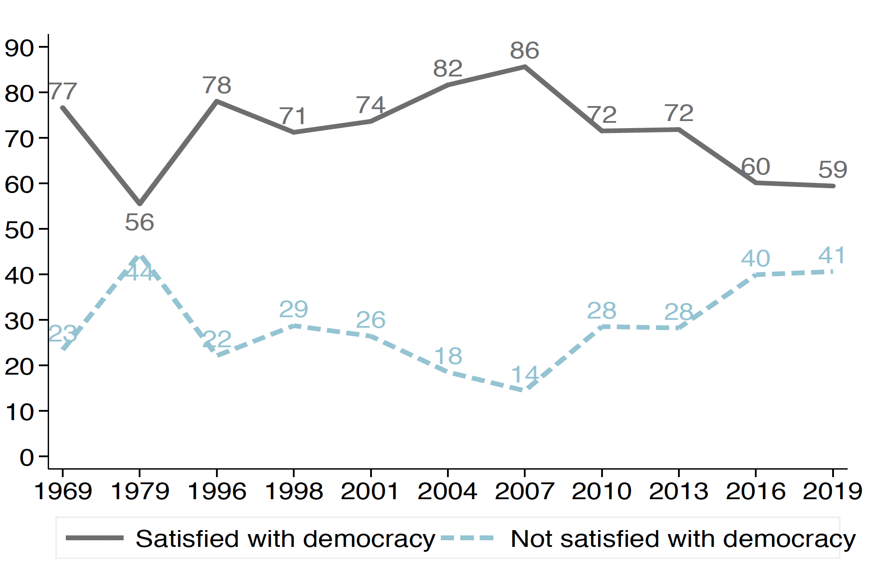

background-image: url(https://upload.wikimedia.org/wikipedia/en/6/6a/Logo_of_the_University_of_Sydney.svg)
background-size: 95%

```{r setup, include=FALSE}

knitr::opts_chunk$set(echo = TRUE, message = FALSE, warning = FALSE, 
                      dev = 'svg', out.width = "45%", fig.width = 6,
                      fig.align="center")

```

---

## Acknowledgement of Country

I would like to acknowledge the Traditional Owners of Australia and recognise their continuing connection to land, water and culture. The  University of Sydney is located on the land of the Gadigal people  of the Eora Nation. I pay my respects to their Elders, past and present.

---

## Course outline

.pull-left[

Week 1: Introduction

Week 2: Foundations: Ontology and Epistemology

Week 3: Research Design (I): Questions, Theories, Hypotheses, Variables, Measurements

Week 4:	Research Design (II): Case selection

Week 5: Research Design (III): Causal Inference

Week 6: Qualitative Methods (I): Data Collection 

Week 7: Qualitative Methods (II): Data Analysis 

]

.pull-right[

⏸️ *Mid Semester break* ⏸️

Week 8: Quantitative Methods (I): Data Collection

*Week 9: 🎉 Public holiday 🎉*

<mark>Week 10: Quantitative Methods (II): Data Analysis</mark> 

Week 11: Quantitative Methods (II): Data Analysis lab

Week 12: Research Proposal: Peer Feedback Workshop Week 

Week 13: New frontiers and Conclusions

]

---

## Today's class

### Introduction to quantitative data collection (continued...)

- Can we trust survey research?

### Introduction to quantitative data analysis
- Variables

- Quantitative Data Analysis

    - Univariate analysis (One variable)
    
    - Bivariate analysis (Two variables)
    
    - Multivariate analysis (Many variables)
    
- R & RStudio

    
---

### General principles of good writing (not specific to this course)

.pull-left[

### Suggestions

- Start with a plan
- Organise using subheadings
- Organise ideas into paragraphs
- Start each paragraph with a clear topic sentence – that summarises the main idea of that paragraph
- Communicate clearly
- Use active voice
- Assume an educated, but non- specialist audience.

]

.pull-right[

### Things to avoid

- Overly long paragraphs
- Less common – overly short paragraphs
- Overly long sentences
- Overuse of passive voice
- Overuse of quotes
    - Use quotes selectively
    - Usually better to paraphrase
- Plagiarism
    - Quotes need both a citation and quotation marks
    - University policies treat accidental and intentional plagiarism the same


]

---

## Quick recap/reflection on Survey research 

–	Are surveys useful tools?

–	Why / why not?

–	What are the strengths and weaknesses of this approach compared to *interviews*?

.center[<mark>Respond on Canvas then copy/paste to Padlet</mark>]


```{r echo = F}
library(countdown)
countdown(minutes = 5, seconds = 00)
```

---
class: inverse, center, middle

# Variables

---

## Recap: Variables (I)

> A variable is a characteristic of a unit being observed that may assume more than one of a set of values to which a **numerical measure** or a **category** from a classification can be assigned (e.g. income, age, weight, etc., and “occupation”, “industry”, “disease”, etc.)

OECD https://stats.oecd.org/glossary/detail.asp?ID=2857

---

## Recap: Variables (II)

*An attribute that can take on a range of values (e.g. for individuals: education level, age, gender; for countries; type of political regime, economic performance)*

- **Independent variable** (the presumed cause)
- **Dependent variable** (the presumed effect)
- **Control variables** (any other variables that may be expected to influence the dependent variable)

.center[<mark>The effect of $X$ (independent variable) on $Y$ (dependent variable), controlling for $Z$ (control variable(s))</mark>]

$$ Y = X + Z $$

### Examples: What is the independent variable and dependent variable?

- What effect does education have on political participation?

- What effect does social media use have on trust in government?

- What effect do gender quotas have on the proportion of women in parliament?


---

## Variables and measurement

Depending on how variables are measured, they can be one of three types:

1. **Nominal variable** (categorical): no hierarchy (e.g. religion, sex)

    * **Dichotomous variable**: Type of nominal variable where there are only two values (e.g. whether voted / sex)
    
2. **Ordinal variable** (categorical): some hierarchy (e.g. income group, level of education, regime type)

3. **Interval variable** (continuous): (e.g. age, income)

**Note**: 

* These categorizations here refer to the way the variable is measured; but ...

* whereas the distinction between independent and dependent variables refers to their role in the hypothesis

---

### Questions for you: What type of variables are these (nominal, ordinal or interval)?

(Answer on Menti: https://www.menti.com/alf6dubihfkj)

#### Satisfaction with democracy:

> On the whole, are you very satisfied, fairly satisfied, not very satisfied or not at all satisfied with the way democracy works in Australia? Response categories [Very satisfied; fairly satisfied; not very satisfied; not at all satisfied]


#### Leader popularity:

> Using a scale from 0 to 10, please show how much you like or dislike the party leaders. If you don't know much about them, you should give them a rating of 5.

#### Vote:

> In the Federal election for the House of Representatives on Saturday 18 May, which party did you vote for first in the House of Representatives? Response categories [Liberal; Labor; National; Greens; Other; Did not vote]

---

class: inverse, center, middle

# Univariate analysis

---

## Univariate Analysis (One Variable)

### Ways to analyze

- Mean (the average)
- Other measures of central tendency - median and mode
- Distribution of responses (e.g. can look at percentage who ‘agree’ or ‘disagree’ to an item)

### How to present

- Tables
- Graphs – e.g. bar graph, pie chart

###Example findings

- 25% of Australians think that people in government can be trusted.
- On average Australians rated Scott Morrison at 5.1 on a scale from 0-10 of how much they liked the leader

---

### Univariate Analysis: Example table Approval of leadership changes, 2010-2015

*Australian Election Study* 

Question wording: 

> 2019: Do you approve or disapprove of the way the Liberal Party handled the leadership change in August of last year, when Scott Morrison replaced Malcolm Turnbull? [strongly approve, approve, disapprove, strongly disapprove] (Similar questions in 2010, 2013 and 2016)

|                                                       |     Approve (%)    |     Disapprove (%)    |
|-------------------------------------------------------|--------------------|-----------------------|
|     2010: Julia Gillard replaced Kevin Rudd           |     26             |     74                |
|     2013: Kevin Rudd replaced Julia Gillard           |     42             |     58                |
|     2015: Malcolm Turnbull replaced Tony Abbott       |     49             |     51                |
|     2018: Scott Morrison replaced Malcolm Turnbull    |     26             |     74                |

---

## Univariate Analysis: Example Satisfaction with democracy

*Australian Election Study* 

Question wording:

> On the whole, are you very satisfied, fairly satisfied, not very satisfied or not at all satisfied with the way democracy works in Australia? (2019 survey responses)

|     Very satisfied            |     8%      |
|-------------------------------|-------------|
|     Fairly satisfied          |     51%     |
|     Not very satisfied        |     29%     |
|     Not   at all satisfied    |     12%     |
|     Total                     |     100%    |

---

class: inverse, center, middle

# Bivariate analysis

---

## Bivariate Analysis (Two variables)

### Looking at the relationship between two variables 

### Different kinds of variables – different analyses

- If you have two categorical variables (nominal variables, ordinal variables) – **tables, bar graphs**

- If you have two interval (continuous) variables – **scatterplots**

- If you have one categorical variable (nominal / ordinal) and one interval variable – **group means, line graph**


---

## Bivariate Analysis: Example table 

## Leadership change and satisfaction with democracy

*Shows the relationship between approval of leadership change (when Malcolm Turnbull replaced Tony Abbott), and satisfaction with democracy.*

|     Approval of leadership change    |           Satisfied with democracy (%)    |           Not satisfied with democracy (%)    |                 Total (%)    |
|--------------------------------------|-------------------------------------------|-----------------------------------------------|------------------------------|
|     Strongly     disapprove          |           38                              |           62                                  |           100                |
|           Disapprove                 |           54                              |           46                                  |           100                |
|           Approve                    |           72                              |           28                                  |           100                |
|     Strongly approve                 |           75                              |           25                                  |           100                |

---

### Bivariate Analysis: Example bar graph

### Leadership change and satisfaction with democracy

*Shows the relationship between approval of leadership changes (in 2010, 2015 and 2018), and satisfaction with democracy*

.center[</img>]

---

### Bivariate analysis example: Satisfaction with democracy

*Source: Australian Election Study*

> On the whole, are you very satisfied, fairly satisfied, not very satisfied or not at all satisfied with the way democracy works in Australia?

.center[</img>]

---

### Bivariate analysis (sub-group means) Leadership popularity (0-10 scale) by gender

.center[</img>]

---

## Bivariate Analysis (Two variables)

### Relationships between two continuous variables

- A variable is *related* or *unrelated* to another

- A variable is *positively* or *negatively* related to another

- A variable is *strongly* or *weakly* related to another

- A variable has a *large* of *small* effect on another

- A variable is *significantly* or *insignificantly* related to another

---

## Bivariate Analysis (Two variables)

### Relationships between two interval (continuous) variables

- The **correlation coefficient** (or $r$) measures the strength and direction of a linear relationship between two variables on a scatterplot.

- A complete lack of relationship: $r = 0$

- A completely negative relationship: $r = -1$

- A completely positive relationship: $r = 1$

- Some positive relationship: $0 < r < 1$

- Some negative relationship: $-1 < r < 0$

---

## Scatterplots

### Related or unrelated? (What is r?)

```{r echo = FALSE}
library(MASS)
library(tidyverse)
```


.pull-left[

```{r echo = FALSE, out.width='100%', fig.width = 3, fig.height = 3}

set.seed(5)
# create the variance covariance matrix
sigma<-rbind(c(1,0.8), c(0.8, 1))
# create the mean vector
mu<-c(10, 5) 
# generate the multivariate normal distribution
df<-as.data.frame(mvrnorm(n=1000, mu=mu, Sigma=sigma))


ggplot(data = df, aes(V1, V2)) + geom_point() + theme_bw() + 
  labs(x = "X", y = "Y", caption = sprintf("Related: r = %s", round(cor(df$V1, df$V2), 2)))

```

]

.pull-right[

```{r echo = FALSE, out.width='100%', fig.width = 3, fig.height = 3}

set.seed(5)
# create the variance covariance matrix
sigma<-rbind(c(1,0.01), c(0.01, 1))
# create the mean vector
mu<-c(10, 5) 
# generate the multivariate normal distribution
df<-as.data.frame(mvrnorm(n=1000, mu=mu, Sigma=sigma))


ggplot(data = df, aes(V1, V2)) + geom_point() + theme_bw() + 
  labs(x = "X", y = "Y", caption = sprintf("Unrelated: r = %s", round(cor(df$V1, df$V2), 2)))

```

]

---

### Positively or negatively related?

.pull-left[

```{r echo = FALSE, out.width='100%', fig.width = 3, fig.height = 3}

set.seed(5)
# create the variance covariance matrix
sigma<-rbind(c(1,-0.8), c(-0.8, 1))
# create the mean vector
mu<-c(10, 5) 
# generate the multivariate normal distribution
df<-as.data.frame(mvrnorm(n=1000, mu=mu, Sigma=sigma))


ggplot(data = df, aes(V1, V2)) + geom_point() + theme_bw() + 
  labs(x = "X", y = "Y", caption = sprintf("Negatively related: r = %s", round(cor(df$V1, df$V2), 2)))

```

]

.pull-right[

```{r echo = FALSE, out.width='100%', fig.width = 3, fig.height = 3}

set.seed(5)
# create the variance covariance matrix
sigma<-rbind(c(1,0.8), c(0.8, 1))
# create the mean vector
mu<-c(10, 5) 
# generate the multivariate normal distribution
df<-as.data.frame(mvrnorm(n=1000, mu=mu, Sigma=sigma))


ggplot(data = df, aes(V1, V2)) + geom_point() + theme_bw() + 
  labs(x = "X", y = "Y", caption = sprintf("Positively related: r = %s", round(cor(df$V1, df$V2), 2)))

```

]

---

## Strongly or weakly related?

.pull-left[

```{r echo = FALSE, out.width='100%', fig.width = 3, fig.height = 3}

set.seed(5)
# create the variance covariance matrix
sigma<-rbind(c(1,-0.75), c(-0.75, 1))
# create the mean vector
mu<-c(10, 5) 
# generate the multivariate normal distribution
df<-as.data.frame(mvrnorm(n=1000, mu=mu, Sigma=sigma))


ggplot(data = df, aes(V1, V2)) + geom_point() + theme_bw() + 
  labs(x = "X", y = "Y", caption = sprintf("Strongly related: r = %s", round(cor(df$V1, df$V2), 2)))

```

]

.pull-right[

```{r echo = FALSE, out.width='100%', fig.width = 3, fig.height = 3}

set.seed(5)
# create the variance covariance matrix
sigma<-rbind(c(1,0.4), c(0.4, 1))
# create the mean vector
mu<-c(10, 5) 
# generate the multivariate normal distribution
df<-as.data.frame(mvrnorm(n=1000, mu=mu, Sigma=sigma))


ggplot(data = df, aes(V1, V2)) + geom_point() + theme_bw() + 
  labs(x = "X", y = "Y", caption = sprintf("Weakly related: r = %s", round(cor(df$V1, df$V2), 2)))

```

]

---

### Bivariate Analysis: Example scatterplot

### GDP per capita vs. electoral democracy in 1990, $r = 0.69$ 

*Source: Bolt et al. (2020); OWID based on V-Dem (v13)* 

```{r echo = F, out.width='65%', fig.width = 5, fig.height = 4, message = FALSE, warning = F}

dat <- 
  read.csv("~/Documents/GitHub/GOVT6139/data/gdp-per-capita-vs-electoral-democracy.csv") %>%
  dplyr::filter(Year == 1990 & !is.na(GDP.per.capita), !is.na(electdem_vdem_owid))

# cor(dat$GDP.per.capita, dat$electdem_vdem_owid)

dat %>%
  ggplot(aes(y = log(GDP.per.capita), x = electdem_vdem_owid)) +
  geom_point() + theme_bw() + geom_smooth(method = "lm") +
  labs(x = "Electoral democracy index", y = "GDP per capita (log)")

```

---
class: inverse, center, middle

# Multivariate analysis

---

## Multivariate analysis (multiple variables)

### Why multivariate analysis – in particular regression analysis?

#### If we are interested in causal relationships between variables, regression analysis is superior to correlation analysis.

#### Correlation analysis is often done as a first-cut analysis prior to regression analysis.

- Remember correlation $\neq$ causation

- Conditions for causality (correlation, time order, non-spuriousness)

####  In regression analysis, you need to:

- decide a direction of the relationship (i.e., impact of $X$ on $Y$) – researcher needs to make justified assumptions here

- control the effects of other variables.

---

## Linear regression model<sup>1</sup>

This is the equation of the **model** for the line that **best fits** the points. 

$$Y_i = \underbrace{\alpha}_{intercept} + \underbrace{\beta}_{slope} X_i + \underbrace{\epsilon_i}_{error\:term}$$
*  **Coefficients (or parameters)**: $\alpha$ and $\beta$  are the intercept and the slope respectively of the line of best fit.

* Little $i$ in $Y_i$ (and $X_i$, $\epsilon_i$)  means the value of $Y$ for each observation $i$ (or data point): $i$ will assume all value from our data set, one at the time. 

* **Chance of error**: $\epsilon_i$ this captures the errors, as the line does not *perfectly* fit the data points.  

    - That it, each data point is allowed to be off the regression line but
    
    - the chance of error is on *average* $0$.
    
.footnote[[1] Slides adapted from https://www.mattblackwell.org/files/teaching/gov50/regression.pdf]
    
---

## Linear regression model

### How do you find the regression line?

- **Fitted (or predicted) value** for each observation $i$: $\widehat{Y}_i = \widehat{\alpha} + \widehat{\beta} X_i$

- **Residual/prediction error** $\widehat{\epsilon_i} = Y_i - \widehat{Y}$

- A $\widehat{hat}$ identifies *estimated* (by the model) values. *Estimates* are our best guesses. 

- This estimates are calculated using the *least squares method*, which *minimises* the **sum of squares residuals** (SSR). 

.pull-left[$$SSR = \sum_{i=1}^{n} \widehat{\epsilon}^2_i$$]

.pull-right[.center[</img>]]

---

## Let's assume this data set with two variables: 

* Our **dependent variable**, our *outcome*, is the *weight* in pounds measured on a given day. 

* The **independent variable**, our *predictor*, is the number of *steps* walked the previous day.

So, each record in our data set, or rows, will contain two measurements:

| weight (in pounds) | steps (in 1000s) |
|--------------------|------------------|
| 170                | 15               |
| 172                | 20               |
| 173                | 21               |
| ...                | ...              |

---

Let's draw our data points (each record/row/observation is a point) and fit a line into it...


```{r echo = FALSE, out.width = '85%'}
library(magick)
magick::image_read_pdf("../img/blackwell-regression-pages.pdf",
                       pages = 1, density = 600)
```


(Sources: https://www.mattblackwell.org/files/teaching/gov50/regression.pdf)

---

$$\underbrace{\widehat{Y_i}}_{estimated\\(predicted)\:value} = \underbrace{\widehat{\alpha}}_{estimated\:intercept} + \underbrace{\widehat{\beta}}_{estimated\:slope} X_i + \underbrace{\widehat{\epsilon}_i}_{estimated\:error\:term\\(residual)}$$

```{r echo = FALSE, out.width = '85%'}
library(magick)
magick::image_read_pdf("../img/blackwell-regression-pages.pdf",
                       pages = 2, density = 600)
```


(Sources: https://www.mattblackwell.org/files/teaching/gov50/regression.pdf)

---

$$\underbrace{\widehat{Y_i}}_{estimated\\(predicted)\:value} = \underbrace{\widehat{\alpha}}_{estimated\:intercept} + \underbrace{\widehat{\beta}}_{estimated\:slope} X_i + \underbrace{\widehat{\epsilon}_i}_{estimated\:error\:term\\(residual)}$$

```{r echo = FALSE, out.width = '85%'}
library(magick)
magick::image_read_pdf("../img/blackwell-regression-pages.pdf",
                       pages = 3, density = 600)
```


(Sources: https://www.mattblackwell.org/files/teaching/gov50/regression.pdf)

---

$$\underbrace{\widehat{Y_i}}_{estimated\\(predicted)\:value} = \underbrace{\widehat{\alpha}}_{estimated\:intercept} + \underbrace{\widehat{\beta}}_{estimated\:slope} X_i + \underbrace{\widehat{\epsilon}_i}_{estimated\:error\:term\\(residual)}$$

```{r echo = FALSE, out.width = '85%'}
library(magick)
magick::image_read_pdf("../img/blackwell-regression-pages.pdf",
                       pages = 4, density = 600)
```


(Sources: https://www.mattblackwell.org/files/teaching/gov50/regression.pdf)

---

$$\underbrace{\widehat{Y_i}}_{estimated\\(predicted)\:value} = \underbrace{\widehat{\alpha}}_{estimated\:intercept} + \underbrace{\widehat{\beta}}_{estimated\:slope} X_i + \underbrace{\widehat{\epsilon}_i}_{estimated\:error\:term\\(residual)}$$

```{r echo = FALSE, out.width = '85%'}
library(magick)
magick::image_read_pdf("../img/blackwell-regression-pages.pdf",
                       pages = 5, density = 600)
```


(Sources: https://www.mattblackwell.org/files/teaching/gov50/regression.pdf)

---

$$\underbrace{\widehat{Y_i}}_{estimated\\(predicted)\:value} = \underbrace{\widehat{\alpha}}_{estimated\:intercept} + \underbrace{\widehat{\beta}}_{estimated\:slope} X_i + \underbrace{\widehat{\epsilon}_i}_{estimated\:error\:term\\(residual)}$$

```{r echo = FALSE, out.width = '85%'}
library(magick)
magick::image_read_pdf("../img/blackwell-regression-pages.pdf",
                       pages = 6, density = 600)
```


(Sources: https://www.mattblackwell.org/files/teaching/gov50/regression.pdf)

---

### But why to stop to one independent variables or predictors?<sup>1</sup>

$$Y_i = \underbrace{\alpha}_{intercept} + \underbrace{\beta_1}_{coefficient\\first\:IV} \ \  \underbrace{X_{i1}}_{values\\first\:IV} \ + \ \underbrace{\beta_2}_{coefficient\\second\:IV} \ \  \underbrace{X_{i2}}_{values\\second\:IV} + ... + \underbrace{\epsilon_i}_{error\:term}$$
#### Why do we want to add additional predictor variables (IVs)?

1. We improve our **predictions** ($Y_i$), as we provide the model more information. (Of course this assumption rests on the *quality of information* we provide to the model) 

2. We can offer a better **interpretations** of the relationships among our variables: " $\beta_1$ is the effect of $X_i$ *holding all other independent variables constant* " => a.k.a. **ceteris paribus**.

.footnote[[1] Adapted from https://www.mattblackwell.org/files/teaching/gov50/regression-ii.pdf]

---

class: inverse, center, middle

# Interpreting regression model results

---

#### Example regression table: explaining satisfaction with democracy

|                                                          |     2019              |     Standard errors    |
|----------------------------------------------------------|-----------------------|------------------------|
|     Sociotropic retrospective     economic evaluation    |           0.501***    |           (0.084)      |
|           Approve leadership change                      |           0.562***    |     (0.1)              |
|     Voted for election winner                            |     0.653**           |     (0.213             |
|     Political interest                                   |     0.349***          |     (0.102)            |
|     University degree                                    |     0.163             |     (0.14)             |
|     Gender (female)                                      |     -0.161            |     (0.14)             |
|     Age (deciles)                                        |     0.0712            |     (0.049)            |
|     Partisanship (base category     Liberal partisan)    |                       |                        |
|     Labor partisan                                       |     0.238             |     (0.256)            |
|     National partisan                                    |     -0.159            |     (0.573)            |
|     Greens partisan                                      |     -0.283            |     (0.316)            |
|     Other partisan                                       |     -1.780***         |     (0.334)            |
|     Non-partisan                                         |     -0.559*           |     (0.249)            |
|     N                                                    |     1,956             |                        |
|     R2                                                   |     0.36              |                        |

---

#### Example regression table: explaining satisfaction with democracy (notes on previous table)

* Four-point measure of satisfaction with democracy is the dependent variable. 

* Standard errors in parentheses. 

* Significance levels: * p<0.05, ** p<0.01, *** p<0.001 

Source: Australian Election Study 2019.

---

## How to interpret a regression table?

#### What to look for

##### P-values / statistical significance

* $p<0.05$ is statistically significant (i.e. there is less than 5% probability the result occurred by chance). Often indicated by stars.*

##### Regression Coefficients

* **Sign** (+/-) indicates whether relationship between the independent variable (cause) and dependent variable (effect) is positive/negative

* **Size** indicates how great an impact the independent variable has on the dependent variable. (For a one unit change in the Independent variable, there is … change in the dependent variable.)

##### R-squared ( $R^2$ )
–	shows how much the variation in the dependent variable is explained by a set of independent variables. (e.g. a $R^2$ of 0.54 means 54% variation in the dependent variable – this is high)

---

## What do we mean with statistical significance?

* Tells us whether our results we observe using our sample could have occurred by chance

    - i.e. can you be confident that the relationship you identify is real - $\widehat{\beta} \approx \beta$ - and you would have an unlucky sample if the the relationship is not real, that is if $\widehat{\beta} \neq \beta$.
     
* As we are studying a sample, indicates likelihood relationship exists in the population

* If $p<0.05$ (i.e. there is less than 5% probability the result occurred by chance) can reject null hypothesis (no relationship between variables)

* Different $p$-levels e.g. $p<0.1$, $p<0.01$

---

#### Example regression table: explaining satisfaction with democracy

|                                                          |     2019              |     Standard errors    |
|----------------------------------------------------------|-----------------------|------------------------|
|     Sociotropic retrospective     economic evaluation    |           0.501***    |           (0.084)      |
|           Approve leadership change                      |           0.562***    |     (0.1)              |
|     Voted for election winner                            |     0.653**           |     (0.213             |
|     Political interest                                   |     0.349***          |     (0.102)            |
|     University degree                                    |     0.163             |     (0.14)             |
|     Gender (female)                                      |     -0.161            |     (0.14)             |
|     Age (deciles)                                        |     0.0712            |     (0.049)            |
|     Partisanship (base category     Liberal partisan)    |                       |                        |
|     Labor partisan                                       |     0.238             |     (0.256)            |
|     National partisan                                    |     -0.159            |     (0.573)            |
|     Greens partisan                                      |     -0.283            |     (0.316)            |
|     Other partisan                                       |     -1.780***         |     (0.334)            |
|     Non-partisan                                         |     -0.559*           |     (0.249)            |
|     N                                                    |     1,956             |                        |
|     R2                                                   |     0.36              |                        |

---

## Reflections


* What would you perceive to be the strengths of the quantitative approach?

* What would be the weaknesses?

* For what research questions would quantitative research be a useful tool?

* For what research questions would other approaches be better suited?

.center[<mark>Respond in Canvas</mark>]


```{r echo = F}
library(countdown)
countdown(minutes = 7, seconds = 00)
```

---

### Quantitative approach strengths

* Generalizability

* Can be replicated

* Process more objective

* Can do large-N analysis (large number of observations – e.g. countries, or people)

* Good for theory testing 

### Quantitative approach weaknesses:

* Can complex concepts be measured / quantified?

* Large-N approach has trade-offs in terms of specific case knowledge

---

## Group task (if time allows)

* Download the "Explaining the Trump vote" paper from Canvas (Week 10 module).

* Go to Table 1 on page 531 (you can read the rest of the paper at home in interested!)

**Note**: As it is common, the table reports more than one model. Coefficients from each model are in a different column. You might also note that each model has different combination of independent variables.

1. Identify the dependent variable (DV) and the independent variables (IVs)

2. Identify the coefficients that are *significant*.

3. Given the *sign* of the significant coefficients, what intepretations do you give to that relationships (IV - DV)?

In our own words, explain the results. What do the results from the models tell us about the Trump vote?


