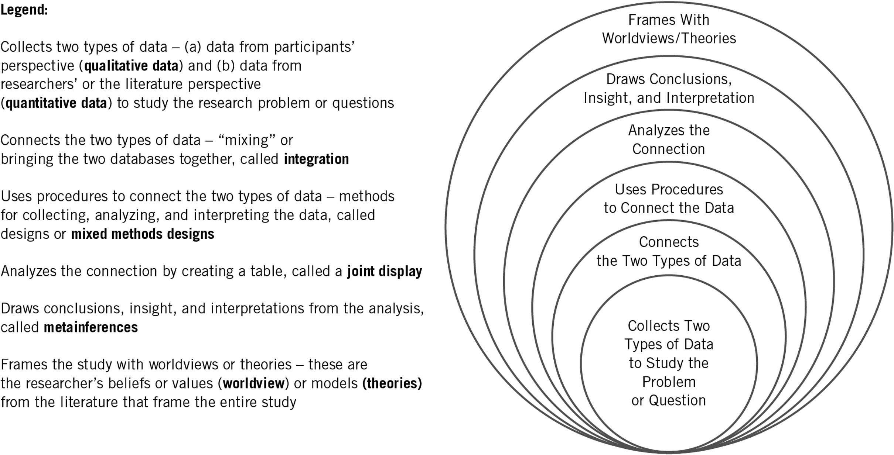

background-image: url(https://upload.wikimedia.org/wikipedia/en/6/6a/Logo_of_the_University_of_Sydney.svg)
background-size: 95%

```{r setup, include=FALSE}

knitr::opts_chunk$set(echo = TRUE, message = FALSE, warning = FALSE, 
                      dev = 'svg', out.width = "45%", fig.width = 6,
                      fig.align="center")

options(scipen = 999)
```

---

## Acknowledgement of Country

I would like to acknowledge the Traditional Owners of Australia and  recognise their continuing connection to land, water and culture. The  University of Sydney is located on the land of the Gadigal people  of the Eora Nation. I pay my respects to their Elders, past and present.


---


## Course outline

.pull-left[

**Week 1**: Introduction

**PART I PRELIMINARY CONSIDERATIONS (Weeks 2-5)**

**Week 2**: The Selection of a Research Approach

**Week 3**: Review of the Literature

**Week 4**: The Use of Theory

**Week 5**: Writing Strategies and Ethical Considerations + Guest lecture w/t Christopher Pepin-Neff 

**PART II DESIGNING RESEARCH (Weeks 6-12)**

**Week 6**: The Introduction **no seminar** (public holiday)

⏸️ *Mid Semester break* ⏸️

]

.pull-right[


**Week 7**: The Purpose Statement 

**Week 8**: Research Questions and Hypotheses + Guest Lecture w/t Charles Robert Butcher 

**Week 9**: Quantitative Methods 

**Week 10**: Quantitative Methods: Data Analysis Lab (Make sure you install R and RStudio) 

**Week 11**: Qualitative Methods + Guest lecture w/t Peter Chen

**Week 12**: Mixed Methods Procedures + Guest lecture w/t Assel Mussagulova 👈

**Week 13**: Conclusions


]


---

class: inverse, center, middle

# Mixed Methods Procedures

---

# Chapter 10 Learning Objectives

1. Describe each of the six characteristics of mixed methods research to use in a definition.

2. Create a justification for using mixed methods research in a proposal or study.

3. Define key terms used in mixed methods, such as open- and closed-ended data, research design, integration, joint displays, and metainferences when presented in a proposal or study.

4. Contrast quantitative and qualitative data when presented in a study.

5. Identify for a core design its intent, procedures for data collection, integration, metainferences, and validity.

6. Choose a type of mixed methods design for a study, and present reasons for the choice.

7. Identify the elements that go into an integration statement for a proposal or a study.

---

# Introduction

* __Mixed methods procedure __
  * Combining qualitative and quantitative forms for more understanding
  * Limitations and strengths of each type of data collection
  * Nature of mixed methods
  * Reasons to use

---

# Characteristics of Mixed Methods Research

* The mixed methods researcher:
  * Collects two types of data— _qualitative (open-ended)_  _ and _  _quantitative (closed- ended) _ data—to study the research problem or question
  * Connects the two data sets, called  _integration_
  * Uses procedures to integrate the two data sets, called a  _mixed methods design_
  * Analyzes integration typically in a table, called a  _joint display_ , by representing the two databases together in the procedures
  * Draws conclusions, insight, or interpretation from the integration analysis, called  _metainferences_
  * Frames the study with the researcher’s beliefs, values  __(__  _worldview_  __)__ , and explanations drawn from the literature  __(__  _theories_  __)__

---

# Types of Mixed Methods Designs

__Figure 10.1: Essential Components of Mixed Methods Research__

</img>

---

# Justification for Using Mixed Methods Research

* Reasons for choosing mixed methods
  * Developing a complete understanding of a research problem by combining quantitative and qualitative results
  * Explaining quantitative results in detail with qualitative
  * Improving measures, scales, and instruments
  * Augmenting experiments
  * Developing cases
  * Evaluating programs
  * Understanding changes needed for marginalized group

---

# Definitions of Mixed Methods Terms

* __Open-ended data__

  * Information gathered where researchers ask a question but do not provide a response option
  
     * Participants share views, researcher records them
    
  * Information gathered when researchers provide a qualitative description of a document (sociql media post)
    
* __Closed-ended data__

  * Information gathered where the researcher provides participants with response options
  
     * Rating scales
    
  * Information generated classifying a document's topic (like a media post) using software 

---

* __Research Design	__
  * Procedure used in conducting a study
  * Two categories:  _core designs _ and  _complex designs_
  * __Core Designs__
    * Designs found in all mixed methods studies including convergent designs, explanatory sequential designs, and exploratory sequential designs
  * __Complex Designs__
    * Primary intent not simply integration of two databases but to have mixed methods  _support _ the procedures of a process or framework
    * Experimental processes, participatory action research frameworks, case study procedures, evaluation processes

---

* __Integration__
  * Central concept in mixed methods research
  * Involves combining in a study or a series of studies information from qualitative and quantitative data
* __Joint Display__
  * Table or graph that presents side-by-side combination of two combined databases
* __Metainferences__
  * Insights that emerge as researcher compares the quantitative and qualitative databases

---

# The Process of Conducting a Mixed Methods Study

* Connecting the quantitative and qualitative data to a specific type of mixed methods design
  * Researcher draws a diagram of the design
  * Integrates the two databases
  * Presents the integration in a table or joint display for analysis
  * Draws insights or metainferences from results of the integration

---

# Quantitative and Qualitative Data Collection

* Indicate types of qualitative and quantitative data collected; one needs a clear sense of types of data gathered
* If both quantitative and qualitative data can be gathered, opportunity opens to use mixed methods research
* Strategy: pose a general problem for the mixed methods study and gather two types of data—quantitative and qualitative—to address the problem
* Present a table that lists sources of quantitative and qualitative data in a project

---

# Core Mixed Methods Designs (1 of 2)

* Three core mixed methods designs (Figure 10.2)
  * Convergent design
  * Explanatory sequential design
  * Exploratory sequential design

---

__Figure 10.2: Three Core Designs__


---

# The Convergent Mixed Methods Design(1 of 4)

* __Intent:__  to  _compare _ results from the qualitative databases with results from the quantitative databases by  _merging _ the results
* __Key assumption__ : quantitative and qualitative data provide different types of information
* Most familiar approach
* Description of the design
  * Collects both quantitative and qualitative data,
  * Analyzes them separately,
  * Compares the results to see if the findings confirm or disconfirm each other

---

* __Data collection__
  * Use the same or parallel variables, constructs, or concepts
* __Data analysis and integration__
  * Analyze qualitative database
  * Analyze quantitative database
  * Integrate the two
  * __Joint display__  – merge forms of data in a single visual display (Table 10.2)

---

__Table 10.2: Template for a Convergent Design Joint Display__

| Scores | Theme 1 | Theme 2 | Theme 3 | Theme 4 | Metainferences |
| :-: | :-: | :-: | :-: | :-: | :-: |
| High | Quote/<br />Scores | Quote/<br />Scores | Quote/<br />Scores | Quote/<br />Scores | Insight |
| Medium | Quote/<br />Scores | Quote/<br />Scores | Quote/<br />Scores | Quote/<br />Scores | Insight |
| Low | Quote/<br />Scores | Quote/<br />Scores | Quote/<br />Scores | Quote/<br />Scores | Insight |
| Metainferences | Insight | Insight | Insight | Insight | Insight |

---

* __Interpretation__
  * Discussion section compares results and notes convergence or divergence
* __Validity__
  * Quantitative validity (e.g., construct)
  * Qualitative validity (e.g., triangulation)
  * Mixed methods validity (e.g., unequal sample sizes)

---

# The Explanatory Sequential Mixed Methods Design(1 of 4)

* __Intent:__  to  _explain _ initial quantitative _ _ results with  results from qualitative data by  _connecting _ the two databases
* __Key assumption__ : quantitative results may yield  _surprising _ information that needs  _explanation_
* Description of the design
  * Involves a two-phase project
  * Collection of quantitative data in the first phase
  * Uses results to plan the second, qualitative phase
  * Qualitative data help in explain in more detail the initial quantitative results

---

* __Data collection__
  * Two distinct phases
  * Rigorous quantitative sampling and purposeful qualitative
* __Data analysis and integration__
  * Connecting quantitative results to qualitative data collection
  * Quantitative results inform sampling and qualitative questions to ask

---

__Table 10.3: Template for an Explanatory Sequential Design Joint Display__

| Quantitative Scores | Qualitative Follow-Up Themes | Metainferences |
| :-: | :-: | :-: |
| High Scores | Theme 1<br />Theme 2<br />Theme 3 | How Themes Explain the Scores |
| Medium Scores | Theme 1<br />Theme 2<br />Theme 3 | How Themes Explain the Scores |
| Low Scores | Theme 1<br />Theme 2<br />Theme 3 | How Themes Explain the Scores |

---

* __Interpretation __
  * First phase quantitative results
  * Second phase qualitative results
  * How the qualitative findings help to explain the quantitative results
* __Validity__
  * Of the scores from the quantitative measures and qualitative findings
  * Mixed methods (e.g., options for following up on quantitative results)

---

* __Intent:__  to  _explore _ how qualitative data can improve quantitative measures, scales, or instruments
* __Key assumption__ : quantitative results may yield  _surprising _ information that needs  _explanation_
* Description of the design
  * A three-phase design
  * Start with a qualitative phase
  * Build to a feature to be tested (e.g., survey instrument)
  * Followed by a quantitative phase that tests the feature

---

* __Data collection__
  * Initial qualitative data collection
  * Test of quantitative feature
* __Integrative data analysis__
  * Analyze the two databases separately
  * Use the findings from the initial exploratory database to build into a feature
  * Qualitative findings inform design of quantitative phase (e.g., instrument, variables)

---

# The Exploratory Sequential Mixed Methods Design  (3 of 4)

__Table 10.3: Template for an Exploratory Sequential Design Joint Display (using a survey design as an example)__

| Qualitative | Design Features | Metainferences |
| :-: | :-: | :-: |
| Qualitative Quotes | Quantitative Survey Items | Analyze the scores on the survey |
| Qualitative Codes | Quantitative Survey Variables | Identify variables |
| Qualitative Themes | Quantitative Survey Scales | Identify scales |

---

* __Interpretation __
  * First report the qualitative finding
  * Development of feature
  * Quantitative test results
  * Determine if qualitative themes can be generalized
* __ Validity__
  * Validity of the qualitative data and the quantitative scores
  * Mixed methods issues (e.g., developing a good instrument)

---

# Complex Mixed Methods Designs

* All mixed methods studies have at least one  __core design __ (e.g., convergent, explanatory sequential, or exploratory sequential)
* __Complex designs __ have core designs embedded in frameworks larger than simply collecting, analyzing, and integrating quantitative and qualitative data

---

# Types of Complex Designs

Several complex mixed methods designs:

Intersecting a secondary method (mixed methods) within a primary quantitative or qualitative design (e.g., an intervention)

Intersecting mixed methods within another methodology (e.g., evaluation)

Intersecting mixed methods within a theoretical framework (e.g., social justice)

---

# Examples of Complex Designs (1 of 5)

__Mixed methods experimental (intervention) design__  – quantitative and qualitative data within an experiment or trial (Figure 10.3)

__Mixed methods case study design__  – mixed methods within a single or multiple case study (Figure 10.4)

__Mixed methods participatory social justice design__  – core mixed methods design within a larger framework (Figure 10.5)

__Mixed methods evaluation design__  – one or more core designs in an evaluation (Figure 10.6)

---

__Figure 10.3: A Mixed Method Intervention Design Diagram __


---

__Figure 10.4: A Multiple Case Study Design Diagram __


---

__Figure 10.5: A Mixed Methods Participatory Action Research Design Diagram __


---

__Figure 10.6: A Mixed Methods Evaluation Design Diagram __


---

# Incorporating Core Designs into Complex Designs

Identify quantitative and qualitative data collection

Draw a diagram of steps

Look in steps for opportunities to collect quantitative and qualitative data

Examine how databases are connected

Discuss overall framework or process and the embedded core designs

---

# Factors Important in Choosing a Mixed Methods Design (1 of 4)

* Choice based on intent and procedures (Table 10.5)
  * __Integration statement__
  * Example:
    * “Integration involved comparing the results from the quantitative and qualitative data by merging so that a more complete understanding emerges than provided by the quantitative or the qualitative results alone.” (convergent design)
  * __Design intent __ (Figure 10.7)
  * __Select procedures that match design __ (Figure 10.8)

---

__Table 10.5: Intent and Procedures of Mixed Methods Designs__

| Mixed Methods Design | Intent or Purpose (of mixing the two databases) | Procedure (for conducting the research) |
| :-: | :-: | :-: |
| Convergent Design | Compare, Match, Corroborate (Validate), Expand, Enhance, Diffract, Identify Cases, Initiating, Complete Understanding | Merge (putting the databases side-by-side) |
| Explanatory Sequential Design | Expand, Explain | Connect (quantitative results connection with qualitative data collection) |
| Exploratory Sequential Design | Build Upon, Transfer, Generalize | Connect (qualitative results lead to design of quantitative assessment that is then tested) |
| Complex Mixed Methods Design | Augment (optimize, ascertain needs, monitor) | Add into a process/ framework<br /><br />Qualitative, Quantitative, or Both Types of Data |

---

__Figure 10.7: Flowchart for Choosing Your Type of Design (Based on Intent) __


---

__Figure 10.8: Flowchart for Choosing Your Type of Design (Based on Procedures) __


---

# Other Reasons for Choosing a Design

* Choice based on
  * Popular designs in a field or discipline
  * Single researcher or team
  * Choice by advisors or mentors
  * Timing in mixed methods data collection – convergent or sequential
  * Emphasis placed on each database – equal or unequal

---

# Summary

Define mixed methods and core characteristics

Mention historical evolution

Discuss chosen mixed methods design and challenges

Draw a diagram of procedures

Convey elements based on your design

---