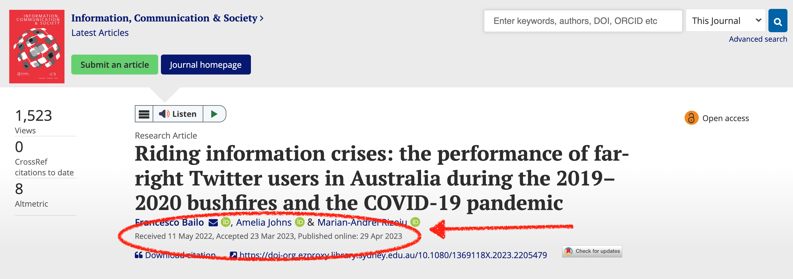
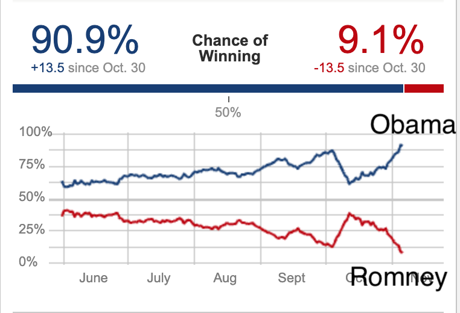
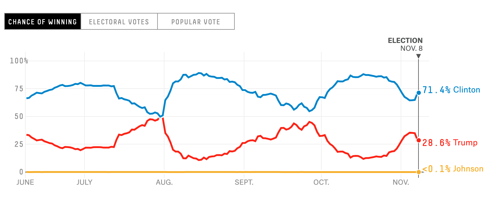
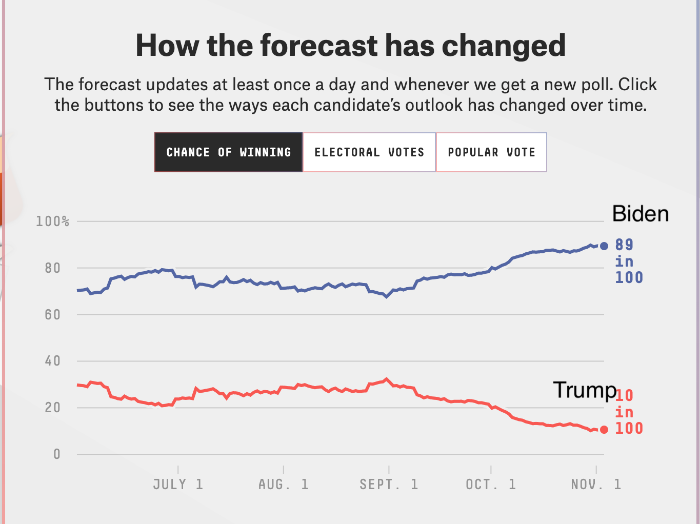
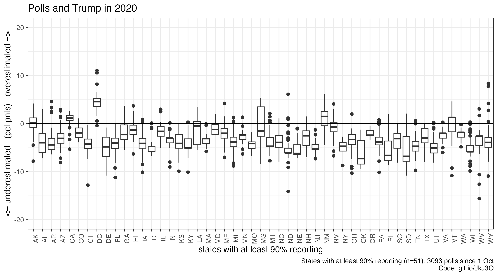
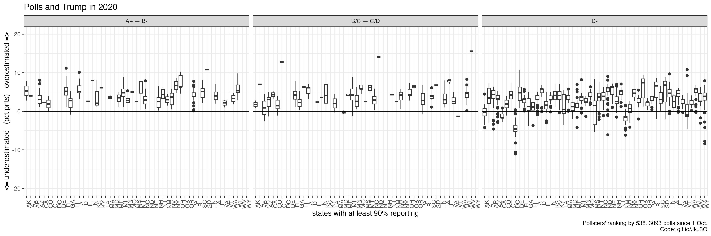
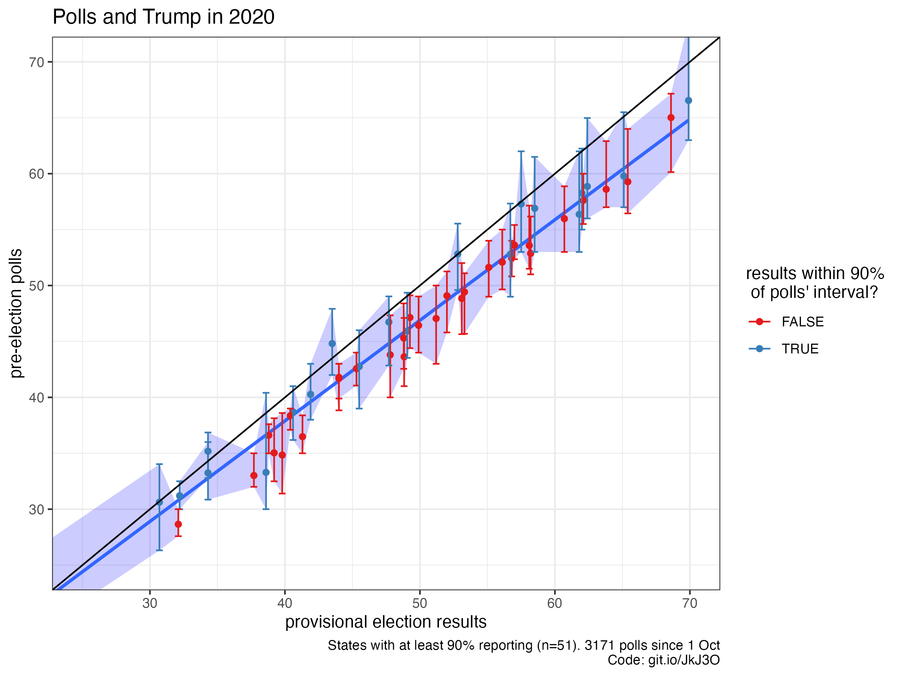
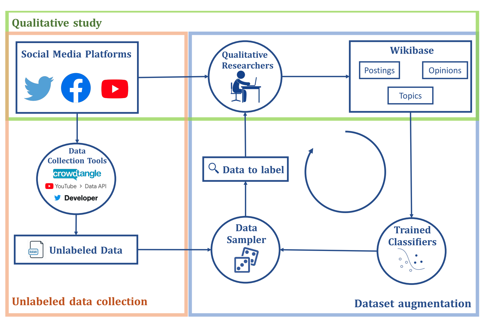
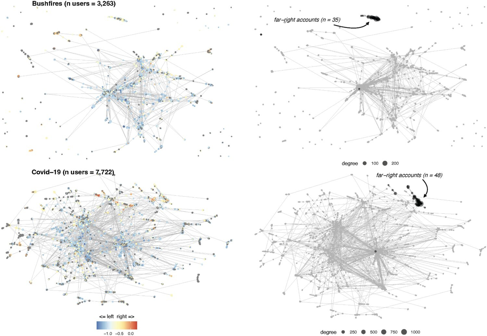
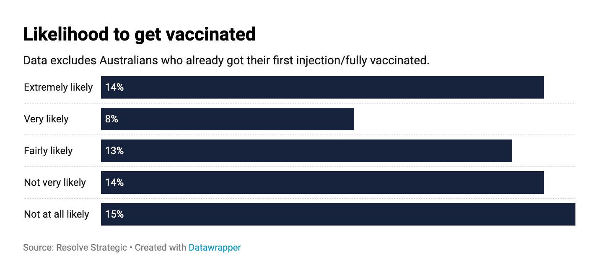

background-image: url(https://upload.wikimedia.org/wikipedia/en/6/6a/Logo_of_the_University_of_Sydney.svg)
background-size: 95%

```{r setup, include=FALSE}

knitr::opts_chunk$set(echo = TRUE, message = FALSE, warning = FALSE, 
                      dev = 'svg', out.width = "45%", fig.width = 6,
                      fig.align="center")

require(knitr)
require(tidyverse)

```

---

## Acknowledgement of Country

I would like to acknowledge the Traditional Owners of Australia and recognise their continuing connection to land, water and culture. The  University of Sydney is located on the land of the Gadigal people  of the Eora Nation. I pay my respects to their Elders, past and present.

---

## Course outline

.pull-left[

Week 1: Introduction

Week 2: Foundations: Ontology and Epistemology

Week 3: Research Design (I): Questions, Theories, Hypotheses, Variables, Measurements

Week 4:	Research Design (II): Case selection

Week 5: Research Design (III): Causal Inference

Week 6: Qualitative Methods (I): Data Collection 

Week 7: Qualitative Methods (II): Data Analysis 

]

.pull-right[

⏸️ *Mid Semester break* ⏸️

Week 8: Quantitative Methods (I): Data Collection

*Week 9: 🎉 Public holiday 🎉*

Week 10: Quantitative Methods (II): Data Analysis

Week 11: Quantitative Methods (III): Data Analysis lab

<mark>Week 12: Research Proposal: Peer Feedback Workshop Week</mark> 

Week 13: New frontiers and Conclusions

]


---

## Please complete the Unit of Study Survey for GOVT6139 (if you haven't yet)!!

---

## Plan for today

- Academic writing and publishing

- New(ish) frontiers

- Takeaways from GOVT6139 and wrapping up

- Research proposal Q and A

---

class: inverse, center, middle

# Academic writing and publishing

---

## The research process

<center>

```{r, echo = F, out.width = "150%"}

DiagrammeR::grViz("digraph {
  graph [layout = neato, rankdir = LR] 
  
  node [shape = doubleoctagon, fontsize=18]    
  nodeWhat [label = 'What', pos = '0,2!']
  nodeHow [label = 'How' , pos = '5,2!']
  nodeDo [label = 'Do it',  pos = '12,2!']
  
  node [shape = cds, width=1.5, height=1.2, fontsize=18]        
  nod1 [label = 'Formulate\\nresearch\\nproblem', pos = '0,0!']
  nod2 [label = 'Conceptualise\\nresearch\\ndesign', pos = '2,0!']
  nod3 [label =  'Construct\\ninstrument for\\ndata collection', pos = '4,0!']
  nod4 [label =  'Select\\na\\nsample', pos = '6,0!']
  nod5 [label =  'Write\\nresearch\\nproposal', pos = '8,0!']
  nod6 [label =  'Collect\\ndata', pos = '10,0!']
  nod7 [label =  'Analyse\\ndata', pos = '12,0!']
  nod8 [label =  'Write\\nresearch\\nreport', pos = '14,0!']
  
  node [shape = house, width=.8, height=1, fontsize=14]  
  nod10 [label = 'Variables\\n&\\nhypothesis', pos = '0,-2!'] 
  nod11a [label = '\\nCausal\\ninference?', pos = '2,-2!'] 
  nod12 [label = 'Validity &\\nreliability of\\nmeasures', pos = '4,-2!'] 
  nod11b [label = '\\nCausal\\ninference?', pos = '6,-2!'] 
  nod13 [label = 'Methods of\\ndata\\ncollection', pos = '10,-2!'] 
  nod14 [label = 'Methods\\nof\\nanalysis', pos = '12,-2!'] 
  nod15 [label = 'Principles\\nof scientific\\nwriting', pos = '14,-2!'] 
  
  # edge definitions with the node IDs
  nodeWhat -> nodeHow -> nodeDo;
  nodeWhat -> nod1; 
  nodeHow -> nod2; nodeHow -> nod3; nodeHow -> nod4; nodeHow -> nod5;
  nodeDo -> nod6; nodeDo -> nod7; nodeDo -> nod8;

  nod1 -> nod10; nod2 -> nod11a; nod3 -> nod12; nod4 -> nod11b;
  nod6 -> nod13; nod7 -> nod14; nod8 -> nod15;
  
  }", 
  width = 800, height = 300)

```

</center>

<mark>
*Literature review relevant across all stages of the research process. 
*Understanding and building upon what research has been done before.</mark>

---

## Writing up academic research: Structure

### Commonly used structure

* Introduction

* Literature Review

* Theory

* Data and Methods

* Results

* Conclusions

*Some variations on this – good to look at published articles (ones using a similar approach) to see how they have structured*

**Note**: *literature review* & *results* are not necessarily called that, even if that’s what it is.

---

## Writing up academic research: Structure example

### Riding information crises: the performance of far-right Twitter users in Australia during the 2019–2020 bushfires and the COVID-19 pandemic 
(*open access here https://doi.org/10.1080/1369118X.2023.2205479*)

1. Introduction

    * *Includes: Hypotheses and research questions*

2. Theoretical and conceptual framework

    * *Literature review, defining key concepts, and theoretical frameworks for information disorders and online beheaviour*
    
3. Data and methods

4. Results

5. Discussion and conclusion

---

### Writing up academic research: What goes where

**Note**: Every project will look different!

#### Introduction
* Scene setting
* Research question
* Rationale
* What I do, what I find
* Overview of the structure of the paper / thesis

#### Literature Review
* Overview of relevant previous research
* Key themes and debates
* Gap(s) that your study will address

#### Theory
* Can be part of or separate to literature review.
* Theories can come from previous literature, and your own ideas.
* Can develop the theory / theories you will test (with mechanisms), and any hypotheses.

---

### Writing up academic research: What goes where

#### Data and Methods
* Provides an overview of the research design and methods of analysis.
* Should be sufficiently detailed that another researcher could replicate what you have done.

#### Results
* This is where your analyses will be. May be one section (e.g. for a focused journal article) or multiple sections (e.g. for a PhD thesis)
* For quantitative work, this is where the graphs / tables presenting your findings will be and discussion of their contents.
* For qualitative work (e.g. interviews) this is where you would unpack and analyse the qualitative data.

#### Conclusions
* What you asked. What the paper did. Overview and discussion of findings.
* Limitations.
* Broader discussion on any implications.

---

## General tips

.pull-left[
* Look at 

    * quality research in your area;
    
    * using your method; or
    
    * from an author whose writing you like

* See how they write things up

* What goes in each section?

* What ideas do they cover from para to para?
]

.pull-right[
.center[</img>]
]

---

### Publishing research

.pull-left[

#### Peer-reviewed journals
* Which journal to target? Fit / rankings / journal acceptance rate / processing time
* Submission
* Decision: Accept / Revise and Resubmit (Minor or major revisions) / Reject
* Timelines can be long / rejection is part of the process
* Mentorship from experienced researchers

#### Books
* Edited / authored
* Targeted at a wider readership

]

.pull-right[
#### Reports
* Overview of findings to reach wider audience
* See for example: Scanlon Foundation 2019 Social Cohesion Report / Australian Election Study report ‘The 2019 Australian Federal Election: Results from the Australian Election Study’

#### Media
* The Conversation (academic rigour, journalistic flair)
* Op-eds
* Work with University media offices
]

---

## Identifying your target publication (little demo)

(Ideally, you want to have an idea **before** you start drafting)

<iframe src = 'https://www.scimagojr.com/' width = 800 height = 400></iframe>

https://www.scimagojr.com/


---

## Identifying your target publication

#### Use different entry points

1. Browse the **category/subcategory** you want to research about (e.g. "Social Sciences > Sociology and Political Science") to identify a few candidates: compare them 

    * what methodology do they publish? 
    * have you referenced anything from these journals? 
    * what are their metrics: impact, acceptance rate, speed (speed is VERY important for ECR, you want that paper on your CV soon!)
    
2. Identify a number of reference **journal articles** (similar for methodology, topic, etc)

    * Where are these published,
    * Where are the articles that referenced these articles published (using Google scholar);
    * Get journals from [Research Rabbit](https://researchrabbitapp.com/)
    
3. Identify a number of **authors** (similar for methodology, topic, etc)

    * Where have they published?

---

## Publishing research

#### Who is your audience?

    * Policy-makers
    * Broader public?
    * Academic researchers?
    * All of the above?

* Academic system values peer-reviewed journal articles (unless in one of the top journals readership / citations often low)

* Writing style expected in academic journals not particularly accessible

* "Real world" values more accessible formats e.g. reports

---

#### Peer review process: Academic journals

.pull-left[

#### Editors provide initial review

* Desk reject
     * Poor fit for the journal / not of high enough quality / not innovative enough
     * Top ranked journals do more desk rejects
     * Send to another journal!
* Or send out to peer reviewers (2-3 normal)

#### Peer review
* Double blind
* Recommend: accept / minor revisions / major revisions / reject
* Provide overall comments including areas for improvement
* Editors make a decision on the basis of reviewer feedback

]

.pull-right[

#### Revise and resubmit (R&R)
* Need to make any improvements identified by the reviewers and editors
* If there’s a change you can’t make, give a good justification for why
* Need to provide a document outlining how the paper has been revised in response to reviewer feedback

#### Back to editors
* May go back to original peer reviewers to review the changes
* For minor revisions, changes may be reviewed directly by the editors
* Decision (Accept / Another R&R / Reject)


]

---

### Peer review example


| Submission | Decision |
| ---------- | -------- |
| 11-May-2022 |	08-Aug-2022: Reject & Resubmit |
| 16-Sep-2022 |	14-Dec-2022: Major Revision |
| 19-Jan-2023	| 06-Mar-2023: Minor Revision |
| 17-Mar-2023	| 23-Mar-2023: Accepted |
|             | 29-Apr-2023: Published online |

.center[</img>]

---

### Peer review process

* Process assumes good faith on part of the researchers and reviewers

* Assumes researchers aren't using fraudulent data

* Some journals require replication datasets to be published

#### Flaws

* Papers with significant (p<0.05) results are more likely to get published

* Creates bias in published research as we are missing research that shows things aren’t significant

* Some journals make a point of accepting well executed research irrespective of statistical significance e.g. PLOS ONE

---

## LaCour scandal

## Paper retracted from Science 2015

.center[</img>]

https://doi.org/10.1126/science.1256151


---
class: inverse, middle, center

# New(ish) frontiers

---

## Reflections on the two readings

* Grimmer, J. (2015). We Are All Social Scientists Now: How Big Data, Machine Learning, and Causal Inference Work Together. *PS: Political Science & Politics*, 48(1), 80-83.  https://doi.org/10.1017/S1049096514001784

* King, G. (1995). Replication, Replication. *PS: Political Science & Politics*, 28(3), 444-452.  https://doi.org/10.2307/420301 

#### What are the key takeaways?

#### Discuss in groups for 5 mins then briefly report using Canvas

---

## Big Data

> data that is so large, fast or complex that it’s difficult or impossible to process using traditional methods.

Three **V**’s

* **V**olume: Organizations collect data from a variety of sources… in the past, storing it would have been a problem – but cheaper storage on (various) platforms... have eased the burden.

* **V**elocity: With the growth in the Internet of Things, data streams in to businesses at an unprecedented speed and must be handled in a timely manner.

* **V**ariety: Data comes in all types of formats – from structured, numeric data in traditional databases to unstructured text documents, emails, videos, audios, stock ticker data and financial transactions.

Source: https://www.sas.com/en_au/insights/big-data/what-is-big-data.html

---

class: inverse, middle, center

# Predictions

---

## Big Data: Election polling

* Nate Silver's **FiveThirtyEight**

* Combines data from range of polls rather than relying on a single poll

* US context: 2012 & 2020 "success", 2016 "failure".

* Problem: Relies on the quality of individual polls ("garbage in, garbage out" problem); assumes no *systematic* error.

---

## Nate Silver's predictions: 2012

Final Percentage: Obama 51.1%	Romney 47.2%

.center[<png>]

---

## Nate Silver's predictions: 2016

Final Percentage: Trump 46.1%	Clinton 48.2%

.center[<png>]


---

## Nate Silver's predictions: 2020

Final Percentage:	Biden 51.3%	Trump 46.8%

.center[<png>]

---

#### Problem with polling (garbage in, garbage out)

Pollsters all incorporate priors while crunching their numbers. That is, this can create a "herd"  effect as they all systematically over/under estimate some value (e.g. voting).  

For example, even in 2020 I noticed that polls still (even the big miss in 2016) systematically udnerestimates Trump's votes. 

.center[<png>]

---

#### Problem with polling (garbage in, garbage out)

Pollsters all incorporate priors while crunching their numbers. That is, this can create a "herd"  effect as they all systematically over/under estimate some value (e.g. voting).  

For example, even in 2020 I noticed that polls still (even the big miss in 2016) systematically udnerestimates Trump's votes. 

.center[<png>]

---

#### Problem with polling (garbage in, garbage out)

Pollsters all incorporate priors while crunching their numbers. That is, this can create a "herd"  effect as they all systematically over/under estimate some value (e.g. voting).  

For example, even in 2020 I noticed that polls still (even the big miss in 2016) systematically udnerestimates Trump's votes. 

.center[<png>]

---

## Atrocity forecasting project

https://politicsir.cass.anu.edu.au/research/projects/atrocity-forecasting 

<iframe src = 'https://politicsir.cass.anu.edu.au/sites/default/files/AFP_2021-23_BriefReport.pdf' width = 800 height = 600></iframe>

---
class: inverse, center, middle

# Social media data

---

## Big data: Social media

* **Text as data**

* Pairwise **relations as data** (who reshares what, who follows who, who links what, etc...)
    
* **Images as data**
    

.pull-left[
#### Strengths
* Huge volume of data
* Ongoing data (not confined to a survey once every five years)
* Ability to scrape data from the web
* *Quantitative approaches* allow analysis of text on much larger scale than qualitative approaches
]

.pull-right[
#### Weaknesses
* Unrepresentative samples
* Combines real people and bots / trolls
* Challenges of measurement
]

---

### Big data: Social media

#### Example 1: An interdisciplinary, mixed-methods approach

Kong, Q., Booth, E., Bailo, F., Johns, A., & Rizoiu, M.-A. (2022). Slipping to the extreme: A mixed method to explain how extreme opinions infiltrate online discussions. *Proceedings of the International AAAI Conference on Web and Social Media*, 16(1), 524–535. https://doi.org/10.1609/icwsm.v16i1.19312

Research problem: Coding massive textual datasets

.pull-left[
Researchers: 

* **Computer scientists**, 

* **Digital ethnographers**, 

* **Quantitative social scientists**.
]

.pull-right[
Methods:

* **Qualitative labelling** (of social media posts)

* **Quantitative labelling** (automatic classification of social media posts)

* **Network analysis** (co-occurence of opinions)
]


---

### Big data: Social media

#### An interdisciplinary, mixed-methods approach

https://doi.org/10.1609/icwsm.v16i1.19312

.center[</img>]

---

### Big data: Social media

#### Example 2: An(other), related interdisciplinary, mixed-methods approach

Bailo, F., Johns, A., & Rizoiu, M.-A. (2023). Riding information crises: The performance of far-right Twitter users in Australia during the 2019–2020 bushfires and the COVID-19 pandemic. *Information, Communication & Society*, 0(0), 1–19. https://doi.org/10.1080/1369118X.2023.2205479

.center[</img>]

---

### Big data: Social media

#### Example 2: An(other), related interdisciplinary, mixed-methods approach

**Research problem**: Identifying far-right accounts among millions of other accounts.

1. Seed far-right account to identify relevant Twitter public lists

2. Getting all Twitter public lists of accounts that also included our seed account

3. Manually checked all these accounts

4. Identification of 208 far-right accounts

---

class: inverse, center, middle

# Online mass collaborations


---

## Online mass collaborations

* **Amazon Mechanical Turk** (participants are paid peanuts with raising ethical issues)

* **Zooniverse** (participants are volunteers)

---

## Zooniverse: Example 1 

### Galaxy zoo

.center[</img>]

**Research problems**: Classify galaxies according to their shape

**Results**: 900,000 galaxies classified by thousands of volunteers. 

---

## Zooniverse: Example 2

### Measuring the Anzacs Talk

Task: Transcribing and digitising historical documents

.center[</img>]

---

class: inverse, center, middle

# Online mass experiments

---

## Online mass experiments: Example 1

Salganik, M. J., Dodds, P. S., & Watts, D. J. (2006). Experimental study of inequality and unpredictability in an artificial cultural market. *Science*, 311(5762), 854–856. https://doi.org/10.1126/science.1121066

> Hit songs, books, and movies are many times more successful than average, suggesting that “the best” alternatives are qualitatively different from “the rest”; yet experts routinely fail to predict which products will succeed. We investigated this paradox experimentally, by creating an artificial “music market” in which **14,341 participants** downloaded previously unknown songs either with or without knowledge of previous participants' choices. Increasing the strength of social influence increased both inequality and unpredictability of success. Success was also only partly determined by quality: The best songs rarely did poorly, and the worst rarely did well, but any other result was possible.

---

## Online mass experiments: Example 2

Centola, D. (2010). The spread of behavior in an online social network experiment. *Science*, 329(5996), 1194–1197. https://doi.org/10.1126/science.1185231

> How do social networks affect the spread of behavior? A popular hypothesis states that networks with many clustered ties and a high degree of separation will be less effective for behavioral diffusion than networks in which locally redundant ties are rewired to provide shortcuts across the social space. A competing hypothesis argues that when behaviors require social reinforcement, a network with more clustering may be more advantageous, even if the network as a whole has a larger diameter. I investigated the effects of network structure on diffusion by studying the spread of health behavior through artificially structured online communities. Individual adoption was much more likely when participants received social reinforcement from multiple neighbors in the social network. **The behavior spread farther and faster across clustered-lattice networks** than across corresponding random networks.

---

## Online mass experiments: Example 2

Centola, D. (2010). The spread of behavior in an online social network experiment. *Science*, 329(5996), 1194–1197. https://doi.org/10.1126/science.1185231


.center[</img>]

---

## Online mass experiments: Example 2

Centola, D. (2010). The spread of behavior in an online social network experiment. *Science*, 329(5996), 1194–1197. https://doi.org/10.1126/science.1185231


.center[</img>]

> Randomization of participants to clustered-lattice and random-network conditions in a single trial of this study (N = 128, Z = 6). In each condition, the black node shows the focal node of a neighborhood to which an individual is being assigned, and the red nodes correspond to that individual’s neighbors in the network. In the clustered-lattice network, the red nodes share neighbors with each other, whereas in the random network they do not. White nodes indicate individuals who are not connected to the focal node.
  
---

class: inverse, middle, center

# Replication

---

## Replication

### Replication crisis
* Finding that many studies unable to be reproduced
* Psychology in particular (also medical science)

### Increasing standard for researchers to:
* Present their research in a way that another researcher would be able to replicate their analyses
* Many journals expect scholars to publish replication datasets and supplementary materials

### Learning how to do research?
* Start by trying to replicate a published paper
* Gary King Harvard quant methods class

---

class: inverse, middle, center

# Key Takeaways from GOVT6139

---

### Key takeaways from this course (I)

#### Become a critical consumer of research
* In your other courses
* In your careers
* As an informed citizen

#### What does it mean to be a critical consumer?
* Understand the strengths and weaknesses of different research approaches
* What do these strengths / weaknesses mean for the inferences we can draw from a particular study
    * Inference definition: ‘A conclusion reached on the basis of evidence and reasoning’

#### A broad introduction to research design and methods
* E.g. for Masters / PhD
* Research in the workplace
* For evidence-based policymaking

---

## Survey data example

[Almost one-third of adult Australians say they’re unlikely to get COVID vaccination: survey](https://www.smh.com.au/politics/federal/almost-one-third-of-adult-australians-say-they-re-unlikely-to-get-covid-vaccination-survey-20210518-p57szo.html)

.pull-left[
.center[]
]

.pull-right[
### Flaws in SMH reporting
1.	Dropping Australians who have already been vaccinated from totals
    * Incorporating vaccinated in totals reduces those unlikely to get vaccine from 29% to 22%
    * Headline incorrect
2.	Survey question wording
    * Unbalanced response categories (3 likely / 2 not likely; see Monroe Ch. 5)
    * Likely to underestimate not likely
]

---

### Key takeaways from this course (II)

#### Some questions to ask when you are reading research articles (or reports/books)
* Epistemology of researchers (*rarely stated directly*)
* How did the researchers go about it?
* What cases did they select?
* What was the timing of the study?
* Did they use quantitative / qualitative methods? What kind?
* Are the researchers making causal claims? If so does the evidence support their conclusions?
* Are measures valid? Do they capture the concepts they purport to measure?
* What are the strengths and weaknesses in terms of internal / external validity?
* If survey research (/polling): How did the researchers go about it? What sampling approach was used (probability/non-probability)? Are the results representative of a population? If so what population? Are survey questions a good fit to measure concepts of interest?
* If qualitative research e.g. interviewing: How did the researchers go about it? Who did they interview? In what context? Are findings context specific?
* If there are multiple studies on a similar topic – are the findings pointing in the same direction or is there debate?

---

## Going about research

* This course a very broad introduction / ‘taster’

* To go about research takes time and training

* Is there one right way to go about research?

* Can qual and quant methods be combined?

* Social science research can be a lot of fun (talking to people about their experiences, travel, analyzing data, creating data visualizations – bringing evidence to questions people have about the world)

---

class: middle, inverse, center

# Wrapping up

---

## Very keen to receive your feedback on (if you have time)

#### Very keen to receive your feedback on:

* What you enjoyed / found useful in your learning

* Any constructive feedback as to areas that could have been improved

* Some specific areas you may wish to comment on:

    * Overall design of the course and coverage of topics
    * Meet the researcher
    * Assessment items
    * Pace and level of the class
    * Peer feedback workshop

---

## Wrapping up

* Thank you everyone for your participation and engagement in this course!

* Congratulations on making it through this far in the course and all the best with the research proposal

* Stay in touch!

.center[]

---

class: inverse, center, middle

# Research proposal Q and A
