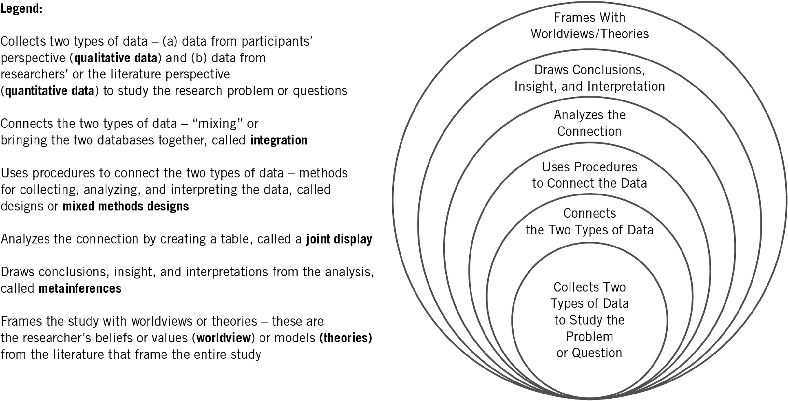
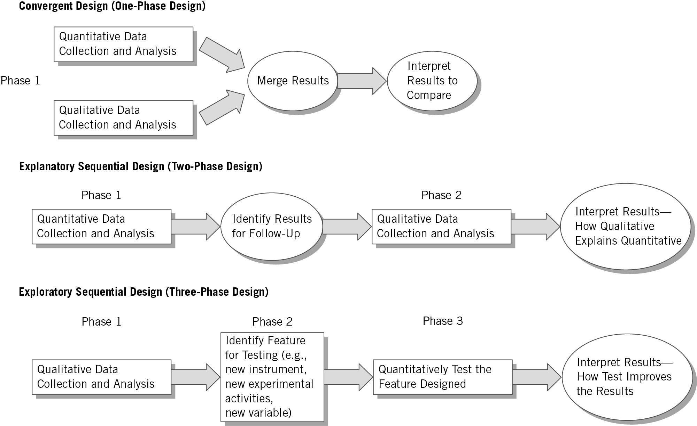
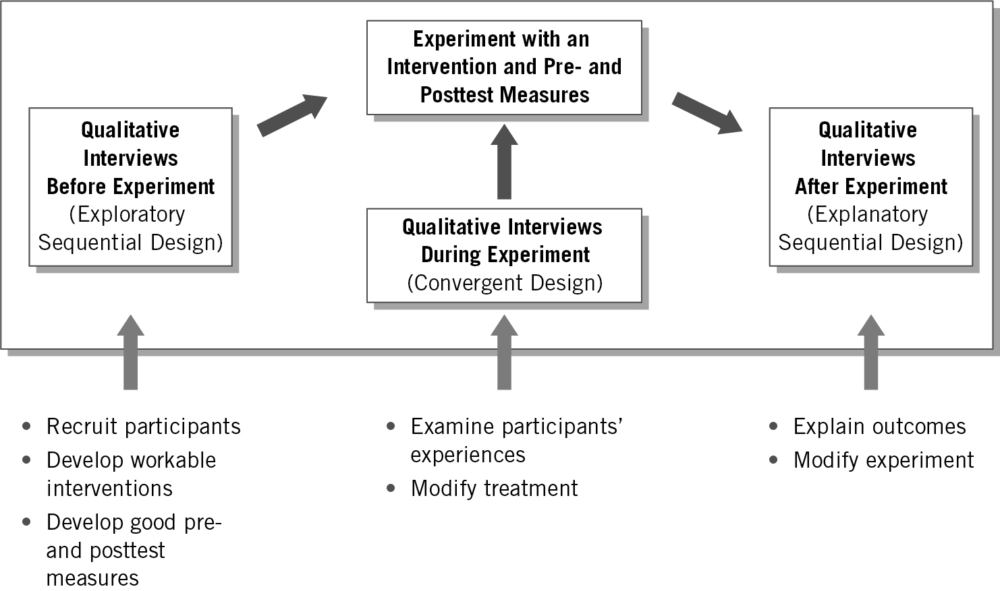
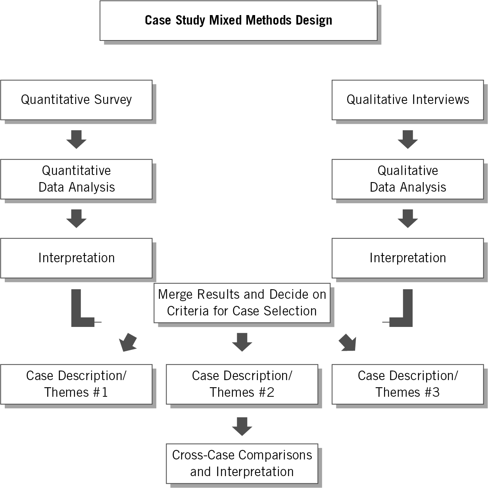
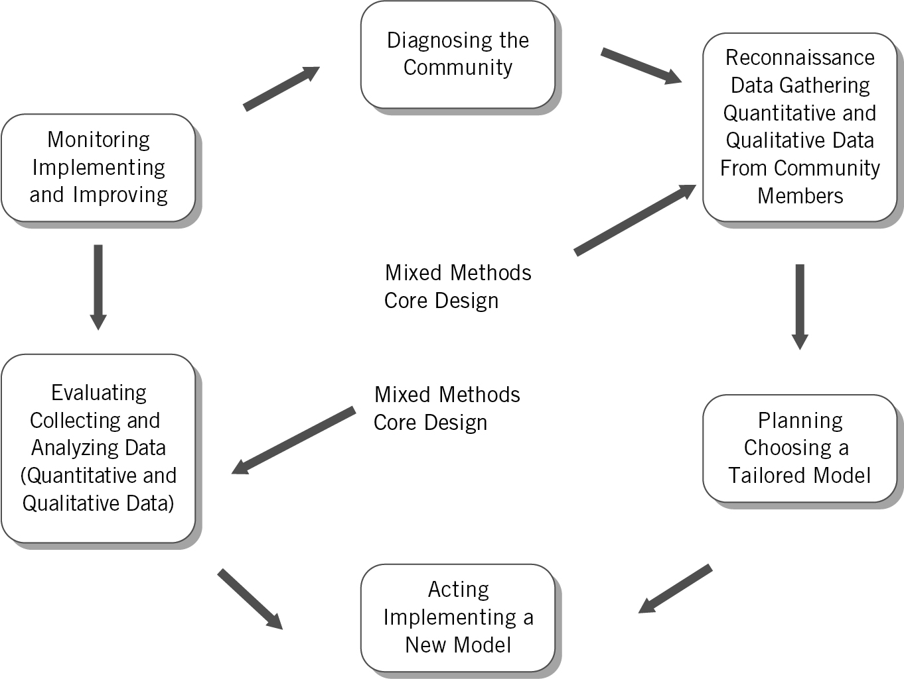
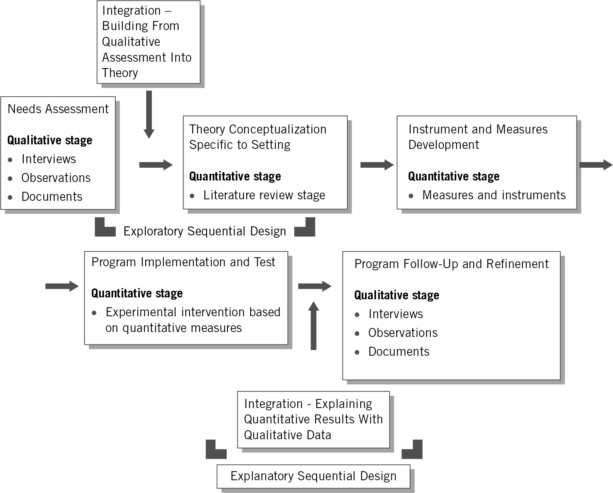
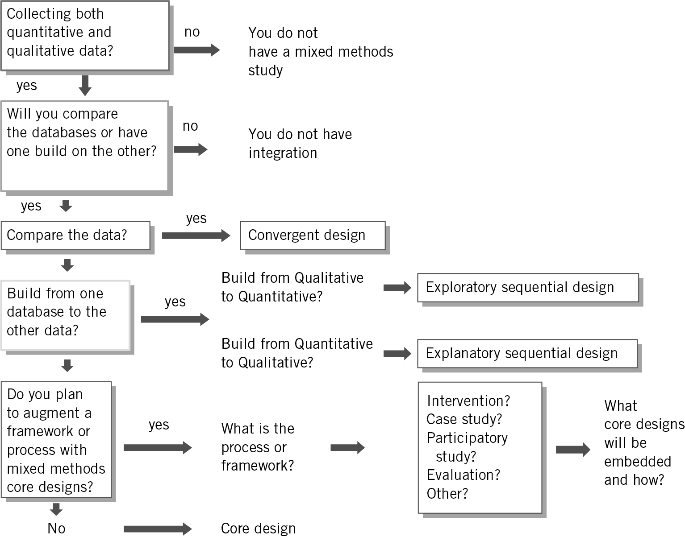
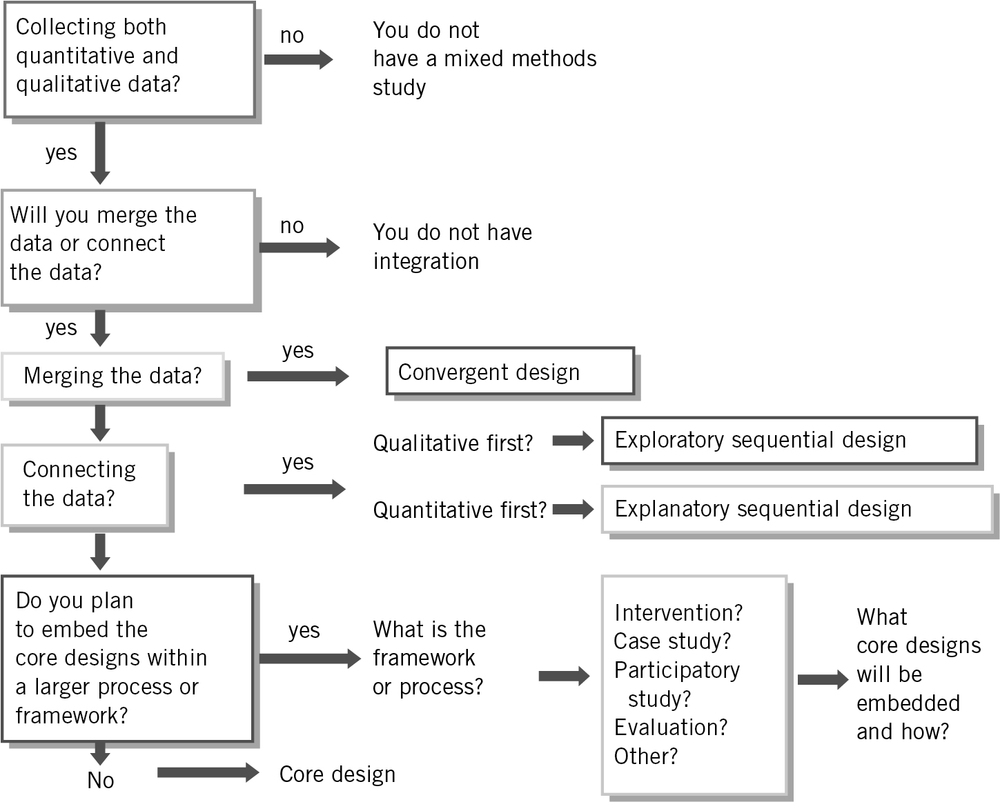

background-image: url(https://upload.wikimedia.org/wikipedia/en/6/6a/Logo_of_the_University_of_Sydney.svg)
background-size: 95%

```{r setup, include=FALSE}

knitr::opts_chunk$set(echo = TRUE, message = FALSE, warning = FALSE, 
                      dev = 'svg', out.width = "45%", fig.width = 6,
                      fig.align="center")

options(scipen = 999)
```

---

## Acknowledgement of Country

I would like to acknowledge the Traditional Owners of Australia and  recognise their continuing connection to land, water and culture. The  University of Sydney is located on the land of the Gadigal people  of the Eora Nation. I pay my respects to their Elders, past and present.


---

## Course outline

.pull-left[

**Week 1**: Introduction

**PART I PRELIMINARY CONSIDERATIONS (Weeks 2-5)**

**Week 2**: The Selection of a Research Approach + Guest lecture w/t Inessa De Angelis

**Week 3**: Review of the Literature

**Week 4**: The Use of Theory + Guest lecture w/t Assel Mussagulova

**Week 5**: Writing Strategies and Ethical Considerations

**PART II DESIGNING RESEARCH (Weeks 6-12)**

**Week 6**: The Introduction


]

.pull-right[


**Week 7**: The Purpose Statement

**Week 8**: Research Questions and Hypotheses + Guest Lecture w/t Minglu Chen

⏸️ *Mid Semester break* ⏸️

**Week 9**: Quantitative Methods

**Week 10**: Quantitative Methods: Data Analysis Lab (Make sure you install JASP)

**Week 11**: Qualitative Methods + Guest lecture w/t Sarah Phillips

**Week 12**: Qualitative Methods: Data Analysis Lab (Make sure you install NVivo)

**Week 13**: Mixed Methods Procedures and Conclusions 👈


]


---

## What is your approach in your research proposal?

.center[</img> 

or https://www.menti.com/al58cddjjy7b]


---

class: inverse, center, middle

# Mixed Methods Procedures

---

# Chapter 10 Learning Objectives

1. Describe each of the six characteristics of mixed methods research to use in a definition.

2. Create a justification for using mixed methods research in a proposal or study.

3. Define key terms used in mixed methods, such as open- and closed-ended data, research design, integration, joint displays, and metainferences when presented in a proposal or study.

4. Contrast quantitative and qualitative data when presented in a study.

5. Identify for a core design its intent, procedures for data collection, integration, metainferences, and validity.

6. Choose a type of mixed methods design for a study, and present reasons for the choice.

7. Identify the elements that go into an integration statement for a proposal or a study.

---

class: segue-red

# Introduction


---

# Introduction

## Mixed methods procedure

* Combining qualitative and quantitative forms for more understanding

* Limitations and strengths of each type of data collection

* Nature of mixed methods

* Reasons to use

---

# Characteristics of Mixed Methods Research

## The mixed methods researcher:

1. Collects two types of data— _qualitative (open-ended)_  _ and _  _quantitative (closed- ended) _ data—to study the research problem or question

2. Connects the two data sets, called  _integration_

3. Uses procedures to integrate the two data sets, called a  _mixed methods design_

4. Analyses integration typically in a table, called a  _joint display_ , by representing the two databases together in the procedures

5. Draws conclusions, insight, or interpretation from the integration analysis, called  _metainferences_

6. Frames the study with the researcher’s beliefs, values (**worldview**), and explanations drawn from the literature (**theories**)

---

# Types of Mixed Methods Designs

__Figure 10.1: Essential Components of Mixed Methods Research__

</img>

---

# Justification for Using Mixed Methods Research

## Reasons for choosing mixed methods

* Developing a **complete understanding** of a research problem by combining **quantitative** and **qualitative** results

* Explaining quantitative results in detail with qualitative descriptions

* Improving measures, scales, and instruments

But also, 

* Augmenting experiments

* Developing cases

* Evaluating programs

* Understanding changes needed for marginalized group

---

# Definitions of Mixed Methods Terms

### Open-ended data

* Information gathered where researchers ask a question but do not provide a response option
  
  * E.g., Participants share views, researcher records them
    
* Information gathered when researchers provide a qualitative description of a document (sociql media post)
    
### Closed-ended data

* Information gathered where the researcher provides participants with response options
  
  * E.g., Rating scales (likert)
    
* Information generated classifying a document's topic (like a media post) using software 

---

# Research Design

## Procedure used in conducting a study

Two categories:  **core designs** and  **complex designs**

### Core Designs

Designs found in all mixed methods studies including convergent designs, explanatory sequential designs, and exploratory sequential designs

### Complex Designs

Primary intent not simply integration of two databases but to have mixed methods  _support _ the procedures of a process or framework


---

# More key terminology for mixed-methods research

### Integration

* Central concept in mixed methods research

* Involves combining in a study or a series of studies information from qualitative and quantitative data

### Joint Display

* Table or graph that presents side-by-side combination of two combined databases
  
### Metainferences

* Insights that emerge as researcher compares the quantitative and qualitative databases

---

# The Process of Conducting a Mixed Methods Study

## Connecting the quantitative and qualitative data to a specific type of mixed methods design

1. Researcher draws a diagram of the design

2. Integrates the two databases

3. Presents the integration in a table or joint display for analysis

4. Draws insights or **metainferences** from results of the integration

---

class: segue

# Core Mixed Methods Designs

---

# Core Mixed Methods Designs

## Three core mixed methods designs

1. **Convergent** design (One-phase design)

2. **Explanatory** sequential design (Two-phase design)

3. **Exploratory** sequential design  (Three-phase design)

---

__Figure 10.2: Three Core Designs__

.center[</img>]

---

# The Convergent Mixed Methods Design

* __Intent:__  to  _compare _ results from the qualitative databases with results from the quantitative databases by  _merging _ the results
* __Key assumption__ : quantitative and qualitative data provide different types of information
* Most familiar approach
* Description of the design
  * Collects both quantitative and qualitative data,
  * Analyzes them separately,
  * Compares the results to see if the findings confirm or disconfirm each other

---

# The Convergent Mixed Methods Design

### Data collection

* Use the same or parallel variables, constructs, or concepts

### Data analysis and integration

* Analyse qualitative database
* Analyse quantitative database
* Integrate the two
* __Joint display__  – merge forms of data in a single visual display (Table 10.2)

---

__Table 10.2: Template for a Convergent Design Joint Display__

| Scores | Theme 1 | Theme 2 | Theme 3 | Theme 4 | Metainferences |
| :-: | :-: | :-: | :-: | :-: | :-: |
| High | Quote/<br />Scores | Quote/<br />Scores | Quote/<br />Scores | Quote/<br />Scores | Insight |
| Medium | Quote/<br />Scores | Quote/<br />Scores | Quote/<br />Scores | Quote/<br />Scores | Insight |
| Low | Quote/<br />Scores | Quote/<br />Scores | Quote/<br />Scores | Quote/<br />Scores | Insight |
| Metainferences | Insight | Insight | Insight | Insight | Insight |

---

__Figure 10.2: Three Core Designs__

.center[</img>]

---

# The Explanatory Sequential Mixed Methods Design

* __Intent:__  to  _explain _ initial quantitative _ _ results with  results from qualitative data by  _connecting _ the two databases
* __Key assumption__ : quantitative results may yield  _surprising _ information that needs  _explanation_
* Description of the design
  * Involves a two-phase project
  * Collection of quantitative data in the first phase
  * Uses results to plan the second, qualitative phase
  * Qualitative data help in explain in more detail the initial quantitative results

---

# The Explanatory Sequential Mixed Methods Design

### Data collection

* Two distinct phases

* Rigorous quantitative sampling and purposeful qualitative

### Data analysis and integration

* Connecting quantitative results to qualitative data collection
  
* Quantitative results inform sampling and qualitative questions to ask

---

__Table 10.3: Template for an Explanatory Sequential Design Joint Display__

| Quantitative Scores | Qualitative Follow-Up Themes | Metainferences |
| :-: | :-: | :-: |
| High Scores | Theme 1<br />Theme 2<br />Theme 3 | How Themes Explain the Scores |
| Medium Scores | Theme 1<br />Theme 2<br />Theme 3 | How Themes Explain the Scores |
| Low Scores | Theme 1<br />Theme 2<br />Theme 3 | How Themes Explain the Scores |

---

__Figure 10.2: Three Core Designs__

.center[</img>]

---

# The Exploratory Sequential Mixed Methods Design

* __Intent:__  to  _explore _ how qualitative data can improve quantitative measures, scales, or instruments
* __Key assumption__ : quantitative results may yield  _surprising _ information that needs  _explanation_
* Description of the design
  * A three-phase design
  * Start with a qualitative phase
  * Build to a feature to be tested (e.g., survey instrument)
  * Followed by a quantitative phase that tests the feature

---

# The Exploratory Sequential Mixed Methods Design

### Data collection

* Initial qualitative data collection

* Test of quantitative feature

### Integrative data analysis

* Analyse the two databases separately

* Use the findings from the initial exploratory database to build into a feature

* Qualitative findings inform design of quantitative phase (e.g., instrument, variables)

---

# The Exploratory Sequential Mixed Methods Design

__Table 10.3: Template for an Exploratory Sequential Design Joint Display (using a survey design as an example)__

| Qualitative | Design Features | Metainferences |
| :-: | :-: | :-: |
| Qualitative Quotes | Quantitative Survey Items | Analyze the scores on the survey |
| Qualitative Codes | Quantitative Survey Variables | Identify variables |
| Qualitative Themes | Quantitative Survey Scales | Identify scales |

---

class: segue-red

# Group task

---

class: segue

# Complex Mixed Methods Designs

---

# Complex Mixed Methods Designs

* All mixed methods studies have at least one  **core design** (e.g., convergent, explanatory sequential, or exploratory sequential)

* **Complex designs** have core designs embedded in frameworks larger than simply collecting, analysing, and integrating quantitative and qualitative data

---

# Types of Complex Designs

Several complex mixed methods designs:


* Intersecting a secondary method (mixed methods) within a primary quantitative or qualitative design (e.g., an intervention)

* Intersecting mixed methods within another methodology (e.g., evaluation)

* Intersecting mixed methods within a theoretical framework (e.g., social justice)

---

# Examples of Complex Designs

__Mixed methods experimental (intervention) design__  – quantitative and qualitative data within an experiment or trial (Figure 10.3)

__Mixed methods case study design__  – mixed methods within a single or multiple case study (Figure 10.4)

__Mixed methods participatory social justice design__  – core mixed methods design within a larger framework (Figure 10.5)

__Mixed methods evaluation design__  – one or more core designs in an evaluation (Figure 10.6)

---

__Figure 10.3: A Mixed Method Intervention Design Diagram __

.center[]

---

__Figure 10.4: A Multiple Case Study Design Diagram __

.center[]

---

__Figure 10.5: A Mixed Methods Participatory Action Research Design Diagram __

.center[]

---

__Figure 10.6: A Mixed Methods Evaluation Design Diagram __

.center[]
---

# Incorporating Core Designs into Complex Designs

* Identify quantitative and qualitative data collection

* Draw a diagram of steps

* Look in steps for opportunities to collect quantitative and qualitative data

* Examine how databases are connected

* Discuss overall framework or process and the embedded core designs

---

## Factors Important in Choosing a Mixed Methods Design

### Choice based on intent and procedures

1. **Integration statement**

> Integration involved comparing the results from the quantitative and qualitative data by merging so that a more complete understanding emerges than provided by the quantitative or the qualitative results alone.” (convergent design example)

2\. **Design intent**
  
3\. **Select procedures that match design**

---

__Table 10.5: Intent and Procedures of Mixed Methods Designs__

| Mixed Methods Design | Intent or Purpose (of mixing the two databases) | Procedure (for conducting the research) |
| :-: | :-: | :-: |
| Convergent Design | Compare, Match, Corroborate (Validate), Expand, Enhance, Diffract, Identify Cases, Initiating, Complete Understanding | Merge (putting the databases side-by-side) |
| Explanatory Sequential Design | Expand, Explain | Connect (quantitative results connection with qualitative data collection) |
| Exploratory Sequential Design | Build Upon, Transfer, Generalize | Connect (qualitative results lead to design of quantitative assessment that is then tested) |
| Complex Mixed Methods Design | Augment (optimize, ascertain needs, monitor) | Add into a process/ framework<br /><br />Qualitative, Quantitative, or Both Types of Data |

---

__Figure 10.7: Flowchart for Choosing Your Type of Design (Based on Intent) __

.center[]

---

__Figure 10.8: Flowchart for Choosing Your Type of Design (Based on Procedures) __

.center[]

---

## Other Reasons for Choosing a Design

### Choice based on

* Popular designs in a field or discipline

* Single researcher or team

* Choice by advisors or mentors

* Timing in mixed methods data collection – convergent or sequential

* Emphasis placed on each database – equal or unequal

---

__Table 10\.1: A Checklist of Questions for Designing a Mixed Methods Procedure__

| _____ | Question |
| :-: | :-: |
| _____ | Have you defined mixed methods research? |
| _____ | Do you justify using mixed methods methodology for your problem and question? |
| _____ | Have you collected both quantitative and qualitative data? |
| _____ | Have you described your intent for collecting both forms of data? (integration statement) |
| _____ | Have you identified a mixed methods design or set of procedures to integrate your data? (mixed methods design) |
| _____ | Have you provided a diagram of your design procedures? |
| _____ | Have you identified how you will analyze your data for integration? (use of a joint display) |
| _____ | Have you drawn conclusions (or metainferences) from analyzing the integration? |
| _____ | Have you discussed validity and ethics related to your research design? |
| _____ | Have you written your mixed methods study to reflect your use of design? |

---

# Mixed Methods Summary

- Define mixed methods and core characteristics

- Discuss chosen mixed methods design and challenges

- Draw a diagram of procedures

- Convey elements based on your design

---

class: segue-red

# Check-in

---

class: inverse, center, middle

# Academic writing and publishing


---

## The research process

<center>

```{r, echo = F, out.width = "150%"}

DiagrammeR::grViz("digraph {
  graph [layout = neato, rankdir = LR] 
  
  node [shape = doubleoctagon, fontsize=18]    
  nodeWhat [label = 'What', pos = '0,2!']
  nodeHow [label = 'How' , pos = '5,2!']
  nodeDo [label = 'Do it',  pos = '12,2!']
  
  node [shape = cds, width=1.5, height=1.2, fontsize=18]        
  nod1 [label = 'Formulate\\nresearch\\nproblem', pos = '0,0!']
  nod2 [label = 'Conceptualise\\nresearch\\ndesign', pos = '2,0!']
  nod3 [label =  'Construct\\ninstrument for\\ndata collection', pos = '4,0!']
  nod4 [label =  'Select\\na\\nsample', pos = '6,0!']
  nod5 [label =  'Write\\nresearch\\nproposal', pos = '8,0!']
  nod6 [label =  'Collect\\ndata', pos = '10,0!']
  nod7 [label =  'Analyse\\ndata', pos = '12,0!']
  nod8 [label =  'Write\\nresearch\\nreport', pos = '14,0!']
  
  node [shape = house, width=.8, height=1, fontsize=14]  
  nod10 [label = 'Variables\\n&\\nhypothesis', pos = '0,-2!'] 
  nod11a [label = '\\nCausal\\ninference?', pos = '2,-2!'] 
  nod12 [label = 'Validity &\\nreliability of\\nmeasures', pos = '4,-2!'] 
  nod11b [label = '\\nCausal\\ninference?', pos = '6,-2!'] 
  nod13 [label = 'Methods of\\ndata\\ncollection', pos = '10,-2!'] 
  nod14 [label = 'Methods\\nof\\nanalysis', pos = '12,-2!'] 
  nod15 [label = 'Principles\\nof scientific\\nwriting', pos = '14,-2!'] 
  
  # edge definitions with the node IDs
  nodeWhat -> nodeHow -> nodeDo;
  nodeWhat -> nod1; 
  nodeHow -> nod2; nodeHow -> nod3; nodeHow -> nod4; nodeHow -> nod5;
  nodeDo -> nod6; nodeDo -> nod7; nodeDo -> nod8;

  nod1 -> nod10; nod2 -> nod11a; nod3 -> nod12; nod4 -> nod11b;
  nod6 -> nod13; nod7 -> nod14; nod8 -> nod15;
  
  }", 
  width = 800, height = 300)

```

</center>

<mark>
*Literature review relevant across all stages of the research process. 
*Understanding and building upon what research has been done before.</mark>

---

### Writing up academic research: Structure

#### Commonly used structure

* Introduction

* Literature Review

* Theory

* Data and Methods

* Results

* Conclusions

*Some variations on this – good to look at published articles (ones using a similar approach) to see how they have structured*

**Note**: *literature review* & *results* are not necessarily called that, even if that’s what it is.

---

### Writing up academic research: Structure example

#### Riding information crises: the performance of far-right Twitter users in Australia during the 2019–2020 bushfires and the COVID-19 pandemic 
(*open access here https://doi.org/10.1080/1369118X.2023.2205479*)

1. Introduction

    * *Includes: Hypotheses and research questions*

2. Theoretical and conceptual framework

    * *Literature review, defining key concepts, and theoretical frameworks for information disorders and online beheaviour*
    
3. Data and methods

4. Results

5. Discussion and conclusion

---

### Writing up academic research: What goes where

**Note**: Every project will look different!

#### Introduction

* Scene setting
* Research question
* Rationale
* What I do, what I find
* Overview of the structure of the paper / thesis

#### Literature Review

* Overview of relevant previous research
* Key themes and debates
* Gap(s) that your study will address


---

### Writing up academic research: What goes where


#### Theory
* Can be part of or separate to literature review.
* Theories can come from previous literature, and your own ideas.
* Can develop the theory / theories you will test (with mechanisms), and any hypotheses.


#### Data and Methods
* Provides an overview of the research design and methods of analysis.
* Should be sufficiently detailed that another researcher could replicate what you have done.

---

### Writing up academic research: What goes where

#### Results
* This is where your analyses will be. May be one section (e.g. for a focused journal article) or multiple sections (e.g. for a PhD thesis)
* For quantitative work, this is where the graphs / tables presenting your findings will be and discussion of their contents.
* For qualitative work (e.g. interviews) this is where you would unpack and analyse the qualitative data.

#### Conclusions
* What you asked. What the paper did. Overview and discussion of findings.
* Limitations.
* Broader discussion on any implications.

---

## General tips

.pull-left[
* Look at 

    * quality research in your area;
    
    * using your method; or
    
    * from an author whose writing you like

* See how they write things up

* What goes in each section?

* What ideas do they cover from para to para?
]

.pull-right[
.center[</img>]
]

---

### Publishing research

.pull-left[

#### Peer-reviewed journals
* Which journal to target? Fit / rankings / journal acceptance rate / processing time
* Submission
* Decision: Accept / Revise and Resubmit (Minor or major revisions) / Reject
* Timelines can be long / rejection is part of the process
* Mentorship from experienced researchers

#### Books
* Edited / authored
* Targeted at a wider readership

]

.pull-right[
#### Reports
* Overview of findings to reach wider audience
* See for example: Scanlon Foundation 2019 Social Cohesion Report / Australian Election Study report ‘The 2019 Australian Federal Election: Results from the Australian Election Study’

#### Media
* The Conversation (academic rigour, journalistic flair)
* Op-eds
* Work with University media offices
]

---

## Identifying your target publication

#### Use different entry points

1. Browse the **category/subcategory** you want to research about (e.g. "Social Sciences > Sociology and Political Science") to identify a few candidates: compare them 

    * what methodology do they publish? 
    * have you referenced anything from these journals? 
    * what are their metrics: impact, acceptance rate, speed (speed is VERY important for ECR, you want that paper on your CV soon!)
    
2. Identify a number of reference **journal articles** (similar for methodology, topic, etc)

    * Where are these published,
    * Where are the articles that referenced these articles published (using Google scholar);
    * Get journals from [Research Rabbit](https://researchrabbitapp.com/)
    
3. Identify a number of **authors** (similar for methodology, topic, etc)

    * Where have they published?

---

## Publishing research

#### Who is your audience?

    * Policy-makers
    * Broader public?
    * Academic researchers?
    * All of the above?

* Academic system values peer-reviewed journal articles (unless in one of the top journals readership / citations often low)

* Writing style expected in academic journals not particularly accessible

* "Real world" values more accessible formats e.g. reports

---

#### Peer review process: Academic journals


#### Editors provide initial review


* Desk reject
     * Poor fit for the journal / not of high enough quality / not innovative enough
     * Top ranked journals do more desk rejects
     * Send to another journal!
* Or send out to peer reviewers (2-3 normal)


#### Peer review

* Double blind
* Recommend: accept / minor revisions / major revisions / reject
* Provide overall comments including areas for improvement
* Editors make a decision on the basis of reviewer feedback

---

#### Peer review process: Academic journals


#### Revise and resubmit (R&R)
* Need to make any improvements identified by the reviewers and editors
* If there’s a change you can’t make, give a good justification for why
* Need to provide a document outlining how the paper has been revised in response to reviewer feedback

#### Back to editors
* May go back to original peer reviewers to review the changes
* For minor revisions, changes may be reviewed directly by the editors
* Decision (Accept / Another R&R / Reject)


---

### Peer review example


| Submission | Decision |
| ---------- | -------- |
| 11-May-2022 |	08-Aug-2022: Reject & Resubmit |
| 16-Sep-2022 |	14-Dec-2022: Major Revision |
| 19-Jan-2023	| 06-Mar-2023: Minor Revision |
| 17-Mar-2023	| 23-Mar-2023: Accepted |
|             | 29-Apr-2023: Published online |

.center[</img>]

---

### Peer review process

* Process assumes good faith on part of the researchers and reviewers

* Assumes researchers aren't using fraudulent data

* Some journals require replication datasets to be published

#### Flaws

* Papers with significant (p<0.05) results are more likely to get published

* Creates bias in published research as we are missing research that shows things aren’t significant

* Some journals make a point of accepting well executed research irrespective of statistical significance e.g. PLOS ONE

---

class: inverse, middle, center

# Replication

---

## Replication

### Replication crisis (of quantitative research)
* Finding that many studies unable to be reproduced
* Psychology in particular (also medical science)

### Increasing standard for researchers to (for both quant and qual researchers):
* Present their research in a way that another researcher would be able to replicate their analyses
* Many journals expect scholars to publish replication datasets and supplementary materials
* Pre-registration of studies

### Learning how to do research?
* Start by trying to replicate a published paper

---

class: inverse, middle, center

# Key Takeaways from GOVT6139

---

### Key takeaways from this course (I)

.small[

#### Become a critical consumer of research
* In your other courses
* In your careers
* As an informed citizen

#### What does it mean to be a critical consumer?
* Understand the strengths and weaknesses of different research approaches
* What do these strengths / weaknesses mean for the inferences we can draw from a particular study
    * Inference definition: ‘A conclusion reached on the basis of evidence and reasoning’

#### A broad introduction to research design and methods
* E.g. for Masters / PhD
* Research in the workplace
* For evidence-based policymaking

]

---

### Key takeaways from this course (II)

.small[

#### Some questions to ask when you are reading research articles (or reports/books)

* How did the researchers go about it?
* What cases did they select?
* What was the timing of the study?
* Did they use quantitative / qualitative methods? What kind?
* Are the researchers making causal claims? If so does the evidence support their conclusions?
* Are measures valid? Do they capture the concepts they purport to measure?
* What are the strengths and weaknesses in terms of internal / external validity?
* If survey research (/polling): How did the researchers go about it? What sampling approach was used (probability/non-probability)? Are the results representative of a population? If so what population? Are survey questions a good fit to measure concepts of interest?
* If qualitative research e.g. interviewing: How did the researchers go about it? Who did they interview? In what context? Are findings context specific?
* If there are multiple studies on a similar topic – are the findings pointing in the same direction or is there debate?

]

---

## Going about research

* This course a very broad introduction / ‘taster’

  * Now you might want to consider: 
  
    * SSPS6004: Social Research Ethics
    * SSPS6006: Data Analytics for Social Research

* To go about research takes time and training

* Is there one right way to go about research?

* Can qual and quant methods be combined?

* Social science research can be a lot of fun (talking to people about their experiences, travel, analyzing data, creating data visualizations – bringing evidence to questions people have about the world)

---

class: middle, inverse, center

# Wrapping up

---

## Very keen to receive your feedback on (if you have time)

#### Very keen to receive your feedback on:

* What you enjoyed / found useful in your learning

* Any constructive feedback as to areas that could have been improved

* Some specific areas you may wish to comment on:

    * Overall design of the course and coverage of topics
    * Meet the researcher
    * Assessment items
    * Pace and level of the class
    * Peer feedback workshop

---

## Wrapping up

* Thank you everyone for your participation and engagement in this course!

* Congratulations on making it through this far in the course and all the best with the research proposal

* Stay in touch!

.center[]

---

class: inverse, center, middle

# Research proposal Q and A

---


